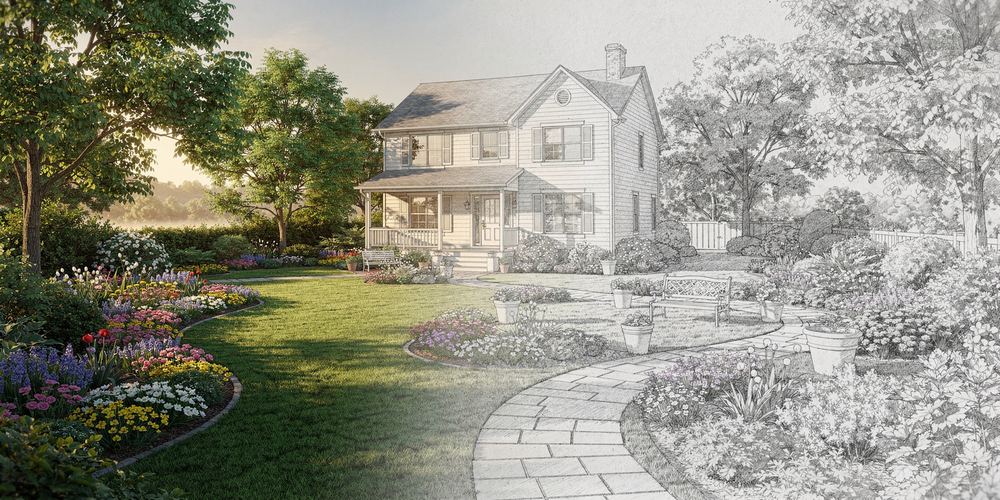

# Creative Landscape Studio

A desktop landscape planning prototype based on the actual
[Open Garden Planner](https://github.com/cofade/open-garden-planner) editor.
This branch implements **Milestone A** of the owner's [master plan](MASTER_PLAN.md):
validate the inherited desktop foundation before changing units or redesigning it.

## Try it on Windows

Download the [current Windows x64 test bundle](https://github.com/jaceaddison2016-dot/Creative-Landscaping-Design-Software/actions/runs/37707747601/artifacts/11520149105)
(about 436 MiB; GitHub sign-in may be required).

The first deliverable is a **Windows x64 test download** with an installer and a
portable ZIP. Follow [the simple download instructions](docs/WINDOWS_DOWNLOAD.md)
from the draft pull request's successful Windows Actions run. No coding or Python
installation is needed. These unsigned test artifacts are retained for 90 days.

The window and installer still say **Open Garden Planner**. The inherited editor
provides drawing, plant placement, layers, undo/redo, `.ogp` save/load, autosave,
exports, and date/time sun and shade controls. **Units are metric in this milestone.**
Feet and inches and a simpler landscape workflow are the next stage.
There is no verified Mac download. See [platform evidence](PLATFORM_STATUS.md).

Use [the five-minute checklist](docs/WINDOWS_DOWNLOAD.md#five-minute-check) and
report results in the draft pull request. It stays a draft until you confirm
desktop testing.

## Project records

- [Upstream assessment and exact provenance](UPSTREAM_PROVENANCE.md)
- [Feature reuse matrix](FEATURE_REUSE_MATRIX.md) and [roadmap](ROADMAP.md)
- [Validation and remaining checks](VALIDATION.md)
- [License and asset/data attribution](THIRD_PARTY_NOTICES.md)
- [Windows rebuild instructions](docs/WINDOWS_BUILD.md)
- [Original upstream README](docs/upstream/README.md) and [architecture docs](docs/05-building-block-view/README.md)

The full source remains in `src/open_garden_planner`, with upstream tests and
resources. The older browser experiment remains in draft PR #1 on its separate
branch; its `.clp` projects are unrelated to `.ogp`.

## Development in the cloud

Use Python 3.12 and the supported pyproject editable install.
Do not use the inherited, outdated requirements files.

```bash
UV_CACHE_DIR=/tmp/creative-uv-cache uv venv --allow-existing --python python3 .venv
UV_CACHE_DIR=/tmp/creative-uv-cache uv pip install --python .venv/bin/python -c installer/constraints-desktop.txt -e '.[dev]' pyinstaller
mkdir -p build/cloud-state/config build/cloud-state/data build/cloud-state/cache
export XDG_CONFIG_HOME="$PWD/build/cloud-state/config"
export XDG_DATA_HOME="$PWD/build/cloud-state/data"
export XDG_CACHE_HOME="$PWD/build/cloud-state/cache"
QT_QPA_PLATFORM=offscreen .venv/bin/python -m open_garden_planner --selftest
QT_QPA_PLATFORM=offscreen .venv/bin/python scripts/desktop_baseline_smoke.py --output build/source-smoke
QT_QPA_PLATFORM=offscreen .venv/bin/python -m pytest tests/ -q
.venv/bin/python -m ruff check src/ tests/ scripts/
.venv/bin/python -m bandit -r src/ --severity-level high
.venv/bin/python scripts/check_agent_context.py
.venv/bin/python scripts/check_no_secrets.py
```

The offscreen smoke checks real application behavior through inherited loopback
MCP, using synthetic plans and editing disabled. Use an isolated development
account with no other app on port 8765. It cannot establish human usability or GPU
rendering. Processes must restart in each cloud task.

## License

Open Garden Planner is copyright its upstream contributors. This derived
application remains **GPL-3.0-or-later**; see [LICENSE](LICENSE).
Data and dependencies keep their respective licenses and notices.
This project has no Land F/X affiliation and claims no professional feature parity.

## Creative visual direction — awaiting approval

The [desktop editor and welcome previews](docs/design/README.md) are an opt-in
experiment in the actual Qt application. See [the proposed design system](BRAND_DESIGN_SYSTEM.md)
and [the saved owner brief](CREATIVE_REDESIGN_BRIEF.md). The normal app and
existing Windows desktop-foundation download keep the upstream interface until
the owner approves this direction and the remaining rollout/QA is complete.
