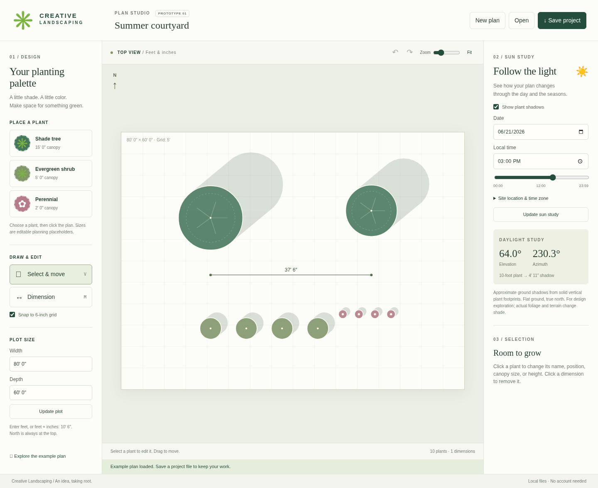

# Creative Landscaping Design Software

A first working landscape-planning prototype for **macOS and Windows**, running in a modern desktop browser. Start with a 2D plan, place plants, measure in feet and inches, save your work, and explore sun and shadows through the day and year.

This is the first step toward a broader Land F/X-style application. It is not a native installer or a replacement for professional CAD software.



## Try it — no coding needed

1. On GitHub, select the **`prototype/landscape-workspace` branch** for this draft version. Click the green **Code** button, then **Download ZIP**.
2. Extract the ZIP: double-click it on macOS; on Windows, right-click and choose **Extract All**. Open the extracted folder.
3. Double-click **`index.html`**. It should open in your browser. Keep `index.html`, `styles.css`, `core.js`, and `app.js` together in the folder. Use a current version of Chrome, Edge, Firefox, or Safari.
4. The example plan opens first. Click **New plan** for a blank 80 × 60-foot plot, or edit the example.

If your browser or organization blocks local HTML files, someone with Node.js 22+ installed can run `npm start` from this folder and open the address printed by the command. No package installation is needed just to run the application. Corporate browser policies may require your administrator's help.

**Testing status:** The application passed functional checks in Chromium on Linux through the local server. Direct-file opening is blocked by this cloud machine's browser policy and could not be verified here. Actual macOS/Windows execution and Safari/Firefox behavior still need the manual checks below. The cross-platform CI workflow is configured but its results are not yet established.

## Make your first plan

- **Plot:** Enter width and depth, then click **Update plot**. Enter `80` for 80 feet, or `10' 6"` for 10 feet 6 inches. A resize that would leave plant centers or measurement endpoints outside the plot is rejected.
- **Plants:** Click **Shade tree**, **Evergreen shrub**, or **Perennial**, then click the plan. Repeated clicks place more plants. These are generic editable design placeholders, not species recommendations.
- **Edit:** Click **Select & move**, then click a plant. Drag it, or enter its position, canopy diameter, height, and name in the right panel. Click **Apply changes**. Plant positions are measured from the left and top of the plot. North always points up. Canopies may extend beyond the plot and are clipped in the view.
- **Measure:** Click **Dimension**, then click two points. The dimension stays on the plan and is saved in the project. Display rounds to the nearest inch; diagonal calculations retain their geometric distance.
- **Correct a mistake:** Use the undo/redo arrows. Click a plant or dimension and choose **Delete selected** to remove it. Undo history keeps the last 50 changes during the session; it is not stored in project files.
- **Zoom:** Use the zoom slider; scroll the workspace when the plan grows larger. **Fit** restores the original view.
- **Save:** Click **Save project** to download a `.clp` file. Keep the file in a folder you can find. Saving downloads a new file; it does not overwrite an existing file or confirm that the browser completed the download. There is no autosave.
- **Return later:** Click **Open** and choose your `.clp` file. Check your Downloads folder if you cannot find a saved file. Unknown formats, invalid data, and files over 2 MB are rejected without replacing the plan. The application asks before replacing a plan with unsaved changes; the browser may also warn before closing the tab.

Keyboard shortcuts while focus is outside an input: **V** select, **M** dimension, **Escape** cancel/switch to select, **Delete/Backspace** delete selected, **Ctrl+Z** (Windows) or **Cmd+Z** (Mac) undo; add **Shift** for redo. Plant and dimension symbols can be selected with Tab and Enter; the property form provides precise position editing.

## Explore sun and shadows

1. Expand **Site location & time zone**. Enter your latitude and longitude (north/east are positive; west longitudes are negative).
2. Set the **UTC offset for the chosen date**. For Detroit, summer is usually `-4` and winter `-5`. Daylight saving time is not selected automatically. Fractional offsets, such as `5.5`, are supported. The default example is Detroit in summer.
3. Choose a date and local time, or move the time slider and release it. The study updates when fields change or when you click **Update sun study**.
4. Change a plant's height to see how its shadow changes. Turn **Show plant shadows** off to inspect the plan without shadows.

This is an **approximate design study**. It uses NOAA's fractional-year solar approximation and a solid vertical canopy footprint on flat ground. Sun bearing is clockwise from true north. Shadows point away from the sun; night and elevations below 1° show no shadow polygons. Canopy transparency, buildings, terrain, weather, surrounding obstructions, and reflected light are not modeled. Overlapping shadow polygons darken visually; the display is not an irradiance or hours-of-sun calculation. No survey, engineering, horticultural accuracy, or planting suitability claim is made.

## For contributors

Node.js 22+ is recommended for development; there are no runtime dependencies or compilation steps.

```sh
npm ci
npm run check
npm run format:check
npx playwright install chromium
npm run test:browser
npm start
```

`npm run test:browser` exercises both direct-file and HTTP launch with downloaded Playwright Chromium. For this cloud machine's managed Chromium, use:

```sh
TEST_HTTP_ONLY=1 BROWSER_EXECUTABLE=/usr/bin/chromium npm run test:browser
```

That explicitly leaves direct-file launch unrun. Browser test screenshots and downloaded fixture projects are written under ignored `test-results/`. Platform and remaining manual checks are in [docs/VALIDATION.md](docs/VALIDATION.md).

- `core.js`: imperial lengths, solar math, shadow vectors, project schema/validation.
- `app.js`: editing, SVG rendering, file operations, session history.
- `scripts/serve.cjs`: optional loopback-only development server.
- `tests/`: unit and real-browser functional checks.

The project file format is versioned JSON (`format: "creative-landscape"`, `version: 1`), with all lengths stored as whole inches. Projects support up to 500 plants and dimensions combined. Project files have no compatibility with Open Garden Planner `.ogp` files.

## Foundation and licenses

[Open Garden Planner was evaluated first](docs/FOUNDATION-EVALUATION.md). Its Python/Qt architecture, GPL-3.0-or-later license, and Windows-focused packaging make it a possible future foundation, but this prototype is an independent browser implementation. No upstream code or assets were copied. [Third-party notices](THIRD_PARTY_NOTICES.md) preserve the licenses of the development tools used. A project-wide license for this original prototype has not been selected.

## Beyond this prototype

Future versions can add species libraries, beds and paths, buildings and fences, layers, printing/export, native packaging, and more realistic shade studies. CAD integrations, irrigation, estimating, terrain, 3D, and Land F/X feature parity need separate scope and validation.
