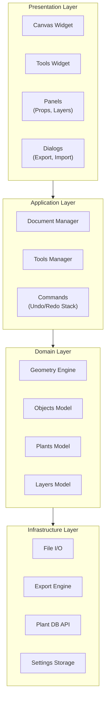
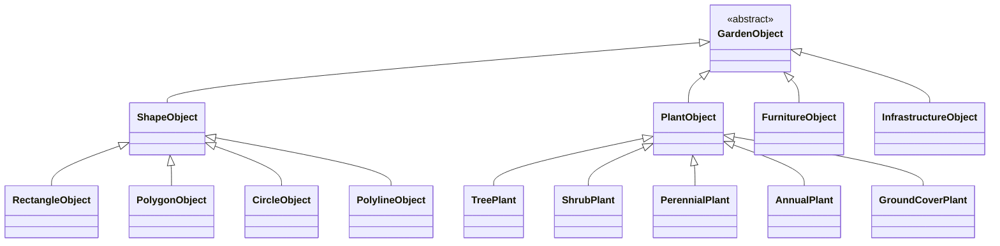

# 5. Building Block View

## 5.1 High-Level Architecture



## 5.2 Module Structure

<!-- Keep this updated when adding/removing files -->

```
src/open_garden_planner/
├── __main__.py, main.py          # Entry points
├── app/
│   ├── application.py            # Main window (GardenPlannerApp)
│   ├── paths.py                  # Safe file-dialog directory chokepoint (ADR-027)
│   ├── settings.py               # Preferences + create_qsettings(), the ONE
│   │                             #   settings-store factory (ADR-041)
│   └── ui_state.py               # Window geometry / splitter persistence
├── core/
│   ├── commands.py               # Undo/redo command pattern
│   ├── project.py                # Save/load, ProjectManager
│   ├── object_types.py           # ObjectType enum, default styles
│   ├── fill_patterns.py          # Texture/pattern rendering
│   ├── plant_renderer.py         # Plant SVG loading, caching, rendering
│   ├── plant_sizing.py           # PlantSizing resolver — footprint/override/max_spread precedence (ADR-028)
│   ├── solar.py                  # Qt-free NOAA solar position engine — elevation/azimuth/declination/EoT (US-E1, ADR-037)
│   ├── object_height.py          # Qt-free effective-height resolver — explicit/container/species/type-default (US-E2, ADR-037)
│   ├── shadow_geometry.py        # Qt-free shadow sweep/union — L=h/tanα, Minkowski sweep, pyclipper union (US-E3, ADR-037)
│   ├── shade_aggregation.py      # Qt-free hours-of-sun sampling/bands/grid — rasterizer injected (US-E4, ADR-037)
│   ├── heatmap_render.py         # Qt-free heatmap rendering — cool→warm ramp LUT + marching-squares hour contours (US-E4)
│   ├── scene3d.py                # Qt-free 3D mesh math — ear-clip triangulation, prism extrusion, sun vector, frame map (US-E6, ADR-038)
│   ├── walk_camera.py            # Qt-free walkthrough rules — eye height, bounds clamp, pitch-limited look vector (US-E7)
│   ├── growth_model.py           # Qt-free current-size→mature interpolation by planting date — one model for shadows/heatmap/3D (US-E8, ADR-037)
│   ├── furniture_renderer.py     # Furniture/infrastructure/hedge SVG rendering & caching (24 generated sprites, ADR-042)
│   ├── constraints.py            # All 16 constraint types + hybrid solver (see §8.12)
│   ├── constraint_solver_newton.py # Newton-Raphson refinement + circle-circle fast path
│   ├── measure_snapper.py        # Anchor-point snapper for measure tool
│   ├── measurements.py           # Measurement data model
│   ├── snapping.py               # Object snapping logic (drag-time bbox)
│   ├── snap/                     # Unified snap engine (ADR-020 + ADR-023, Package A/B)
│   │   ├── provider.py           #   SnapProvider ABC (+reference_point in v2), SnapCandidate
│   │   ├── registry.py           #   Active-providers + best() tie-breaking
│   │   ├── point_snapper.py      #   QuadTree-backed point-snap entry point
│   │   ├── spatial_index.py      #   Bounded-depth QuadTree (~60ms / 1000 items)
│   │   ├── geometry.py           #   item_edges, segment_intersection
│   │   └── providers/            #   Endpoint, Center, EdgeCardinal, Midpoint,
│   │                             #     Intersection, Nearest, Perpendicular, Tangent
│   ├── cad_geometry.py           # arc_from_three_points, fillet_corner, chamfer_corner,
│   │                             #   reflect_point/reflect_angle_deg/snap_point_to_axis_step (US-B4)
│   ├── mirror_geometry.py        # build_mirrored_item — per-type reflection rebuild (US-B4, ADR-026)
│   ├── coordinate_input/         # Typed coordinate pipeline (ADR-021, Package A US-A1/A2/A4)
│   │   ├── parser.py             #   parse(@dx,dy / @dist<angle / x,y), smart decimal
│   │   └── buffer.py             #   CoordinateInputBuffer(QObject) — shared state
│   ├── alignment.py              # Object alignment helpers
│   ├── i18n.py                   # Internationalization, translator loading
│   ├── geometry/                 # Point, Polygon, Rectangle primitives
│   └── tools/                    # Drawing tools
│       ├── base_tool.py          # ToolType enum, BaseTool ABC
│       ├── tool_manager.py       # ToolManager with signals
│       ├── select_tool.py        # Selection + box select + vertex editing
│       ├── rectangle_tool.py     # Rectangle drawing
│       ├── polygon_tool.py       # Polygon drawing
│       ├── circle_tool.py        # Circle drawing
│       ├── polyline_tool.py      # Polyline/path drawing
│       ├── arc_tool.py           # 3-point arc drawing (Package B US-B2)
│       ├── bezier_tool.py        # Cubic Bezier pen tool (Package B US-B1)
│       ├── corner_edit_base.py   # Shared corner-picking for Fillet / Chamfer
│       ├── fillet_tool.py        # Round-corner tool (Package B US-B3)
│       ├── chamfer_tool.py       # Bevel-corner tool (Package B US-B3)
│       ├── mirror_tool.py        # Mirror selection across an axis (Package B US-B4)
│       ├── trim_tool.py          # Trim/Extend (US-11.16)
│       ├── offset_tool.py        # Parallel-copy offset (US-11.15)
│       ├── measure_tool.py       # Distance measurement
│       └── constraint_tool.py    # Distance constraint creation
├── models/
│   ├── plant_data.py             # Plant data model
│   ├── layer.py                  # Layer model
│   ├── soil_test.py              # SoilTestRecord & SoilTestHistory (US-12.10a)
│   ├── pest_log.py               # PestLogRecord & PestLogHistory (US-12.7)
│   ├── harvest_log.py            # HarvestRecord & HarvestHistory (US-C1)
│   ├── journal_note.py           # JournalNote — map-linked notes (US-12.9)
│   ├── amendment.py              # Amendment & AmendmentRecommendation (US-12.10c)
│   └── task.py                   # ManualTask — user-created reminder (US-C2, ADR-029)
├── ui/
│   ├── canvas/
│   │   ├── canvas_view.py        # Pan/zoom, key/mouse handling
│   │   ├── canvas_scene.py       # Scene (holds objects)
│   │   ├── dimension_lines.py    # Dimension line rendering & management
│   │   ├── sun_shadow_controller.py # Runtime-only solar shadow overlay + debounced recompute (US-E3, ADR-037)
│   │   ├── sun_heatmap.py        # QImage rasterizer + HeatmapWorker(QThread) + cool→warm ramp overlay + hourly contour lines/labels (US-E4)
│   │   ├── geometry_apply.py     # THE canonical resize/rotate/vertex apply path — panel + handles + agent (US-D2.2/D2.6)
│   │   ├── geometry_inspect.py   # Live scene-frame geometry projection for Agent API reads (US-D2.6)
│   │   └── items/                # Canvas item types
│   │       ├── garden_item.py    # GardenItem base class
│   │       ├── rectangle_item.py
│   │       ├── polygon_item.py
│   │       ├── circle_item.py
│   │       ├── polyline_item.py
│   │       ├── arc_item.py       # ArcItem (Package B US-B2)
│   │       ├── bezier_item.py    # BezierItem (Package B US-B1)
│   │       ├── background_image_item.py
│   │       └── resize_handle.py
│   ├── view3d/                   # 3D view MVP (US-E6): snapshot.py (plan→records) + qt3d_adapter.py (ONLY Qt3D importer) + view3d_window.py
│   ├── panels/
│   │   ├── drawing_tools_panel.py
│   │   ├── properties_panel.py
│   │   ├── layers_panel.py
│   │   ├── plant_database_panel.py
│   │   ├── plant_search_panel.py
│   │   ├── pest_overview_panel.py # Active pest/disease overview (US-12.7)
│   │   └── journal_panel.py      # Garden-journal browser w/ search + date range (US-12.9)
│   ├── dialogs/
│   │   ├── new_project_dialog.py
│   │   ├── welcome_dialog.py
│   │   ├── calibration_dialog.py
│   │   ├── custom_plants_dialog.py
│   │   ├── export_dialog.py
│   │   ├── preferences_dialog.py
│   │   ├── print_dialog.py
│   │   ├── shortcuts_dialog.py
│   │   ├── plant_search_dialog.py
│   │   ├── shopping_list_dialog.py # Garden→Shopping List dialog (US-12.6)
│   │   ├── pest_log_dialog.py    # Pest/disease log entry (US-12.7)
│   │   ├── journal_note_dialog.py # Garden-journal note editor (US-12.9)
│   │   ├── map_picker_dialog.py  # Embedded Google Maps satellite picker (ADR-019)
│   │   ├── task_dialog.py        # Create/edit a ManualTask (US-C2, ADR-029)
│   │   └── properties_dialog.py
│   ├── views/
│   │   └── tasks_view.py         # Unified Tasks dashboard tab + build_plan_state (US-C2, ADR-029)
│   ├── widgets/
│   │   ├── toolbar.py            # MainToolbar (5 CAD-style core tools)
│   │   ├── constraint_toolbar.py # ConstraintToolbar (CAD constraints)
│   │   ├── category_toolbar.py   # CategoryToolbar (10 category dropdowns + global search) (ADR-018)
│   │   ├── category_dropdown.py  # Popup palette under each category button (ADR-018)
│   │   ├── global_search.py      # Toolbar object search across all categories (ADR-018)
│   │   ├── gallery_data.py       # Source of truth for placeable objects (ADR-018)
│   │   ├── coordinate_input_field.py # Status-bar typed coordinate input (ADR-021)
│   │   ├── dynamic_input_overlay.py  # Cursor-anchored Dynamic Input overlay (ADR-021)
│   │   ├── sun_sim_toolbar.py    # Sun & shade sim date/time-slider toolbar (US-E3)
│   │   └── collapsible_panel.py
│   ├── icons.py                  # Central themed icon provider (#279, ADR-039)
│   └── theme.py                  # Theme system — single source of chrome colors (ADR-039)
├── spike_q3d/                    # DORMANT Qt Quick 3D GO/NO-GO spike (ADR-048, Phase 17 L0): only
│                                 #   reached via `--spike-q3d`, never imported at startup; quick.py is
│                                 #   its ONLY Qt Quick 3D importer, meshes.py is Qt-free numpy;
│                                 #   graduates into core/scene3d + ui/view3d/quick3d (L1) or is deleted
├── services/
│   ├── plant_api/                # Trefle.io/Perenual/Permapeople integration
│   │   ├── base.py
│   │   ├── manager.py
│   │   ├── perenual_client.py
│   │   ├── permapeople_client.py
│   │   └── trefle_client.py
│   ├── plant_library.py          # Local plant library management
│   ├── bundled_species_db.py     # Bundled species DB loader + drop-flow hook (issue #170)
│   ├── scene_rendering.py        # Shared region-render helper (ADR-023, used by PNG + viewport)
│   ├── export_service.py         # PDF/image export
│   ├── autosave_service.py       # Autosave logic
│   ├── soil_service.py           # Soil test history facade (US-12.10a)
│   ├── task_generator.py         # Pure (PlanState)->list[Task] generators + generate_all (US-C2, ADR-029)
│   ├── harvest_aggregation.py    # Pure per-species/year/unit harvest totals (US-C1)
│   ├── task_status.py            # Render-time effective_status (open/snoozed/done/dismissed/archived) (US-C2)
│   ├── shopping_list_service.py  # Plants/seed-gap/material aggregator (US-12.6)
│   ├── google_maps_service.py    # Static Maps HTTP + tile-mosaic stitching (ADR-019)
│   ├── google_maps_js_capture.py # JS-API view-capture math + helpers: EEA 403 classifier, pan-grid zoom/layout + stitch, attribution bake, per-cell blank detection (ADR-019 addenda #346/#347)
│   └── update_checker.py         # GitHub releases update check (frozen exe only)
└── resources/
    ├── icons/                    # App icons, banner, tool SVGs
    ├── textures/                 # Fill textures — GENERATED by scripts/generate_asset_forge_textures.py (ADR-042, §8.24)
    ├── plants/                   # Plant sprites — GENERATED by scripts/generate_plant_sprites.py (ADR-040, §8.22)
    ├── translations/             # .ts source & .qm compiled translations
    ├── data/
    │   ├── plant_species.json    # Bundled species DB (118 records, issue #170)
    │   ├── amendments.json       # Soil amendment substances (US-12.10c)
    │   ├── companion_planting.json
    │   └── seed_viability.json
    ├── objects/                  # Object sprites — GENERATED by scripts/generate_object_sprites.py (ADR-042, §8.23)
    │   ├── furniture/            # 15 furniture sprites (tables … hot tub, swing, hammock)
    │   └── infrastructure/       # 9 infrastructure sprites (raised bed … pergola, bird bath)
    └── web/                      # HTML loaded by QWebEngineView (ADR-019)
        └── map_picker.html       # Google Maps picker UI for satellite import

installer/                        # Windows installer build files
├── ogp.spec                      # PyInstaller spec (--onedir bundle)
├── ogp_installer.nsi             # NSIS installer script (wizard, registry)
├── build_installer.py            # Build orchestration script
├── ogp_app.ico                   # Application icon (multi-size)
└── ogp_file.ico                  # .ogp file type icon

tests/
├── unit/                         # Unit tests
├── integration/                  # Integration tests
└── ui/                           # UI tests (pytest-qt)
```

## 5.3 Object Model

All drawable entities inherit from a common base:

```python
class GardenObject(ABC):
    id: UUID
    name: str
    layer_id: UUID
    geometry: Geometry        # Abstract geometry
    style: ObjectStyle        # Fill, stroke, opacity
    metadata: dict[str, Any]  # Extensible properties
    rotation: float           # Degrees
    z_elevation: float = 0.0  # For future 3D
    height: float = 0.0       # For future 3D extrusion
```

### Object Type Hierarchy



Concrete shape types: `RectangleObject` (house, garage, terrace, driveway), `PolygonObject` (custom shapes, garden beds), `CircleObject` (ponds, circular features), `PolylineObject` (fences, paths, walls). `FurnitureObject` (Phase 6, roster grown in Package 3a #308) covers tables, chairs, benches, parasols, BBQs, loungers, fire pits, planters, sandboxes, trampolines, hot tubs, swings, picnic tables and hammocks; `InfrastructureObject` (Phase 6 + #308) covers raised beds, compost bins, cold frames, rain barrels, water taps, tool sheds, wheelbarrows, pergolas and bird baths. All are SVG-rendered from the generated "Lush Object" set (ADR-042, §8.23).

## 5.4 Project File Format

```json
{
  "version": "1.0",
  "metadata": {
    "name": "My Garden",
    "created": "2025-01-15T10:30:00Z",
    "modified": "2025-01-20T14:22:00Z",
    "units": "cm",
    "location": {"lat": 52.52, "lon": 13.405}
  },
  "canvas": {
    "width": 5000,
    "height": 3000,
    "background_color": "#f5f5dc"
  },
  "layers": [...],
  "objects": [...],
  "background_images": [...],
  "plant_library": {...}
}
```

## 5.5 Task Subsystem (US-C2)

Black-box view of the unified Tasks tab. See ADR-029 and FR-21.

| Building block | Responsibility | Interface (in → out) |
|----------------|----------------|----------------------|
| `services/task_generator.py` | Derive the actionable to-do list from a project snapshot. Owns the frozen `Task` value object, the `PlanState` snapshot, six pure `(PlanState) -> list[Task]` generators (planting-calendar windows, propagation, succession sow/clear, soil amendments, frost protection, manual tasks) and `generate_all` (flat-map + dedup by `task_id`). Qt-free. | `PlanState` in → `list[Task]` out |
| `services/task_status.py` | Resolve a stored raw task state against "today" into a render-time status. No scheduler — expired snoozes read `open`, done > 7 days reads `archived`. | raw state + today → `effective_status` ∈ {open, snoozed, done, dismissed, archived} |
| `models/task.py` (`ManualTask`) | Data model for a user-created reminder (date, title, notes, optional bed link). Serialized under the additive `.ogp` key `manual_tasks`; Add/Edit/Delete are undoable. | dict ⇄ `ManualTask` |
| `services/harvest_aggregation.py` | Roll the project's `harvest_logs` into per-species, per-year, per-unit totals for the Harvest dashboard tab, CSV export and PDF summary page. Groups by `(species, year, unit)` — different units never summed. Qt-free. | `harvest_logs` dict → `list[AggregatedHarvest]` |
| `models/harvest_log.py` (`HarvestRecord`/`HarvestHistory`) | Per-target (plant/bed) yield records (date, quantity, unit, quality, notes, photo, linked journal-note id). Serialized under the additive `.ogp` key `harvest_logs` keyed by item UUID; history caches `species_key`/`species_name`. Add/Edit/Delete undoable, auto-maintaining a pin-less `harvest`-tagged journal note. | dict ⇄ `HarvestHistory` |
| `ui/views/tasks_view.py` (`TasksView`) | Dashboard tab (Ctrl+4 since #310 — was Ctrl+5, appended after Seed Inventory). Builds the Qt-side `PlanState` (`build_plan_state`), runs the generators, applies `effective_status`, groups Overdue/Today/This Week/Upcoming/No date plus Snoozed/Done sections, and writes done/snooze/dismiss through `set_task_status` (which keeps the legacy `task_completions` store in sync). Reuses the planting calendar's single weather fetch via `frost_alerts_ready`. | project state + signals in → grouped task UI |

## 5.6 Agent API Subsystem (US-D1.1/D1.2/D1.3/D1.4/D1.5/D1.6/D2.0–D2.6/D3.1–D3.4)

Black-box view of the embedded MCP server for AI agents. See ADR-033/034/035/036, FR-26, §8.19. Default-on, loopback-only, toggle to disable; structural/spatial/diagnostics/vision reads plus four file-producing export/save tools (D1.4, no scene mutation except `save_plan`); five read-only resources + two read-analysis prompts (D1.5, no new business logic — reuse the same providers as the tools); an in-app "Connect your AI assistant" onboarding dialog (D1.6, detects Cursor/Claude Code/Claude Desktop and registers the connect URL where each client's own docs support it safely); and the token-gated D2 write surface, including live geometry reads, absolute positioning, vertex edits, and the global GUI/agent `undo`/`redo` bridge.

| Building block | Responsibility | Interface (in → out) |
|----------------|----------------|----------------------|
| `agent_api/server.py` (`AgentApiServer`, `build_server`) | Build a `FastMCP`, mount its `streamable_http_app()`, and run `uvicorn` on a daemon thread (own asyncio loop). Registers the read-side tools (each `async def` + `anyio.to_thread.run_sync(provider)`), 5 `@mcp.resource()` + 2 `@mcp.prompt()` (D1.5), and — **only when `writes_enabled and write_token`** (D2.0) — the D2 scene-mutating write tools `create_object` (D2.1/D2.5) / `move_object` / `set_object_position` / `delete_object` / `resize_object` / `rotate_object` (D2.2) / `set_vertex` / `add_vertex` / `delete_vertex` (D2.6) / `set_species` / `set_parent_bed` (D2.3), the six layer tools (D2.4), and global `undo`/`redo` (the #353 follow-up), each gated by `_require_write_auth` (constant-time token check) before its provider hop; `tests/unit/test_agent_api_auth.py::test_gate_covers_every_write_tool` asserts the gated set is exactly that list, so a write tool registered outside the gate fails a test. A pure-ASGI `_bearer_token_middleware` wraps the app so each request's URL-query or `Authorization: Bearer` token reaches the check via a `ContextVar`. Lifecycle: `start()` (pre-bind port → `PortInUseError`, poll `started`), `stop()` (`should_exit` + join), `is_running`, `url`. `mcp`/`uvicorn` imported lazily (`Image` is a real top-level import — see ADR-034/036). | `AgentProviders` + host/port + `write_token`/`writes_enabled` → running server |
| `agent_api/bridge.py` (`MainThreadBridge`) | Run a callable on the Qt main thread from any thread and return the result (queued signal + `concurrent.futures.Future`). `abort_pending()` fails in-flight calls for clean shutdown. The reusable write-ready core. | `run_on_main(fn) → fn()`'s result |
| `agent_api/providers.py` (`AgentProviders`) | Frozen dataclass bundling the main-thread-marshaled callables tools use: reads `snapshot`/`diagnostics`, exports `render`/`save_plan`/`export_pdf`/`export_dxf`/`export_csv`, exposes the unauthenticated live `get_geometry` read, and writes `create_object` (D2.1/D2.5) / `move_object` / `delete_object` (D2.0) / `resize_object` / `rotate_object` (D2.2) / `set_object_position` / `set_vertex` / `add_vertex` / `delete_vertex` (D2.6 writes) / `set_species` / `set_parent_bed` (D2.3), the six layer providers (D2.4), and `undo`/`redo` — every document write runs one undoable command via `command_manager.execute` on the main thread; `set_active_layer` is the deliberate session-state exception and has no undo entry. `create_object` and `resize_object` are spelled as `Protocol`s rather than `Callable`s so their parameter NAMES are part of the contract (both take several `float | None` arguments a transposition would silently swap). Every field is required (no defaults), so a newly added provider cannot be silently left unwired. Qt-free. | — |
| `agent_api/schema.py` (`PlanSummary`, `ObjectRef`, `ObjectDetail`, `GeometryResult`, `Diagnostic`, `Measurement`, `RenderMeta`, `ExportResult`, `WriteResult`, `HistoryResult`) | Curated, stable pydantic contracts for agents, decoupled from `.ogp`/`FILE_VERSION`. `WriteResult` (D2.0–D2.6) is the write-tool confirmation (`item_id`/`action` ∈ create|move|set_position|delete|resize|rotate|set_species|set_parent_bed|set_vertex|add_vertex|delete_vertex|arrange|set_object_layer|create_layer|rename_layer|delete_layer|set_active_layer|set_layer_property / `undo_description` + resulting `x`/`y` where applicable, plus the shape/edit fields). `GeometryResult` and its point/anchor/constraint/curve/leader models are the curated live low-level read; `HistoryResult` describes one global GUI/agent `undo`/`redo` call and reports the post-call `can_undo`/`can_redo` state. `set_active_layer` deliberately has no undo description because it changes session state only. The `action` `Literal` values are themselves drift guards. Qt-free. | models |
| `agent_api/mapping.py` (`plan_summary_from_snapshot`) | Pure map from a `snapshot_dict` to `PlanSummary`; classifies beds/plants/shapes by `object_type` (name sets drift-guarded). Qt-free. | dict → `PlanSummary` |
| `agent_api/prompts.py` (`render_audit_plan_prompt`, `render_describe_garden_prompt`) | Pure text builders for the two `audit-plan`/`describe-garden` MCP prompts (D1.5): compose prose from an already-built `PlanSummary` + `Diagnostic`/`ObjectRef` list (no snapshot access of its own — callers in `server.py` do the two `providers` hops). Caps `describe-garden`'s per-object listing at 50 (`_MAX_DESCRIBED_OBJECTS`, "...and N more — use list_objects" beyond that). Qt-free. | `PlanSummary` + `list[Diagnostic]`/`list[ObjectRef]` → prompt text |
| `agent_api/queries.py` | Pure structural/spatial functions over the snapshot dict: `list_objects`, `get_object`, `objects_in_region`, `objects_in`, `plants_in_bed`, `nearest_objects`, `measure_distance`, plus `object_bbox`/`object_center` geometry normalisers. Qt-free, linear scan (no live quadtree). | dict + filters → `ObjectRef`/`ObjectDetail`/`Measurement` (or raw dicts) |
| `agent_api/creates.py` (`build_create_dict`, `CREATABLE_TYPE_NAMES`, D2.1/D2.5) | Pure validation + `.ogp`-dict building for `create_object`: routes each supported type to its serialised shape (plants + round containers → circle; rect-like objects → rectangle; plus ellipse, polygon, polyline, and callout families (D2.5), applies the gallery-drop default plant radii, converts the API's **centre** to the rectangle serializer's top-left anchor, and refuses unsupported types, shape/dimension mismatches, non-positive/non-finite numbers, and callout offsets outside `2 * max(canvas_width_cm, canvas_height_cm)`. Inlined `ObjectType` name sets keep it Qt-free (drift-guarded by `tests/unit/test_agent_api_creates.py`). | creation params → loader-shaped item dict |
| `agent_api/edits.py` (`validate_resize_request`, `validate_rotation`, `require_plant_parent_type`, `validate_scene_point`, `validate_vertex_index`, D2.2/D2.3/D2.6) | Pure validation for the edit tools, the counterpart to `creates.py`: absolute resize dimensions against the object's shape (reusing `creates'` finite/positive/sane-extent bounds, including the plant-diameter cap), rotation angles (finite, plausible, normalised into `[0, 360)`), plant-parent eligibility, and D2.6 finite/canvas-reachable scene points plus zero-based vertex indices and deletion-minimum enforcement. Inlined `PLANT_PARENT_TYPE_NAMES` is drift-guarded by `tests/unit/test_agent_api_edits.py` (note `TRELLIS` is a plant parent but not a soil container, §8.14/ADR-017). Shape and vertex *capability*, including the actual 3/2 minimum, is decided on the main thread by the item's own `geometry_apply` protocol, not by a name set here. | edit params → validated dimensions / angle / point / index, or `ValueError` |
| `agent_api/diagnostics.py` (`diagnostics_from_records`) | Maps harvested warning-flag records to `Diagnostic` (companion/spacing/soil/capacity/rotation); positive indicators are not reported. Qt-free. | `list[dict]` → `list[Diagnostic]` |
| `agent_api/render.py` | Qt-**touching**. `resolve_image_pixel_size` (pure) clamps requested width + derived height to `[128, 2048]`. `render_canvas_image` resolves the default region, temporarily hides non-allowlisted layers, calls `services/scene_rendering.render_scene_region`, and PNG-encodes — one atomic main-thread call. | scene + region/layers/width → PNG bytes + render metadata dict |
| `agent_api/exports.py` | Qt-**touching**. `resolve_export_path` (pure-ish) resolves a target path via `app/paths.py`'s chokepoint (no `file_path`) or an explicit path (suffix forced, parent must exist). `save_plan_file`/`export_pdf_file`/`export_dxf_file`/`export_csv_file` call the same `PdfReportService`/`DxfExportService`/`ExportService`/`ShoppingListService`/`ProjectManager.save` the GUI's File menu uses — no new export logic. | scene + `ProjectManager` + path/options → written file + `ExportResult` dict |
| `core/project.py` (`ProjectManager.snapshot_dict`/`diagnostics_snapshot`/`save`/`load`) | In-memory, read-only `.ogp`-shaped dict (+ `agent_meta`) via `_build_project_data(scene, sync_journal=False)`; harvests each garden item's warning flags into Qt-free records; `save()` persists to disk and updates `current_file`; `load()` clears every serialized document item (including callouts and Arc/Bezier) through one predicate while leaving compare/dimension overlay lifecycle to their owners. | scene → dict / `list[dict]` / file |
| `services/ai_client_onboarding.py` (D1.6, generalized by #366) | Qt-free. **Clients are data**: each is one frozen `ClientTarget` record in `TARGETS`, and the three things that genuinely differ between them are independent fields — `container_key` (a possibly-dotted path: `mcpServers` / `mcp_servers` / `mcp.servers`), `syntax` (`json` / `jsonc` / `toml`), and `entry`/`cli_argv`. `detect_clients()` derives every row from that table (plus a `registered_url` read that distinguishes registered / stale), so a new client needs no new branch here, and none in the dialog beyond its one-line note. `install_to_client()` prefers the client's own CLI and otherwise merges directly, choosing fail-closed from the record's `ownership` (a required field — a safety decision must never be inherited from a default). The merge itself routes on `syntax` through one shared backup / atomic-replace / foreign-key-preserving path, with a surgical TOML append that is **parse-checked before writing** and a JSONC-tolerant reader for comments and trailing commas. A record may also declare `merge_supported=False`, which makes every route that would re-serialise a foreign file **refuse and explain** instead — OpenCode does, because JSON has no table structure to splice and rewriting it would eat the user's comments. Six targets: Cursor, Claude Code, OpenCode, Codex, Gemini CLI, and Claude Desktop (detection-only — it cannot reach a localhost server). `generic_snippets()` is the always-available, always-read-only vendor-agnostic route. See ADR-035. | url + client id → `ClientInfo` / `InstallResult` |
| `ui/dialogs/connect_ai_assistant_dialog.py` (`ConnectAiAssistantDialog`, D1.6/#366) | Thin Qt shell, registry-driven: it renders a row per detected client, so it gained OpenCode, Codex and Gemini CLI with **no vendor-specific code** beyond one per-client note in `_manual_note_for` (completeness-tested). Owns all translated copy. The **read-only** connect URL is the default copy action and the write URL sits behind a separate, explicitly-worded button (#366: the old single button copied the write-enabled URL, so the default thing a user pasted into a chat was a live credential). Each row reports detected / registered / **stale** and is re-read from disk after a successful Add; a generic "Other AI clients" group is always present. Reached from Help → "Connect AI Assistant…" and Preferences → Agent API → "Connect…", both via `GardenPlannerApp.agent_api_running_url()`. | server URL → registered client config / clipboard |
| `ui/canvas/geometry_apply.py` (`apply_rect_like_geometry`, `apply_rotation`, `build_*_resize`, `build_*_vertex`, D2.2/D2.6) | Qt-**touching**, main-thread only. **The one geometry-command apply path**: rect-backed resize/rotation plus the `MoveVertexCommand`/`AddVertexCommand`/`DeleteVertexCommand` builders shared by interactive vertex commits and Agent API writes. The authoritative caller list and deliberate rect-resize exceptions live only in this module's docstring. Rect apply is `prepareGeometryChange` → `setRect` → #219 transform-origin re-pin → `setPos`; vertex apply delegates only to the item protocol. `local_vertex_for_scene` reuses the exact current local point for an unchanged live vertex, so inverse-transform noise is detected as a no-op rather than becoming an empty Agent API command. | item + target geometry → `(old, new)` command state / applied geometry |
| `ui/canvas/geometry_inspect.py` (`describe_geometry`, D2.6) | Main-thread live projection into the curated Agent geometry shape. Uses `mapToScene` for current polygon/polyline vertices and Bezier anchors/handles, reads native extents/radius/rotation, emits Arc/construction/leader/group data, and projects constraint records in deterministic order. It never reads geometry from the raw serializer and never mutates the scene. | live `QGraphicsItem` + centre/constraints → schema-shaped plain dict |
| `app/application.py` (wiring) | `_setup_agent_api` (bridge + deferred auto-start), `_agent_snapshot`/`_agent_diagnostics`/`_agent_render`/`_agent_save_plan`/`_agent_export_pdf`/`_agent_export_dxf`/`_agent_export_csv` (one `run_on_main` hop each), all D2 read/write bodies including live `_agent_get_geometry`, shared absolute/move orchestration, vertex writes, `_agent_undo`/`_agent_redo`, duplicate-ID fail-closed deletion and post-delete absence checks, `_start/_stop_agent_api`, `_on_preferences` (live restart), `closeEvent` (abort + stop), `agent_api_running_url` (D1.6, the single accessor both the Help menu and Preferences dialog query — never a settings/widget-state reconstruction), `_on_connect_ai_assistant` (D1.6, opens `ConnectAiAssistantDialog` with that URL). | settings + signals → server lifecycle |

The D2.4/D2.5 extension keeps the server/provider split intact: layer reads
map the existing snapshot records into the curated `Layer` model, layer writes
call the existing layer commands on the Qt main thread, and shape creation
builds loader-shaped dictionaries in Qt-free `agent_api/creates.py` before
the application performs the loader call. `HOUSE` plus `ROOF_RIDGE` is the
only multi-item creation and is submitted to `CreateItemsCommand` as one
atomic undo step. The shared Qt geometry-only `core/roof_ridge.py` helper is
also used by the interactive polygon tool; it deliberately has no scene, item,
or command dependencies.

D2.6 keeps the same split: `edits.py` validates points and indices Qt-free;
`geometry_inspect.py` performs the live main-thread read; `geometry_apply.py`
constructs the one vertex command path shared with the GUI; and
`application.py` owns policy/orchestration only. Absolute positioning computes
a delta and enters the existing move helper rather than duplicating child or
bed-reparenting behavior. All constrained geometry writes refuse at the shared
perimeter; `get_geometry` remains the unauthenticated explanatory read.

D3 adds domain adapters over companion, succession, task and soil services. With
editing enabled, the registered surface is **57 tools, 5 resources and 6 prompts**;
the write tools disappear when the write gate is off. `agent_api/domain.py`
curates task lists/month buckets and soil records/recommendations/mismatches;
`schema.py` owns the per-bed models and explicit soil aggregate envelopes.
`prompts.py` composes the four D3 briefs from those curated views. The task/soil
extension contributes nine tools and `plan-my-week` / `plan-soil-amendments`.
`app._build_agent_providers()` is the one production graph used by the server and
real-client integration tests. Four D3.3/D3.4 writes reuse existing manual-task
and soil-test commands, with one undo step each.

`services/task_generator.py` owns the injected-date snapshot, explicit
calendar-year/actionable filtering, date-window generation and shared propagation
calculator. `services/soil_service.py` owns effective-record/provenance/history
resolution and the canonical mismatch `(reason_code, display_text)` builder.
The agent adapters add no second urgency, amendment or soil-health computation.

## 5.7 Theme, Icon & Plant-Art System (#279/#281, ADR-039/ADR-040)

Black-box view of the visual-refresh subsystem. See §8.4 (theme/tokens), §8.21 (icon system), §8.22 (plant sprites), FR-28, FR-29.

| Building block | Responsibility | Interface (in → out) |
|----------------|----------------|----------------------|
| `ui/theme.py` | Single source of truth for every chrome color: `ThemeColors.LIGHT/DARK` (incl. the #279 semantic tokens), the generated application stylesheet (typography/color/button roles as dynamic-property rules, banner/card rules), live-palette helpers (`theme_color`/`theme_qcolor`/`rgba`/`is_dark_theme`/`set_text_role`), `register_theme_listener`, `CATEGORY_ICON_TINTS`, and `apply_theme()`'s duck-typed propagation walk (`apply_theme_colors` / `refresh_theme_icons`). | `ThemeMode` → styled app + notified subscribers |
| `ui/icons.py` | Central themed icon provider — the ONLY render path for `resources/icons/ui/`: substitutes theme colors into the contract SVG text before rasterizing (QSvgRenderer paints raw `currentColor` black), renders at devicePixelRatio, Normal + fully-grayed Disabled modes, cache per (name, size, dpr, tint, accent) cleared via theme listener; `None` for unknown names so every caller's text fallback survives. | name (+ size/tint) → `QIcon`/`QPixmap` \| `None` |
| `resources/icons/ui/` | The icon set: 150 Tabler-vendored (MIT, pinned v3.45.0; 62 in #279 + 88 in #310) + 12 bespoke glyphs (10 in #279, `lawn` + `partly_cloudy` in #310) on the 24×24 currentColor+sentinel contract, with the binding house-style README, `PROVENANCE.md` (cross-checked by the gate in both directions) and the vendored MIT license text. | files |
| `scripts/normalize_icons.py` / `check_icon_conformance.py` / `vendor_tabler_icons.py` | Icon asset-forge toolchain: deterministic SVG canonicalizer (idempotence is itself a gate; `--check` for CI drift), mechanical contract+provenance gate (pinned into pytest by `tests/unit/test_icon_conformance.py`), pinned-release Tabler vendoring (the PROVENANCE reproduction recipe). | SVG files → normalized/verified set |
| `scripts/generate_plant_sprites.py` | Procedural plant-sprite generator (#281) — the single source of all 123 plant SVGs: 13 seeded deterministic archetype builders over shared primitives (leaf rings, occlusion, fruit/bloom features) driven by per-species recipe tables; refuses unknown recipe keys; `--check` verifies committed files byte-match regeneration (pinned into pytest by `tests/unit/test_plant_sprite_conformance.py`). | recipe tables → `resources/plants/*.svg` |
| `resources/plants/` | Generated "Lush Sprite" set: 108 species + 15 category SVGs with the binding style contract (`README.md`, incl. the gated visual-weight rule) and `PROVENANCE.md` (generator = provenance, no external assets); consumed unchanged by `core/plant_renderer.py`. | files |
| `scripts/generate_asset_forge_textures.py` | The texture forge (#264 → #309, Package 3b) — the single source of all 24 fill-pattern PNGs: one seeded recipe per texture over a numpy float64 torus painter (analytic AA primitives with radial shading and occlusion halos, periodic noise, torus Voronoi, wrap-aware blur); `--check` verifies committed PNGs are pixel-identical to regeneration (pinned by `tests/unit/test_texture_forge_conformance.py`); `--only` for subsets; rewrites only changed files. Replaces the Qt-painted `generate_textures.py` (deleted). | recipes → `resources/textures/*.png` |
| `scripts/check_texture_tileability.py` | Seam-vs-98th-percentile tileability metric (threshold 1.6) for every texture; pinned for all 24 by `tests/unit/test_texture_tileability.py`. | PNG → ratio per axis, exit 1 on any seam |
| `resources/textures/` | Generated "Lush" texture set: 24 × 256² RGB PNGs (1 px = 1 cm), seamless on a torus, tint-readable, with `PROVENANCE.md` (generator = provenance, per-file register). | consumed unchanged by `core/fill_patterns.py` |
| `scripts/generate_object_sprites.py` | Procedural object-sprite generator (#308, Package 3a) — the single source of all 24 furniture/infrastructure SVGs: a `MATERIALS` anchor table + reusable material primitives (planks, discs/rings, fabric, metal, glass, water, granular fills, glow/flame) composed by one seeded builder per object; no baked shadow, viewBox = default footprint; `--check` verifies committed files byte-match regeneration (pinned into pytest by `tests/unit/test_object_sprite_conformance.py`). | builders → `resources/objects/*/*.svg` |
| `resources/objects/` | Generated "Lush Object" set: 15 furniture + 9 infrastructure SVGs with the binding style contract (`README.md`, incl. the gated visual-weight band and the add-a-type checklist pointer) and `PROVENANCE.md`; consumed unchanged by `core/furniture_renderer.py`, letterboxed by `gallery_data.render_svg_thumbnail`. | files |

## 5.8 Qt Quick 3D Spike — dormant (Phase 17 L0, ADR-048, GO)

Black-box view of the GO/NO-GO spike for the renderer switch. It is **not part of the product**: never imported at app start (pinned by `tests/unit/test_spike_q3d_isolation.py`), reached only via `--spike-q3d`, and, per ADR-048's GO (2026-10-05), graduates into `core/scene3d/` + `ui/view3d/quick3d/` in Phase 17 L1. Its strings are untranslated by design (log and metrics only; the QML has no text — the ADR-038 spike precedent).

| Building block | Responsibility | Interface (in → out) |
|----------------|----------------|----------------------|
| `spike_q3d/runner.py` | CLI entry (`run_spike_cli`): loads a plan, bakes the 2D ground, builds models, renders the shot × preset board and runs the probes and measurements the flags ask for. Writes everything it learns to disk, because a frozen GUI exe has no stdout. | `.ogp` + flags → PNGs, `metrics.json` (rewritten per phase), `spike.log` (flushed per line) |
| `spike_q3d/meshes.py` | Qt-free numpy procedural geometry: plant archetypes (`fit_to` makes the bounding box equal the data), gable roofs, fences, beds, built objects, grass, merged per item. | resolved heights/footprints → `MeshData` (scene frame) |
| `spike_q3d/quick.py` | The **only** Qt Quick 3D importer: numpy → `QQuick3DGeometry`, `QImage` → `QQuick3DTextureData`, the `QQuickView`/`QQuickWidget` hosts, sun/sky/camera control, frame waiting, grabs, picking. Owns the engine rules found in L0 (geometry re-upload on re-attach). | `MeshData`, sun state → frames, picks, timings |
| `spike_q3d/qml/` | The scene: `ExtendedSceneEnvironment`, procedural sky light probe, cascaded soft shadows, materials and wind shaders. No user-visible strings. | root properties ← Python |
| `spike_q3d/probes.py`, `spike_q3d/measure.py` | Truth probes and the L0.2 measurements: shadow IoU vs `core/shadow_geometry`, north-up and sky orientation, picking vs a CPU oracle, 100k-vertex update, a second window, WebEngine coexistence, split-pan cost, the soak with project reloads and its leak gate. | renderer → plain numbers for `metrics.json` |
| `spike_q3d/qt_messages.py` | Records every Qt message (`qInstallMessageHandler`) into `spike.log` and `metrics.json`; a shader or QML error ends the run with status `qt_errors` (exit 4). The classifier is Qt-free and unit-tested. | Qt messages → counts, errors, warnings |
| `scripts/make_bench_plans.py` | Deterministic `tests/fixtures/plans/bench_small.ogp` / `bench_large.ogp` through the real serializer (`--check` pins them); writes to a throwaway settings store. | → `.ogp` fixtures |

Engine facts measured here live in the `ogp-3d-renderer` skill; the art-direction contract in `ogp-lush-cinematic`; the evidence in ADR-048 and `docs/09-architecture-decisions/adr-048-evidence/`.

## 5.9 Creative desktop design experiment (approval pending)

`app/creative_preview.py::CreativePreviewWindow` composes the existing main
window, real canvas/controllers, a docked sidebar container and a second pure
layer view. Individual SidebarController panels retain their canonical parents
and order. `ui/creative_preview.py` provides the searchable existing gallery
view and an inherited-contract welcome dialog; `ui/creative_theme.py` owns the
proposed palette and installed-font fallbacks. `ui/theme.py` accepts optional
color overrides through its existing stylesheet/listener pipeline.

Only `scripts/creative_design_preview.py` imports the opt-in window. It redirects
settings/data to a preview account before construction, creates an absent
interactive sample through ProjectManager and preserves saved edits on restart.
Captures use a separate account and synthetic fixture path and grab actual Qt
widgets. Normal startup
remains unchanged. See [ADR-050](../09-architecture-decisions/README.md#adr-050-opt-in-creative-desktop-design-preview)
and [design review](../design/README.md); no approved production redesign is claimed.
