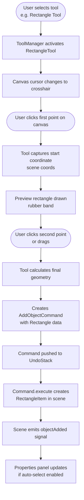
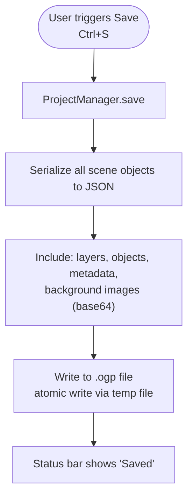
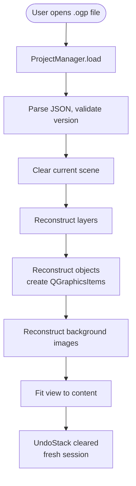
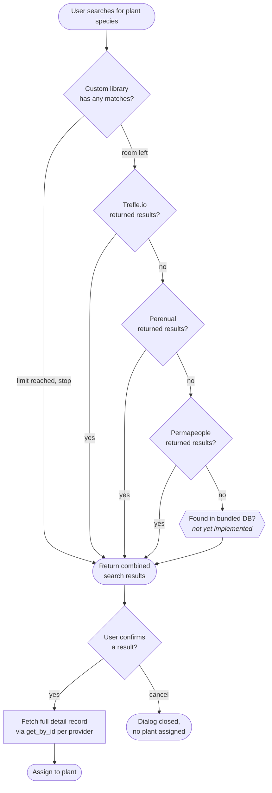
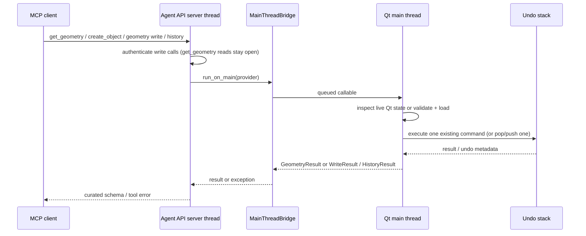
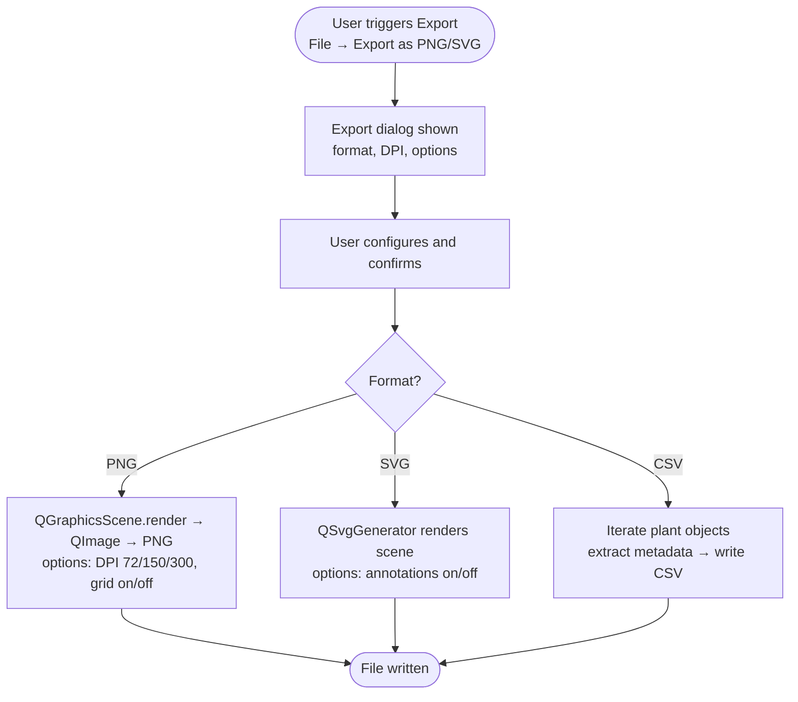
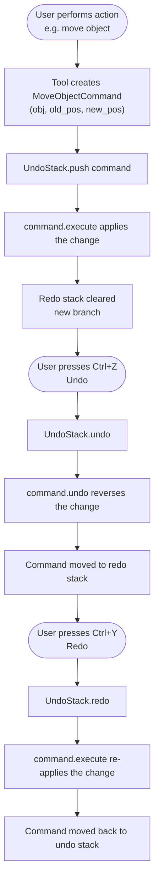
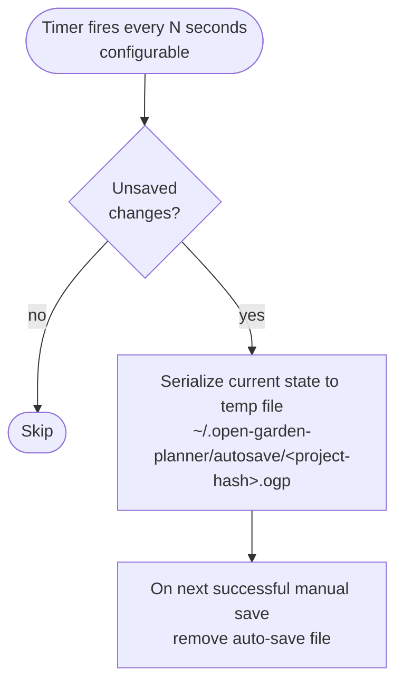
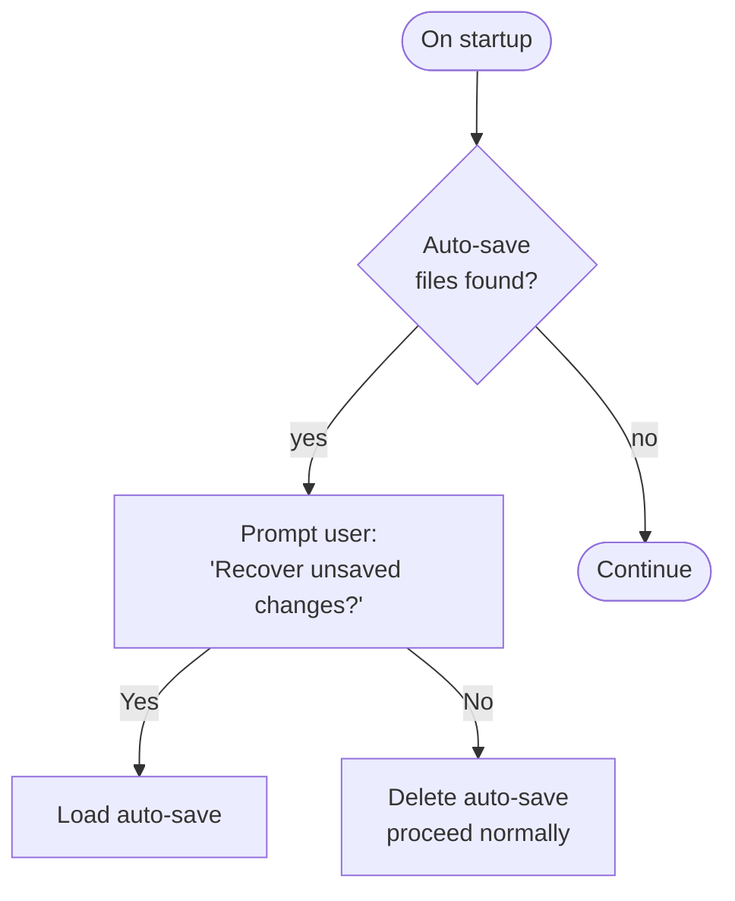

# 6. Runtime View

## Creative Windows validation runtime

The Windows workflow freezes the normal app, verifies startup/subsystems and
launches `--prototype-check` from an output directory outside the checkout.
The probe uses a private QA settings account and a retained fresh Python temp
directory so normal-account untitled autosave recovery is untouched. It creates QApplication and the real
Creative window, then schedules drawing, key/mouse input, undo/redo, save/reopen
and exports on the Qt event loop. A fresh run ID, process exit and JSON verdict
must agree. Screenshots come from actual widgets. After silent NSIS installation,
the workflow repeats these checks against the installed executable, preserves
source/licenses/evidence and uploads a test artifact. It does not create a release.

## 6.1 Drawing Workflow



## 6.2 Save/Load Flow

### Save



### Load



## 6.3 Plant API Integration Flow



**Custom library first, then Trefle → Perenual → Permapeople (issue #297,
corrected 2026-08-10):** `PlantAPIManager.search()` always searches the
user's local custom-plant library first (the `Custom` node) -- if it alone
meets the result limit, the search stops right there with no API call at
all; otherwise each provider is tried in order and the first to return any
results wins, with results concatenated onto whatever the custom library
already contributed. **Custom-library results are never deduplicated against
API results** -- a stale or bogus custom entry sharing a name with a real
species is returned (and, before this fix, displayed identically) alongside
it; every result row in `PlantSearchDialog` now carries a visible
data-source label (`plant_source_label()`, shared with the properties
panel) so the two can be told apart. See the #297 update in
`docs/11-risks-and-technical-debt/README.md` §11.4 for the incident this
corrected. The `Bundled` branch predates this fix and remains aspirational --
see `manager.py`'s `# TODO: Add bundled database client` and the #296 entry
in the same §11.4.

**Search vs. detail data (issue #297):** `search()` results (the `Return`
node above) are sparse for most providers -- Trefle's in particular omits
`growth`/`specifications`/`foliage` entirely, leaving sun/water/pH/nutrient/
foliage at UNKNOWN/None. `PlantSearchDialog` fetches the richer per-species
record via `PlantAPIManager.get_by_id()` only once the user **confirms** a
result (the `Confirm`/`Detail` nodes) -- not per browsed row, to avoid one
extra request per visible search result against rate-limited free tiers. A
failed detail fetch falls back to the sparse result rather than blocking the
assignment -- **quietly** (no warning) when the provider signals "no richer
detail exists for this record" (Perenual's free-tier paywall, or a Trefle
record with a null `main_species`), **with a user-facing warning** for a
genuine failure, so a real error can't silently reproduce #297's own
symptom. A successful fetch is **merged** onto the search result (a generic
field-by-field overlay: the detail response's value wins unless it's at the
field's default or `None`) rather than swapped in wholesale. The `Confirm
-->|yes| Detail` edge is simplified: a result whose `data_source` isn't one
of the three online providers (`custom`, or a future `bundled`) skips the
fetch entirely, since neither has an online detail endpoint.

### 6.3.1 Satellite Background Loading

The File → Load Satellite Background… path resolves its credential at the application boundary: a non-empty Preferences value (`api_keys/google_maps_key`) wins, otherwise `OGP_GOOGLE_MAPS_KEY` from the process environment is used. `main.py` supports the project-root `.env` in source runs and an adjacent `.env` in packaged runs. The menu action is enabled from this same resolver and is refreshed after Preferences is accepted. When the dialog opens, the resolved key is passed explicitly to the JavaScript bridge and the background fetch worker; it is never part of the project snapshot or serialized image metadata.

While the Static Maps request is in flight, closing or rejecting the picker requests worker interruption and leaves the dialog alive until the worker's terminal signal has been processed; the GUI thread never joins a network-bound worker. The main window also tracks the modal picker so application shutdown follows the same asynchronous path. Unexpected worker failures stay generic in the dialog, while a traceback scrubbed of the resolved key is written to the module logger for diagnosis.

When the Static worker fails with a classifiable EEA 403 (issue #346), the dialog offers the **JS-API view capture** path; a “Capture view” button also makes it available at any time with a drawn rectangle. Capture is a GUI-thread choreography with no worker (issues #346/#347): Python picks the best integer zoom + pan grid (`pick_capture_zoom_and_grid`, 0.85 viewport margin, 3×3 cap) and drives a two-phase page choreography. Phase 1 (`window.beginCaptureChrome` → hides toolbar/hint, `disableDefaultUI`, hides Google's attribution element for the capture only) reports the **capture profile** through the bridge (`captureReady(token, −1, dpr, cssW, cssH)` — frame index −1), pinning the real viewport + dpr. Phase 2 (`window.beginCaptureFrames` with the derived frame centres) settles one frame at a time (`setCenter`+`setZoom`, wait for `idle` + `tilesloaded`, 15 s JS timeout); the page reports readiness per frame (`captureReady(token, i, z, dpr, cssW, cssH)`, token first — the echo of the capture generation) and Python grabs the `QWebEngineView` widget — metadata crosses the bridge, pixels never do. Each grab is blank-checked (per-cell luminance analysis — a partial tile strip counts as a failure) and retried up to `FRAME_RETRIES = 2` (`retryCaptureFrame`); a mid-capture window resize is refused; the frame-0 grab is additionally ruler-gated against the profile dpr (`layout.dpr`) — the value the mosaic geometry and result scale are actually built from — so a falsy profile report or a cross-monitor DPI change between profile and first frame is refused, never silently mis-scaled. After the last frame the grabs are stitched (`stitch_frames` — whole css-pixel steps, integer grabbed-pixel paste offsets, seam-free by construction), the mosaic is cropped to the bbox through the same `crop_image_to_bbox` seam the Static path uses, exactly one attribution strip is baked (`bake_attribution`), and the result flows to the application as a standard `FetchResult` with `tile_grid=(cols, rows)`, `source="google_js_view_capture"` and `attribution`; `BackgroundImageItem.from_fetch_result` persists both as additive `geo_metadata` keys. The single-frame flow is the same choreography with a 1×1 grid. A 20 s Python watchdog (re-armed at every choreography step) and the generation counter guard against a lost page/bridge.

## 6.3.2 Agent API reads/writes: layers, shapes, geometry, and history



Layer reads are unauthenticated and expose stable UUIDs. Layer mutations use
the existing command classes, so moving an object or deleting a layer is one
undo step and undo restores the original layer assignment. Switching the
active layer is session state and has no undo entry. `create_object` validates
the shape family off the Qt thread, then invokes the loader's
`_deserialize_item_core` on the Qt thread and submits the item to the same
creation command used by the GUI. A `HOUSE` also receives its linked ridge in
the same `CreateItemsCommand`; a following Ctrl+Z removes both. Plant
parenting and active-layer assignment happen inside that same create operation.
The authenticated `undo`/`redo` tools use the same `CommandManager` as the GUI:
one call pops or reapplies exactly one command, returns the command description
and post-call stack state, and refuses an empty stack explicitly. Project load
uses a centralized serialized-document-item predicate, so a same-scene reload
cannot retain a stale callout/curve while compare and dimension overlays keep
their own cleanup owners.

For D2.6, `get_geometry` takes the same main-thread hop but performs no command:
it resolves the live item, maps current vertices/curve points through
`mapToScene`, and returns the constraint graph records that reference it. The
absolute-position and vertex writes validate on that same main-thread provider
before touching `CommandManager`. `set_object_position` converts the requested
centre to a delta and enters the complete move orchestration; vertex writes build
the canonical `MoveVertexCommand`/`AddVertexCommand`/`DeleteVertexCommand`.
A constrained item returns at the shared preflight with its constraint type/id
and therefore produces no command, no dirty signal, and no partial scene change.

## 6.4 Export Flow



## 6.5 Undo/Redo Flow



## 6.6 Auto-Save Flow





## 6.7 Agent Task and Soil Requests (US-D3.3/D3.4)

```mermaid
sequenceDiagram
    participant Client as MCP client
    participant Server as MCP/asyncio thread
    participant App as Qt main thread
    participant Service as Task/soil service
    participant Commands as CommandManager
    Client->>Server: Read tool or guided prompt
    Server->>App: anyio worker -> MainThreadBridge
    App->>Service: Snapshot/generate requested period or resolve effective soil
    Service-->>App: Tasks or record + source + matching history
    App-->>Server: Curated plain payload
    Server-->>Client: Typed result envelope or rendered prompt
    Client->>Server: Manual-task or soil-test write
    Server->>Server: Check write token
    Server->>App: MainThreadBridge
    App->>App: Validate all inputs before mutation
    App->>Commands: execute one existing command
    Commands-->>App: Mark dirty and refresh views
    App-->>Client: Result; one undo reverses the write
```

The soil prompt extracts one bed from the status/mismatch envelopes. Calendar
generation selects a year independently of `today`; urgency uses `today` after
the full requested period is generated. Refused writes return an error without
changing project data or either undo/redo stack.

## Creative preview startup (experimental only)

The development runner chooses a separate settings organization/application
before any store exists (ADR-041), creates QApplication after the required
WebEngine pre-import, loads the saved translator, applies proposed tokens, and constructs a
`CreativePreviewWindow`. The inherited startup/recovery sequence and project
manager remain intact. Gallery activation emits tool selection first and plant
metadata second; subsequent canvas gestures use existing commands.

Capture mode uses a separate capture account and fixture path, resets its UI state,
loads a synthetic saved plan, enables
the existing sun study and records real widget grabs after layout/accordion
settling. Interactive mode retains saved sample edits, language, theme, window/dock
preferences and the inherited welcome-on-startup choice. Normal app
startup does not import the experiment. Details: [design validation](../design/VALIDATION.md).


### Creative unit-edit sequence

Imperial text → LengthSpinBox/core.units.parse_length → canonical cm → existing property/drawing command → existing scene/solver → project serializer. A unit switch executes SetDisplayUnitsCommand, refreshes views and dimensions, and leaves canonical geometry untouched. Loading defaults missing preferences to metric before installing the validated document. Sun workspace changes toolbar visibility; the existing sun QAction owns simulation state. See ADR-051.
