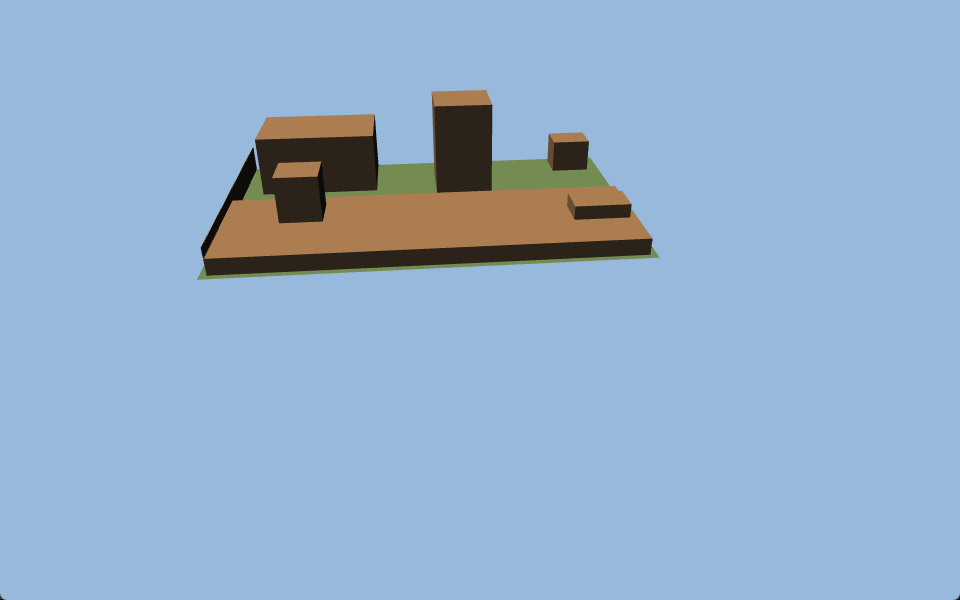

# 9. Architecture Decisions

Architecture Decision Records (ADRs) for significant technical choices.

## ADR-001: PyQt6 as GUI Framework

**Status**: Accepted
**Context**: Need a desktop GUI framework for Python with strong 2D graphics support.
**Decision**: Use PyQt6 with QGraphicsView/Scene for the canvas.
**Rationale**: Mature, native look on all platforms, hardware-accelerated 2D, 3D-ready via Qt3D. Large community.
**Consequences**: GPLv3 license required. Larger app size than lightweight alternatives.

## ADR-002: Bottom-Left Coordinate Origin (Y-Up)

**Status**: Accepted
**Context**: Need to choose coordinate system convention for the canvas.
**Decision**: Bottom-left origin with Y-axis increasing upward (CAD convention).
**Rationale**: Standard in CAD software. Eases future 3D transition. Mathematical convention.
**Consequences**: Requires Y-flip transform in QGraphicsView (which uses Y-down). Some complexity in mouse coordinate handling.

## ADR-003: JSON Project File Format (.ogp)

**Status**: Accepted
**Context**: Need a project file format for saving/loading garden plans.
**Decision**: JSON-based .ogp files with embedded images (base64).
**Rationale**: Human-readable, VCS-friendly, no external database needed. Embedded images ensure portability.
**Consequences**: Large file sizes with embedded images. No binary efficiency. Version migration requires JSON schema evolution.

## ADR-004: Command Pattern for Undo/Redo

**Status**: Accepted
**Context**: Need robust undo/redo support for all editing operations.
**Decision**: Wrap all modifications in Command objects, push to QUndoStack.
**Rationale**: Industry standard pattern. Qt provides QUndoStack. Clean separation of actions from UI.
**Consequences**: Every new editing operation requires a corresponding Command class. More code but predictable behavior.

## ADR-005: Fixed Sidebar (Not Dockable)

**Status**: Accepted
**Context**: Whether to use dockable panels (Qt dock widgets) or fixed sidebar.
**Decision**: Fixed sidebar with collapsible panels.
**Rationale**: Simpler UX, consistent layout, no user confusion about panel placement. Lower implementation complexity.
**Consequences**: Less flexibility for power users. May revisit for future versions.

## ADR-006: AI-Generated SVG Assets

**Status**: Accepted (Phase 6)
**Context**: Need illustrated SVG graphics for plants, furniture, and infrastructure objects.
**Decision**: Use AI image generation to create consistent top-down plant/object illustrations, then convert to SVG.
**Rationale**: Fast production, consistent art style, fully custom, no licensing issues. Can iterate on style.
**Consequences**: Quality depends on AI generation capabilities. May need manual cleanup. Style may evolve.

## ADR-007: Tileable PNG Textures (over Procedural)

**Status**: Accepted (Phase 6)
**Context**: Current procedural patterns are too subtle. Need rich, recognizable textures.
**Decision**: Replace procedural fill patterns with pre-made tileable PNG textures.
**Rationale**: Better visual quality, easier to create realistic materials, AI-generated or CC0 sourced.
**Consequences**: Increases app bundle size. Need LOD management for different zoom levels. Less flexibility than procedural.

## ADR-008: Qt Linguist for i18n

**Status**: Accepted (Phase 6)
**Context**: Need multi-language support (English + German initially).
**Decision**: Use Qt Linguist translation system (tr() calls, .ts/.qm files).
**Rationale**: Native Qt integration, industry standard for Qt apps, supports plurals and context, good tooling.
**Consequences**: All strings must be wrapped in tr(). Requires pylupdate6/lrelease build steps. Translation memory maintained in .ts XML files.

## ADR-009: NSIS Windows Installer

**Status**: Accepted (Phase 6)
**Context**: Need professional distribution for public release.
**Decision**: PyInstaller (--onedir) bundled with NSIS installer script.
**Rationale**: Professional install experience (wizard, shortcuts, file association, uninstaller). NSIS is free, mature, widely used.
**Consequences**: Windows-only initially. Need to maintain NSIS script. Cross-platform support deferred.

## ADR-010: Branded Green Theme

**Status**: Accepted (Phase 6)
**Context**: Current theme is generic. Need visual identity.
**Decision**: Garden-themed green color palette as primary brand color with light/dark variants.
**Rationale**: Strong visual identity appropriate for a garden planning tool. Green is universally associated with gardens/nature.
**Consequences**: Replaces current generic light/dark theme. Need careful color balance to avoid "too much green".

## ADR-011: Hybrid Plant Rendering

**Status**: Accepted (Phase 6)
**Context**: How many unique plant SVG illustrations to create.
**Decision**: Hybrid approach: ~15-20 category-based shapes varied by color/size, plus unique illustrations for ~10 most popular species.
**Rationale**: Best balance of visual appeal and production effort. Category shapes cover 90% of cases. Popular species get special treatment.
**Consequences**: Need mapping logic from plant type/species to SVG file. Category shapes must be generic enough to represent multiple species.

## ADR-012: Hybrid Constraint Solver (Gauss-Seidel warm-start + Newton-Raphson refinement)

**Status**: Accepted (Phase 11 — issue #140)
**Context**: The original solver was a pure Gauss-Seidel relaxation loop. It resolves every constraint by a 1D projection along its own geometric direction. This works for decoupled systems but diverges on coupled ones — the canonical failure is two `EDGE_LENGTH` constraints sharing a vertex, where the feasible position is the intersection of two circles. Users reported that constraining edge A to 4.53 m and adjacent edge B to 5.00 m left edge A drifting to 5.21 m (both constraints geometrically satisfiable).
**Decision**: Keep Gauss-Seidel as a fast warm-start, then run damped Newton-Raphson refinement (`constraint_solver_newton.py`) when the residual exceeds tolerance. Add a closed-form circle-circle fast path for the shared-vertex case. Add `numpy` as an explicit dependency (`>=1.24`) for `linalg.lstsq`.
**Alternatives considered**:
- *Pure geometric closed-form* — would need a case per constraint-pair (O(16²)); brittle and high-maintenance.
- *scipy.optimize* — adds ~40 MB to the installer for a problem numpy solves in <20 variables.
- *Analytic Jacobian* — a nice-to-have optimization, but numerical central differences cost microseconds; deferred as TD-008.
**Consequences**: Robust behaviour for user-built CAD sketches (matches SolveSpace/Onshape expectations). +1 runtime dependency (numpy). Jacobian is numerical, not analytic — mild perf ceiling, no correctness impact. See §8.12 for the full solver architecture.

## ADR-014: Bundled `plant_species.json` is single source of truth for species + calendar

**Status**: Accepted (Phase 12 — issue #170)
**Context**: Before #170 there were two bundled JSON files: `planting_calendar.json` (sow/transplant/harvest weeks, frost tolerance) consumed by `planting_calendar_db.py`, and an unbundled species record file that did not exist — species data only came from on-demand API search (Perenual/Trefle/Permapeople), which returns inconsistent or empty pH/NPK fields. Result: dropped plants had no `metadata["plant_species"]` until the user clicked Suchen, and US-12.10d (plant↔soil pH/nutrient warnings) silently no-op'd because `ph_min`/`ph_max`/`n/p/k_demand` were always None.
**Decision**: Collapse to one file — `src/open_garden_planner/resources/data/plant_species.json` — with full `PlantSpeciesData` records (incl. calendar fields) for every species the gallery exposes (118 records at land time: trees, shrubs, vegetables, herbs, berries, fruits, ornamentals). The new `bundled_species_db.py` module owns both the species-record API (`lookup_species`, `populate_item_species_metadata`) used by canvas drop / tool-draw paths, and the legacy calendar API (`get_calendar_entry`, `merge_calendar_data`) used by the plant detail panel. The old `planting_calendar.json` and `planting_calendar_db.py` are deleted.
**Alternatives considered**:
- *Two separate files (species + calendar)* — would duplicate `family`, `frost_tolerance`, `nutrient_demand` and create drift risk. The user explicitly rejected this in design discussion.
- *Auto-merge species data from the existing API at first launch* — only works with network access on first run, can't cover the offline installer experience, and the upstream APIs return inconsistent pH/NPK regardless.
- *Per-record source citations in the JSON* — adds noise. Sources cited at envelope level (`"sources": [...]`) is sufficient for the curated set.
**Consequences**: One file to maintain. Adding a species means writing one record with all fields populated. Drop flow auto-populates metadata for any of the 60+ bundled plants → US-12.10d warnings fire automatically. Long-tail species still fall through to the API search button. Bundle size grows by ~80 KB (negligible).

## ADR-015: Multi-nutrient Amendment Composition + User-toggleable Library

**Status**: Accepted (Phase 12 — US-12.11)
**Context**: US-12.10c shipped a calculator that walked deficits in priority order and picked the *first matching unused* substance for each fix tag. This worked for single-nutrient organics (blood meal → N, bone meal → P, greensand → K) but silently mishandled real-world commercial fertilizers, where one bag carries N + P + K + Mg + S in a single product. The old "consume substance, decrement secondaries by 1 step" rule under-credited compound fertilizers and produced over-long lists. Users also wanted to disable substances they don't have on hand, and to add structural amendments (sand, perlite, vermiculite, diatomaceous earth) driven by a soil-texture rating.
**Decision**: Replace the pick-once-per-fix loop with a **deficit-map + greedy max-coverage** loop. Each iteration scores every unused candidate by the number of currently-outstanding nutrient deficits it touches; the breadth-leader is picked, its primary nutrient is fully closed (quantity scales with deficit), and co-fixed nutrients are credited at the same dose factor and recorded in `AmendmentRecommendation.credits`. The pool is filtered by a per-project `enabled_amendments` allowlist that the user manages from a checkbox panel embedded in the existing Amendment Plan dialog. A `prefer_organic` flag biases tie-breaks. A new `SoilTestRecord.soil_texture` field drives a structural-pick phase that runs after the nutrient phase.
**Alternatives considered**:
- *Linear-program optimal solver* (e.g. scipy.optimize.linprog) — would minimise total grams across all substances. Rejected: ≤24 substances × ≤7 nutrients is too small to justify a numpy/scipy build dependency, the greedy pick is provably optimal for the breadth metric, and users prefer "one bag covers most" reasoning over "two-half-bags covers slightly less". 
- *Two-pass: organic first, then mineral* — clean conceptually but loses the "one compound substance covers multiple deficits" insight that motivated the rewrite.
- *Per-substance application_rate scaled by chemistry mass-balance (NPK %)* — would let the calculator do exact label-percentage math. Deferred: keeps the calculator's domain to "Rapitest level steps", avoids per-substance NPK% data entry on JSON, and the +1 step credit suffices for end-user purchasing decisions.
**Consequences**: Compound NPK fertilizers (Blaukorn, Tomatendünger, etc.) emit one row instead of three. Users see an honest "Raises N 1→3 + also raises P 1→3, K 1→3" rationale. Disabling substances changes both the inline preview and the cross-bed plan and shopping-list materials in real time. Soil-texture-driven structural picks add up to two rows for clayey soil (drainage + aeration), one row for sandy or compacted soil. Bundle data file grows by 12 entries (12 → 23 substances). No file-format bump; legacy projects load with `enabled_amendments=None` (= all enabled) and `soil_texture=None` (no structural picks).

## ADR-013: Soil Data Embedded in `.ogp` (not a sidecar file)

**Status**: Accepted (Phase 12 — US-12.10a)
**Context**: Per-bed soil tests need to persist across sessions. Two reasonable shapes: (a) embed under a top-level `"soil_tests"` key in the existing `.ogp` JSON file, or (b) ship a sidecar `<project>.soil.json` next to the `.ogp` file.
**Decision**: Embed soil tests directly in the `.ogp` file under `"soil_tests"`, bumping `FILE_VERSION` to `1.3`.
**Rationale**:
- *Single-file portability* — the `.ogp` file already carries seed inventory, location, propagation overrides etc.; soil tests fit the same contract. Users move/share one file.
- *Atomic save* — soil-test mutation participates in the existing dirty-flag/save flow. No risk of `.ogp` and sidecar drifting out of sync.
- *Undo coherence* — `AddSoilTestCommand` operates on `ProjectManager` state; the same instance the canvas commands work against. A sidecar would need its own dirty-tracking and merge protocol.
**Alternatives considered**:
- *Sidecar JSON* — would let lab-mode CSV imports drop a file alongside the project, but the same goal is achievable through Garden → Import inside the embedded model in 12.10c. The portability cost outweighs the import convenience.
- *Per-bed metadata field on `RectangleItem` etc.* — entangles canvas-item lifetime with historical data. Deleting a bed would lose its test history; restoring it via undo would not bring history back. Project-level storage avoids this.
**Consequences**: `.ogp` files grow modestly (≈100 bytes per test record). Migration path is one-way (v1.3 files cannot be opened in older binaries — same convention as v1.2). All later 12.10 sub-stories (overlay, calculator, warnings, sparklines) consume the same `SoilService` facade and inherit the storage decision automatically.

## ADR-016: Canonical Species Key

**Status**: Accepted (Phase 12 — issue #176)
**Context**: Five species identity fields existed across the codebase — `source_id`, `scientific_name`, `common_name`, `species_id`, `species_name` — with each module resolving them in a different order and with different normalisation. US-12.6 patched around the inconsistency with a local `_norm_species_key()` function in `shopping_list_service.py`. US-12.8 (Succession Planting) and US-12.9 (Journal) would both need to key data by species and would have baked the inconsistency deeper or invented yet another normaliser.
**Decision**: A single `species_key(species: dict[str, str]) -> str` function in `models/plant_data.py` is the only sanctioned way to derive a stable dict key from a species dict. Priority: `source_id` → `scientific_name` → `common_name`. Output is always `.strip().lower()`. Returns `"_unknown"` if all fields are absent or empty. All existing call sites migrated in issue #176.
**Rationale**: `source_id` is preferred because it is stable across common-name renames; all existing comparisons already worked case-insensitively once stripped, so the normalisation step is backward-compatible with on-disk project files. Centralising the logic means future call sites cannot diverge silently.
**Alternatives considered**:
- *New UUID `species_id` field on every canvas item* — would give a true stable key. Rejected: requires a data-migration for existing `.ogp` files and a coordinated change to the plant-drop workflow. Deferred until a file-version bump is warranted.
- *Normalise inside every caller* — the status quo. Rejected: each caller diverged slightly; the inconsistency was already causing phantom seed-gap misses in US-12.6.
**Consequences**: Keys in `propagation_overrides` and `shopping_list_prices` are stable unless a plant's `source_id` changes (API re-imports only — rare). `crop_rotation_service.py` was not migrated because it keys exclusively on botanical family name, not species identity.

## ADR-018: Object Gallery Moves to Top Toolbar (Sims-style Category Dropdowns + Global Search)

**Status**: Accepted (Phase 12 — UI refactor)
**Context**: The `GalleryPanel` sidebar widget held all ~120 placeable objects (beds, shapes, plants, structures, surfaces, furniture, infrastructure, fences) in 11 stacked categories with a search box and category dropdown. It was the first of 10 collapsible panels in a 450 px right sidebar. Three problems compounded: (a) the most-used action — "draw a garden bed" — sat as the *tenth* category (`Paths & Surfaces`), requiring the user to scroll past 100+ plants/objects first; (b) the sidebar overall was dense with 10 panels visible at once; (c) the toolbar at the top was intentionally minimal (5 tools) and left horizontal screen real estate unused.
**Decision**: Replace the sidebar gallery with **10 category-icon buttons in the top toolbar**, each opening a popup dropdown of 64×64 thumbnails (3-column grid) with an in-popup filter field. A separate **global search field** on the toolbar searches across every object regardless of category. The toolbar layout is `[5 core tools] | [10 category buttons] | [stretch] | [search field]`. Icons are SVG; 7 of 10 categories reuse existing icons from `resources/icons/tools/`, 3 new SVGs were added (`vegetable`, `furniture`, `infrastructure`).
**Alternatives considered**:
- *Sims-style left-rail "Build / Plant / Manage" modes* — bigger UX shift, would have required mode switching for previously-single-screen workflows. Rejected as too invasive for the value delivered.
- *Sidebar tabs (Objects / Plan / Garden)* — preserved the gallery in the sidebar, but did not solve the "scroll past 100 plants to find a bed" problem.
- *Promote only the top-3 shapes to the toolbar, keep gallery* — solves discoverability for beds but leaves the dense sidebar untouched.
- *Floating inspector for selection-dependent panels* — orthogonal concern, deferred. Selection panels currently still live in the sidebar.
**Consequences**: One-click access to every category. The "Garden Bed" tool is now the first item in the first dropdown (`Beds & Surfaces`), reflecting actual usage frequency. Gallery data lives in a single source (`ui/widgets/gallery_data.py`) consumed by both the dropdowns and the global search. `GalleryPanel`, its `_panels/__init__.py` export, and its test file are removed; translation strings migrated from context `GalleryPanel` to `GalleryData`. The sidebar drops from 10 to 9 panels and is reordered so selection-related panels (Properties → Plant Details → Companion → Crop Rotation) sit directly under each other. Drag-from-dropdown to canvas is preserved (same MIME format the canvas already accepts).

**Toolbar layout note (3-toolbar split):** The category buttons live in a *separate* `CategoryToolbar` rather than being embedded in `MainToolbar`. Three top-row toolbars are added in this order: `MainToolbar` (Select/Measure/Text/Callout/Pin) → `ConstraintToolbar` (CAD constraints) → `CategoryToolbar` (10 category dropdowns + global search). Qt's `addToolBar` ordering puts them left-to-right on the same row, with the search field naturally rightmost. Splitting also keeps the icon-lookup for category buttons free of `_CATEGORY_ICON_MAP` glue: the icon filename now lives on `GalleryCategory.icon_name` itself, set at construction (before any `tr()` translation), so locale-independent lookup is intrinsic to the data.

**Search-popup focus note:** The global search uses a `Qt.ToolTip`-flagged, `WA_ShowWithoutActivating` results popup with a no-focus QListWidget. Without these, the `Qt.Popup` window activates on every `show()` and steals keyboard focus from the QLineEdit — every keystroke after the first lands on the popup and is lost.

**Persistence:** Window geometry and the main splitter are persisted to `QSettings` (`UiState/…` group) by the lightweight `app/ui_state.py` wrapper, saved on `closeEvent`. (Per-panel expanded state was persisted in earlier versions but was removed in #226 — the sidebar accordion always starts collapsed; see **ADR-030**.)

**Toolbar visibility (added #283):** None of the five toolbars is user-hideable. `QMainWindow`'s built-in toolbar context menu is suppressed (`GardenPlannerApp.createPopupMenu()` returns `None`), and `_enforce_toolbar_visibility()` re-asserts the invariant after every `restoreState()` — the three core toolbars on, the two feature toolbars off — which also heals any state already saved with a core toolbar hidden. Rationale: since this ADR the `CategoryToolbar` *is* the object gallery, so a stray right-click removed **every** placement tool, and because the layout is saved on exit it stayed gone across restarts, with the only way back inside the same easily-missed menu (found in #283 manual testing). The same enforcement fixes #286, where the soil-overlay toolbar returned visible while its View-menu action stayed unchecked and its canvas tint was off.

## ADR-017: Bed-Specific Features Built Centrally on `GardenItemMixin`

**Status**: Accepted (Phase 12 — US-12.8 post-bug)
**Context**: Bed-capable shapes are not a single class but four (`RectangleItem`, `PolygonItem`, `EllipseItem`, `CircleItem`) — historical reasons: garden beds are drawn as polygons, raised beds as rectangles, in-ground round beds as circles or ellipses. Each new "bed-only" feature (grid toggle, soil-test entry, pest/disease log, succession plan) was hand-copied into all four `contextMenuEvent` methods. Twice in a row a feature shipped missing from one or more shapes: pest/disease log was missing from `PolygonItem` and `EllipseItem` until #173 added it; succession-plan ("Plan Anbaufolge…") was missing from all three non-rectangle shapes until the post-US-12.8 fix.
**Decision**: Bed-action construction and dispatch live on `GardenItemMixin` as `build_bed_context_menu(menu, *, grid_enabled, supports_grid)` and `dispatch_bed_action(action, actions)`, returning a `BedMenuActions` dataclass. Every bed-capable shape's `contextMenuEvent` calls these two methods inside its `is_bed_type` guard; no shape adds its own action constants for grid/soil/pest/succession. A parametrised regression test (`tests/integration/test_bed_context_menu.py`) iterates over all four shape classes and fails for any missing bed action.
**Rationale**: Adding a fifth shape (or new bed feature) is now a one-file change instead of a four-file diff. The regression test makes divergence detectable in CI rather than at user-report time. Centralising also means translation strings live in a single `"BedActions"` context, so the German/English wording is the same regardless of which shape opened the menu.
**Alternatives considered**:
- *Per-shape menus, manual sync* — the status quo. Rejected: failed twice in three months.
- *Unify the four classes into one* — much larger refactor, complicated by different shape semantics (vertex editing on Polygon, radius on Circle, etc.).
- *Plugin/registry pattern (bed features as data)* — overkill for four actions. The mixin method is just enough indirection.
**Consequences**: Bed-only menu strings now live under context `"BedActions"` instead of `"RectangleItem"`/`"PolygonItem"`/etc. — historical translations under per-shape contexts remain valid for non-bed menu entries (delete, duplicate, arrays, etc.). When introducing a NEW bed feature in the future, the entry point is `BedMenuActions` + `build_bed_context_menu` + `dispatch_bed_action`. The parametrised test must be extended with an `assert actions.<new_field> is not None` line — that single assertion forces the dev to remember the central path.

## ADR-019: In-App Satellite Background Picker via Google Maps + Embedded QtWebEngine

**Status**: Accepted (Phase 12 — satellite-import feature)
**Context**: Bringing a garden's satellite image onto the canvas was a fully manual process: take a screenshot of Google Maps, save it locally, import via `File → Import Background Image…`, then start the calibration tool and click two reference points whose real distance is known. Two pain points: (a) the screenshot-and-import dance is friction every time a new project starts; (b) calibration is the canonical source of subtle scale errors — picking the two points 1 px off propagates to every measurement in the canvas. Free open satellite providers (ESRI World Imagery, Sentinel) either lacked the sub-meter resolution needed for garden planning or had ToS that made them awkward for a Windows binary.
**Decision**: Embed a Google Maps picker inside the app via `QWebEngineView` + Google Maps JS API for navigation/drawing/address search, and use **Google Static Maps API** for the actual image fetch. The JS↔Python bridge is `QWebChannel`. Image fetch is in a worker `QThread`, automatically using a 2×2 or 3×3 mosaic of Static-Maps calls when the chosen bounding box does not fit a single 1280×1280 tile at the desired zoom (algorithm: pick the highest zoom — up to 20 — at which `cols × rows ≤ 3 × 3`). Pixel-to-meter scale is **derived analytically** from Web-Mercator (`mpp = cos(lat) × 2π × 6378137 / (256 × 2^zoom)`), so the resulting `BackgroundImageItem` lands on the canvas at true real-world size — no manual calibration step. Manual override remains via the existing "Calibrate Scale…" context menu (the saved `scale_factor` wins over the geo-derived value at load time).
**Alternatives considered**:
- *Free providers (ESRI, Bing, Mapbox)* — Mapbox/Bing have free tiers but slightly lower max resolution; ESRI World Imagery is keyless but ToS limits commercial redistribution. Google's $200/month free credit (~100k Static Maps calls/month) is overkill for hobby use; chose maximum image quality + simplest setup over multi-provider plumbing.
- *External browser + URL paste-back* — leaner (no QtWebEngine, no ~50 MB installer bloat) but a workflow break that loses the immediacy of "pick area → image on canvas".
- *Coordinate input only (no visual picker)* — simplest implementation but defeats the purpose; finding a garden by lat/lng without a map is hostile.
- *Tile-layer overlay on canvas* — would require ongoing tile fetches as the user pans/zooms within the project, blowing past sensible API budgets. Static one-time fetch keeps the call count to 1–9 per project.
**Consequences**: The `MapPickerDialog` (File → "Load Satellite Background…") replaces the screenshot-and-calibrate workflow for the typical case. `BackgroundImageItem` now carries optional `geo_metadata` (center + bbox + zoom + meters-per-pixel + source + timestamp) that persists through the `.ogp` project file — older project files without geo data load unchanged via the existing `to_dict`/`from_dict` path. **API-key handling** is the critical operational caveat: the key is resolved from Preferences first, then from `OGP_GOOGLE_MAPS_KEY` (loaded from `.env` via `python-dotenv` in `main.py`) and must **never** be bundled into the release `.exe` — any binary distributing the key could be reverse-engineered and the key abused. The menu item is disabled with an explanatory tooltip when the key is missing. Installer impact: `PyQt6-WebEngine>=6.10` adds ~50 MB to the runtime; spec file bundles the picker HTML from `resources/web/`. Web platform requirement: `from PyQt6 import QtWebEngineWidgets` is done at `main.py` module level, before `QApplication(...)` — Qt enforces this so it can configure OpenGL sharing in time.

**Addendum (Issue #342)**: The application now resolves a non-empty key saved in Preferences at `api_keys/google_maps_key` before falling back to `OGP_GOOGLE_MAPS_KEY` from the environment or supported `.env` file. The resolved value is passed explicitly to the map bridge and Static Maps worker. Blank Preferences means “use the environment fallback”; environment values are never copied into QSettings. The key remains local configuration, is not encrypted by QSettings, and must never be written to `.ogp` files, PyInstaller data, logs, or error messages. The satellite menu action is refreshed immediately after an accepted Preferences save. There is deliberately no billable “Test key” action.

**Addendum (Issue #346 — JS-API view capture)**: Effective 8 July 2025, Google's EEA terms make the Static Maps API reject `satellite`/`hybrid` requests with HTTP 403 for projects linked to EEA billing accounts (the Map Tiles API photo tiles are equally blocked; the documented alternatives are the Maps JavaScript API, Android and iOS SDKs). The JS API has **no export endpoint**, and Google's tile responses carry no `Access-Control-Allow-Origin` header — a measured spike (QtWebEngine 6.10.2, real key) proved that html2canvas-style DOM capture is impossible anyway: drawing a tile `` onto a canvas taints it (`SecurityError` on `getImageData`), and tile URLs embed the API key, so DOM-side image extraction is both broken and unsafe. **Decision**: a second import path, *JS-API view capture*: the already-embedded picker re-positions the live map over the drawn rectangle (integer zoom chosen by `services/google_maps_js_capture.pick_capture_zoom` so the bbox fits the viewport with an 0.85 margin), hides only *our* chrome (never Google's attribution overlay), waits for `idle` + `tilesloaded`, then the **Python side grabs the `QWebEngineView` widget** (`QWidget.grab()` — measured to return real pixels at exactly `css × devicePixelRatio`; verified at dpr 1.0 and 1.25). The grab is cropped with the *same* shared seam as the Static path (`google_maps_service.crop_image_to_bbox`), at `meters_per_pixel = meters_per_pixel(lat, zoom) / dpr` (dpr plays the exact role `scale=2` plays in Static), an English attribution strip (“Map data ©{year} Google”) is baked into the bottom of the image (the native overlay is usually cropped away; EEA ToS §3.2.4 requires preserved attribution), and the result flows through the unchanged `FetchResult` → `BackgroundImageItem.from_fetch_result` path with additive `geo_metadata` keys `source: "google_js_view_capture"` and `attribution` (old binaries ignore them; no `FILE_VERSION` bump — invariant 9). The capture is offered automatically when the Static worker fails with the EEA 403 body (classified by Google's own canonical wording, never re-diagnosed) and is always available via a “Capture view” button. Capture runs on the GUI thread guarded by the same generation-counter discipline as the fetch worker, with a JS-side 15 s timeout and a Python-side 20 s watchdog. **Non-goals kept**: no tile harvesting, no bypassing Google restrictions, no caching outside the user's own plan file; browsers/pixels never cross the QWebChannel bridge. Known limits recorded: the single-pass capture is capped at the dialog-viewport size (pan-grid stitching is follow-up **#347**); the Static path keeps priority for non-EEA projects; and the pre-existing (ADR-019-era) Static-image attribution gap on canvas remains open. The EEA body was probed live with a real EEA project key (the owner's): static satellite returns exactly *“satellite and hybrid map types are not available for your account and region”* while the JS map renders satellite tiles normally — the live capture harness produced a non-blank, correctly cropped and attributed image at the analytic scale.

**Addendum (Issue #347 — pan-grid view capture)**: The single-frame view capture's resolution is capped by the dialog's ~1000×700 CSS viewport; the Static mosaic reaches 3×3 its resolution. Issue #347 raises the JS path to the same ceiling with one engine, not a second: the capture is now a **pan grid** — the page pans the embedded map across a `cols × rows` grid of viewport positions at one integer zoom, Python grabs every frame and stitches them in Python. A *capture profile* phase (`beginCaptureChrome` → `captureReady(token, −1, …)`) reports the real viewport size + dpr before the grid is derived; afterwards the dialog drives one settle at a time (`beginCaptureFrames` → per-frame `captureReady(token, i, …)` → `advanceCaptureFrame()` / `retryCaptureFrame()`), reusing the #346 idle/tilesloaded settle, grab, blank/dpr gate and the single `crop_image_to_bbox` seam. **Seam-free stitch theory**: at an integer zoom, satellite tiles are deterministic world-pixel content; `build_frame_layout` places every frame centre a whole number of world (css) pixels from its neighbours, so all frames share the same sub-pixel phase and adjacent grabs are exact adjacent windows of the same world image. Steps are aligned to the dpr fraction (`step × dpr` whole), so `stitch_frames` pastes at integer grabbed-pixel offsets — no overlap, no blending, no seam. The grid is symmetric about the bbox centre, so the mosaic crops through the unchanged shared seam. **Grid selection mirrors `pick_zoom_and_grid`** (`pick_capture_zoom_and_grid`, cap 3×3 = Static parity, `_MIN_ZOOM` fallback); the single-frame path is the degenerate 1×1 grid (`pick_capture_zoom` became a `max_grid=1` wrapper). **Attribution**: Google's native attribution element is hidden for the capture choreography only and exactly one “Map data ©{year} Google” strip is baked onto the stitched result — never per frame (EEA ToS §3.2.4 preserved; the interactive map keeps the native overlay). **Failure handling**: per-frame failures (blank/partly-loaded/zoom-mismatch/timeout) retry up to `FRAME_RETRIES = 2`, then fail with a translated message; a mid-capture window resize is refused (`_CAPTURE_VIEW_CHANGED_MESSAGE`); the stitch raises `CaptureLayoutError` when the mosaic cannot cover the bbox — never a silently blank or wrongly scaled region. **dpr gate semantics**: all pan-grid geometry and the result mpp derive from one dpr value (`layout.dpr`, set from the capture-profile report with a 1.0 fallback); the frame-0 ruler check (`capture_dpr_close_enough`, 0.5% relative) validates the measured grab against *that* value — never against a per-frame report — so a falsy profile or a cross-monitor DPI change between the profile and the first frame is refused instead of silently mis-georeferencing. `FetchResult` is unchanged, so canvas placement, `geo_metadata` and status messaging keep working (the JS-branch status message does not consume `tile_grid`). The one assumption validated only on a real key is that Google's rasterizer is phase-deterministic between whole-css-px pans (its own sub-pixel sampling could in principle vary between frames); the manual-test checklist inspects the seam visually.

## ADR-020: Unified Snap Provider Registry + QuadTree Spatial Index

**Status**: Accepted (Phase 13 — Package A, US-A3)
**Context**: Snapping logic was split across two unrelated modules. `core/snapping.py` (the `ObjectSnapper`) compares left/center/right and top/center/bottom values of a *dragged* bounding rect against every other item's bounding rect — a 1-D value match producing full-height/width magenta dashed guide lines, used only during drag operations. `core/measure_snapper.py` enumerates *point* anchors (centers, edge midpoints, vertices) and is used by the MeasureTool (and indirectly by every constraint tool's anchor picker) via `find_nearest_anchor`. Two new snap modes — midpoint of any straight edge, and intersection of two edges — were required by US-A3, and the existing systems had no place to put them: the bounding-box engine cannot represent a midpoint and the anchor-points helper is a flat function with no notion of activation toggles or performance budget. Both paths iterated every scene item on every query, which is fine at ~50 items but became visible on 1000-item gardens.

**Decision**: Add `core/snap/` as a thin orchestration layer that *wraps* the existing geometry helpers without replacing them. A `SnapProvider` ABC owns one snap mode (endpoint, center, edge, midpoint, intersection); a `SnapRegistry` collects providers and runs them on a query, breaking ties by `priority` — lower wins outright, then distance as the secondary key (endpoint 10 < intersection 15 < center 20 < midpoint 30 < edge 40). `EndpointSnapProvider`, `CenterSnapProvider`, `EdgeCardinalSnapProvider` delegate to `measure_snapper.get_anchor_points` and filter by `AnchorType`. `MidpointSnapProvider` walks edges of rectangles/polygons/polylines/construction-lines via a new `core/snap/geometry.item_edges` helper. `IntersectionSnapProvider` does pairwise segment intersection capped at 60 segments per query. A bounded-depth (max 6) `QuadTree` (`core/snap/spatial_index.py`) pre-filters candidates — items spanning multiple children are duplicated into every overlapping child and `_query` deduplicates via `id()`, trading a little memory for simpler insert logic. `PointSnapper` glues the index to the registry and is the single entry point used by `CanvasView`. The two legacy modules stay intact; the new path is opt-in.

**Alternatives considered**:
- *Replace `ObjectSnapper` and `measure_snapper` entirely*. Rejected: the constraint solver and 20+ call sites pin `AnchorType` and `get_anchor_points`; a one-shot rewrite would have ballooned the PR and made the diff unreviewable. The wrap-don't-replace shim leaves master green at every commit.
- *Embed midpoint/intersection inside `measure_snapper`*. Rejected: the legacy helper has no notion of enable/disable toggles, no spatial index, and would have grown to ~500 lines mixing data extraction with orchestration.
- *Use an external `rtree` package instead of a hand-rolled QuadTree*. Rejected: adds a non-trivial native dependency (libspatialindex) that complicates the PyInstaller build. The QuadTree passes the 16 ms 60-fps budget at 1000 items.

**Consequences**: The new modes ship with one menu toggle each (`View → Snap to Midpoints`, `Snap to Intersections`), persisted in `AppSettings`. Glyphs (square = endpoint, circle = center, triangle = midpoint, X = intersection, dot = edge) are rendered in `CanvasView.drawForeground` and stay at constant on-screen size via 1/zoom scaling. The drag-time bbox snapper is untouched; future work may unify it under the same registry if a need arises. `tests/unit/test_snap_providers.py` (19 tests) covers each provider; `tests/unit/test_snap_spatial_index.py` and `tests/unit/test_point_snapper.py` enforce the perf gate.

**Addendum (issue #354 — CI variance):** the 1000-item spatial-index test no longer treats one wall-clock sample as a deterministic contract. It performs one warm-up, five rebuild samples, and five 100-query batches, then asserts median build `< 200 ms` and median query `< 1 ms`. This preserves a loud failure for a sustained regression while absorbing an isolated shared-runner scheduler spike. The threshold is calibrated against the recorded Python 3.11/Linux outlier (284.110 ms) and repeated local Python 3.12/Windows samples (median about 15 ms); it is intentionally a platform-tolerant guard, not the end-to-end 16 ms user-facing snap budget. The test remains the same regression gate, and no spatial-index implementation change was needed.

## ADR-022: Bezier Curve Model + Filleted-Rectangle Conversion

**Status**: Accepted (Phase 13 — Package B, US-B1 + US-B3)
**Context**: Two unrelated curve problems landed in the same package. (1) The bezier tool (US-B1) needed a curve model — quadratic, cubic, or NURBS — and an authoring UX that doesn't punish users who've only ever used pen tools in Illustrator / Inkscape / Figma. (2) The fillet tool (US-B3) had to round corners of polylines, polygons, **and rectangles**, but rectangles store only `x, y, w, h` — they have no per-corner geometry slot to hold a fillet radius, and the existing `RectangleItem` is referenced by ResizeHandlesMixin, RectVertexEditMixin, the constraint solver, and a dozen other call sites that all assume an axis-aligned bounding rect.

**Decision**: (1) Adopt **cubic** Bezier (two handles per anchor) as the single curve model. Each anchor stores `handles_in[i]` + `handles_out[i]` so the segment from anchor `i` to anchor `i+1` is rendered with `path.cubicTo(handles_out[i], handles_in[i+1], anchors[i+1])`. Authoring mirrors the Illustrator pen: click-drag per anchor — drag direction sets `handles_out[i]`, `handles_in[i]` is mirrored automatically (smooth tangent default). ~~Edit mode reuses the polyline `VertexHandle` infrastructure plus a "handle" variant rendered as a hollow square so users can drag handles distinct from anchors.~~ **(Superseded by ADR-025:** placed-curve editing shipped later as US-B9 via a dedicated `CurveEditMixin` + `CurveControlHandle`, *not* the polyline `VertexHandle` — see ADR-025 for why.) (2) **Filleting a rectangle is a destructive conversion**: `FilletCornerCommand` removes the `RectangleItem` and inserts a `PolygonItem` (5 vertices — the picked corner becomes two tangent points) **plus** a free-standing `ArcItem` for the fillet's arc. The command stores the original `RectangleItem` reference; undo removes the new polygon + arc and re-inserts the original rect untouched. Polylines and polygons mutate in place via the same vertex-split pattern (no destructive conversion needed) and gain their own `ArcItem`.

**Alternatives considered**:
- *Quadratic Bezier* — simpler (one handle per segment) but produces lower-quality curves for typical garden layouts (smooth driveway sweeps, organic bed edges). Cubic is the format the user's existing PDF / SVG / DXF outputs already expect, so quadratic would have required conversion at every export. Rejected.
- *NURBS / rational Beziers* — would handle conic sections (true circles, ellipses) inside a single curve type, but the authoring UX is unfamiliar and the export plumbing for DXF/SVG would need rational extensions. Beyond Phase 13 scope.
- *Polygon-with-arc item type for filleted rectangles* — would have preserved "rectangle-ness" through fillets so resize handles still work. Rejected: needed a whole new item class with its own serialiser, vertex editor, resize logic, constraint hook-up, and selector ranking. Polygon + ArcItem is a 4× smaller surface and reuses existing plumbing. The trade-off (filleted rectangles lose their rectangle resize handles) is documented in the user-facing release notes.
- *Soft conversion via a hidden "fillet_radii" dict on RectangleItem* — keeps the rect type but adds invisible per-corner data the rest of the codebase doesn't know about. Rejected as a footgun: the next person to touch RectangleItem.serialize would forget the radii.

**Consequences**: The Bezier item lives at `ui/canvas/items/bezier_item.py`; its undoable mutations live in `core/commands.py::BezierMoveAnchor/Handle/Add/Delete/ToggleSmoothCommand`. The pen tool stores `_active_drag_anchor_index` and applies the smooth-handle mirror on `mouse_move` until the user releases. **Alt-break-symmetry** (independent left/right handle angles) is deferred to a follow-up — the MVP ships with smooth-only. Filleted rectangles cannot be un-filleted except via undo; once the command is no longer on the undo stack, the polygon stays a polygon. DXF export rasterises Bezier curves to short line segments (limitation logged in the export-service comments); native cubic export will follow in a future package. `tests/unit/test_bezier_item.py` (14 tests), `test_bezier_commands.py`, `test_fillet_geometry.py` (12), `test_chamfer_geometry.py` (6), `tests/integration/test_fillet_chamfer.py` (10) cover the new geometry and undo paths.

## ADR-023: Snap Pipeline v2

**Status**: Accepted (Phase 13 — Package B, US-B4/B5/B6)

> An earlier draft of this ADR also covered the Paper Space MVP (US-B7). US-B7 was dropped during PR #191 manual-test review — the existing `pdf_report_service` already covers print-to-PDF at chosen paper sizes, and the second-space CAD-style workflow added no user value on top. The `ui/paper_space/` package, `services/scene_rendering.py`, and the `paper_layouts` persistence schema were deleted before merge. This ADR is now scoped to the snap-pipeline change alone. (`scene_rendering.py` survives separately as the PNG-export refactor target.)

**Context**: ADR-020 (snap registry + quadtree) shipped four kinds — endpoint, center, edge, midpoint, intersection. Package B added three more (nearest, perpendicular, tangent), two of which (perpendicular, tangent) are *not* a function of the cursor and the scene alone — they need a **second** anchor: the active tool's `last_point`. Perpendicular drops a foot from `last_point` onto the nearest edge; tangent finds the contact point of a line from `last_point` to a circle's tangent. Bolting these onto `SnapProvider.candidates(cursor, items, threshold)` would have meant either threading `view._drawing_tool.last_point` through every provider or having providers look it up themselves, breaking the pure-function contract.

**Decision**: Extend `SnapProvider.candidates()` with a single new optional argument: `reference_point: QPointF | None = None`, propagated through `SnapRegistry.best()` and `PointSnapper.snap()`. Existing providers (anchor, midpoint, intersection) accept the kwarg and ignore it; new providers (`PerpendicularSnapProvider`, `TangentSnapProvider`) act on it; `NearestSnapProvider` doesn't need it. `CanvasView._active_tool_reference_point()` centralises the lookup so callers don't poke into `tool_manager._active_tool` directly. Priority ordering: endpoint 10 < intersection 15 < center 20 < perpendicular 25 < tangent 26 < midpoint 30 < edge 40 < nearest 45 — the new modes slot below the established kinds.

**Alternatives considered**:
- *Add a `reference_point` provider attribute set externally before each query* — stateful and harder to test (providers should be pure functions of their inputs).
- *Pass a richer `SnapContext` object* — fits future expansion but adds noise for the four providers that don't need it. Defer until at least one more "needs side-channel state" provider arrives.

**Consequences**: The snap signature change is a one-time API churn — all in-tree providers were updated atomically, and external consumers (none yet) get a `None` default. Glyph rendering moved into `CanvasView.drawForeground` (each kind has its own shape: square=endpoint, circle=center, triangle=midpoint, X=intersection, hourglass=nearest, ⊥=perpendicular, small-circle+tangent-line=tangent) — no separate `snap_indicator.py` needed. `FILE_VERSION` bumped to 1.4 for the new `arc`/`bezier` item types; the loader rejects projects with a `version` higher than `FILE_VERSION` so an older binary can't silently round-trip a newer file. Tests: `test_perpendicular_snap_provider.py` (8), `test_tangent_snap_provider.py` (7), `test_nearest_snap_provider.py` (11) + integration tests; `test_scene_rendering.py` (3), `test_export_png_after_refactor.py` (2).

## ADR-021: Coordinate Input Pipeline (Status-Bar Field + Cursor Overlay, Single Buffer)

**Status**: Accepted (Phase 13 — Package A, US-A1/A2/A4)
**Context**: Typed coordinate entry is the most-requested workflow gap for users coming from AutoCAD/QCAD. Two UI surfaces are needed: a status-bar field (always-visible, CAD convention, predictable) and a cursor-anchored Dynamic Input overlay (modern, immediate). Without a shared state, the two surfaces drift out of sync, focus bounces between them, and the parser has to live in two places. Adding to the complexity, German users expect `,` as the decimal mark but `,` is also the natural dx/dy separator (`@500,200` → ambiguous: dx=500.2 or dx=500,dy=200?).

**Decision**: A single `CoordinateInputBuffer(QObject)` owns the text and the anchor point; both widgets read and write it via Qt signals (`text_changed`, `anchor_changed`, `committed`, `parse_error`). The pure-Python parser (`core/coordinate_input/parser.py`) accepts `@dx,dy` (relative), `@dist<angle` (polar, 0° = east, CCW positive, math convention) and `x,y` (absolute) with deterministic decimal/separator disambiguation rules (A–F): `;` is always separator; `.` + `,` mixed → `.` decimal; only commas → 1 = separator, 3 = locale decimal pair, 2 = ambiguous (prefer locale, `parse_alternative` exposes the secondary reading). The buffer is owned by `CanvasView`; the status-bar `CoordinateInputField(QLineEdit)` (inserted into the existing `_setup_status_bar`) and the floating `DynamicInputOverlay` both subscribe. Anchor is refreshed after every tool `mouse_press`/`mouse_release`/`mouse_double_click`/`key_press` and after tool changes (which also clears stale text). `BaseTool` gains `last_point` (default `None`) and `commit_typed_coordinate(point)` (default no-op); drawing tools (polyline, polygon, circle, rectangle, ellipse, construction line/circle) implement both, reusing the same code path as a mouse click would.

**Alternatives considered**:
- *Status-bar field only* — predictable but slower; users have to glance away from the cursor.
- *Cursor overlay only* — modern but loses always-visible affordance and is easy to dismiss.
- *Locale-only decimal* — would fail every English-speaking user who pastes `100.5,200`.
- *Separator-only decimal* (CAD legacy) — fails German users who naturally type `1,5`.
- *Per-tool typed-input hooks* — would have duplicated focus/anchor wiring N times.

**Consequences**: Adding a new drawing tool that supports typed input is two methods (`last_point` getter + `commit_typed_coordinate`). The parser is reusable for future CSV/DXF-style imports of point lists. The Y-axis flip lives in one place (the parser): user-entered Y reads as math-up-positive and is converted to scene-down-positive at parse time, so the rest of the codebase keeps its existing Y-down convention. The overlay is hidden while the active tool's `last_point` is `None`, avoiding a meaningless polar input UI. `View → Enable Dynamic Input` toggles the overlay independently of the status-bar field. The buffer's `parse_alternative` is currently unused by the UI but available for a future "interpreting as …" tooltip if 2-comma ambiguity becomes a support pain point. **Polar without anchor**: the parser requires `last_point` for polar input (with or without `@`); without it, a `ParseError` is raised instead of silently falling back to the origin — a silent fallback would place a vertex far from the cursor with no feedback.

## ADR-024: Snap-Emitted Constraints — TANGENT Type + Named-Edge Anchors

**Status**: Accepted (Phase 13 — Package B follow-up, issues #192/#196/#197)

**Context**: ADR-023 added nearest/perpendicular/tangent snap *points*, and a first auto-constraint emitter turned a snapped polyline vertex into a durable constraint. Manual testing of PR #191 found those constraints were decorative: the emitter referenced the source item's `CENTER` anchor (not the specific edge), and `POINT_ON_EDGE` was emitted without its mandatory `anchor_c`, so the solver silently skipped it. Tangent snaps couldn't become durable at all — there was no `ConstraintType.TANGENT`. Separately, "constraints aren't enforced on drag" turned out to be a *consequence* of the malformed anchors: the drag-time propagation path (`CanvasView._compute_constraint_propagation` → `ConstraintGraph.solve_anchored`) already existed and works for well-formed constraints.

**Decision**:
1. **Carry the source edge on the candidate.** `SnapCandidate` gains `source_edge_index: int | None` (deterministic order: rectangle 0=top/1=right/2=bottom/3=left, polygon/polyline edge `i` = vertex `i`→`i+1`), populated by the nearest/midpoint/perpendicular providers.
2. **Resolve anchors by position-matching, not index arithmetic.** `auto_constraint` recomputes the edge's endpoints/midpoint, then matches them against `get_anchor_points(source)` to pick the exact `(anchor_type, anchor_index)` the drag solver already builds offsets for. This avoids duplicating each item type's idiosyncratic vertex/midpoint indexing (rectangle corner order differs from `item_edges` order; polygon edge-midpoints get a geometry-dependent cardinal type).
3. **Map snap kind → constraint**: NEAREST/PERPENDICULAR on a straight edge → `POINT_ON_EDGE` (vertex + both edge endpoints); MIDPOINT → `COINCIDENT` (vertex ↔ edge midpoint anchor); NEAREST on a circle/arc → `POINT_ON_CIRCLE` (centre + radius); TANGENT on a circle/arc → **`POINT_ON_CIRCLE` + `ConstraintType.TANGENT`** as a non-degenerate pair (see points 4–5).
4. **TANGENT means "edge ⟂ radius at the contact", actively enforced.** The residual is the radius projected onto the edge direction: `(C − v1)·(v0 − v1) / |edge|`, which is `0` exactly when the edge `anchor_a→anchor_c` is perpendicular to the radius `anchor_b − anchor_a`. (`anchor_a` = contact `v1`, `anchor_b` = centre `C`, `anchor_c` = far vertex `v0`; `target_distance` stores the radius for display only.) Enforced in **both** solver passes: Gauss-Seidel translates the line (or, if pinned, the circle) *along the edge direction* by the residual — closed-form, since the projection is linear in a rigid translation — and the same residual is in Newton `eval_residuals` as backup (numerical Jacobian, per ADR-012).
5. **The pair welds the contact AND stays tangent because it is NON-degenerate.** `POINT_ON_CIRCLE` pins the contact's *radial* DOF (`|v1−C| = r`); its gradient is radial. The TANGENT residual pins the *tangential* DOF (where on the rim the contact sits); its gradient is along the edge. At a tangent configuration the edge ⟂ the radius, so the two gradients are **orthogonal** → full-rank Jacobian. The contact is welded to the rim, the edge stays tangent, and under a circle drag the contact co-moves with the circle. (The naïve "signed perpendicular distance = radius" tangent has a *line-normal* gradient that is **parallel** to `POINT_ON_CIRCLE`'s radial one → rank-deficient → it drifted. That degeneracy, with an additional unsigned-`|cross|` kink and a stale warm-start, produced the three successive manual-test failures: radial stall → side flip → tangency drift. The edge⟂radius form fixes all three at the root.)
6. **Tangent items keep their previous-frame position as the drag warm-start.** `CanvasView._propagate_constraints_during_drag` normally reverts each propagated item to its drag-start position every frame (to compute clean deltas). The contact-on-rim has *two* antipodal solutions; reverting to the original drawn position lets a large circle drag re-project onto the wrong one and flip. Items in a `TANGENT` constraint are therefore *excluded* from the per-frame revert — they warm-start from the previous frame's position and track continuously. Combined with the non-degenerate pair + active Gauss-Seidel enforcement, the contact stays welded + tangent on the drawn side for arbitrarily large drags. Other constraint types keep the clean-delta revert.

**Alternatives considered**:
- *Perpendicular snap → rotation-only `PERPENDICULAR` constraint* — rejected: that type rotates a whole item and is skipped by the position solver, so it can't hold a single drawn edge at 90°. `POINT_ON_EDGE` (vertex rides the edge) captures the intent and is enforced today. A true edge⟂edge residual is deferred.
- *TANGENT as "signed perpendicular distance from centre to line = ±radius"* — rejected: paired with `POINT_ON_CIRCLE` (needed to weld the contact) it is degenerate (gradient parallel to the radial one, point 5). Manual testing exposed this as a radial stall, then an opposite-side flip, then tangency drift. The edge⟂radius residual has an edge-aligned gradient (orthogonal to radial), so the pair is well-conditioned.
- *Emit TANGENT alone (no weld)* — rejected: pure tangent is robust but lets the circle slide *along* the line, so the contact drifts off the drawn point — the user requires the contact welded to the rim.
- *Recompute anchor indices per item type in the emitter* — rejected as fragile duplication of `measure_snapper` classification; position-matching is DRY and robust.
- *Build a new `itemChange`-based debounced solver for enforcement (as issue #197 literally described)* — unnecessary: `_compute_constraint_propagation` already runs on drag.

**Consequences**: Snap-emitted constraints are enforced by the existing drag path in both directions. A tangent line keeps its contact welded to the circle's rim AND stays tangent through arbitrarily large circle drags — no stall, flip, or drift. TANGENT round-trips through the unchanged `Constraint.to_dict/from_dict` (enum-by-name + `anchor_c`); `FILE_VERSION` is unchanged (no new item types). Tests: `test_constraint_tangent_math.py` (edge⟂radius residual; pair = proper tangent; holds when the circle moves), `test_auto_constraint_emit.py` (emit for all kinds, drag-propagation enforcement, and `TestTangentDragHolds` reproducing the manual-test failure on the user's exact geometry then asserting contact-welded + tangent every frame), and `test_dynamic_input_overlay.py` now exercises the real polyline-finalize path (issue #190) instead of monkeypatching it, with autosave sandboxed to `tmp_path` in the fixture.

## ADR-025: Exact Arc Rendering + Curve Control-Handle Editing

**Status**: Accepted (Phase 13 — Package B follow-up, issues #195/#193)

**Context**: PR #191 manual testing flagged two gaps on the curve items shipped by Package B. (1) A finished 3-point arc rendered its end *a little past* the user's third click. Empirical measurement showed the *analytic* geometry was exact (`ArcItem.start_point()`/`end_point()` match the clicks to ~1e-13 cm) but Qt's `QPainterPath.arcMoveTo`/`arcTo` drifted the *rendered* endpoint by up to **0.24 cm** on a shallow, large-radius (near-collinear) arc — a rendering bug, not a math bug. (2) Placed `BezierItem`/`ArcItem` could be moved and deleted but not *reshaped* — selecting one showed no edit handles, unlike polylines/polygons/rectangles.

**Decision**:
1. **Render arcs from exact cubic-Bézier segments.** `core/cad_geometry.arc_to_painter_path(center, radius, start_deg, span_deg)` splits the span into ≤45° segments (endpoints exact regardless; ≤45° keeps the interior radial error ≈ O(θ⁶·r), ~4e-6·r) and places each segment's **anchor points exactly** on the analytic circle (`center + r·(cos,sin)`), with control points along the tangents scaled by `k = 4/3·tan(Δ/4)` (signed, so CW spans extend the handles the right way). `ArcItem._rebuild_path` and `ArcTool._update_preview_path` both use it → rendered start/end match the clicks to double precision, and preview == final. Snapping is unaffected (it reads analytic `center`/`radius`, never the path).
2. **A dedicated, selection-driven curve editor — not the polygon `VertexHandle`.** `CurveEditMixin` + `CurveControlHandle` (in `resize_handle.py`) provide reshape-only editing: handles appear while the curve is selected (`itemChange(ItemSelectedHasChanged)` → `sync_curve_edit_to_selection`) and vanish on deselect. We deliberately did **not** reuse `VertexHandle`, which carries polygon insert/delete-vertex context-menu semantics irrelevant to curves. The item stays movable (body-drag moves the whole curve; a handle is a child item that grabs the mouse on press, so its drag reshapes without moving the parent). Handles are fixed-screen-size children, like the vertex handles.
3. **Keyed on the item's own selection, not "sole selection".** The plan considered showing handles only for the single selected item, but a scene-wide gate leaves *stale* handles on an item whose own selection didn't change when a second item joins a multi-selection (its `itemChange` never re-fires). Keying on `self.isSelected()` keeps every item's `itemChange` self-consistent; multi-select simply shows handles on each curve. (The alternative — a scene `selectionChanged` broadcast — was rejected as unnecessary coupling for no user-visible requirement.)
4. **Reshape semantics.** *Bezier*: dragging an anchor carries both its tangent handles along; dragging a tangent handle mirrors the opposite one across the anchor for a smooth (C1) join, unless **Alt** is held (corner mode). Endpoint anchors expose only their single live handle. *Arc*: start / through / end handles (plus a read-only centre marker); any drag recomputes the arc via `arc_from_three_points`, so dragging the through-point changes curvature with the endpoints fixed. A drag that would make the three points collinear (or radius < `_ARC_MIN_RADIUS`) is rejected — the geometry simply doesn't update.
5. **Undo via geometry snapshot.** `SetCurveGeometryCommand(item, old_state, new_state)` calls the item's `_restore_geometry()`; each item implements `_capture_geometry()` (an opaque, comparable tuple) / `_restore_geometry()`. A handle press snapshots, the live drag mutates, and release registers exactly one command (skipped if the geometry is unchanged) — matching the existing `_on_vertex_move_end` registration idiom (append to the stack without re-executing, since the drag already applied it).
6. **Arc gains a stored through-point.** Reshaping needs the third degree of freedom held fixed while dragging an endpoint, so `ArcItem` stores `_through` (the original 3-point through-point, defaulting to the angular midpoint) and persists it as additive `through_x`/`through_y`. Files without it derive the midpoint on load, so **`FILE_VERSION` stays 1.4** (old apps ignore the keys; this app back-fills them).
7. **The view must register `CurveControlHandle` in its dropped-grab allow-list.** `CanvasView` works around a PyQt6 bug where Qt silently drops the mouse grab on `ItemIgnoresTransformations` child items between events, by tracking `self._active_drag_handle` on press and re-grabbing in `mouseMove`/`mouseRelease` — but only for a type allow-list (`ResizeHandle`, `RotationHandle`, `VertexHandle`, `RectCornerHandle`, `MidpointHandle`, **now `CurveControlHandle`**). A handle omitted from this tuple receives the press but no moves (manual-test round 1 caught exactly this). **Any future in-scene handle that uses `ItemIgnoresTransformations` must be added here.**

**Alternatives considered**:
- *Keep `arcTo` and nudge the endpoints* (e.g. `QPainterPath.setElementPositionAt` on the first/last element) — rejected: it leaves the interior control points slightly off, kinking the curve; the Bézier builder is exact throughout and is the standard CAD technique.
- *Reuse `VertexHandle` with a flattened control index* — rejected: its polygon insert/delete context menu and minimum-vertex logic don't apply to curves and would have to be special-cased.
- *Per-control `MoveVertexCommand`* — rejected: an anchor move also moves two tangents and a smooth handle move moves its mirror, so a single `(index, old, new)` point can't capture the change; a whole-geometry snapshot is simpler and always correct.
- *Derive the arc through-point as the angular midpoint instead of storing it* — rejected: the through-handle would jump on release (the recomputed arc's angular midpoint ≠ the user's point) and start/end drags would lack a stable third DOF.

**Consequences**: 3-point arcs render exactly through the third click at any radius/sweep; the fillet arc inherits the fix for free. Selecting a Bezier or Arc shows draggable handles that reshape it in place with single-step undo, surviving save/reload. `FILE_VERSION` unchanged. Tests: `test_arc_item.py` (`TestArcRenderedEndpointPrecision` incl. the near-collinear bug case, `TestArcThroughPoint`, `TestArcReshape`), `test_bezier_item.py` (`TestBezierReshape` — anchor-carries-tangents, smooth mirror, Alt corner), and `test_curve_vertex_edit.py` (selection→handles, drag→one undo, collinear reject, save/reload still editable).

## ADR-026: Mirror Tool — Per-Type Rebuild, Copy/Move Identity, Shapes-Only v1

**Status**: Accepted (Phase 13 — Package B follow-up, US-B4, issue #187)

**Context**: US-B4 is the last undelivered slice of Package B epic #187: a Modify tool that reflects the current selection across a user-defined two-click axis (Copy or Move). Two cross-cutting facts shaped the design. (1) The repo has **two diverging item serializers** — `CanvasView`'s clipboard pair (handles text but not arc/bezier, drops `layer_id`/`item_id`) and `ProjectManager`'s save/load pair (handles arc/bezier and preserves ids/layer but has no `text` branch) — so neither is a reliable basis for "mirror every type". (2) Constraints (`ConstraintGraph`) key on `AnchorRef.item_id` (a UUID), so whether a mirrored item keeps its constraints is purely a question of whether it keeps its `item_id`.

**Decision**:
1. **Reflect by rebuilding each item from its own constructor — never a Qt negative-scale transform.** `core/mirror_geometry.build_mirrored_item(source, a, b)` dispatches on item type and constructs a fresh item with reflected geometry, copying style/object-type/metadata/layer. Reflecting *geometry* (not applying a mirror `QTransform`) means the result persists through the normal save/load and DXF paths with no special cases, and SVG-rendered glyphs (furniture, plants) and any embedded content render **un-flipped** — only position/orientation reflect, matching LibreCAD. Pure helpers `reflect_point` / `reflect_angle_deg` / `snap_point_to_axis_step` live in `cad_geometry.py` (unit-tested, no Qt widgets).
2. **Per-type strategy.** Point-based items (polyline, polygon, bezier) reflect every defining point in scene space and rebuild at `pos (0,0)` with those as local coords (geometry baked in, no residual rotation). Circles reflect the centre. Rectangles/ellipses keep width/height and reflect the centre + flip the rotation angle (`2φ − θ`); the rotation pivot is the bounding-rect centre, which equals the geometric centre, so `mapToScene(rect.center())` is rotation-invariant. Arcs reflect their three defining points (start/through/end) and recompute via `arc_from_three_points`, which preserves the (reversed) winding automatically; a reflection that turns out degenerate is skipped.
3. **No new serializer; do not depend on the divergent ones.** Building live items directly sidesteps both serializer gaps and keeps Mirror's blast radius to new files plus thin wiring.
4. **Copy vs Move = an identity decision.** *Copy* leaves originals untouched and adds reflected duplicates with **fresh** `item_id`s (so, like paste/duplicate, copies start **unconstrained**); bed→plant parent links are remapped among the mirrored set. *Move* removes the originals and adds reflections that **carry the originals' `item_id`** (+ `parent_bed_id`/`child_item_ids`), so existing constraints stay bound and the solver simply re-solves over the reflected positions. `MirrorItemsCommand` bundles the add (Copy) or replace (Move) into one undo step. A status note flags that copies are unconstrained when the source had constraints. **Selected beds carry their plants:** the source snapshot auto-includes the mirrorable children of any selected bed (matching copy/duplicate), so the children reflect *with* the bed instead of being orphaned at their old position — for Move this keeps the plant inside its (re-positioned) bed; for Copy the children are relinked onto the copied bed.
5. **Shapes-only for v1.** Supported: polyline, polygon, rectangle, ellipse, circle, arc, bezier (furniture/plants ride along as rectangle/circle items). `TextItem`, callouts, journal pins, construction geometry, background image, and groups are **skipped** (with a status note). This matches the user-confirmed scope and avoids the text-serialization gap; reflecting an annotation's anchor adds little for symmetric *layout* design.
6. **Reflections are clamped to the canvas.** An axis can place a reflection partly or fully off-canvas; the result is shifted back inside via the shared `CanvasView._clamp_items_to_canvas` (the same group-translate clamp used by drag/array), so the mirrored set keeps its arrangement and never escapes the plan bounds — consistent with every other item-placing operation.
6. **Distinct from the Symmetry _constraint_.** `ToolType.CONSTRAINT_SYMMETRY` keeps two anchors mirror-symmetric across an H/V axis as a *persistent* relationship; the Mirror tool is a *one-shot* reflect-copy/move. They share neither code nor UI beyond living on the same toolbar.

**Alternatives considered**:
- *Apply a reflection `QTransform` to each item* — rejected: it visually flips glyphs/text and doesn't bake into the persisted geometry fields, so it wouldn't round-trip without a separate "flatten transform" step per type.
- *Serialize → reflect the dict → deserialize* (reuse a serializer) — rejected: neither serializer covers all types, and `CanvasView`'s drops `layer_id`/`item_id` (failing the "retain layer" + Move-identity requirements). A direct builder is less code than reconciling the two.
- *Duplicate + rebind constraints onto Copy results* — deferred: recreating constraints whose both endpoints are in the selection is feasible but adds notable complexity; Move already retains constraints, which covers the common "mirror my constrained layout" case.

**Consequences**: Selecting shapes and invoking Mirror (`Shift+M`) → two-click axis (Shift constrains to 45°) → Copy/Move reflects them in one undo step, retaining layer/style/plant metadata; Move keeps constraints bound. Adds `core/mirror_geometry.py`, `core/tools/mirror_tool.py`, `MirrorItemsCommand`, and a toolbar button; no save-format change. Tests: `test_mirror_geometry.py` (helpers + per-type builder) and `test_mirror_tool.py` (Copy keeps original + fresh id, Move replaces + preserves id, one-undo-step, Shift 45° snap, unsupported skipped). Closes epic #187.

**Addendum (#400, epic #392, 2026-10-05)**: Context point 1's "two diverging item serializers" is resolved. `CanvasView`'s duplicate serialization methods (`_serialize_item`, `_serialize_item_core`, `_deserialize_item`) have been removed; `CanvasView` now delegates directly to `ProjectManager`'s static methods. Module-level helpers `_strip_item_ids` and `_offset_item_dict` handle clipboard offset and UUID re-minting uniformly across all placeable items, including curves (Arc, Bezier), annotations, fences, and groups, while preserving spacing overrides, frost flags, label visibility, and fence styles. `TextItem` is serialized natively by `ProjectManager` with `type: "text"` (closing #394, TD-010); `FILE_VERSION` remains `"1.4"` because text was already part of the clipboard schema since v1.1 and earlier binaries safely ignore additive keys.

## ADR-027: User-Data Location & Installer Data Preservation

**Status**: Accepted (issue #199)

**Context**: A user reported that updating to v1.13.0 deleted every `.ogp` plan they had stored under `C:\Program Files (x86)\Open Garden Planner`. Two independent defects combine to destroy data: (1) the app's `QFileDialog.getSaveFileName`/`getOpenFileName` calls passed `""` as the *directory* argument, so the dialogs open in the process **current working directory** — for a packaged PyInstaller/NSIS build that is the install folder — and users naturally saved their plans where the dialog opened; (2) the NSIS uninstaller runs `RMDir /r "$INSTDIR"`, and the upgrade flow in `.onInit` silently invokes the *old* uninstaller before installing the new build (`ExecWait '$R0 /S _?=$INSTDIR'`), so an in-place update wipes the whole install directory — user plans included.

**Decision**:
1. **User data never defaults under the install directory.** A new `app/paths.py` exposes `get_projects_dir()` → `<Documents>/Open Garden Planner` (resolved via `QStandardPaths.DocumentsLocation`, fallback `~/Documents`), created on first use. This mirrors the existing `services/plant_library.get_app_data_dir()` pattern but targets the user-visible Documents location rather than AppData, because these are documents the user opens and manages directly.
2. **One chokepoint resolves a safe start directory.** `app/paths.default_dialog_dir(current_file)` returns the folder of the open project when one is loaded (so users stay where they last worked), otherwise `get_projects_dir()`; `default_save_path(filename, current_file)` joins it with a default filename. **Every** `QFileDialog` call in the app routes through these — the main-window dialogs (`.ogp` save/open, PNG/SVG/CSV/DXF/PDF export, DXF/background-image import) via `GardenPlannerApp._default_dialog_dir()`/`_default_save_path()`, and the standalone dialogs (shopping-list CSV/PDF export, season-manager new-`.ogp`, journal/pest-log photo pickers) by calling the module helpers directly. None pass `""` or a bare relative filename any more. Centralising in `paths.py` (rather than per-call-site reminders) is deliberate: the original fix missed five call sites precisely because the convention lived only in `application.py`.
3. **The installer treats `$INSTDIR` as possibly containing user files.** Before `RMDir /r`, the uninstall section copies any top-level `$INSTDIR\*.ogp` to a `Recovered Plans` subfolder *inside* the app's default projects folder (`$DOCUMENTS\Open Garden Planner\Recovered Plans`) — one level down from where new saves land, so recovered files sit alongside the user's plans without clobbering them and their provenance is obvious. Because the silent upgrade path executes this same uninstall section, the backup protects pre-existing victims on their *next* update as well as manual uninstalls; a `MessageBox` reports recovered files and carries `/SD IDOK` so silent (`/S`) upgrades auto-dismiss it instead of hanging on an invisible modal (NSIS does **not** auto-suppress a bare `MessageBox` under `/S`).

**Alternatives considered**:
- *Remember the last-used directory in `QSettings`* — rejected as the primary mechanism in favour of a single, predictable, discoverable folder (the user picked the dedicated-folder option); the current-project-folder heuristic already covers "stay where I was working" within a session.
- *Make the NSIS uninstaller delete only an explicit file manifest instead of `RMDir /r`* — rejected for v1: the bundle is installed with `File /r` (hundreds of unenumerated files), so a manifest is brittle. Backing up `*.ogp` before the recursive delete is a smaller, robust safety net.
- *App-startup migration that scans the old install dir and offers to move files out* — deferred; the installer backup already rescues users at their next upgrade. Can be added later if needed.

**Consequences**: New plans/exports land in `Documents\Open Garden Planner`; updates and uninstalls no longer silently destroy plans saved in the install folder. Adds `src/open_garden_planner/app/paths.py` and `_default_dialog_dir()`/`_default_save_path()` helpers in `application.py`; edits the NSIS uninstall section. No `.ogp` format change. Tests: `tests/unit/test_paths.py` (projects dir resolution + creation + fallback) and `tests/integration/test_save_location.py` (dialogs start in the projects dir, and follow the open project's folder). The NSIS backup is Windows-only and verified manually (drop a `.ogp` in `$INSTDIR`, run a new setup, confirm it reappears under `Recovered Plans`).

## ADR-028: Plant Sizing Resolver + Unified Rotation-Aware Resize

**Status**: Accepted (issue #218)

**Context**: Two related smells fell out of the #213/#217 plant-resize work. (1) A plant's size is governed by three numbers — drawn footprint (`CircleItem._radius`), manual `spacing_radius_cm` override, and DB `max_spread_cm` — whose precedence (override > `max_spread`/2 > None; spacing ring drawn only when effective > footprint) was re-encoded inline in three files (`garden_item.effective_spacing_radius()`, `circle_item.paint()`/`boundingRect()`, `plant_species_assignment.py`). The next person had to read all three to learn the rules. (2) "Resize a shape keeping a point fixed, rotation-aware" was hand-rolled in 3+ places, and only `CircleItem.set_radius_centered()` re-pinned `transformOriginPoint`. The interactive drag path (`ResizeHandle._apply_resize` → per-item `_apply_resize`) and the `apply_geometry` undo closures never did, so a **rotated** item drag-resized (or undone) drifted — the serialized `pos + rect.center()` diverged from the on-screen centre (the same class of bug #219 fixed for the rotation gesture).

**Decision**:
1. **One Qt-free resolver owns the precedence.** `core/plant_sizing.py` exposes a frozen `PlantSizing` value object (`effective_spacing_radius_cm`, `spacing_source`, `shows_spacing_ring`), plus `sizing_for_item(item)` and `db_spacing_radius_cm(species_dict)`. The three former call sites delegate to it. Behaviour is **identical** — this is a centralisation, not a semantics change (the override-masks-DB precedence is preserved deliberately; collapsing the three quantities into one was considered and rejected as a UX/serialization change out of scope here).
2. **One rotation-aware primitive owns "resize about a scene anchor".** `resize_handle.resize_rect_item_keeping_anchor(item, new_rect, scene_anchor, local_anchor)` applies the rect, re-pins the origin to `new_rect.center()`, and sets `pos = scene_anchor − O − R(θ)·(local_anchor − O)` (derived from Qt's `mapToScene(p) = pos + O + R(θ)·(p − O)`). The centre-anchor case (`local_anchor == O`) collapses to `set_radius_centered`'s old `pos = scene_center − O`. `set_radius_centered`, the interactive drag, and all three `apply_geometry` undo closures route through it. It calls `prepareGeometryChange()` first so a shrinking footprint invalidates the old (larger) region — without it a plant's spacing ring left a stale "ghost" disc.
3. **The interactive drag threads the fixed anchor authoritatively (revised by the #218 follow-up).** `ResizeHandle._apply_resize` determines the fixed corner/edge directly from `self._position` (the handle is the source of truth — TOP_LEFT ⇒ bottom-right fixed, MIDDLE_LEFT ⇒ right edge fixed, …), computes the new local rect, lets the item normalize it via `_constrain_resize_size(...)` (a circle squares it so the dragged handle *tracks the cursor* — corner → `max(w,h)`, edge → that axis, which also lets a side handle grow a circle; rect/ellipse keep w×h), applies it through the primitive, and refreshes bookkeeping via `_after_resize_geometry()`. This works for **all** rotations, so the original rotation-gated `_reanchor_after_rotated_resize` post-correction (and the `min(w,h)` + scene-space fixed-edge guess that disagreed with the rotated frame) are **removed**. The programmatic per-item `_apply_resize(x,y,w,h,pos,pos)` is retained as the documented fallback contract for equal-constraint partner resizes (`RectangleItem`'s is called by `constraint_tool`; `CircleItem`'s is now only that fallback — the interactive path no longer routes through it).
4. **Rect-bearing items only.** The `hasattr(item, 'rect')`/`_after_resize_geometry` gate (as in #219) scopes the path to `Circle`/`Rectangle`/`Ellipse`, which serialize `pos + rect.center()` with rotation as a separate angle. Polygons/polylines scale vertices and serialize absolute geometry, so they keep the existing axis-aligned `_apply_resize` path.

**Alternatives considered**:
- *Collapse the three sizing numbers into a single "footprint is the truth" model (deprecate the override).* Cleaner conceptually but changes UX and the `.ogp` format (needs a load-migration for existing `spacing_radius_cm`); deferred — the resolver makes a future change easy without forcing one now.
- *A rotation-only post-correction (`_reanchor_after_rotated_resize`) instead of threading the anchor through the contract.* This was the first cut; it shipped briefly and **failed manual testing** because the per-item `min(w,h)` squaring + a scene-space fixed-edge guess were themselves incoherent under rotation — the post-correction reverse-engineered a fixed corner that disagreed with the geometry, so the diameter collapsed and the centre drifted. The #218 follow-up replaced it with point 3's authoritative threading (the right design, as the senior review flagged). Lesson: do not post-correct an incoherent geometry step — fix the step.

**Consequences**: Adds `core/plant_sizing.py`; `effective_spacing_radius()`/`paint()`/`boundingRect()`/`plant_species_assignment` delegate to it; `resize_handle.py` gains the shared primitive and an authoritative anchor-threading interactive path; Circle/Rectangle/Ellipse gain `_after_resize_geometry` (+ Circle `_constrain_resize_size`); the three `apply_geometry` closures re-pin the origin and `prepareGeometryChange()`. No `.ogp` format change, no new dependency, no user-visible string. Tests: `tests/unit/test_plant_sizing.py` (precedence pinned behavior-preserving) and `tests/integration/test_rotation_aware_resize.py` ({Circle,Rect,Ellipse}×{0,45,215°}×{corner,edge}: the fixed side stays put across a multi-step drag, the dragged handle tracks the cursor (grow/shrink), a circle stays circular and a side handle can grow it, no small-drag collapse, pivot + serialized centre invariants, undo restores geometry+pivot, helper matches `set_radius_centered`). The #206 "rebuild on every repaint" overlap-refresh smell is untouched.

**Addendum (US-D2.2, #326)**: Decision 3's last sentence is retired — the rect-item programmatic `_apply_resize(x, y, w, h, pos_x, pos_y)` fallback contract is gone: the EQUAL-constraint partner appliers now route through `ui/canvas/geometry_apply` (`constraint_tool._apply_partner_extents`), and the three rect-item methods themselves were deleted as dead code, leaving the handle's `hasattr(_apply_resize)` fallback to serve `PolygonItem` alone. Decision 2's undo-closure leg moved with it: the three `apply_geometry` undo closures named in the Consequences were collapsed into `geometry_apply.apply_rect_like_geometry`, which performs the re-pin and `prepareGeometryChange()` itself. The primitive, the authoritative anchor threading, and the sizing resolver stand unchanged.

## ADR-029: Unified Task Model — Pure Generators, Render-Time Status, Dual-Store Coexistence

**Status**: Accepted (Phase 13 — Package C, US-C2, issue #188)

**Context**: The app already surfaced "what to do now" in several disconnected places — the planting-calendar dashboard's "today" view, succession sow/clear dates, soil-amendment recommendations, and frost alerts — but had no single, actionable to-do list, and no way for the user to add their own reminders. US-C2 asks for one unified **Tasks** tab that aggregates every auto-derived action *and* user-created manual tasks, grouped by urgency, with per-task done / snooze / dismiss state that persists. Three forces shaped the design: (1) the auto-derived sources are scattered across services that each compute their own dates; (2) there is no background scheduler in a desktop QGraphicsView app, so "is this overdue / still-snoozed / done-then-archived" has to be answered without a daemon; (3) the existing planting-calendar dashboard is working US-12.x code that already reads a legacy `task_completions` done-set from the project, and refactoring it onto any new model is pure regression risk for no new user value.

**Decision**:
1. **Tasks come from pure, Qt-free generators over a snapshot.** `services/task_generator.py` defines a frozen `Task` value object and a `PlanState` snapshot (location, beds, plant items, succession plans, soil service, manual tasks, frost alerts) assembled Qt-side by `tasks_view.build_plan_state`. Six pure generators, each `(PlanState) -> list[Task]`, cover planting-calendar windows, propagation steps, succession sow/clear, soil amendments, frost protection, and manual tasks; `generate_all` flat-maps them and dedups by `task_id`. Keeping generation Qt-free makes every rule unit-testable without a running app and means the same `PlanState` cannot produce different tasks on two surfaces.
2. **Status is computed at render time, not scheduled.** `services/task_status.py::effective_status` maps a stored raw state + "today" to one of `open / snoozed / done / dismissed / archived`. There is **no** background job: a snooze that has expired reads as `open` on the next render, and a task done more than 7 days ago reads as `archived` (the done-then-archive window). Status is therefore always consistent with the current date with zero scheduler infrastructure.
3. **Status lives in TWO stores kept in sync at both write chokepoints.** The Tasks tab reads the new per-task `task_states` store; the untouched planting-calendar dashboard still reads the legacy `task_completions` done-set. `set_task_status` **and** `set_task_completion` each write **both** stores, so the two surfaces can never disagree about what is done. This deliberate "parallel coexistence" was chosen over refactoring the calendar dashboard onto the new generators now — that refactor carries regression risk against working US-12.x code and delivers no extra user value in this story. A convergence follow-up (retire `task_completions`, point the calendar dashboard at `task_generator`) is planned and tracked separately.
4. **Build a new tab on the generators rather than refactor the calendar dashboard.** The new Tasks tab is greenfield over the pure generators; the calendar dashboard is left exactly as-is. Trade-off: two code paths read overlapping project state (mitigated because they read the *same* state, so they cannot diverge in data — only the legacy path covers less). The alternative — one converged model now — was rejected for this story on regression-risk grounds; see point 3's follow-up.
5. **Persistence is additive and backwards-compatible.** Two new top-level `.ogp` keys — `manual_tasks` and `task_states` — with **no `FILE_VERSION` bump**; older binaries ignore the keys and older files load with empty dicts. On load, legacy `task_completions` ids are folded into `task_states` as archived-done entries, so historical completions still suppress their tasks on the new tab. Manual-task Add/Edit/Delete are undoable commands.
6. **The tab is appended, not inserted, to avoid shortcut/badge regressions** (shortcut renumbered to Ctrl+4 by #310). The Tasks tab is added after Seed Inventory and its shortcut is resolved via `indexOf` (→ Ctrl+5) rather than a hard-coded index, so the existing Garden Plan / Planting Calendar / Seed Inventory shortcuts and the planting-calendar frost badge are untouched.
7. **Frost tasks reuse the calendar's single weather fetch.** Rather than issue a second forecast request, the frost generator consumes the alerts the planting calendar already fetches, delivered via `PlantingCalendarView.frost_alerts_ready` — one network round-trip feeds both surfaces.

**Alternatives considered**:
- *Refactor the planting-calendar dashboard onto the new generators immediately (single converged model).* The clean end-state, but it rewrites working US-12.x code for no new user-visible behaviour in this story. Deferred to a convergence follow-up; dual-store sync keeps the surfaces consistent in the meantime.
- *Single status store (`task_states` only), update the calendar dashboard to read it.* Same regression-risk objection as above, and would require touching the dashboard's done-set reads. The dual-write keeps `task_completions` authoritative for the legacy reader with one extra write line per chokepoint.
- *A background scheduler / timer that flips snoozed→open and done→archived.* Unnecessary complexity for a desktop app; render-time `effective_status(today)` gives the same result deterministically and is trivially testable.
- *Bump `FILE_VERSION` for the new keys.* Rejected — the keys are purely additive and older binaries can ignore them safely; a version bump would needlessly lock older binaries out of new files.
- *Insert the Tasks tab at a fixed index.* Rejected — would shift the established Ctrl+1/2/3 shortcuts and risk the frost-badge wiring; appending + `indexOf` is regression-free.

**Consequences**: Adds `services/task_generator.py`, `services/task_status.py`, `models/task.py` (`ManualTask`), `ui/views/tasks_view.py`, `ui/dialogs/task_dialog.py`, and `Add/Edit/DeleteManualTaskCommand`. Two additive `.ogp` keys, no format bump. The two done-state surfaces stay in lockstep at the cost of a documented dual-write and a planned convergence follow-up. Generators are pure → fast unit tests; status is render-time → no daemon. Tests: pure-generator + `effective_status` unit tests and an end-to-end Tasks-tab integration test (create/snooze/done a manual task, legacy-fold on load, navigate-to-bed). See FR-21 (FR-TASK-01…09) and §12 glossary entries (Manual task, Task state, Task generator, Effective status).

**Addendum (PR #227)**: dual-store sync (point 3) is necessary but **not sufficient** — the two surfaces must also derive the `task_id` *identically*, or a status written by one is stored under a key the other never looks up. The calendar dashboard and the Tasks-tab generator both key calendar tasks by `"{species_key}:{task_type}:{year}"`, but `tasks_view.build_plan_state` originally computed `species_key` differently from the calendar (raw `scientific_name`, vs the canonical `species_key()` helper from `models/plant_data.py` — `source_id`-first, lowercased, ADR-016), so for any DB-sourced species the ids diverged and sync silently failed in both directions despite the dual-write. Fix (two parts): `build_plan_state` reuses the canonical `species_key()` helper, **and** the calendar `task_id` *format* (`"{species_key}:{task_type}:{year}"`, previously copy-pasted in both the generator and the calendar dashboard) is now built through a single shared `make_calendar_task_id()` in `services/task_generator.py`, used by both surfaces. **Invariant, now code-enforced rather than comment-enforced: the `task_id` derivation — both the key and the format — must go through one shared function across every surface that reads/writes the shared status store.** A new surface or generator must call `make_calendar_task_id()` (calendar/propagation tasks) and the canonical `species_key()`; the still-deferred convergence (retire `task_completions`, point the calendar dashboard fully at `task_generator`) is tracked separately. See §11.4 and `tests/integration/test_tasks.py::TestCrossSurfaceSync`.

**Addendum (PR for #228 — convergence delivered)**: the deferred convergence promised in point 3/4 and both prior addenda is now done — the "parallel coexistence" is retired in favour of a single generation engine and a single status **write-path**, while presentation stays surface-specific:
- **One generator engine feeds both surfaces.** `build_plan_state` + `_bed_amendment_recs` moved from `tasks_view.py` into `services/task_generator.py` (still Qt-free — duck-typed scene access, no widget imports), and the planting-calendar dashboard now builds its "Today's Tasks" rows from `generate_all(build_plan_state(...))` instead of four bespoke `_DashboardTask` paths (`_generate_dashboard_tasks` / `_inject_frost_tasks` / `_inject_soil_mismatch_tasks` / `_collect_succession_tasks`, all deleted). The calendar passes its computed `prop_plans` (a new `build_plan_state` parameter, gated by the propagation toggle); the Tasks tab passes none, so propagation stays Tasks-tab-excluded.
- **Soil-*mismatch* is promoted to a shared generator.** It was calendar-only and is a genuinely different task type from the unified soil-*amendment* task, so converging it meant adding `generate_soil_mismatch_tasks` (fed by a new `BedInput.mismatch_plants`, computed in `build_plan_state` when a soil service is present). Both surfaces now show mismatch warnings. Manual tasks now also appear on the calendar's actionable strip (both decisions were explicit product choices).
- **One status write-path.** `set_task_completion` is now a thin shim that delegates to `set_task_status` (the single source of truth, which still mirrors the legacy `task_completions` set for `.ogp` forward/back-compat). The calendar dashboard reads `effective_status` (showing only `open` tasks) instead of the `task_completions` done-set, so `task_completions` is now a **write-only serialized mirror** with no in-app reader. The dual-*write* invariant from point 3 is gone — there is exactly one write-path.
- **Calendar refresh fixed (#225).** The calendar's `refresh()` is heavyweight (#210), so it was wired only to `command_executed` and went stale on undo/redo. It now has a debounced `schedule_refresh()` that skips work while its tab is hidden (mirroring the Tasks tab), and is wired to `cmd_mgr.stack_changed` + `task_states_changed`. Frost arrives async via `_on_weather_ready`, which now calls `_rebuild_dashboard()` (the dashboard-only path) rather than the full `refresh()` to avoid re-triggering the weather fetch in a loop.

Presentation is allowed to differ (the calendar is an actionable, open-only strip with compact rows; the Tasks tab shows Done/Snoozed sections), but generation and status are unified. Tests: `tests/integration/test_calendar_task_convergence.py` asserts done/snooze/dismiss agree across both surfaces for the same `task_id`; `generate_soil_mismatch_tasks` is unit-tested in `test_task_generator.py`; the obsolete `tests/unit/test_dashboard_tasks.py` was removed (coverage subsumed by the engine tests).

### Addendum (#414 — one frost anchor per surface, and one date-window entry point)

**Context.** The frost-relative windows (sowing, transplant, harvest, propagation
steps) are anchored on the plan's last spring frost. Every GUI surface anchored
on *the current year's* frost, while the agent's `get_tasks` /
`get_task_calendar` anchored on every year whose window could reach the requested
dates — `generate_for_date_window` derives that range from the offsets. The two
therefore disagreed by construction: a southern plan (20 September frost) put a
tomato harvest at 29 Nov 2026 – 7 Feb 2027, invisible on every GUI surface on
1 January 2027. Measured by the committed harness
`scripts/measure_task_window_sweep.py` — over the 64 bundled species with
calendar offsets × 6 frost dates × every 10th day of 2026 (222 cases):
**1,849 missed (task, frost date, day) cases, 0 after the fix**, and 0 tasks the
GUI listed that the agent did not. The count is harness-dependent (all 118 species on every day of 2026 gives 18,007 before / 0 after), so quote the harness with the
number; the *invariant* is pinned by `tests/unit/test_task_windows_multi_anchor.py`,
which asserts both directions.

**Decision 1 — one urgency-filtered entry point, and one unfiltered one for the chart.**
`task_generator.generate_actionable_for_surface(state)` is the single path for the
two surfaces that list *reminders*: the Tasks tab and the planting-calendar
dashboard. It *wraps* `generate_for_date_window` rather than reimplementing it, and
re-applies the GUI's own listing rule (`classify_urgency(...) is not None`)
afterwards. That post-filter is part of the contract: the date-window path
deliberately runs with `actionable_only=False`, so without it a surface would list
the next decade.

The Gantt deliberately uses a **different** entry point,
`generate_for_date_window(state, Jan 1, Dec 31)`, because a calendar chart is not
a reminder list: it draws every window overlapping the displayed year, urgency
irrelevant. Routing it through the reminder helper would drop most of the chart —
which is exactly what happened during implementation. Two entry points, two
declared purposes; neither reimplements the other.

**Decision 2 — the chart consumes generated windows, it does not recompute them.**
`_GanttWidget` previously re-derived every bar from `self._last_frost` plus the
species week-offsets. That made it a second implementation of "offset to date" (the agent's `generate_for_date_window` and the dashboard's `generate_all` both *call* `generate_calendar_tasks` rather than reimplementing it, so the generator itself is the first implementation and the Gantt's re-derivation the second; the old "fourth" counted the callers) and it was
the reason the chart could only ever draw one anchor year. It now draws the
windows the shared generator produced, already clipped to the displayed year.

**Decision 3 — task ids carry the anchor year, and statuses stay separate.**
`make_calendar_task_id` produces `{species_key}:{task_type}:{anchor_year}`, so
listing a second anchor year produces a *second, distinct* id. This is correct and
load-bearing: the 2026-anchored and 2027-anchored harvests are different physical
harvests, and marking one done must not mark the other. Pinned by
`test_different_anchor_years_yield_different_ids`.

**Decision 4 — the propagation editor edits ONE plan; the others render.**
A species has one propagation plan per anchor year (`propagate_plans_by_anchor`).
The detail panel edits the plan anchored on the **current year**; the other
anchors are drawn on the chart and listed by the dashboard and the agent, but are
not editable. The panel's single-plan contract is preserved, which is what let the
#415 year fix stand on its own.

**Consequence for reviewers — two things the reminder helper must NOT do.**
Both were bugs found by the senior review of the first version, in the same eight
lines, with no test covering either:

- **Undated tasks stay.** `classify_urgency` dereferences both dates, and
  `generate_manual_tasks` emits undated tasks (`date=None`). Calling it unguarded
  raises `TypeError` and takes both task tabs down — for a plan the agent's own
  `add_manual_task` creates ("omit `date` for an undated task").
- **Manual tasks are never filtered.** `generate_manual_tasks` documents that "a
  manual task is never filtered out by urgency", and `TasksView._bucket`
  re-derives a bucket for exactly those (including its `no_date` case). They are
  also outside the date span, so they are merged in from their own generator
  rather than harvested from the date-window pass — a long-past or far-future
  to-do would otherwise be dropped before the exemption could apply.

**Consequence for reviewers — `actionable_only` is inherited per anchor year.**
`generate_for_date_window` builds each anchor with `replace(state, ...)`, so a
wrapper that passes the GUI's `True` into it filters anchors out *before* its own
filter runs — this produced an empty Tasks tab and a blank Gantt during this work.
Both call sites pass `False` inward and filter once at the edge. See §11.4.
## ADR-030: Sidebar Hover-Peek + Click-to-Pin Accordion

**Status**: Accepted (issue #226). Refines **ADR-005** (fixed sidebar / collapsible panels).

**Context**: The right sidebar was a static `QVBoxLayout` of 9 always-expanded `CollapsiblePanel`s. At launch every panel showed its full content at once → visual clutter, and there was no way to give the panels you care about more vertical room. Three panels (Plant Details / Companion / Crop Rotation) were `setVisible(False)`-hidden until a matching item was selected; the other six persisted a collapsed/expanded bit. The goal: a modern accordion — collapsed at startup, **hover** to peek a bar open in place, **click** the title to pin it, and pinned panels **share height fairly** (equal default, draggable).

**Decision**:
1. **A `SidebarController` widget owns all layout + the per-panel state machine.** `PanelState ∈ {COLLAPSED, PEEKING, PINNED}`, `PinSource ∈ {USER, SELECTION}`. Collapsed/peeking bars live directly in a top-level `QVBoxLayout`; pinned panels are *moved* into a lazily-created vertical `QSplitter` that holds only the pinned subset in canonical order, with a trailing `addStretch()` that absorbs slack when nothing is pinned (so bars sit at top). The controller is the single source of truth for state; `CollapsiblePanel.set_expanded/toggle` stay as the low-level show/hide primitive.
2. **Hybrid layout, NOT one big splitter.** The rejected single-`QSplitter`-holds-everything design puts a draggable handle between *every* adjacent pane, and balancing `setSizes` against per-bar `maximumHeight` clamps is fragile. In the hybrid, collapsed/peeking bars are never in the splitter (no spurious handles); panels enter/leave the splitter only on pin/unpin — hover-peek never touches it.
3. **In-layout reflow peek (not a floating overlay).** Hovering a bar expands it in place after a debounce, pushing bars below it down; leaving collapses it. Asymmetric debounce (open ~140 ms, close ~220 ms) so a fast diagonal sweep toward the canvas doesn't cascade-peek, and re-entering a bar cancels its pending close (anti-flicker). One controller-level open timer + one close timer, each keyed by a single `_pending_*_key` (the pointer leaves only one bar at a time).
4. **Equal share, re-equalized on every pin/unpin.** `QSplitter.setSizes` is recomputed to equal pixel shares whenever the pinned set changes; user drags are honoured until the next change. Equalize is deferred via `QTimer.singleShot(0, …)` (and re-deferred once if height is still 0) because a freshly-inserted pane has no geometry yet.
5. **Selection auto-pin for the three contextual panels.** `set_selection_pinned(key, on)` pins with source `SELECTION` on relevant selection and unpins on clear — but only `SELECTION`-source pins; a `USER` pin is never torn down by a selection change. A user click on a `SELECTION`-pinned panel **upgrades** it to `USER` so it survives the clear.
6. **No pin/panel-state persistence.** Startup is always fully collapsed, so the old `UiStateStore.save_panel_state`/`restore_panel_state` helpers (and their per-panel `_restore/_save_ui_state` loops) are removed; window geometry + the horizontal `main` splitter are still persisted. No `.ogp`/`FILE_VERSION` change — pin state is purely runtime.
7. **State-driven QSS via a dynamic property.** `CollapsiblePanel.set_visual_state(state)` sets a `panelState` property (`collapsed`/`peeking`/`pinned`) and re-polishes (`unpolish`/`polish` on both the panel and its header — required for Qt to re-evaluate property selectors, and the header is styled via `CollapsiblePanel[panelState=…] > QFrame`). Peeking = accent border; pinned = 3 px left accent rail. The pinned splitter gets an object name (`pinnedSplitter`) so a dedicated QSS rule restores a grabbable 5 px handle (the global vertical-handle rule is 1 px).

**Alternatives considered**:
- *One `QSplitter` holding all 9 panels.* Rejected — handle-between-every-pane + fragile size/clamp interplay (point 2).
- *Floating overlay peek.* Rejected in favour of in-layout reflow so peeked content pushes siblings rather than occluding them (locked with the user).
- *Persist pins across sessions.* Rejected — the product decision is "always collapsed at startup" for a predictable clean slate; selection auto-pins restore context on demand.
- *Keyboard equivalents + open/collapse animation.* Deferred (documented) — v1 is mouse-only with no animation, matching the prior code.

**Consequences**: Adds `ui/widgets/panel_stack.py` (`SidebarController` + `PanelState`/`PinSource`). `CollapsiblePanel` gains a `_HeaderFrame` (hover/`pin_toggled` signals), `header`/`header_height()`/`set_visual_state()`; its old header-click→`toggle()` lambda is removed (the controller decides). `application.py` routes panels through the controller and rewrites the three selection updaters to `set_selection_pinned(...)` (the content-update calls — `set_selected_items`/`update_for_plant`/`update_for_bed` — are preserved). `ui_state.py` loses the panel-state helpers; `tests/unit/test_ui_state.py` (only tested those) is deleted. New i18n strings: pin tooltips under the `CollapsiblePanel` context. Tests: `tests/unit/test_sidebar_controller.py` (state machine), extended `tests/ui/test_collapsible_panel.py` (pin signal + `panelState` + `header_height`), `tests/integration/test_sidebar_accordion.py` (startup/pin/multi-pin/auto-pin), and `test_sidebar_order.py` reads order from `controller.panels()`. See arc42 §8.17 and FR-UI-SIDEBAR.

**Addendum (manual-test revision — same issue #226)**: the first cut (points 1–7 above) shipped but failed manual testing on three counts, all rooted in the splitter-reparenting model. The interaction model and layout were reworked; **points 2, 4, and the second half of 5 are superseded** by this addendum.
- **Stable order — no reparenting (supersedes the hybrid/splitter, points 1–2, 4).** Moving a pinned panel into a bottom `QSplitter` made it physically *jump out of its canonical slot* to the bottom of the sidebar (the splitter is inserted below all collapsed bars), so opening a panel visibly reordered the list. Fixed by dropping the splitter entirely: **all panels live, in fixed canonical order, in one `QVBoxLayout` and are never reparented.** A state change only adjusts the panel's height clamp, so it cannot reorder.
- **Fill-the-surplus + scroll (supersedes "equal share + draggable", point 4).** The `QVBoxLayout` lives in a `QScrollArea` (`setWidgetResizable(True)`, horizontal scrollbar off). An open panel floors at its content height (`setMinimumHeight(sizeHint)`, set after the open animation) and carries a **content-weighted layout stretch factor** so it **absorbs the surplus sidebar space** instead of leaving an empty gap at the bottom (a follow-up polish the user reported): one open panel fills the sidebar; several share the surplus weighted by content size (each ≥ its content); combined overflow scrolls. The trailing `addStretch()` keeps bars top-aligned when nothing is open. Draggable dividers are dropped (the `pinnedSplitter` QSS rule with them).
- **Organic animation (delivers the deferred animation).** Open/close tweens each panel's `maximumHeight` via a per-panel `QPropertyAnimation` (`CollapsiblePanel.animate_expand`/`animate_collapse`, ~160 ms, `InOutCubic`); `expand_now`/`collapse_now` are the instant variants used at startup / bulk reset. Logical state (`is_expanded`, chevron) flips synchronously at the start of a transition; on expand the clamp is released to `QWIDGETSIZE_MAX` at the end so the panel tracks later content-size changes; on collapse the content is hidden at the end.
- **Click always toggles; selection panels are dismissible (supersedes the "upgrade" half of point 5).** The old "a click on a selection-pin upgrades it to USER (and stays open)" made selection panels *unclosable* — the click was a visual no-op and the next selection re-notify (scene move / undo) re-opened it. Now **a click on any open panel collapses it**; if it was `SELECTION`-opened the entry is marked `selection_dismissed`, which suppresses auto-reopen for the *current* selection. `SidebarController.reset_selection_dismissals()` (called from `application._on_selection_changed`, before the `_update_*_panel` slots run) clears the flags on a genuine selection change, so a newly selected item re-opens its contextual panels. `USER` pins still survive a selection clear (the kept half of point 5).
- **Contextual panels are hidden when irrelevant (restores pre-US-226 behaviour).** The first rework left Plant Details / Companion / Crop Rotation as permanent collapsed bars even with a non-matching (or no) selection, so the user could open them onto an empty placeholder. They are now **hidden entirely** unless a matching item is selected, via a new `set_panel_visible(key, visible)` that is *orthogonal* to open/collapse (hiding collapses-instantly then `setVisible(False)`s; a hidden widget takes no layout space). The three are hidden at startup and toggled by the selection updaters alongside `set_selection_pinned`; `_fill_target`/surplus-share skip hidden panels. Non-contextual panels are never hidden. **Visibility overrides pin state for these three:** a contextual panel the user *manually* pinned is still collapsed-and-hidden when it becomes irrelevant (it has no content to show), so the "USER pins survive a selection clear" invariant (point 5 / point 4 of this addendum) applies **only to non-contextual panels** — the three contextual panels are gated purely by relevance. This is the deliberate consequence of "no empty placeholder bars."
- **Net code change**: `panel_stack.py` loses all splitter/equalize machinery and gains the `QScrollArea` + `_open`/`_collapse` appliers + the dismissal model + `set_panel_visible()`/`reset_selection_dismissals()`/`panel(key)`/`panel_keys()`/`is_open()`; the test-only `application._tracked_panels` mirror is removed (callers use `controller.panel(key)`). Tooltips become `Click to open` / `Click to keep open` / `Click to collapse`. Tests updated to the no-splitter model + new regressions: order-unchanged-on-open, single-click-closes-a-selection-panel, dismissed-stays-closed-until-reselection, contextual-hidden-until-relevant, animated/instant end-states.

## ADR-031: Container/Trellis as Plant-Parents — Predicate Split (`is_bed_type` vs `is_plant_parent_type`)

**Status**: Accepted (Phase 13 — Package C, US-C3a)
**Context**: US-C3 adds containers (pots), wall planters, and trellises. Containers and wall planters are *soil-bearing* plant-parents (they want soil tests, mismatch borders, amendment/shopping volume) while a trellis is a *vertical structure* that hosts climbers but holds no soil. Historically a single predicate `is_bed_type()` (true for `GARDEN_BED`/`RAISED_BED`) gated **two distinct seams** that both run off it: the *soil seam* (soil tests, mismatch, amendment volume, soil-depth UI, soil overlay) and the *parent/relationship seam* (plant→parent reparenting via `find_smallest_bed_containing`, drag/copy/duplicate/delete child-propagation, the "Contained Plants" panel section). A trellis must join the parent seam but be excluded from the soil seam — which one predicate cannot express. (The square-foot grid overlay stays on the *soil* seam — `is_bed_type` — a grid on a vertical surface is meaningless; but the bed-style **context menu** is a parent-seam concern — the trellis gets pest/harvest/succession with only its soil-test action gated off via `supports_soil=False`. See the C3b addendum below.)
**Decision**: Reuse the existing shape items (no new `QGraphicsItem` subclasses) — containers/wall planters/trellises are `RectangleItem`/`CircleItem` tagged with new `ObjectType`s (`CONTAINER`, `CONTAINER_ROUND`, `WALL_PLANTER`, `TRELLIS`), exactly as `RAISED_BED` already works. Split the predicate in `core/object_types.py`:
- `SOIL_CONTAINER_TYPES = {GARDEN_BED, RAISED_BED, CONTAINER, CONTAINER_ROUND, WALL_PLANTER}` — `is_bed_type()` now returns true for these (it is the *soil-capable* predicate; it already returned true for the non-"bed" `RAISED_BED`).
- `PLANT_PARENT_TYPES = SOIL_CONTAINER_TYPES | {TRELLIS}` — new `is_plant_parent_type()` gates the parent/relationship seam.
- `CONTAINER_TYPES` + `is_container_type()` flags the pot/wall-planter subset that measures fill by **height in litres** (via the Qt-free `core/container_model.py`) rather than bed soil-depth, and carries material/drainage props.

Because `is_bed_type` was *extended* (not renamed) to include containers, every existing soil call site picks up containers for free; only the parent-seam sites were switched to `is_plant_parent_type` (so trellis participates). Container properties are additive `metadata` keys (`container_height_cm`, `container_material`, `container_drainage`, `container_soil_volume_l`) → **no `FILE_VERSION` bump** (stays "1.4"), and old files round-trip unchanged. Capacity-overrun reuses the badge mechanism: a new `GardenItemMixin.set_capacity_overrun` flag painted by a shared `_draw_capacity_badge`, computed in `application._update_container_capacity` (summing true child footprints vs the container footprint).
**Alternatives considered**:
- *Rename `is_bed_type` → `is_soil_container_type`* — semantically cleaner but a ~30-site churn touching unrelated soil code; the extend-and-document approach keeps the diff focused. A future rename remains open.
- *New `ContainerItem`/`TrellisItem`/`WallPlanterItem` classes (as the issue literally names)* — would need new serializers, resize/vertex/constraint wiring, and context-menu plumbing per class: the "4× larger surface" rejected in ADR-022/§8.14. Tagging shapes with an `ObjectType` reuses all existing machinery.
- *Put containers in `is_bed_type` only and skip the second predicate* — works for C3a containers (they are soil-capable) but cannot express the trellis (parent, not soil). `is_plant_parent_type` is introduced now so C3b's trellis behaviour is a data-only addition.
**Consequences**: Containers inherit soil tests, amendment/shopping volume (branched onto container height in `shopping_list_service`), mismatch borders, grid, reparenting, and the bed context menu with zero per-feature work. Trellis is a plant-parent excluded from soil; C3b (the addendum below) gives it a context menu (pest/harvest/succession via `supports_soil=False`) and a **vertical 1-D spacing rule** (climbers stack vertically, so spacing is measured along the trellis axis, not 2-D). The `is_bed_type` name now means "soil-capable", a documented readability trade-off (docstring + this ADR). Tests: `tests/unit/test_container_model.py`, `tests/integration/test_container_gardening.py` (parent acceptance, soil-seam in/out, capacity wiring), `tests/integration/test_container_roundtrip.py` (additive round-trip + unbumped FILE_VERSION), extended `tests/integration/test_bed_context_menu.py` (container shapes), `tests/ui/test_properties_panel.py::TestContainerProperties`.

**Addendum (US-C3b — trellis menu + 1-D spacing).** Two trellis behaviours land in the same PR (#236) on top of C3a; both are product-confirmed:
- **Context menu moves to the parent seam.** `build_bed_context_menu` gains a `supports_soil: bool = True` kwarg that gates **only** the soil-test action; the four shape items' `contextMenuEvent` guards switch from `is_bed_type` to `is_plant_parent_type`, passing `supports_grid=supports_soil=is_bed_type(self.object_type)`. So the trellis (a `RectangleItem`) gets **Pest / Harvest / Succession** but no Grid / Soil-test — climbers do get harvested, get pests, and can be succession-planted, none of which are soil features. This **supersedes** the C3a wording "the bed context menu stays on the soil seam": the *menu* is a parent-seam concern; only the **grid overlay** stays on the soil seam (`is_bed_type`) — a grid on a vertical surface is meaningless.
- **1-D vertical spacing.** On a top-down 2-D canvas a trellis has no real vertical dimension (its height is metadata, not canvas-Y). `_update_spacing_overlaps` resolves each group's parent and, for a `TRELLIS`, passes `_check_spacing_group` a distance callable that projects the centre-separation onto the trellis's **long-axis unit vector in scene space** (`mapToScene` of two mid-edge points → normalise; rotation-aware), discarding the perpendicular component. `_check_spacing_group` is unchanged — its second arg was already the distance function (`math.hypot` for beds). Two climbers at the same along-bar position overlap regardless of canvas-Y offset; spacing along the bar is what matters. This is a deliberate top-down approximation; height-aware spacing, if ever wanted, is a follow-up that swaps the distance callable (the seam is in place). Tests: `tests/integration/test_trellis.py` (perpendicular-offset overlap, far-along-bar clear, vertical-dimension branch, rotation-aware axis, soil exclusion) + the trellis row in `test_bed_context_menu.py`.

## ADR-032: Smart Symbol Format & Versioning (US-C4)

**Status**: Accepted (Phase 13 — Package C, US-C4). **UI deferred (PR #236 manual review):** the engine, persistence, properties-panel editing, and DXF export ship and are tested, but the **Smart Symbols sidebar panel is hidden** — it adds little over composing structures from primitives, so it is withheld pending clearer demand. It stays registered with the `SidebarController` (order/wiring intact) behind a single `set_panel_visible("smart_symbols", False)` in `application.py`; symbols already in a loaded `.ogp` regenerate and export normally. Re-enable by deleting that line.
**Context**: Users want reusable **parametric blocks** ("raised bed L×W with N rows", pergola, fence panel) they can drop and edit by parameter rather than redrawing. The acceptance criteria require: a versioned, **user-extendable** definition format (drop a JSON → new symbol on next launch); the instance stores `symbol_id + version + params`, NOT the expanded geometry (it regenerates on load); a cached-geometry fallback for unknown/changed symbols; DXF export as BLOCK/INSERT; and a CI schema validator. A dropped JSON is untrusted input, so geometry expressions must be evaluated **without** `eval()`.
**Decision**:
- **Declarative geometry DSL.** A symbol JSON declares typed `parameters` (number/length/choice) and an `elements` list (`rect`/`line`/`polyline`/`polygon`/`circle`); each coordinate is a number or an arithmetic **expression string** over the parameters, and a `repeat{var,from,to}` block emits an element across an integer range. Bundled *and* user symbols are pure data — authoring a new shape needs no code. (`models/smart_symbol.py`, Qt-free, emits plain `PrimitiveSpec` dataclasses so generation is unit-testable.)
- **Safe evaluator, no `eval()`.** `core/parametric_eval.safe_eval` parses with `ast` and walks a strict whitelist (arithmetic + a fixed `min/max/abs/round/floor/ceil/sqrt`); attribute access, arbitrary calls, comprehensions, imports, and unknown names raise `ValueError`. No new dependency (no `jsonschema`/`yaml` — manual validation, like `amendment_loader`).
- **`SmartSymbolItem(GroupItem)`.** The canvas item is a `GroupItem` subclass whose children are the generated primitives, so it inherits selection/move/rotate, serialization-of-children, the type-dispatch sites that already treat groups correctly, and DXF export — only `regenerate_geometry()` is new (it rebuilds children from `definition.generate(params)`, preserving the group's position/rotation/layer). Children use **generic** shape types so a symbol stays decoupled from the bed/soil/plant systems that key off `object_type`; the definition's `object_type` field is reserved for a future styling pass.
- **Serialize as a group + metadata — no `FILE_VERSION` bump.** A smart symbol is written as `type:"group"` with an extra `smart_symbol:{id,version,params}` key and its generated children as the cached snapshot. An **older** app ignores the unknown key and loads it as a plain group (geometry preserved, parametricity lost); a **current** app reads the key and, if the live definition's `version` matches, regenerates — otherwise rebuilds from the serialized children and logs a warning. Stays at `FILE_VERSION` 1.4, consistent with the additive ethos.
- **DXF BLOCK + INSERT.** `dxf_service` emits one BLOCK per `(symbol_id, params)` (children in symbol-local coords) + an INSERT at the symbol's position/rotation, and skips the symbol's children in the flat-export loop so geometry is never double-exported.
- **Library (`services/smart_symbol_library.py`).** Bundled `resources/data/smart_symbols/*.json` load eagerly (a malformed bundled file is a packaging bug → crash loud); user `<app-data>/smart_symbols/*.json` load skip-with-warning (a bad user file must not break the app). A user file may override a bundled `id`.
**Alternatives considered**:
- *Built-in Python generators + JSON parameter manifest* — simpler/safer but **not** user-extendable for new geometry (a dropped JSON couldn't introduce a new shape without code), failing the core AC. Rejected.
- *A dedicated `SmartSymbolItem(QGraphicsItem)` with its own serializer/resize/snap plumbing* — the "~16 dispatch sites" surface rejected throughout Package C. The `GroupItem` subclass reuses all of it.
- *Bumping `FILE_VERSION` for a new `smart_symbol` type* — would make new plans unreadable by older apps. The group+metadata encoding degrades gracefully instead.
- *YAML / `jsonschema`* — extra dependencies for no real gain; JSON + manual validation + a dry-run `generate()` (the CI test) suffices.
**Consequences**: Smart symbols are a data-only feature — adding/curating symbols is editing JSON. i18n for symbol/param names is baked into the data (`name`/`name_de`, `label`/`label_de`, like `Amendment.display_name`), not Qt `tr()`; only the panel chrome goes through `tr()`. A param edit is an undoable `ChangePropertyCommand` (apply_func = set param + regenerate). Rotated-symbol DXF INSERT rotation sign is a known nuance left for a follow-up (unrotated is exact). The bundled starter set (`raised_bed_rows`, `greenhouse_gabled`, `pergola`, `fence_panel`, `compost_bay_3`) doubles as the format's worked examples. Tests: `tests/unit/test_parametric_eval.py` (adversarial), `test_smart_symbol_model.py`, `test_smart_symbol_schema.py` (CI validator over every bundled file), `tests/integration/test_smart_symbols.py` (place/edit/undo/round-trip/missing-def/version-mismatch/DXF). This completes Package C (#188). **Known limitations (follow-ups):** rotated-symbol DXF INSERT rotation sign (unrotated is exact); a DXF block is keyed on `(symbol_id, params)` so two identical-param instances on different colours share the first instance's colour; `choice` parameter option strings have no `_de` localisation path yet (no bundled symbol uses `choice`); editing a bundled symbol's geometry without bumping `version` silently re-renders already-saved files (the version field is a strict geometry contract). Untrusted-JSON runtime errors (divide-by-zero, overflow, over-budget `repeat`) are caught at the `generate()`/`_resolve_specs` chokepoint and degrade to the cached geometry + a warning rather than crashing.

## ADR-033: Agent API — Embedded MCP-over-HTTP Server + Main-Thread Marshaling Boundary (US-D1.1)

**Status**: Accepted (Phase 13 — Package D, US-D1.1 spike). Read-only surface; built write-ready.
**Context**: We want AI agents (Claude, Cursor, any MCP client) to work on the garden plan currently open in the GUI (epic #237). The app is a long-running PyQt6 GUI; classic stdio MCP servers are spawned per-session by the client and can't reach a running process. Edits (a later phase) must be safe against Qt's main-thread-only rule and go through the existing undo system, and the whole thing must bundle into the PyInstaller exe.
**Decision**:
- **Embed an MCP streamable-HTTP server inside the app.** `agent_api/server.py` builds a `FastMCP` (mcp Python SDK, pinned `>=1.12,<2.0`), takes its `streamable_http_app()` ASGI app, and drives it with a `uvicorn.Server` we own, run on a **daemon `threading.Thread`** with its own asyncio loop. We drive uvicorn ourselves (not `run_streamable_http_async`) so `stop()` can set `should_exit` + join cleanly. `stateless_http=True` (local single client → no SSE session to drain). Bound to **127.0.0.1 only**, **on by default** (read-only; a Settings toggle disables it), **auto-start on launch**, no auth (loopback trust; token auth is a hard prerequisite before write tools — delivered in **ADR-036**, US-D2.0). Default-on chosen after manual testing showed an opt-in toggle was an adoption dealbreaker (nobody enables a localhost server they can't see).
- **Main-thread marshaling boundary** (`agent_api/bridge.py`, `MainThreadBridge(QObject)`). Tool handlers run on a server thread and must never touch Qt directly. `run_on_main(fn)` emits a `QueuedConnection` signal carrying `(fn, concurrent.futures.Future)`; the slot runs `fn` on the main thread and resolves the future; the caller blocks on `future.result(timeout)`. This is the reusable, **write-ready** core — later edit tools route through it identically.
- **Async tool handlers are mandatory for Qt-touching tools.** Verified in mcp 1.28.1 `func_metadata`: the SDK calls a **sync** tool handler *inline on the event loop*, but `await`s an `async` one. A sync handler calling `run_on_main` would block the uvicorn loop on `future.result()`. So `get_plan_summary` is `async def` and offloads the blocking snapshot read via `await anyio.to_thread.run_sync(snapshot_provider)`, keeping the loop free. (The original spike comment claimed the SDK offloads sync tools to a thread — false; corrected here and in the `bridge.py` house-rule docstring.)
- **Clean shutdown.** `MainThreadBridge.abort_pending()` fails any in-flight `run_on_main` immediately; `application._stop_agent_api()` calls it *before* `server.stop()` so a tool request in flight at close can't deadlock the join on a main-thread hop the (tearing-down) main thread will never service. Server is stopped first in `closeEvent`.
- **Decoupled core.** The server depends only on an injected `snapshot_provider: () -> dict`, never the main window — so the server/schema/mapping are unit-testable without a GUI.
**Alternatives considered**:
- *Stdio MCP bridge process forwarding to the app over IPC* — matches the classic launch model but adds a relay process + handshake; the embedded HTTP server reaches the live app directly. Deferred.
- *Sync tool handler blocking the loop briefly per read* — works for one idle-GUI read but the documented model would be false and it risks a multi-second UI freeze on close; rejected in favour of async + `to_thread` + `abort_pending`.
- *Per-request scene serialization on the server thread* — unsafe (Qt off the main thread); the bridge is the price of live access.
### Addendum (#396 — the browser is a caller, and the Host/Origin guard is ours)

The "loopback trust" above reasons about a **local process** (an MCP client the
user launched). It does not cover a **browser**, which is a local process acting
on behalf of a remote page: a page on `evil.example` can reach
`http://127.0.0.1:8765/mcp`, and loopback binding does not stop it because the
request originates on this machine. The only barrier is the transport's
`Host`/`Origin` validation, so that guard is now **explicitly configured by OGP**
rather than inherited from the SDK:

- `build_server(..., host=..., port=...)` constructs
  `TransportSecuritySettings(enable_dns_rebinding_protection=True, allowed_hosts=[...],
  allowed_origins=[...])` covering the bound loopback address, `localhost`, and the
  bound port, and passes it to `FastMCP(transport_security=...)`.
- A hostile `Host` is answered **421**, a hostile `Origin` **403**; the loopback
  connect URL and the "Connect AI Assistant" dialog keep working. The allow-lists
  name the **exact** host:port pairs (the bind address, `127.0.0.1`, `localhost`
  and the IPv6 loopback literal) with **no `:*` port wildcard**: the port is fixed
  for the life of the server, so a wildcard would only restore the breadth of the
  default this decision exists to replace.
- The dependency floor rises to **`mcp>=1.23`** — the first release whose FastMCP
  auto-enables the loopback guard. The explicit settings are the defence; the
  floor stops the SDK default from silently regressing under us.

**Why this was a product decision and not just a version bump.** The audit
measured that under the old floor a 1.22.0 wheel answered a crafted
`Host: evil.example` initialize with **HTTP 200 and a full MCP result** (all six
hostile variants), while the 1.30.0 wheel that every released exe bundled answers
421/403. So no shipped exe is known to be exposed, but the exposure was a property
of *whichever wheel resolved at build time* rather than of the product — the kind
of inheritance this codebase has been bitten by before. `build_server` now takes
the host/port it will bind, which is also what makes the allow-list exact instead
of a wildcard.

**Consequence for tests.** The black-box 421/403 tests alone are not sufficient:
with mcp 1.30.0 installed they **pass even with our settings deleted** (measured —
the SDK's loopback auto-enable covers the behaviour). Worse, an assertion of the
form "the settings object is not None and the flag is True" *also* passes with our
configuration removed, because the SDK auto-enable returns exactly such an object.
The assertions that actually detect removal are the ones the SDK default cannot
satisfy: that `allowed_hosts` names the **bound port** (the default carries no
port-specific entry) and that no entry is a `*` / `:*` wildcard. Measured: deleting
the `transport_security=` argument fails three of the four object-level tests.

**Still unchanged**: tokenless read tools remain loopback trust (challenged
decision C2 in the audit snapshot) — this addendum only makes the browser vector
explicit and enforced, and does not re-open that question.

**Consequences**: New runtime deps (`mcp`, `uvicorn`, `starlette`, `pydantic` + transitive `anyio`/`sse-starlette`/`pydantic-core`/`pydantic-settings`/`httpx`/`cryptography`), bundled via `installer/ogp.spec` (see §7 deployment). If the main thread is wedged longer than the bridge's `DEFAULT_TIMEOUT_S`, `run_on_main` raises (on the offload worker) and the SDK surfaces it to the client as a tool error — the agent sees a failed call, the GUI never hangs. MCP tool/resource/prompt descriptions are an English API contract (exempt from i18n); only the Settings UI strings go through `tr()`. No `FILE_VERSION` change (read-only + an additive `snapshot_dict` built from the existing serializer). Tests: `tests/unit/test_agent_api_bridge.py` (marshaling, exception/timeout/abort), `tests/integration/test_agent_api_server.py` (real MCP client end-to-end). The marshaling boundary is the contract D2 (write tools) builds on.

## ADR-034: Curated Agent Schema + UUID Addressing (US-D1.x)

**Status**: Accepted (Phase 13 — Package D). Spike implements the read half (`PlanSummary`); the full read surface follows in D1.2.

### Addendum (US-D3.3 + US-D3.4 — the D3 localisation convention)

Epic #237 required **one** answer across #332 and #333, and #333 escalated it: *"two different answers to the same question across two D3 tools would be worse than either answer."* This is that answer.

**Context.** Several strings an agent receives are built with `QCoreApplication.translate` — task titles at `task_generator.py` (the soil-amendment and soil-mismatch generators), and the mismatch reason sentences in `soil_service.get_mismatch_details`. A German UI therefore returns **German prose** through a surface §8.19 documents as an **English API contract**. Forcing English at the generator is not available: the GUI is the primary consumer of those strings and would break.

**Decision — two field classes, per tool:**

| Field class | Tools | Contract |
|---|---|---|
| `task_id`, `task_type`, `source`; `amendment_id`, `target_kind`, `fixes`, `reason_codes` | D3.3, D3.4 | **Stable English machine keys.** Part of the API contract. Never localised. Agents branch on these. |
| `title`, `notes`; `display_name`, `reasons` | D3.3, D3.4 | **Display strings in the user's current UI language.** Explicitly *not* part of the English contract. Documented in the tool docstring, the schema field description and §8.19. |

- **No second translation path.** The agent layer **passes the generator's string through unchanged**; the localisation stays upstream where it already lives. A test asserts pass-through *and* upstream translation separately, because asserting only "the title changed" would pass even if the wrapper had invented a translation of its own.
- **No new `title_key` field.** `task_type` + `source` + `task_id` already give an agent every branch it needs; a parallel label would be a second thing to keep in sync.
- **Amendment names are data, not translations.** `Amendment.name` / `name_de` are bilingual *data* fields (an invariant-16 exemption), so `display_name` is *selected*, not translated. The convention is unchanged either way: `amendment_id` never moves with the UI language.
- **Enforcement.** `tests/unit/test_agent_d3_localisation.py` installs a real `QTranslator` and asserts that the machine keys are byte-identical while the display strings change. It also asserts the schema field descriptions carry the rule, because a convention nothing states erodes.

**Addendum (US-D3.3 — task sources).** `Task.source` has **six** values — `calendar`, `propagation`, `succession`, `soil`, `frost`, `manual` — read off the `source=` argument of all seven generators. **Not** seven: both soil generators emit `source="soil"`, and the two are distinguished by `task_type` (`soil_amendment` vs `soil_mismatch`), not by `source`. An agent filtering by `source` alone therefore cannot select one of them, which the `get_tasks` docstring states. A drift guard asserts **equality** in both directions between the tuple and the engine; see §11.4 for why a subset-only guard was not enough.

**Addendum (US-D3.4 — the effective soil record needs provenance).** `SoilStatus` carries **`record_source`** (`'bed'` / `'global'` / `'none'`) alongside the readings. `SoilService.get_effective_record_with_source` resolves the record, provenance and matching history together through one hierarchy (bed's own latest → global default's latest → none); `get_effective_record` delegates to it for existing GUI callers. The overdue check uses that selected history, including global fallbacks. Resolving provenance separately in the provider was rejected after review reproduced an old global reading incorrectly reported as current.

**Addendum (US-D3.3/D3.4 — review and live verification, 2026-10-04).** Soil reads use explicit aggregate models (`SoilStatusListView`, `SoilMismatchBedsView`) for both one-bed and all-bed calls. The soil prompt extracts the requested bed; it does not feed an envelope into a single-bed model. Real-MCP integration coverage uses the application's production provider graph, including authenticated writes/refusals and both new prompts. This caught failures that direct provider tests had missed. Amendment names select `Amendment.display_name(language)` using the app's language. Soil-write numeric annotations are strict: MCP must not coerce booleans/strings into categorical readings before the domain check.

Task generation separates `today` from the calendar `year`. An explicit `actionable_only` option preserves the GUI's current reminder behavior while complete annual calendars and explicit agent windows retain inactive tasks; urgency still uses the actual reference date. Cross-year intervals are clipped to the requested year. `generate_for_date_window` derives frost-anchor years from the actual species and generated propagation offsets, rather than matching the window's year numbers: bundled garlic sowing precedes its anchor year and asparagus harvest extends three years. Both annual calendars and explicit windows use that path, preserving canonical anchor-year task IDs. Propagation reuses the extracted GUI calculator with seed-packet data and stored overrides. A second agent-only calendar or propagation implementation was rejected.

An empty amendment list establishes only that the engine recommends nothing from the readings it can assess. Existing GUI lab-only ppm records remain unconverted and can yield unknown health with an empty plan; tool and prompt prose must not infer that measured values are near target.

Absolute propagation steps use their overridden start-date year as their canonical owner year in the shared generator. Relative steps retain frost-anchor-year IDs. This makes one saved override one task across GUI and agent reads, including multi-year windows; deduplication by anchor-year ID alone cloned an override for every evaluated anchor. An agent-only deduplication rule was rejected because the two surfaces would then disagree on identity.

**Addendum (US-D3.4 — secondary nutrients have no health rating).** `SoilService.health_level` rates `ph`, `n`, `p`, `k` and `overall` — its `ALL_PARAMS` is exactly those five. Passing `'ca'`, `'mg'` or `'s'` **falls through to its `overall` branch** and returns the whole bed's rating. So `SoilReading.health_level` is `str | None`, and `None` for a secondary means *"no rating exists for this nutrient"* — deliberately distinct from `'unknown'`, which means *not tested*. Reporting the overall rating as calcium's would be a confidently wrong answer, which is the D3.1 trap (`check_placement` reporting `unknown_bed` rather than a clean-looking `neutral`). `overall_health_level` likewise covers **pH and N/P/K only**; the secondaries do not drag it down.

**Cross-refs:** §8.19, §8.3, ADR-036 (D3.3/D3.4 addenda), ADR-045, issues #332, #333, #237, §11.4.

**Context**: Agents need a stable contract for reading the plan. The on-disk `.ogp` shape is an implementation detail that shifts with `FILE_VERSION`; exposing it directly would couple agent integrations to the save format.
**Decision**:
- **Curated pydantic schema** (`agent_api/schema.py`) is the default return shape — decoupled from `.ogp`/`FILE_VERSION`. The mapping (`agent_api/mapping.py`) is **Qt-free** and pure: it consumes `ProjectManager.snapshot_dict()` (an in-memory `.ogp`-shaped dict + an `agent_meta` block) and emits the schema. A `raw=True` escape hatch (D1.2) will expose the underlying dict for power use.
- **Object classification stays in sync with the domain** via a unit **drift-guard**: `mapping.py` inlines the bed/plant `ObjectType` name sets (to avoid importing Qt), and `tests/unit/test_agent_api_mapping.py` asserts they equal `SOIL_CONTAINER_TYPES` / `{t for t if is_plant_type(t)}`. Counts are **top-level objects only** (grouped/nested items are not counted individually).
- **Stable UUID addressing.** Objects are addressed by their existing `item_id`; read tools return ids. (Edit tools in D2 target ids.)
**Alternatives considered**: *Return raw `.ogp` JSON* — zero mapping effort but a brittle contract that leaks internals and breaks agents on every format bump; rejected as the default (kept as an opt-in escape hatch).
**Consequences**: A small mapping layer to maintain, guarded against silent drift by the unit test. The schema is the public surface agents code against; it evolves additively and independently of the save format.

**Addendum (US-D1.2 — read/query tools):** the read surface grows to `list_objects`, `get_object`, the spatial tools (`objects_in_region`, `objects_in`, `plants_in_bed`, `nearest_objects`, `measure_distance`) and `get_diagnostics`, with these decisions:
- **Curated shapes** `ObjectRef` (lightweight list element), `ObjectDetail` (full single object: rotation, area, colours, parent/children, species, metadata), `Diagnostic`, and `Measurement` join `PlanSummary` in `schema.py`. All structural/spatial logic is the **Qt-free** `agent_api/queries.py`, computed purely from the existing `snapshot_dict` (one main-thread hop per call, no new Qt access).
- **`raw=True`** is realised as a **dict-first union return** (`list[dict[str, Any]] | list[ObjectRef]`, `dict[str, Any] | ObjectDetail | None`). FastMCP emits a clean `anyOf` output schema and — crucially — the dict member must come **first**: with the model first, FastMCP coerces a raw dict back into the model and **silently drops unknown keys** from structured content (verified against mcp 1.28.1). Dict-first preserves the full serialiser dict on `raw=True` while model instances still validate as the model.
- **Coordinate frame:** objects are reported in the plan's **native scene frame** — centimetres, CAD Y-up (ADR-002): origin bottom-left (south-west), +x east/right, +y **north/up** (a larger y is further north — the same frame `move_object` uses). Non-rectangular shapes are summarised by their axis-aligned bounding box (`queries.object_bbox` normalises every serialised geometry: rect, circle/arc, ellipse, polyline/polygon, bezier, and bare-anchor shapes).
- **Spatial index:** a **linear scan** over the snapshot, **not** the live scene quadtree. The quadtree lives in the Qt scene and would force per-query Qt access + a main-thread hop; gardens have tens–low-hundreds of objects, so O(n) is trivially fast and keeps the layer Qt-free and unit-testable.
- **Diagnostics reuse, never recompute:** `get_diagnostics` reports the plan's **already-computed** warnings — the same flags the canvas paints as badges (`garden_item.antagonist_warning` / `spacing_overlap` / `capacity_overrun` / `soil_mismatch_level` / `rotation_status`). `ProjectManager.diagnostics_snapshot` harvests them on the main thread into Qt-free records; the Qt-free `agent_api/diagnostics.py` maps records → `Diagnostic`. Positive indicators (spacing `"ideal"`, rotation `"good"`) are **not** reported. The values reflect the last computed badge state (may lag a debounce tick after a programmatic change — acceptable for read-only inspection).
- **Provider bundle:** `build_server`/`AgentApiServer` now take an `AgentProviders` dataclass (Qt-free) of main-thread-marshaled callables (`snapshot`, `diagnostics`) instead of a bare snapshot callable — the extension seam for render (D1.3), exports/save (D1.4) and writes (D2). **No `FILE_VERSION` change.**

**Addendum (US-D1.3 — vision tool):** `render_canvas_image(x?, y?, width?, height?, layers?, image_width_px?)` returns a PNG of the live canvas plus a `RenderMeta` metadata block, reusing `services/scene_rendering.render_scene_region` (the same pipeline `ExportService.export_to_png`/the PDF report already use — no new rendering logic). Two facts below were **empirically verified**, not assumed, mirroring the D1.2 dict-first-union discovery:
- **`Image` is not pydantic-representable, so the naive design crashes the server at build time.** `async def render_canvas_image(...) -> list[Image | RenderMeta]` registered the normal way makes `@mcp.tool()` raise `PydanticSchemaGenerationError` the moment the server builds (verified against mcp 1.28.1). Annotating `list[Any]` instead defers the same crash to call time — strictly worse. **Fix:** `@mcp.tool(structured_output=False)` skips schema/model creation entirely and routes straight to `_convert_to_content()`'s flattening dispatcher, which correctly turns `Image` → `ImageContent` and a bare `RenderMeta` instance → `TextContent` (pydantic_core JSON dump); confirmed end-to-end via a live `mcp.call_tool()`. **Consequence:** this tool has no `structuredContent`, unlike the other 9 — a client must parse the `TextContent` block's JSON for render metadata. A second, independent pitfall surfaced only by actually running the test suite (not the isolated SDK probe that found the first one): with `from __future__ import annotations` in effect, every `@mcp.tool()` registration calls `inspect.signature(func, eval_str=True)` inside the SDK's `func_metadata` (unconditionally, regardless of `structured_output`) to resolve each stringified annotation via the **function's own `__globals__`**, not the enclosing `build_server()` call's locals — so `Image` must be a genuine module-level import in `server.py`, not merely imported inside `build_server()` (which raises `NameError: name 'Image' is not defined` at server-build time). Costs nothing extra: both names live under the same `mcp.server.fastmcp` package that `FastMCP` itself already pulls in at server-start time, and `agent_api.server` stays behind `agent_api/__init__.py`'s existing lazy `__getattr__` gate either way.
- **The rendered image's pixel Y-axis is inverted relative to the D1.2 scene frame.** `render_scene_region`'s `y_flip=True` (kept here for visual parity with the live CAD view and every existing PNG/PDF export) makes the output PNG Y-up (north at the top), so a scene point's pixel row is inverted relative to its Y-up scene y (pixel rows count top-down). Empirically pinned by rendering a known-position `CircleItem` and scanning the actual output pixels (`tests/unit/test_agent_api_render_coordinate_frame.py`), including a `y_flip=False` cross-check isolating the flip as the sole cause. **Accepted correction formula**, documented on `RenderMeta.px_per_cm` as the permanent agent-facing contract: `px_x = (x_cm - region_x_cm) * px_per_cm`; `px_y = image_height_px - (y_cm - region_y_cm) * px_per_cm`.
- **Region params mirror `objects_in_region`'s existing flat `x, y, width, height` convention** (scene cm) rather than a nested object — all four given together or all omitted (full canvas, resolved from `scene.canvas_rect` on the **same** main-thread hop as the render itself, avoiding a second hop and any TOCTOU race if the canvas is resized in between).
- **`AgentProviders.render`** is the first **parametrized** provider (unlike the no-arg `snapshot`/`diagnostics`): `Callable[[region | None, layers | None, image_width_px], dict]`, implemented as one atomic `run_on_main` hop that resolves the default region, temporarily forces layer-bearing item visibility to match `layers` (new context manager, `_hidden_layers_not_in`), renders, and encodes to PNG bytes.
- **Output size is double-clamped**, not just width-capped: `agent_api/render.py::resolve_image_pixel_size` clamps the requested width **and** the aspect-ratio-derived height independently to `[128, 2048]`, so a pathological region (e.g. 1cm × 10 000cm) can't turn a modest width request into a runaway-large image.
- **`layers` is a full override of what's shown, not a subtractive filter** (unknown names silently match nothing, consistent with D1.2's existing filter semantics). **Post-review fix:** the first cut only ever *hid* items not in the allowlist, leaving an allowed layer's visibility untouched — so a layer the user had toggled off in the live Layers panel stayed invisible even when explicitly requested, since `_update_items_visibility()` (`canvas_scene.py`) is the sole driver of item visibility from layer state and nothing was forcing it back on. `_hidden_layers_not_in` now snapshots **every** layer-bearing item's original visibility, forces each to match `should_show` (in `layers` → visible, otherwise hidden) regardless of its current state, and restores the exact original state afterward — an agent asking for "Layer B" gets Layer B even if a human currently has it hidden, with no lasting effect on the live UI. Pinned by `test_render_canvas_image_layers_filter_shows_layer_hidden_in_ui`. `hide_overlays`/`hide_construction` stay fixed `True` (not exposed as params) — an agent's "look at my garden" screenshot has no reason to show selection handles or construction geometry. Verified the existing `_hidden_overlay_items` already restores the **pre-existing selection**, not just item visibility, so a read-only render call has no lasting side effect on the human's live GUI state.

**Addendum (US-D1.4 — export/save tools):** `save_plan`/`export_pdf`/`export_dxf`/`export_csv` are the Agent API's first tools with a **filesystem side effect** beyond returning bytes/dicts — each writes a real file to disk by calling the exact same services the GUI's File > Export/Save menu already calls (`PdfReportService`, `DxfExportService`, `ExportService`, `ShoppingListService`, `ProjectManager.save`). No new export/serialization logic; only new callers plus the path plumbing an agent-driven (dialog-less) caller needs that a human clicking through `QFileDialog` doesn't.
- **No token auth needed here — deferred to D2.** ADR-033 flags token auth as "a hard prerequisite before write tools"; D1.4 doesn't trigger that gate because none of these tools mutate the in-memory plan/scene graph. `save_plan` persists what a human already has on screen (mirroring `application._save_to_file` exactly, including the issue-#178 stale shopping-list-price prune before writing) and cannot be used to make an edit the agent isn't otherwise capable of, since D2's scene-mutating write tools don't exist yet — but it is **not** Ctrl+S in every respect: given an explicit `file_path`, it overwrites whatever is already at that path without the confirmation a `QFileDialog` save prompt would give a human, and Ctrl+S can never touch a file other than the one already open. That gap is accepted, not hidden, under the same loopback-trust model as every other file-producing tool here. The three `export_*` tools produce a brand-new deliverable file and never touch the live plan at all. The FastMCP server `instructions` string is updated to say so explicitly rather than leaving the stale "This server is read-only" claim from D1.1–D1.3.
- **File-write threat model stays "loopback trust" (ADR-033), not path sandboxing.** A local MCP client already has the same filesystem access as the OS user account running the app — restricting *which* paths a tool may write to would not add real protection, only guard against typos. `agent_api/exports.py::resolve_export_path` therefore only enforces: (1) with no `file_path` given, use the exact same safe-default chokepoint the GUI dialogs use (`app/paths.py`'s `default_save_path`/`default_dialog_dir`, the #199/#204 data-loss fix — next to the currently open project, or `<Documents>/Open Garden Planner`); (2) with an explicit `file_path`, force the correct suffix (mirroring every `_on_export_*` handler's own `.with_suffix()` call) and require the **parent directory already exist** — a typo'd path fails with a clear error instead of silently creating an arbitrary directory tree, mirroring what a save dialog would allow (you can't save into a folder that doesn't exist there either).
- **`save_plan` requires an explicit `file_path` for a brand-new, never-saved project.** Omitting `file_path` needs `ProjectManager.current_file` already set; if it's `None`, the tool raises rather than inventing an `Untitled.ogp` — mirrors the GUI, where a new project always needs an explicit Save-As dialog interaction before a filename exists. Given a path, that path becomes the project's file going forward (Save As semantics) — `ExportResult.previous_file_path` reports the prior `current_file` so a caller can tell whether this call redirected the project.
- **One shared `ExportResult` schema** (`file_path`, `format`, `row_count | None`, `previous_file_path | None`) covers all four tools, mirroring D1.2's reuse of `Measurement` rather than inventing a schema per tool. None of these tools return `Image` — D1.3's `structured_output=False`/top-level-import workaround doesn't apply; all four register and populate `structuredContent` normally, like the pre-D1.3 tools.
- **`AgentProviders` gains four parametrized fields** (`save_plan`, `export_pdf`, `export_dxf`, `export_csv`), each implemented as one atomic `run_on_main` hop (path resolution + the underlying service call together) — same TOCTOU reasoning as D1.3's `render`: resolving `current_file`/`project_name` and then acting on them must happen in one hop, not two.

**Addendum (US-D1.5 — resources + read-analysis prompts):** the read surface grows to 5 MCP resources (`garden://plan`, `garden://plan/raw`, `garden://canvas.png`, `garden://diagnostics`, `garden://species`) and 2 prompts (`audit-plan`, `describe-garden`), with these decisions:
- **`garden://species` needs no new `AgentProviders` field.** `services/bundled_species_db.py` imports only `json`/`pathlib`/`typing` — no Qt dependency — so the resource handler calls `get_species_db()` directly from the server thread, unlike every other resource/tool here which reads live-plan state through a main-thread-marshaled provider. This is static bundled data (118 records), not plan state, so no hop is needed or correct.
- **Resources are simpler than tools — verified by reading `mcp` 1.28.1's source, not assumed** (`fastmcp/server.py`, `fastmcp/resources/types.py`, `lowlevel/server.py`): `@mcp.resource(uri)` only inspects params via plain `inspect.signature(fn)` (no `eval_str`), and every D1.5 resource is zero-argument, so the tool-only `NameError`-on-local-import gotcha (D1.3) doesn't apply here. `FunctionResource.read()` passes `bytes` and `str` through unchanged; anything else (a pydantic model, a `dict`, a `list`) goes through `pydantic_core.to_json(result, fallback=str)` — no manual `json.dumps`/`model_dump_json()` needed. The lowlevel `read_resource` handler then pattern-matches the result type: `bytes` → `BlobResourceContents` (base64-encoded, using the resource's own `mime_type`), `str` → `TextResourceContents`. So `garden://canvas.png` just returns raw PNG `bytes` with `mime_type="image/png"` on the decorator — **no** `Image`/`structured_output=False` workaround; that was a tool-dispatch-only quirk (D1.3).
- **`@mcp.prompt()` accepts a plain `str` return** — it gets wrapped as `[UserMessage(TextContent(text=result))]` automatically, no `list[Message]`/`PromptMessage` construction needed for these read-analysis prompts.
- **New Qt-free `agent_api/prompts.py`** holds the two prompts' text-composition logic (`render_audit_plan_prompt`, `render_describe_garden_prompt`) as pure functions over the existing `PlanSummary`/`Diagnostic`/`ObjectRef` schema types — unit-testable without mcp/Qt, mirroring `mapping.py`/`diagnostics.py`. `server.py`'s registrations stay thin: fetch via the existing providers/queries, hand off to `prompts.py`.
- Four of the five resources are one-line reuses of existing D1.2–D1.4 functions (`mapping.plan_summary_from_snapshot`, a raw `snapshot` passthrough, `providers.render`, `diagnostics_from_records`); no dedicated `resources.py` module was added — it would have been pure ceremony over one-liners.

**Addendum (US-D2.4 — layer tools, #328):** Layer identity is exposed
additively as a curated `Layer` model. Agents address layers by UUID, never
by name; `layer_names` stays in `PlanSummary` for existing clients, while
`PlanSummary.layers`, `list_layers`, and `ObjectRef.layer_id` provide the
addressable state needed by write tools. The mapping computes active state from
the runtime-only `agent_meta.active_layer_id` and counts top-level objects per
layer without changing the `.ogp` format. Existing
`MoveToLayerCommand`, `AddLayerCommand`, `DeleteLayerCommand`,
`RenameLayerCommand`, and `SetLayerPropertyCommand` are the single write
paths. `set_active_layer` is a session-state switch and intentionally has no
undo entry; all document changes use one existing command execution. The
locked-layer decision is deliberately conservative: `locked` is read-only to
agents, `delete_layer` refuses a locked layer, and visibility/opacity remain
changeable because they do not release the user's protection. Layer deletion
preserves its objects on the command's replacement layer and undo restores
both the layer and object assignments. The command revalidates the replacement
lock immediately before every execution, including redo, and a refused redo
remains available on the redo stack.

**Addendum (issue #365 — the layer-lock policy is REVERSED):** the paragraph
above states that `locked` is read-only to agents. **That is no longer true, and
the reversal is a decision, not a bug fix.** The project owner decided agents
SHOULD be able to both lock and unlock layers, so `set_layer_property(layer_id,
locked=...)` now works in both directions, through the **same
`SetLayerPropertyCommand`** the Layers panel's own lock toggle runs — one undo
step, no second write path. The D2.4 reasoning ("an agent that could
unlock-then-edit would reduce every locked-layer refusal from a protection to a
speed bump") is recorded here as the *original* argument, not as a live
constraint; what survives it is described next.

**What deliberately did NOT change** is the important half, and the issue
overstated the blast radius: the four **object-level** lock guards are untouched
and remain absolute in the sense that matters — they test the layer's **current**
lock state. `_resolve_agent_item` still refuses to edit, move, resize, rotate, or
delete an object on a locked layer; `create_object` still refuses a locked
active layer and refuses to place an object on a locked layer;
`delete_layer` still refuses a locked layer. Because each guard reads live
state rather than a permission bit, "unlock, then edit" already works as a
**two-call sequence** with two ordinary undo steps the user can see and reverse.
No guard had to become conditional, and the tests pinning them
(`test_move_and_delete_refuse_locked_layer_item`,
`test_resize_and_rotate_refuse_locked_layer_item`,
`test_arrange_object_refuses_locked_layer_before_any_change`,
`TestLockedLayerDropped`) all still pass unchanged. Only
`test_set_layer_property_refuses_locked_in_both_directions` was **inverted**
(deliberately, not deleted) into `test_set_layer_property_locks_and_unlocks`,
joined by `test_unlock_then_edit_is_a_legitimate_two_call_sequence`.

The one-property-per-call rule is unchanged and now spans three properties:
passing `visible` and `locked` together still refuses *before* any command is
built, so a mixed call can never half-apply. `FR-AGENT-17` is updated to match.

**Addendum (issue #365 — document lifecycle: `new_plan` / `open_plan`):** the
Agent API could save a plan but not create or open one, so an agent could only
ever work on whatever document the user happened to have open. Both new tools
**reuse the GUI's own paths** rather than reimplementing them — `_on_new_project`
was extracted into `_new_project_document`, and `_open_project_file` was split
into `_load_project_file` (raises) plus its GUI wrapper (catches and shows a
modal). That split is load-bearing: an agent must never have a `QMessageBox`
appear on its behalf, so the dialog belongs in the wrapper and the shared path
must raise. This is the same one-seam discipline as
`ui/canvas/geometry_apply.py` and `ui/canvas/arrange.py`.

Three decisions, each of which the issue posed as an open question:

- **These tools are TOKEN-GATED, not ungated beside `save_plan`.** `save_plan`
  only writes a new file, but `new_plan`/`open_plan` **replace the open document
  and can discard unsaved work** — strictly more destructive than
  `delete_object`, so they take the same double gate. They live inside the
  `writes_active` block and are listed in the `WRITE_TOOL_NAMES` drift guard, so
  a future refactor that moves one out of the gate fails
  `test_gate_covers_every_write_tool`.
- **The unsaved-changes guard is `force`, not a prompt.** The GUI asks the user
  (`_confirm_discard_changes`); an agent cannot raise a modal, so the choice is
  binary — refuse, or proceed on an explicit `force=true`. The check lives in
  the main-thread body, because only there can the live `is_dirty` flag be read.
- **Paths are NOT sandboxed.** `agent_api/exports.py` already documents the
  project's position: a loopback-only server grants no filesystem access that a
  local MCP client does not already have as the OS user, so a sandbox would add
  no real protection. What *is* enforced is what prevents a silent surprise — the
  file must exist, be a file, and carry the `.ogp` suffix; and a relative path is
  resolved to absolute, because an agent cannot know which directory the GUI was
  launched in. `new_plan` **refuses** an out-of-range or non-finite canvas rather
  than clamping it: a clamped canvas is a silently different plan than the one
  asked for.

Neither tool is an undo step — a new or loaded document resets the undo stack
(`CommandManager.clear` emits no `stack_changed`, so the new plan starts clean
and not dirty), so there is nothing to Ctrl+Z back to.

**A tool's declared return model is part of its contract, and testing the
provider is not the same as testing the tool.** `new_plan` and `open_plan`
first shipped returning `ExportResult(**result)` while their providers returned
a dict with no `format` key — and a `None` `file_path` against a `str` field.
Both therefore raised a pydantic `ValidationError` on **every successful call
over the wire**, *after* the document had already been replaced, while all 22
body-level tests passed: the body builds a plain dict and never constructs the
model, so the two lines between provider and tool were untested. The tools now
declare `PlanLifecycleResult` (no `format`, because neither writes a file; and
`was_dirty` read **before** the mutation, because a new or loaded document
clears the flag and reading it afterwards is structurally always `False`).
`tests/integration/test_agent_api_lifecycle.py` calls both through the **real
MCP transport** against a real `GardenPlannerApp`. The general lesson: when a
tool's result crosses a `BaseModel`, that model needs coverage at the same level
as the handler, and the cheapest form is one transport test per new result type
rather than per tool.

**Addendum (US-D2.5 — shape/structure creation, #329):** `create_object`
continues to build through `ProjectManager._deserialize_item_core`, now with
explicit circle, rectangle, ellipse, polygon, polyline, and callout families.
Vertices use the native scene centimetre/Y-up frame with no conversion; the
rectangular polygon convenience form expands to the same four loader points as
an explicit request. `HOUSE` is a composite creation: the ridge endpoints
are computed by the Qt geometry-only `core/roof_ridge.py` helper shared with the
polygon tool, and `CreateItemsCommand` adds the house plus its linked ridge
in one undo step. Callout `item_id` is persisted so UUID addressing survives
a save/load round trip. A Qt-free discovery function and a full-roster drift
guard make support decisions explicit. Direct `ROOF_RIDGE`,
`GARDEN_JOURNAL_PIN`, `GENERIC_TEXT`, and legacy `HEDGE_SECTION` creation
is refused with reasons; these are deliberate gaps, not accidental omissions.
The extension is additive and does not bump `FILE_VERSION`.

## ADR-035: AI Client Onboarding — Safe Cross-App Config Registration (US-D1.6)

**Status**: Accepted (Phase 13 — Package D, US-D1.6).
**Context**: D1.1's embedded MCP server is on by default, but a running server is useless until the user's AI client (Claude Desktop, Claude Code, Cursor, …) knows its URL — there is no universal localhost-MCP auto-discovery, and every client reads its own config file. D1.6 adds an in-app "Connect your AI assistant" dialog (`ui/dialogs/connect_ai_assistant_dialog.py`) backed by a new Qt-free `services/ai_client_onboarding.py`. Unlike every prior file writer in this codebase, this one edits files **owned by other applications** — a materially higher bar than OGP's own save format.
**Decision**:
- **Per-client strategy, not one writer.** Each client's own docs were checked (context7 + official Anthropic/Cursor/MCP docs, not assumed) before choosing a mechanism:
  - **Cursor** — direct JSON merge into `~/.cursor/mcp.json` (documented flat `{"mcpServers": {"<name>": {"url": "..."}}}` schema).
  - **Claude Code** — `claude mcp add --transport http --scope user <name> <url>` via the CLI when found on `PATH`. Preferred over hand-editing `~/.claude.json`, which nests per-project scopes and isn't meant to be edited directly; the CLI is the officially documented registration path and validates its own writes. Falls back to a copy-paste command when the CLI isn't present.
  - **Claude Desktop** — **detection only, no automatic write.** Verified against `modelcontextprotocol.io`'s own docs: `claude_desktop_config.json` only documents *stdio* servers (`command`/`args`); a plain local HTTP endpoint like ours is registered through the app's own Settings → Connectors → "Add custom connector" UI flow, not a static config edit. Writing a guessed schema into that file would risk corrupting it for no guaranteed benefit — the third-party `mcp-remote` npm bridge workaround was considered and rejected (requires Node.js/`npx`, fetches and runs a package on first use, too large a risk surface for an unattended "click a button" install). This target always shows the connect URL + guided steps instead.
- **First atomic-write pattern in this codebase.** Every prior JSON writer here (`plant_library.py`, `smart_symbol_library.py`, autosave, `.ogp` save) does a bare `open(path, "w")` because it only ever writes *its own* file. `_atomic_merge_mcp_server` (the Cursor writer) instead: backs up the file's current contents to `<name>.bak` before touching it (a second call overwrites `.bak` with the state from just before *that* call, not OGP's first-ever touch — only the most recent pre-write snapshot survives), merges only the `mcpServers.<name>` key (every other key/server preserved), and writes via a same-directory temp file + `os.replace()` so a crash mid-write can never leave a truncated foreign config behind. Mirrors ADR-027's precedent (back up data you don't fully control before a destructive-adjacent operation) applied one level further out — to a file OGP doesn't even own the format of.
- **Untrusted-input trust boundary.** An existing config file that is corrupt or not a JSON object is logged and replaced rather than raised (mirrors `smart_symbol_library`'s user-file boundary) — a malformed foreign config must never crash the onboarding flow.
- **No token auth needed.** Registering a client is not itself a scene-mutating action (mirrors D1.4's reasoning) — the gate stays reserved for D2 write tools.
- **Qt-free core, thin dialog.** `services/ai_client_onboarding.py` returns structured `ClientInfo`/`InstallResult` data (paths, booleans, a short English `detail` string for logs) — it does not compose user-facing prose. `ConnectAiAssistantDialog` owns all translated UI copy, embedding `detail` into a translated sentence exactly like `preferences_dialog._test_api`'s existing `tr("Error testing {api}: {error}").format(error=str(e))` pattern. The MCP server name/URL/snippet payloads are agent-facing data, not translated (mirrors ADR-033's "tool/resource descriptions are English" precedent).
**Alternatives considered**:
- *One generic writer for all three clients* — rejected; Cursor and Claude Code have genuinely different safe mechanisms (JSON vs. CLI), and forcing them through one abstraction would have meant either skipping the CLI's own validation or hand-editing `~/.claude.json`'s complex nested schema.
- *Auto-write Claude Desktop's config with a best-guess schema* — rejected after verifying the official docs show no supported local-HTTP config shape; guessing wrong risks corrupting a file OGP doesn't own.
**Consequences**: New `services/ai_client_onboarding.py` (Qt-free, unit-tested with `tmp_path` + `monkeypatch` on `Path.home`/`sys.platform`/`shutil.which`/`subprocess.run`) and `ui/dialogs/connect_ai_assistant_dialog.py` (integration-tested end-to-end against a redirected `~/.cursor/mcp.json`). No `FILE_VERSION` change — this feature touches only external app configs and the Preferences/Help UI, never the `.ogp` scene graph.

**Addendum (issue #253) — CLI-independent Claude Code registration, honest Claude Desktop, dialog sizing.** Three gaps surfaced once the onboarding was used on real machines after US-D2.0 shipped:
- **Claude Code without the `claude` CLI on `PATH`.** The original design fell back to a copy-paste `claude mcp add …` *command* when the CLI wasn't found — but that command also needs the CLI, so a very common setup (the native `~/.local/bin` installer dir not on `PATH`, or a VS Code-extension-only install) had neither a working one-click nor a working manual path. `_install_claude_code` now falls back to a **direct atomic merge into the top-level `mcpServers` of `~/.claude.json`** — the exact user-scope location `claude mcp add --scope user` writes, read by both the CLI and the VS Code extension (verified empirically during the D2.0 investigation). The CLI is still preferred when present (it validates its own writes and self-heals a stale entry); the direct merge is the fallback. The registered entry MUST carry `type: "http"` (without it the entry is not recognised as an HTTP server and is silently ignored — a `url`-only entry doesn't match the stdio-*command* shape either, so it simply never connects) — `_claude_code_entry` sets it. `detect_clients()` now reports `install_method="json_merge"` (not `"manual"`) when the CLI is absent so the dialog offers a working button, and `$CLAUDE_CONFIG_DIR` is honoured so the merge targets the same file the CLI would. The Claude Code copy-paste snippet is likewise now the `~/.claude.json` JSON block, not a `claude mcp add` command.
- **Fail-closed on `~/.claude.json`.** Unlike Cursor's small `mcp.json` (which OGP effectively owns and may replace if corrupt — the original untrusted-input boundary), `~/.claude.json` also holds OAuth tokens, project trust, and history. `_atomic_merge_mcp_server` gained `replace_on_parse_error` (default `True`, unchanged for Cursor); the Claude Code path passes `False`, so an unreadable or non-object file **raises `_ConfigMergeError` and is left byte-for-byte untouched** (a `.bak` snapshot is still taken first) and the install reports failure rather than clobbering a file OGP doesn't own.
- **Claude Desktop is now honestly detection-only.** The prior note told the user to paste the URL into Settings → Connectors → "Add custom connector" — but Claude Desktop **cannot reach a localhost server at all**: its connectors are reached from Anthropic's cloud and reject `localhost`/`http://`, and writing a `url` field into `claude_desktop_config.json` makes Claude Desktop silently delete the whole `mcpServers` block. The row now shows an honest "use Claude Code or Cursor instead" note with **no button and no (misleading) snippet**.
- **Connect dialog sizing.** Client rows moved into a `QScrollArea` (`setWidgetResizable(True)`); the manual-snippet height cap grew from 90px to 110–240px, and revealing a snippet now `adjustSize()`s the dialog and `ensureWidgetVisible()`s the snippet — previously the snippet was clipped behind the Close row until the user dragged the window edge. A successful Claude Code install also shows a "start a new session to pick it up" note (a user-scope server is only read at session start).

No `FILE_VERSION` change. Added tests: `tests/unit/test_ai_client_onboarding.py` (CLI-absent direct merge writes `{type:"http", url}` and preserves pre-existing top-level keys; fail-closed leaves a corrupt file untouched with `success=False`; stale `headers` dropped on re-install; `$CLAUDE_CONFIG_DIR` honoured; JSON snippet), `tests/integration/test_connect_ai_assistant_dialog.py` (Desktop row has no button/snippet + honest note; rows in a resizable scroll area; snippet visible after toggle).

**Addendum (issue #366) — clients as data, three syntax strategies, and a read-only URL by default.** The manual pass that found this issue also exposed *why* onboarding leaked a credential: the dialog's single "Copy URL" button copied the **write-enabled** URL, and the only route for a client OGP did not know about was "paste that into a chat". Three structural changes, none of which adds a dependency:

- **A client is a `ClientTarget` record, not a branch.** `ClientId = Literal[...]` plus an `if`/`elif` chain through `install_to_client` and `snippet_for_client` meant every new vendor was two new branches. Each client is now one frozen record in `TARGETS`, and the three things that genuinely differ between clients are three independent **fields**: `container_key` (`mcpServers` / `mcp_servers` / the NESTED `mcp.servers` — three names for one semantic model, and the OpenCode spelling is established below), `syntax` (`json` / `jsonc` / `toml`), and `entry`/`cli_argv`. The dialog renders from `detect_clients()` and therefore gained a row for a new client with **no vendor-specific code** beyond one per-client note in `_manual_note_for` — which a completeness test requires, precisely so a missing note cannot render as an empty string. Two corrections to the issue's own design sketch, found while building: `detect_installed` and `config_path` are separate callables because clients are detected by wildly different things (a *directory* for Cursor, a *CLI on `PATH`* for Claude Code, a *platform app-data dir* for Claude Desktop), and `install_method` is **derived at detect time** from `cli_name` via `shutil.which` rather than stored, because `claude_code` flips between `cli` and `json_merge` per machine.
- **Serializers keyed on `syntax`, and the JSONC case is a genuine trap.** Backup-before-write, atomic replace, fail-closed, and foreign-key preservation were never per-client — they are the hard part, and they now exist **once** in `_merge_into_config` with only serialisation varying. OpenCode's `~/.config/opencode/opencode.jsonc` is a **commented** JSON variant that plain `json.load()` *rejects*; the JSONC reader strips comments and trailing commas by **character scan, not regex** (a `//` inside a string literal is data), and the strict `json` reader deliberately still raises so leniency cannot leak into the fail-closed path — pinned by a negative guard.
- **A surgical writer OWES a parse check on its own output.** The TOML path rewrites one table's line span, but span arithmetic over a textual scan of a non-textual format fails in ways that are silent: a header written as `["mcp_servers"."name"]` or `[ mcp_servers.name ]` is the *same table* to `tomllib` and invisible to `line.strip() == header`, so appending declares it twice; and a `[`-leading line **inside another table's multi-line string** both truncates the span early and lets the scan match a header that is really text, destroying that table's contents. Every one of these produced a file the user's own Codex could not parse, with the install reporting `success=True`. Two rules follow, and both are now tested: **parse the result before writing it**, and **use the parser (not the line scan) to decide whether the table already exists**, refusing with a named spelling when the two disagree. The input being valid is not a licence to write an unverified output into a file you do not own.
- **The "never re-serialise a file you do not own" rule applies to JSONC too — so the JSONC merge refuses instead.** The same PR argued, correctly, that a `tomli_w` rewrite of `~/.codex/config.toml` would destroy the user's comments, and then re-serialised the *other* foreign file (`opencode.jsonc`) with plain `json.dumps`, discarding its comments just as thoroughly. The defence "writing plain JSON is valid JSONC" is true about validity and blind to the harm: those comments are the user's own content, and they are the entire reason `_strip_jsonc` exists. A position argued for one syntax is a property of the *file*, not of the syntax, so it has to be carried to the other one. JSON has no line-delimited table structure to splice, so `ClientTarget.merge_supported=False` for OpenCode: with no CLI, registration **refuses honestly** and the dialog offers the manual snippet. That has direct precedent in this same module — Claude Desktop is detection-only because it genuinely cannot be registered — and the supported route (`opencode mcp add --global`, verified by running it) preserves the user's unrelated keys.
- **TOML is appended surgically, and `tomli-w` was rejected.** `~/.codex/config.toml` is a `foreign` file. A `tomli_w`-style re-serialise would discard the user's own comments and formatting — silent data loss in someone else's file, for the sake of a dependency. Instead `tomllib` (stdlib, read-only) parses and validates, and only the one `[mcp_servers.<name>]` table's line span is rewritten; everything else stays byte-identical. **No new dependency, and no `ogp.spec` change.**
- **Container keys may be NESTED, and one of them is — known only by running the CLI.** `container_key` accepts a dotted path. OpenCode's published schema declares `mcp` as nothing more than `additionalProperties: {}` and never says where a server belongs; running `opencode mcp add --global` against a throwaway `XDG_CONFIG_HOME` showed it writes **`mcp.servers.<name>`**, not `mcp.<name>`. Reading the docs would have produced a registry that writes an entry the client silently ignores *and* reports every real registration as absent, because the staleness read looked in the wrong place. The observed shape is pinned by `TestDottedContainerPaths` so it cannot drift back.
- **The read-only URL is the default hand-out.** "Copy read-only URL" is now the primary button and carries no `?token=`; the write URL sits behind a separate action whose status line states that anyone holding it can change the plan. The always-present generic fallback (canonical `mcpServers` JSON + generic CLI shape + bare URL) is read-only for the same reason — it is the text most likely to be pasted somewhere public. Read-only *registration* needed no new capability: `url_with_token(url, None)` already returns the URL unchanged, so the dialog was simply never offering it (research item R6, answered from the code). A registration is compared against the **read-only** form as well as the write form, so a client the user deliberately registered read-only is not forever reported as "stale" with the write credential as the only offered remedy.
- **Honest registration state.** Each client now reports detected / registered / **stale**, from a per-target `registered_url()` read, and the row is re-read from disk after a successful Add rather than only on open. The motivating failure was real: a hand-pasted entry in a real `~/.codex/config.toml` pointed at a dead port *and* a superseded token, and nothing surfaced it. `stale` is what turns "my client silently stopped working" into a visible "add again to update".
- **A CLI wins over a direct merge when it exists, and the merge is a supported route rather than a degraded one.** This is #253's rule generalised. `opencode mcp add <name> --url <url> --global` was verified by running it; `codex mcp add <name> --url <url>` by its official reference. `--global` is load-bearing: without it OpenCode writes the **project** config, silently dropping an `opencode.json` into the user's working directory - pinned by a test. **Three consequences of `merge_supported=False` that are load-bearing, not incidental.** (1) The no-CLI path refuses and offers the manual snippet. (2) The flag is checked **at the merge seam itself**, not at the call sites that reach it: there were three of them, and a record with a `cli_name` on `PATH` but no `cli_argv` slipped past the earlier checks and re-serialised a foreign file. A guard checked on some paths is not a guard, so the check moved onto the operation it protects. (3) The self-heal is one of those three: when the CLI is present but reports "already exists" and the client has no `mcp remove` (OpenCode), the merge would have been the natural update path - and it is exactly the path a user reaches after a port change or a token rotation, so bypassing the guard there would have reintroduced the comment destruction on the most important route. Finally, because the dialog hides its Add button for `install_method == "manual"`, `detect_clients` reports `manual` for a target whose merge is unsupported and whose CLI is absent: **a button whose only possible outcome is a refusal is a dead end with a polite message**, which is the shape this issue was opened to close.
- **Two things deliberately NOT changed, stated rather than assumed.** (1) **OpenCode's 5 000 ms default MCP timeout is left alone** — it is untested against `render_canvas_image` on a large plan, and hard-coding a value before measuring would be a guess dressed as a fix; the live dogfood run measures it. (2) **The write token still rides the URL for every target**, even though both new CLIs accept a header. A header is the better home for a secret, but *documented* support is not evidence that a client transmits it on streamable-HTTP **tool-call** requests — the exact failure Claude Code has open upstream (#50464 / #28293) — and shipping the header as the default before that is measured would make write tools silently unreachable. `ClientTarget.token_route` **implements** the branch (the token leaves the URL entirely and rides `headers` / `--header`) and is unit-tested, so enabling it later is a one-field data change rather than a dead switch; a switch that *looks* like a working flip but has no reader would be worse than no field at all.

**Alternatives considered**: *`tomli-w` for TOML writing* — rejected (destroys a foreign file's comments; the surgical append needs only stdlib). *Detecting clients by globbing config filenames* — rejected; OpenCode's config is a `.jsonc`, not a `.json`, so a filename sniff misses every real install. *Sandboxing `open_plan` to the plans directory* — rejected; `agent_api/exports.py` already documents the project's position that a loopback-only server grants no filesystem access an MCP client does not already have, and inventing a stricter rule for one tool than the rest of the surface holds would be a policy nothing else enforces.

- **A shape complaint is not a parse error, and must not share its policy.** `_ConfigShapeError` (a `_ConfigMergeError`) is raised when a config parsed cleanly but the MCP **container** is the wrong type — `{"mcpServers": "oops"}`. The pre-refactor code did `servers = data.get("mcpServers"); if not isinstance(servers, dict): servers = {}`, which **silently overwrote a wrong-typed container even when `replace_on_parse_error=False`** — i.e. it clobbered a file it had just promised to fail closed on. Because we *understood* the document, replacing it would discard the user's unrelated top-level keys for no reason, so this now fails closed **whatever `ownership` says**, which is a deliberate narrowing of the one `own` target's contract too: a parse error may still be replaced, a shape error never is. `_ConfigReadError` is a sibling marker for "could not be read at all", and `registered_url` reports that as simply "not registered" — invariant 14 makes it non-fatal, not silent, so the reason is logged at `debug` rather than swallowed.
- **The trust boundary is one broad catch, not an enumerated list.** Every place this module reads a file that belongs to another program — `registered_url`, `_merge_json_like`, `_merge_toml`, and `install_to_client`'s two entry points — catches `Exception` and moves the `replace_on_parse_error` decision *inside* the handler so it still fails closed. Enumerating cost two review rounds: a module-owned type was added to the tuple, and the next family found was `RecursionError` (which both `json.loads` and `tomllib.loads` raise on a deeply nested document), which escaped `registered_url` → `detect_clients` → the dialog's `__init__` → `qFatal()`/`abort()`. The trigger file is contrived; the shape is not. Every family added is a family still missing, and the correct reading of invariant 14 is that the broad catch *is* the fix.
- **A guard belongs on the operation it protects, not on the call sites that reach it.** `merge_supported` was checked at three places that could call the merge, and a record with a `cli_name` on `PATH` but no `cli_argv` slipped past the first and re-serialised a foreign file, reporting success. It now lives inside `_merge()`. Same lesson as the seam discipline in `geometry_apply.py` and `arrange.py`: a check with several call sites is several chances to miss one.
- **A refusal leaves the filesystem exactly as it found it.** The `.bak` is taken by `_backup_existing()` *immediately before* `_atomic_write`, not before the decision to write. Taken earlier, every refusal — the common case for a `foreign` target — left a spurious second file beside a config OGP had just promised not to touch, which is a strange way to demonstrate a safety property. Two corollaries, both from senior-review round 4: a **successful** merge now reports the backup path in `InstallResult.detail`, because a backup made but never named is litter the user cannot find; and the tests that assert a refusal now assert the whole *directory* listing, because `path.read_text() == original` cannot see a file that was created next to it.
- **One writer, one state machine.** `_strip_jsonc` was two near-verbatim copies of the same string-aware character scan — one to drop comments, one to drop trailing commas — and "a `//` or `#` inside a string literal is data, and a regex cannot tell" is the property that makes the parser correct at all. That is the shape in which a fix lands in one copy and not the other, so both now delegate to `_scan_outside_strings`, whose handler returns how far to advance (`None` keep, `0` drop, `k` drop k characters). Behaviour-identical, and the JSONC tests pin that.

**Addendum (issue #366, the owner's manual test — "add to OpenCode" failed).** Every finding above came out of review. This one came out of the only gate that cannot be automated, and it is the reason that gate exists.

- **A CLI on `PATH` is not a USABLE CLI, and a machine can hold two generations of the same client.** The owner's machine has OpenCode twice: `~/.opencode/bin/opencode.exe` (**2.0.16**, supports `--global`) and an npm `opencode-ai` (**1.18.32**, no `--global`). `shutil.which` picks the first on `PATH`, and which one that is depends on how the process was launched — the owner's shell got 2.0.16, the GUI got 1.18.32. So the same button works or fails depending on who started the app. The failure was not clean either: 1.18.32 rejects the unknown flag by printing **its entire help text** and exiting non-zero, and the dialog rendered that as the status line, so the user was shown a wall of flag descriptions and no explanation at all. Three consequences, all now in the code:
  1. **`ClientTarget.cli_required_flags`** — a MEASURED requirement (`("global",)` for OpenCode, and only for OpenCode; inventing one for Codex would be a guess). `cli_missing_capability()` asks the binary what it advertises, by parsing its own `mcp add --help` for option lines. The result is cached per `(exe, probe)` because `detect_clients()` runs on every dialog refresh and a subprocess per refresh is a visible stall; the cache is process-local, so it cannot go stale against a binary replaced mid-session.
  2. **A too-old CLI is ADAPTED to, not refused** (`legacy_cli_argv` + `legacy_container_key`). This **reverses** the owner's earlier decision to refuse, on the same evidence: 1.18.x writes the USER config when `--global` is absent, so omitting the flag there is not a downgrade but that generation's documented behaviour. The first implementation refused, reported `install_method="manual"`, and consequently **removed the Add button from the dialog** — the owner hit that and was right to call it a regression. Refusing had removed a button that works. A refusal is only the honest answer when there is genuinely nothing to fall back to, which is why `cli_missing_capability` still refuses for a record with no `legacy_cli_argv` (pinned by a test using a record built for the purpose, since no production target is in that state).
  3. **The READER accepts both shapes.** 1.18.x stores servers flat as `mcp.<name>`, 2.x nests them under `mcp.servers` — so a user who registered with one and is reading the dialog after the other would otherwise be told their working registration is absent, which is precisely the "OGP says it isn't registered but it is" confusion this feature exists to end. `_container_keys_to_read()` returns both, modern first. The **manual snippet** likewise follows the *installed* generation, because a snippet in the wrong shape is worse than none: pasted into a 1.18.x config the nested block is silently ignored and the user concludes OGP is broken.
  4. **`_condense_cli_error`** recognises a help dump by any of its section headers and reports the one line that identifies it. Matching only `USAGE:` would have missed the real case: 1.18.x's help has no `USAGE:` line at all, which a test caught.
- **Supporting 1.18.x properly was initially declined and then adopted**, and the sequence is the interesting part: the owner's first instruction was to refuse, which was implemented and pushed; the owner's next manual test reported that **the Add button had disappeared**. That is the cost of a refusal nobody asked for — it removed a capability that in fact worked. The evidence that reversed it was already in hand (1.18.x has no project config for `mcp add`, so the user config is what it writes). **Residual limitation, stated rather than hidden:** a user who *upgrades* 1.18.x → 2.x keeps a flat entry that 2.x does not read; OGP's reader accepts it, so the row says "registered and up to date", but OpenCode itself will not use it, and re-adding through one-click creates a second, nested entry. Detecting that (same name present under both keys) and warning is future work.
- **The version-detection lesson is larger than OpenCode.** A CLI's *capability* is a property of the binary installed, not of the client as documented — and it is invisible to every test that stubs `shutil.which`, because a stub returns a path that does not exist, which this code correctly reads as "cannot probe, therefore cannot use". The rule: **when argv is verified against one version, either verify the version or require the flag.** `opencode --version` was measured too (1.18.32 vs v2.0.16) and deliberately *not* used — parsing a help for a flag is evidence the binary accepts it, whereas a version string is a convention that changes.

**Consequences**: `services/ai_client_onboarding.py` rewritten around `TARGETS`; three new targets (**OpenCode, Codex, Gemini CLI**). `ClientId` widens from a `Literal` to `str` — the registry is now the authority, and an unknown id still raises `ValueError`. Added `tests/unit/test_ai_client_onboarding_registry.py` (registry drift guards, JSONC tolerance + the strict-reader negative guard, surgical-TOML round trips **and the hostile spellings**, read-only/write split, stale detection, dotted containers, the token-route branch) and extended `tests/integration/test_connect_ai_assistant_dialog.py` (a row per registry record, the OpenCode no-CLI and CLI routes, Codex end-to-end writes, generic fallback present with nothing detected). The 49 pre-existing onboarding unit tests in `test_ai_client_onboarding.py` were kept as the regression net for the refactor and **still pass**; two of their assertions changed, because `InstallMethod`'s `"json_merge"` value was renamed to the syntax-neutral `"merge"` (it was already a lie for the TOML and JSONC targets). No `FILE_VERSION` change, no new dependency, no `ogp.spec` change.

## ADR-036: Agent Write Path — Per-Tool Bearer-Token Gate + Writes-Enabled Toggle (US-D2.0)

**Status**: Accepted (Phase 13 — Package D, US-D2.0). First scene-mutating agent tools; the D2 write gate ADR-033 flagged as a hard prerequisite.

**Context**: D1 shipped a read/visualise/export MCP surface that is **on by default** and **loopback-only** with **no auth** (loopback trust — any local process can already read the open plan). ADR-033 and the architecture contract both state that **token auth must land before any write tool**: letting an unauthenticated local caller *mutate* the user's plan is the line the project refuses to cross. US-D2.0 delivers that gate plus the first, minimal write slice — `move_object`/`delete_object`, chosen because both operate on existing objects, reuse existing commands verbatim, and together prove the whole path (auth → main-thread marshal → one undoable command) so later D2 stories are repetition of a proven pattern.

**Decision**:
- **Per-tool token check, not a blanket middleware.** Reads must stay open so D1 clients onboarded *without* a token keep working; a server-wide auth middleware would break them. Only the write tools require the token. A pure-ASGI middleware (`_bearer_token_middleware`, wrapping `mcp.streamable_http_app()` in `AgentApiServer._start_locked`) reads the `Authorization: Bearer <token>` header off each request into a module `contextvars.ContextVar`; each write tool's `async` handler calls `_require_write_auth(write_token)` — running in the SAME request task, so it sees that request's token — **before** the `anyio.to_thread.run_sync` main-thread hop. Comparison is constant-time (`secrets.compare_digest`). Empirically verified end-to-end against mcp 1.28.1 with `stateless_http=True` (the ContextVar set in middleware is visible in the tool handler for the same request). Chosen over a `ctx: Context` tool parameter reading `ctx.request_context.request.headers` so the gate does not depend on FastMCP `Context` internals.
- **Two independent guards: a writes-enabled toggle AND a token.** `agent_api_writes_enabled` (Settings, **default OFF**) is the user's explicit opt-in to agent editing; the bearer token gates each call on top of it. The write tools are **registered only when `writes_enabled and write_token`** — when either is missing they don't appear in the agent's tool list at all (cleanest UX and defence in depth: a disabled write path is unreachable, not merely rejected). Settings changes already restart the server (`_on_preferences`), so this re-evaluates live.
- **Auto-generated, in-app token (reuses D1.6).** `agent_api_token` is lazily generated with `secrets.token_urlsafe(32)` on first access and persisted, so a user who enables editing always has a token to hand out — never invents one. It is read (and thus generated) **only when writes are enabled**, so a user who never opts in never gets a token written to settings. Surfaced with Copy + Regenerate in Preferences → Agent API and threaded into the D1.6 "Connect AI Assistant" onboarding writers so a one-click install actually reaches the write tools. It is delivered to clients **in the server URL as a `?token=` query parameter** (see the addendum below); the server also still accepts an `Authorization: Bearer` header for clients that reliably send one. `Regenerate` is a deliberate revoke — clients using the old token must reconnect.
- **Writes go through the existing command system (invariants #3/#4/#13, unchanged) — matching GUI *behaviour*, not just reusing a Command class.** Each write tool routes through an `AgentProviders` callable that, on the Qt main thread via `MainThreadBridge`, resolves the item by UUID (`scene.find_item_by_id`) and runs `canvas_view.command_manager.execute(cmd)` — never a hand-append. `delete_object` is genuinely one command (`DeleteItemsCommand` already detaches contained plants and restores that on undo). `move_object` mirrors the *whole* drag-release sequence `CanvasView` runs, not only its simplest branch: a bed/container/trellis carries its contained plants along (`AlignItemsCommand` over item+children, same as `_propagate_bed_children_during_drag`'s release-time commit), and a moved plant has its bed membership re-evaluated afterward (`SetParentBedCommand`, same as `_update_plant_bed_relationships`) — a first cut that used a bare `MoveItemsCommand([item], delta)` looked like it matched the GUI's call site but silently abandoned a bed's plants and left stale parent/child links for soil-mismatch diagnostics to act on. So **one agent write is one undo step for a lone item, and two when the move also reparents a plant** — exactly mirroring the GUI's own two-command sequence in that case, never more. Every command still dirties the document via `stack_changed`; no parallel mutation path is invented for agents.
- **Curated `WriteResult` return.** A stable pydantic confirmation (`item_id`, `action`, `undo_description`, resulting `x`/`y` for move) decoupled from the `.ogp` serializer — mirrors D1.2's curated-schema principle.

**Alternatives considered**:
- *Blanket auth middleware requiring the token on every request* — rejected: breaks existing read-only onboarded clients and over-secures a loopback read surface that ADR-033 deliberately left open.
- *`ctx: Context` header access in each handler* — viable but couples the gate to FastMCP `Context`/request internals; the ContextVar+middleware path is SDK-version-robust and was proven end-to-end first.
- *Token only, no writes-enabled toggle* — rejected: a single explicit "allow AI to edit" switch is worth the redundancy given the caution the default-on read server already drew; a user must consciously opt into mutation.
- *A new agent-specific mutation path bypassing commands* — rejected outright (invariant #13): the user must be able to Ctrl+Z anything an agent did, and every write must dirty the document.

**Review refinements** (self-review, post-implementation):
- **`move_object`'s returned centre uses the read layer's source**, not `sceneBoundingRect().center()`: the reply's `x/y` is computed with `queries.object_center(ProjectManager._serialize_item(item))`, identical to what `get_object`/`list_objects` report. Otherwise a plant showing the runtime-only antagonist badge (asymmetric `boundingRect`, invariant #2/#219) would report a centre that disagreed with a follow-up read — a phantom offset in the common "move then confirm" flow.
- **The handed-out token derives from the running server, not settings.** `agent_api_write_token()` returns `AgentApiServer.write_token` (the token the live server was built with), mirroring `agent_api_running_url` (US-D1.6 round 3). Regenerating the token in Preferences without saving persists a new settings value but doesn't restart the server, so reading settings could hand a client a token the live server rejects; reading the server can't.

**Consequences**: New settings keys `agent_api/writes_enabled` + `agent_api/token` (additive, no `FILE_VERSION` change). `build_server`/`AgentApiServer` gain `write_token`/`writes_enabled`; `AgentProviders` gains `move_object`/`delete_object`; `application.py` gains the main-thread write bodies + an `agent_api_write_token()` accessor the Connect dialog uses. `ai_client_onboarding` writers/snippets take an optional `token`. Bandit-clean (the listener is loopback-only; the token check is constant-time). Tests: `tests/unit/test_agent_api_auth.py` (gate + conditional registration + middleware extraction), `tests/integration/test_agent_api_writes.py` (real MCP client: authenticated move/delete mutate + undo restores + one undo step; unauthenticated call errors and leaves the scene untouched), plus onboarding-header and settings round-trip tests. The pattern generalises to D2.1+ (`create_object` via the loader's `_deserialize_item_core` + `CreateItemCommand`; `resize_object`/`rotate_object`; `assign_species`/`set_parent_bed`/`set_layer`).

**Addendum (issue #353 — global history and load lifecycle):** MCP history is deliberately the same global GUI/agent LIFO stack, not a second history owned by the server. `undo` and `redo` are registered inside the existing write gate, hop to the Qt main thread, preflight the relevant stack, reverse or reapply exactly one command, and return a dedicated `HistoryResult` (`action`, command description, and post-call `can_undo`/`can_redo`). An empty stack is an explicit refusal so a client cannot mistake a no-op for a successful edit. The same follow-up fixes the load lifecycle at its source: `_deserialize_to_scene` uses one serialized-document-item predicate that includes the previously omitted callout and Arc/Bezier classes, while compare/dimension overlays retain their dedicated cleanup. `delete_object` fails closed if duplicate live UUIDs are present and verifies post-command absence before returning success; main-thread queued execution serializes concurrent MCP deletes without introducing a second mutation path. Tests use the real MCP client and production provider graph for the round-trip count, concurrent delete, and history contracts.

**Addendum (issue #355 — bounded callout input):** callout offsets are validated in the Qt-free `agent_api/creates.py` boundary before `_deserialize_item_core` or a command can run. The accepted domain is signed and canvas-relative: `abs(offset) <= 2 * max(canvas_width_cm, canvas_height_cm)`, with finite values required; the resolved default offsets go through the same check. Because some JSON stacks normalize non-finite numbers to `null`, the MCP wrapper uses an omission sentinel and rejects explicit null rather than allowing a hostile value to fall back to the default. Refusals leave the scene and undo stack untouched; valid negative/default offsets and save/load/render/delete behavior remain unchanged. This is an input contract, not a new geometry implementation.

**Independent review (round 2, fresh worktree) — P0 caught: `move_object` didn't behave like the GUI's own move, only like its narrowest branch.** `_do_agent_move_object`'s first cut moved the target item alone via a bare `MoveItemsCommand` — plants and shapes aren't Qt-children of their bed (`parent_bed_id`/`child_item_ids` are logical links, not scene-graph parentage; `RectangleItem.itemChange` doesn't cascade a position change to contents), so moving a bed via the agent silently abandoned its contained plants at their old position while `child_item_ids` kept claiming they were still inside it — soil-mismatch diagnostics then reasoned about a layout that no longer existed. A related P1: a moved plant's bed membership was never re-evaluated, so an agent-driven "move the tomato into the raised bed" left it unparented, and moving one out left it falsely still attached — with no `set_parent_bed` tool yet, there was no way for an agent to correctly relocate a plant at all. Root cause: `CanvasView`'s drag-release path is not one call site but an orchestrated sequence (live child-propagation during drag → a release-time `AlignItemsCommand` spanning item+children → a separate `_update_plant_bed_relationships` pass issuing `SetParentBedCommand` on a boundary crossing) — the first cut matched the *class name* (`MoveItemsCommand`) the GUI happens to use in its narrowest branch (single item, no propagation, no reparenting) without checking that that branch is not what a bed or an in-bed plant actually goes through. **Fix**: `_do_agent_move_object` now builds the same `(item, delta)` pairs `CanvasView._propagate_bed_children_during_drag`'s release-time commit does (item plus every `child_item_ids` entry, via `AlignItemsCommand` when there's more than one), then runs the same reconciliation `_update_plant_bed_relationships` does (`SetParentBedCommand` if `find_smallest_bed_containing` disagrees with the current `parent_bed_id`) — extracted as `_agent_move_item_deltas`/`_agent_reconcile_bed_membership`. So **one agent move is one undo step for a lone item, and two when it also reparents a plant** — mirroring the GUI's own two-command sequence in that case, never more; `WriteResult` gained `children_moved`/`bed_membership_changed`/`new_parent_bed_id` so the agent can see which happened. The ADR/FR/§8.19 "one agent write = one undoable step" wording was corrected everywhere it appeared (it was never true of the GUI's own plant-move behaviour either). Pinned by three new integration tests: a bed with two contained plants moved together as one undo step, a plant moved across a bed boundary into a bed (reparented, two undo steps), and a plant moved out of its bed (detached).

**Same review pass, two more gaps in `_delete_selected_items`'s orchestration that `DeleteItemsCommand` alone doesn't cover** (found via the same "read the actual GUI call site, don't assume the Command class is the whole behaviour" method): the GUI's delete also (a) removes any constraint referencing the deleted item via a separate `RemoveConstraintCommand` per constraint — otherwise the constraint graph keeps a dangling reference to a UUID no longer in the scene — and (b) expands a `HOUSE` deletion to include its linked `ROOF_RIDGE` (a `metadata["ridge_item_id"]` association, not a Qt-child or bed relationship), otherwise the ridge is orphaned on screen. `_do_agent_delete_object` now replicates both, exactly mirroring the GUI's command sequence (constraint removals first, then one `DeleteItemsCommand` over `[item, *linked_ridge]`); `WriteResult` gained `linked_items_deleted`/`constraints_removed` for transparency. **Also from this pass**: `move_object` now explicitly refuses (raises) when the target item — or a bed child it would carry along — participates in any geometric constraint, rather than silently moving it while `CanvasView`'s own live solver (`_propagate_constraints_during_drag`, which computes a per-item delta via constraint solving, not a uniform offset) goes unreplicated; integrating that solver into a one-shot agent call is out of scope for this slice, and a clean refusal is preferable to silent constraint violation. Both `move_object` and `delete_object` also now refuse journal pins outright — `JournalPinItem` has its own `DeleteJournalNoteCommand` path that prunes a `ProjectData` note record, which a bare `DeleteItemsCommand` doesn't do, so silently "deleting" one via the agent would leave an orphaned note dict forever. Pinned by five more tests: move refused on a constrained item, move refused when a bed child is constrained, delete removes a referencing constraint, delete of a `HOUSE` also deletes its ridge (one undo step for both), and both tools reject a journal pin.

**Third review pass — two more "agent bypasses a GUI-enforced protection by resolving UUIDs directly" cases**, both closed in the shared `_resolve_agent_item` chokepoint (so every current *and future* D2 write tool inherits them, exactly as the GUI's protections are global to all interactions): (1) **Layer lock.** The GUI enforces a locked layer purely by clearing each item's `ItemIsSelectable`/`ItemIsMovable` flags (`canvas_scene._update_items_visibility`), so a locked-layer item can't be dragged, arrow-moved, or deleted — every GUI edit path works off `selectedItems()`. The agent resolves by UUID, bypassing selection entirely, so it would happily mutate an item a user deliberately locked; `_resolve_agent_item` now refuses when the item's layer is `locked`. (2) **Group members.** A group member is not a top-level object (`list_objects`/`get_object` and the diagnostics harvester all skip items whose `parentItem()` is a `GroupItem`), but a `raw=True` snapshot exposes its id nested in the group; `moveBy` on a `QGraphicsItemGroup` child would displace it *within* the group, which the GUI never permits (you address the whole group). `_resolve_agent_item` now refuses a group member and points at the group id. Moving/deleting the group *itself* needs no special handling — `GroupItem`/`SmartSymbolItem` are real `QGraphicsItemGroup`s, so Qt cascades `moveBy`/removal to members natively (unlike the *logical* bed↔plant link, which is why beds needed the explicit child-propagation above). Confirmed complete: `ridge_item_id` is the **only** metadata-based structural item link in the codebase (grep-verified), and the spacing/companion/soil-mismatch diagnostics all recompute off `QGraphicsScene.changed` — which an agent's `moveBy`/command fires identically to a GUI drag — so no diagnostic goes stale after an agent edit. Pinned by two more tests (locked-layer item refused for both move+delete then editable after unlock; group member refused for both while the group itself moves).

Three P2s from the same pass, all fixed: (1) `_require_write_auth`'s `secrets.compare_digest` raises `TypeError` on a non-ASCII presented token instead of failing closed as a normal rejection — an `isascii()` guard now short-circuits before the comparison, pinned by a `café`-token test. (2) The Preferences token field's **Copy** button could hand out a value the running server doesn't yet accept: **Regenerate** persists a new token to settings immediately, but the running server keeps validating whatever it was started with until a restart (which Save triggers) — rather than have Copy silently diverge from what's displayed, an explicit note now appears whenever the running server's actual token (via `agent_api_write_token()`) differs from the settings value shown in the field. (3) The existing single-item move test gained an explicit `is_dirty` assertion (previously only exercised indirectly).

**Addendum (manual-test finding): deliver the token in the URL, not an HTTP header.** The header form above shipped and is *correct on both ends* — a raw MCP client sending `Authorization: Bearer <token>` authenticates, and a wrong/absent token is rejected (verified against the live server). But **writes failed from Claude Code**, the primary target client, on Windows: reads worked, every write tool call was rejected as unauthenticated, and `claude mcp get` showed the header present in config. Root cause is an external, known-and-unfixed Claude Code bug — for `type: http` (streamable-HTTP) servers it **stores a configured header but does not transmit it on tool-call POST requests** (at best only on initialize/connect): anthropics/claude-code **#50464** (Windows; a line-for-line fingerprint match — header present, `Connected`, reads OK, write calls 401/rejected, identical token works via a raw client), **#28293** ("sent on initialize, not on subsequent tool-call POSTs"), **#48514**; several closed *"not planned"*, no fix through v2.1.212. No server- or onboarding-side change can make Claude Code send the header. **Decision**: deliver the secret in the **URL** as `http://127.0.0.1:<port>/mcp?token=<token>`, which every MCP client transmits on every request because it is the request target, not a header. The pure-ASGI `_bearer_token_middleware` now reads the token from the `Authorization: Bearer` header **or** the `?token=` query param (the **URL token wins** when both are present, so a stale legacy header can't shadow a fresh URL token; the query token is also stripped from the request scope so nothing downstream logs it) into the same ContextVar — `_require_write_auth` and the constant-time compare are unchanged; only how the token *arrives* changed. Onboarding (`ai_client_onboarding.url_with_token`) embeds the token in the URL for every client (Cursor `url`, Claude Code positional `url`, Claude Desktop snippet) and **drops the `--header` injection entirely** — which also removes the fragile variadic-`--header`-ordering footgun that caused an earlier manual-test failure. The Connect dialog's displayed/copied URL is token-embedded when editing is on. **Threat model is preserved** (ADR-036 unchanged in intent): a local process or webpage that can reach `127.0.0.1:<port>` still cannot write without knowing the token. **Accepted tradeoff**: a URL-borne secret can leak into request logs — mitigated (defense-in-depth, from the automated security review) by (a) `uvicorn.Config(access_log=False)` so the server never writes the request line, and (b) the middleware **stripping the `token` param from `scope["query_string"]` immediately after extraction** so no downstream ASGI handler or logger sees it (the MCP app routes on path, not query). The residual exposure is the client's own stored config — the same place the header form already kept the secret — plus anything that client itself chooses to log. Header acceptance is retained server-side for back-compat with header-capable clients. (A custom non-Authorization header was considered and rejected: the Claude Code bug drops *all* configured headers on tool calls, #48514, so it would fail identically; per-restart token rotation was rejected as it would force re-registration every launch, defeating the persistent onboarding this fixes.) Pinned by `test_agent_api_auth.py` (query-param extraction, URL-token-wins-over-header), `test_agent_api_writes.py::test_move_object_authenticated_via_query_param` (real MCP client, token in URL, no header → mutates + undo), and `test_ai_client_onboarding.py::TestUrlWithToken`/`TestWriteTokenThreading` + connect-dialog token-in-URL tests.

**Addendum (US-D2.1): `create_object`, and the premise a probe disproved.**

The second write slice adds **`create_object(object_type, x, y, width?, height?, radius?, name?, species?)`** behind the same double gate. Three decisions worth recording:

1. **Build through the loader's factory, not a new constructor.** The item is built by `ProjectManager._deserialize_item_core` from a curated `.ogp`-shaped dict, so an agent-created object is constructed by exactly the code path a loaded one is. The alternative — calling `CircleItem`/`RectangleItem` directly — was rejected because this repo already carries a known weak point of **two divergent item serializers** (see ADR-026); adding a third construction path would be a new drift surface. Validation and dict-building live in a Qt-free `agent_api/creates.py`, mirroring `mapping.py`'s inlined-name-set + drift-guard pattern.

2. **The API speaks centres, both directions.** `x`/`y` are the object's centre in the read tools' own Y-up frame, so an agent can place relative to something it just read. Rectangles serialise anchor-based, so the conversion is `anchor = centre − extent/2` — chosen deliberately because it holds under either y-direction reading and therefore **cannot** introduce a Y-flip bug, the failure mode ADR-002/§8.20 keeps costing this project.

3. **The bed-linking premise was wrong, and a probe is what caught it.** The design started from "the GUI's gallery-drop path never sets `parent_bed_id`, so a dropped plant stays unlinked until something moves it" — read off the `CanvasView` drop handler, which indeed contains no linking code. The plan was therefore to reconcile membership explicitly after creating (as `move_object` must), accepting a deliberate divergence from the GUI. **A failing test then contradicted it**, and instrumenting the real path showed the new plant *already* carried the correct `parent_bed_id` before the reconcile ran: `CreateItemCommand.execute` calls `_auto_parent_plant`, and `undo` calls `_detach_from_parent` (`core/commands.py`). The linking is one layer below where it was looked for. Consequences: the reconcile call was **removed as dead code** (it could only ever return "unchanged"), `create_object` always produces **exactly one undo-stack entry** — unlike `move_object`, whose `MoveItemsCommand` has no such hook — and `WriteResult.bed_membership_changed` is documented as strictly meaning "a *second* undo step happened", with the new plant's parent reported via `new_parent_bed_id` instead. The general lesson is the project's own: **verify the premise against the running code before designing around it** — reading the obvious call site was not the same as measuring the behaviour.

Note that "one undo-stack entry" is a claim about the *stack*, not about total side effects: creating on a **hidden** active layer silently un-hides it (`QGraphicsScene.addItem` does this for the GUI's draw tools too) and undo does not re-hide it. Pre-existing GUI behaviour rather than a D2.1 regression, but it sits oddly beside the deliberate locked-layer refusal, so it is stated in §8.19 and FR-AGENT-14 rather than left to be discovered.

Scope is deliberately narrow (plants + the five `SOIL_CONTAINER_TYPES`); resize/rotate/species/reparent/layer tools follow. **Creation inherits none of `_resolve_agent_item`'s refusals** — there is no item to resolve — so its guards are split by what they need: shape/size/position (including the two sanity bounds below) in the Qt-free `creates.py`, scene state in `GardenPlannerApp._agent_creation_target_layer()`, extracted as a named seam so the next creation-shaped tool inherits it rather than copy-pasting the check. Keep the two halves in step; §8.19 documents them together.

**Sanity bounds, and why refusing merely-finite input isn't enough.** An agent is precisely where a metres-for-centimetres slip appears, and `create_object("TREE", …, radius=10000)` is that slip. Unbounded it reaches `plant_renderer.render_plant_pixmap`, which does `size = max(int(diameter), 4)` and allocates a `size × size` ARGB `QImage` **from scene centimetres, not device pixels**, on the Qt main thread — quadratic, measured at ~0.26 GB / 0.5 s for diameter 8000 cm and ~2.3 GB / 3.0 s at 24000 cm, with a large enough value failing allocation and returning a **null** (not `None`) `QPixmap` that the paint path forwards to `drawPixmap` unchecked. So extents are capped at twice the plan's larger canvas dimension (canvas-relative, so the error can name the real plan size, and so a plot-spanning bed still passes) and a plant's diameter additionally at 5000 cm. Positions further than one canvas beyond an edge are refused as well — such an object is invisible, unselectable and un-deletable through the GUI, so returning success and echoing the coordinates back would be a lie. This follows `render.py`'s existing precedent of clamping agent-supplied sizes harder than the GUI does. (Checked and **refuted** a worse hypothesis while doing this: exports are *not* poisoned by an off-plan object, because `ExportService`/`pdf_report_service`/`render_canvas_image` all source from `scene.canvas_rect`, not `itemsBoundingRect`.) Refusals extend the D2.0 ethos of failing loudly over half-doing: out-of-slice type (the error names every supported one), a dimension that doesn't fit the shape, a missing/zero/negative extent, a non-finite number, and a **locked active layer** (the GUI cannot draw onto one either — the creation-side counterpart of `_resolve_agent_item`'s lock check). Every refusal leaves the scene and the undo stack untouched. `AgentProviders` keeps every field required, so adding a provider cannot silently skip a wiring site — the five test construction sites that broke on the new field are the mechanism working as intended. No `FILE_VERSION` change. See FR-AGENT-14.

### ADR-036 addendum: resize/rotate + the canonical geometry-apply path (US-D2.2, #326)

**Status**: Accepted (2026-08-18) | Adds `resize_object` / `rotate_object` behind the same double gate.

**The load-bearing decision is not the tools — it is refusing to write another geometry path.** `ResizeItemCommand`/`RotateItemCommand` take a caller-supplied `apply_func`, so before this story every call site carried its own closure. Adding the agent would have made yet another copy of a function that must stay byte-identical across all of them. Instead the copies were collapsed into `ui/canvas/geometry_apply.py`. This is the same move D2.1 made when it built items through the loader's own `_deserialize_item_core` rather than writing a second item factory.

**Exactly what was consolidated, and what deliberately was not.** The authoritative list of what shares this path — and the two deliberate exceptions (`PolygonItem`'s vertex-list resize; `constraint_tool.circle_apply`, which is already rotation-correct because it rebuilds around the same local centre) — is the module docstring of `ui/canvas/geometry_apply.py`. It is stated **there only**: five paraphrases of it drifted into three inconsistent answers during review, which is the same failure this extraction exists to prevent.

**The copies had already drifted, and the drift was three live user-facing bugs.** The drag-release closures re-pin `transformOriginPoint` onto the new rect centre (the #218 fix, preserving the #219 serializer invariant `transformOriginPoint == rect().center()`); the properties-panel closures never did, and neither did `RectVertexEditMixin._move_corner_to`. So a **rotated** object resized by typing a number into the panel kept a pivot that was no longer its centre and lurched away. Measured before the fix: a `TREE` at scene (200, 200), rotated 30°, resized from radius 50 → 100 cm through the panel's own code, ended up centred at (263.4, 163.4) — **73.2 cm** of displacement, and it then *saves* that displaced position. At rotation 0 the drift is exactly 0.0, which is why it survived every test and every manual pass since #218. The canonical function adopts the drag path's (correct) behaviour, so the extraction fixes the panel as a side effect. Pinned by `tests/integration/test_geometry_apply_shared_path.py`, which was verified to fail with the re-pin removed (17 tests go red when the re-pin is removed; 10 when the guard was first written — re-measured, not carried).

**The second site was found by this story's senior review, not by the extraction.** `RectVertexEditMixin._move_corner_to` (vertex-edit mode, dragging a rectangle's corner) had the same omission and had escaped the first pass because its call site sits in `resize_handle.py` rather than in an item class. Measured on a 30° `RAISED_BED` before the fix: the rotation origin ended **640 cm** from the rect centre, and the serialised centre (`pos + rect.center()`) disagreed with the visual centre by **331 cm** — i.e. it saved displaced, the #219 failure mode, on a path a user reaches by double-clicking a rectangle. Fixed here and pinned parametrically over rotation. The lesson generalises past this ADR: an extraction that converts *most* call sites and then asserts completeness is worse than one that names its exceptions, because the next reader stops looking.

**The third site was found two review rounds later, by grepping the constructor.** `ResizeItemCommand` takes a *second* callable — each `partner_resizes` entry's apply function, which it runs on execute and undo alike — and the first pass enumerated only `apply_func`. The EQUAL-constraint partner appliers in `core/tools/constraint_tool.py` were therefore never converted, and carried the same rotation defect: they solved for a new `pos` as if the item were unrotated, so a size-linked **rotated** partner ended up **25.9 cm** adrift at 30° and **70.7 cm** at 90°. Now routed through `build_rect_resize(keep_center=True)`, which is what they were always trying to do. `circle_apply` beside them is deliberately *not* routed and was verified correct by measurement — it rebuilds the rect around the same local centre, so `_center`, `rect().center()` and `transformOriginPoint` stay coincident. Three sites, three review rounds, one lesson: **grep the constructor and enumerate every callable it accepts**, including the ones passed in a list.

**Anchor policy is a parameter, not a fork.** `create_object` and every read tool speak in **centres**, so `resize_object` preserves the object's scene centre for every type — the only rule an agent can reason about without knowing an item's internal anchor. The panel keeps its long-standing per-type behaviour (circles centre-preserving, rectangles/ellipses growing right/down from the local origin). Both are expressed as `keep_center=True|False` on one builder, and both resolve `pos` through `anchored_position()` — the solved form of Qt's transform extracted out of `resize_rect_item_keeping_anchor` so the mutating primitive (#218) and the undo-record builders cannot transcribe the same formula differently.

**Rotation sign: measured, then documented, then pinned.** Issue #267 was a docstring that stated a coordinate frame the code did not honour, and it sent agents the wrong way for a release. So the convention here was determined by probing a real item rather than read off Qt's documentation: a **positive angle rotates counter-clockwise** (an object whose long axis points east points north after `+90`). It is asserted in two places against a measured **corner position** before and after — never against the stored angle, which says nothing about which way the object turned. `rotate_object` is absolute by default (idempotent: calling it twice with 90 leaves the object at 90) with `relative=True` to accumulate; the result is normalised into `[0, 360)`.

**Refusals** extend D2.0's list rather than inventing one: constrained objects (via the new shared `_agent_require_unconstrained`, so `move_object`/`resize_object`/`rotate_object` cannot drift on whether they check at all), plus vertex-backed objects — a polygon or polyline has no width/height box, so `resize_object` refuses it **by name** and points at the vertex tools later delivered by US-D2.6, rather than silently no-opping. Resizability is decided by the item's actual shape (`is_resizable_rect_like`, a capability check) rather than by a type-name allowlist, because that is the question the apply function actually asks; the *message* names the type. Sanity bounds are D2.1's, reused verbatim including the plant-diameter cap that exists because a plant's footprint drives a quadratic `QImage` allocation.

**One undo step, always.** Neither tool reparents, so unlike `move_object` neither can produce a second step. No `FILE_VERSION` change. See FR-AGENT-15.

### ADR-036 addendum: species assignment + explicit bed reparenting (US-D2.3, #327)

**Status**: Accepted (2026-08-18) | Adds `set_species` / `set_parent_bed` behind the same double gate.

**Both tools are third callers of helpers that already exist**, on the same "never a second definition" principle as US-D2.2. `set_species` delegates to `ui/plant_species_assignment.apply_species_to_item` — the helper issue #213 extracted so the plant-database panel and the Plants-menu species search behave identically — rather than constructing `ApplySpeciesCommand` itself. `set_parent_bed` uses `SetParentBedCommand` directly, which already owns the whole contract: child-id bookkeeping on both beds, a z refresh (`_refresh_z_after_relink`) on attach/detach — z is **derived** from the persisted per-object stacking order since #338, so no `zValue` snapshot/restore is needed either way — and `trigger_soil_mismatch_refresh` because parent-link mutations do not fire `QGraphicsScene.changed` (#173).

**The `apply_database_size` parameter is narrower than its name suggests, and the issue's premise about it was wrong.** #327 specified it as "default `False`, leaves the drawn footprint alone". Reading `apply_species_to_item` disproved that: the app *always* resizes the footprint to the species' `max_spread_cm` when assigning a species — silently — and only asks the user anything when a manual `spacing_radius_cm` override disagrees with the database, via a two-button dialog. Defaulting the agent to "don't resize" would therefore have made the agent behave differently from the GUI on the common path, which is exactly the divergence this package exists to prevent. So `apply_database_size` **defaults to `True` and is the agent's answer to that dialog**: `True` takes the database values and clears the override, `False` keeps the user's. Without a conflicting override the footprint adopts the database size either way. Both the tool docstring and the provider docstring say so in those terms.

**The D2.1 asymmetry, decided rather than left implicit.** `create_object` sizes a new plant from the *gallery defaults* (radius 100/50/30 cm for TREE/SHRUB/PERENNIAL); `set_species` sizes from `max_spread_cm`. That is kept, deliberately: `radius` is an explicit `create_object` parameter, and having `species` silently overrule it would make two arguments fight with no way for the caller to express which it meant. An agent that wants a database-sized new plant calls `create_object` and then `set_species` — two documented steps, not a gap. Recorded here because #327 required the decision to be made either way and said silence was not acceptable.

**`set_species` is a geometry mutation, so it clears the geometry gate.** Assigning a species resizes the footprint to `max_spread_cm`, which makes it an arbitrary agent-driven resize — so it calls the same `_agent_require_unconstrained` check `resize_object` does. The first cut did not, and the senior review proved the consequence: an agent refused by `resize_object` on a constrained plant could obtain the identical resize by calling `set_species` on the same item one line later. A shared gate that three of four geometry-mutating tools honour is a perimeter with a door in it. Clearing a species (`species=None`) resizes nothing and is therefore not gated. Both D2.3 tools also refuse a **no-op**: linking a plant to the bed it is already in, or clearing a species that was never set — a success report plus a junk undo step for a state that did not change is exactly the kind of lie that makes an agent's model of the plan diverge from the plan.

**`set_parent_bed` deliberately does not require geometric containment.** The plant does not move; only the link changes. This is the one state `move_object` cannot reach — a plant already sitting inside a bed that was drawn around it, and therefore never linked — and the app's own properties-panel Link action does not require containment either. Refusing would make the tool useless for the exact case it exists for. The result carries `link_is_geometric` so an agent can see that the link and the geometry disagree and tell the user. A no-op (linking to the bed it is already in, or detaching an unlinked plant) is refused rather than silently succeeding, so an agent's model of the plan cannot quietly diverge from it.

**Plant-parent types follow §8.14 / ADR-017 exactly**, including the asymmetry that trips people up: `TRELLIS` is a plant parent but **not** a soil container, so a plant on a trellis has a parent yet no soil readings. `agent_api/edits.py` inlines the name set to stay Qt-free and `tests/unit/test_agent_api_edits.py` guards it against the real `PLANT_PARENT_TYPES`; a `HOUSE` target is refused by name, with the message listing what *would* work. `WriteResult` gains `species_key`, `link_is_geometric`, `width`/`height`/`radius` and `rotation_deg`, and its `action` literal gains the four new verbs — the `Literal` is itself the drift guard. One undo step each. No `FILE_VERSION` change. See FR-AGENT-16.

### ADR-036 addendum: low-level geometry escape hatches + permanent constraint refusal (US-D2.6, #330)

**Status**: Accepted (2026-09-25) | Completes D2 with `get_geometry`, absolute positioning, and polygon/polyline vertex writes behind the existing double gate.

**The stable geometry read comes from the live Qt item, not the serializer.** `get_object(raw=True)` exposes pre-transform storage and is deliberately allowed to change with `FILE_VERSION`; it is not a safe input/output contract for geometry edits. `get_geometry` therefore resolves the top-level live item on the Qt main thread and reports `center_x_cm`/`center_y_cm` from the same serialized-center resolver as `get_object`, while polygon and polyline vertices pass through `mapToScene()`. At 215° those live points and the raw stored points genuinely differ. The inverse direction (`set_vertex`) uses `mapFromScene`, except when the requested scene point is within `1e-9 cm` of the current mapped vertex: then it reuses the exact current local `QPointF`. A measured raw scene→local→scene round trip perturbs a rotated polyline by about `5.7e-14 cm`; invisible to a person, but enough to make an unchanged write look like a real mutation. The epsilon turns that into an exact no-op detection, not user-facing snapping: an unchanged `set_vertex` refuses with no command, no history entry, and no dirty state, consistent with `set_object_position` and the other no-op refusals. Moving a vertex and setting it back leaves the serialized object byte-identical.

**Absolute placement is a delta into the existing move orchestration, not a second move implementation.** `set_object_position` validates the requested centre, obtains the current centre through the read-layer resolver, computes `(target-current)`, and enters the same helper as `move_object`. That helper owns logical bed/container/trellis child propagation, the complete constraint preflight, `MoveItemsCommand` versus multi-item `AlignItemsCommand` selection, and plant bed-membership reconciliation. Consequently the documented move exception is inherited exactly: one undo step normally, two only when absolute placement moves a plant across a bed boundary. A no-op is refused, but constraint preflight happens first so a constrained object still receives the required constraint-named error.

**Vertex commands extend the D2.2 canonical-apply rule rather than bypassing it.** `MoveVertexCommand`, `AddVertexCommand`, and `DeleteVertexCommand` also take caller-supplied callbacks. `ui/canvas/geometry_apply.py` now owns `build_move_vertex_command`, `build_add_vertex_command`, and `build_delete_vertex_command`; interactive polygon/polyline commit callbacks and the Agent API call those same builders. The item-local `_move_vertex_to` / `_insert_vertex` / `_remove_vertex` methods remain the one low-level mutation protocol. Topology changes invoke a small hook after insertion/deletion; `PolygonItem` uses it to preserve the existing HOUSE→ROOF_RIDGE boundary reprojection through execute, undo, and redo. Qt-free `agent_api/edits.py` owns finite/reachable point checks, zero-based index semantics (append uses `index == vertex_count`), and minimum-count refusal before any Qt geometry is constructed. No accepted set/add/delete writes a closure in `application.py`.

**The constraint decision is (a): permanent refusal, made legible by the read side.** `CanvasView`'s solver is a live iterative, multi-item interaction. Emulating only part of it in a one-shot call would violate user intent; the verified cost/benefit did not justify a new solver API in this slice. Every geometry-changing agent tool therefore refuses before command execution, and the error names the deterministic first constraint type and UUID. `get_geometry` remains unauthenticated and succeeds on the same object, returning every referencing constraint with full anchors, target data, and visibility so the agent can explain the refusal to the user. `delete_object` remains the deliberate policy exception: it removes the object's constraints as part of the GUI-equivalent delete orchestration. This converts D2.0's temporary “solver deferred” wording into a final contract.

**Protection is asymmetric by capability, not by convenience.** Individual group members remain non-addressable for reads and writes; journal pins and locked-layer objects remain inspectable through `get_geometry` but every write refuses; duplicate live UUIDs fail closed rather than choosing an arbitrary Qt wrapper. Scene-point validation reuses `create_object`'s finite and one-canvas reachability contract; `get_geometry` and the vertex writer share `geometry_apply.is_vertex_editable`, and the deletion minimum comes from the item's own protocol, so a future vertex-backed item cannot be advertised as editable and then refused. A HOUSE's linked ridge is not a second command: the existing item-owned reprojection hook keeps it attached while the HOUSE vertex command remains the one undo entry.

**Explicitly deferred backlog**: arrays, boolean operations, trim/extend/fillet/chamfer, align, mirror, and group/ungroup. Each is a rich GUI operation whose agent-facing selection, result, and undo contract needs its own issue. Solver-backed constrained writes are a separate research/architecture task: prove the live solver can be called outside a drag before designing a tool that may move several objects in one call. None of these omissions is an accidental gap in D2.6.

**Alternatives considered**: *Run the solver for constrained writes* — deferred because a one-shot multi-object mutation has not been proved equivalent to the live drag choreography. *Remove constraints automatically* — rejected because silently discarding a user's design intent is worse than refusal. *Return raw serializer geometry* — rejected because pre-rotation points are not the live geometry an agent must feed back. *Give `application.py` private vertex closures* — rejected because D2.2 proved that callback copies drift; the GUI and agent now share the canonical builders.

**Consequences**: new `ui/canvas/geometry_inspect.py` (main-thread live geometry projection), new curated geometry models and D2.6 `WriteResult` fields/actions, expanded required `AgentProviders` fields, and shared vertex builders in `geometry_apply.py`. No dependency, user-visible app string, setting, `.ogp` field, or `FILE_VERSION` change. Tests: `tests/unit/test_agent_api_edits.py` (Qt-free bounds/index validation), `tests/integration/test_agent_api_geometry.py` (rotated live read and curve/constraint payload), `tests/integration/test_agent_api_writes.py` (real MCP absolute placement, byte-identical vertex round trip, one-step add/set/delete, auth and constraint refusals), and `tests/integration/test_agent_api_default_on.py` (child/reparent orchestration, group/journal/lock policy, HOUSE/ridge topology). Cross-refs: FR-AGENT-21, §8.19, §11.4.

**Addendum (US-D3.3 + US-D3.4 — four more `ProjectData` writes, and one refusal).**

Both stories write stored document state rather than scene state, joining D3.2's `set_succession_plan`. The gate is unchanged (ADR-036's double gate, one undo step each) and the validation-before-command discipline is what makes the refusal path trustworthy: a refused write must leave the stored state **and** the undo stack untouched, which is asserted per tool rather than assumed.

- **`record_soil_test` takes the Rapitest KIT scale, and lab ppm is refused by name.** The highest-risk input in the story. `SoilTestRecord` carries *both* scales — categorical `n_level`/`p_level`/`k_level` and optional `n_ppm`/`p_ppm`/`k_ppm` lab floats, plus a persisted `mode` discriminator — and an agent that helpfully converts a lab report and passes `40` would poison every downstream recommendation. The refusal is not a nicety: **nothing in `services/` reads the `*_ppm` fields.** `health_level`, `calculate_amendments` and the mismatch check all read the `*_level` fields, and no code converts between the scales (US-12.10c owns that). A record written from ppm alone would report UNKNOWN health, recommend nothing and find no mismatches while looking complete to the caller. So the tool refuses ppm, writes `mode="kit"`, and the error names the scale. *Considered and rejected for this package: accepting ppm* — it adds a field and no analysis, needs a second open-ended validation range, and would require the conversion US-12.10c has not built.
- **The ranges are per-nutrient, and that is the whole point.** N and P are `0–4`, **K is `1–4`** (the kit has no zero for potassium), and Ca/Mg/S are `0–2`. A single shared "is it in range" check would accept a potassium `0` the engine then reads as Deficient-but-measured rather than absent. The table lives in `agent_api/domain.py::RAPITEST_LEVEL_RANGES` and is drift-guarded.
- **The parameters are named after the model, not after the issue.** The issue proposed `nitrogen`/`phosphorus`/`potassium`; the tool takes `n_level`/`p_level`/`k_level` (and the secondaries the issue omitted entirely, which `calculate_amendments` does reason over via `_NUTRIENT_KINDS`). A parameter whose name states its scale is the cheapest guard against the failure this story is about. The commands are addressed **by keyword** through a Protocol for the same reason D2.1/D2.2 have one: six `int | None` parameters over six different ranges transpose silently.
- **One canonical mismatch path, extracted not copied.** `get_mismatched_plants` is now a projection of a new `get_mismatch_details`, which yields `(reason_code, display_text)` pairs. **Its signature and both in-app callers (`tasks_view`, `canvas_view`) are unchanged**, and a test pins the projection as behaviour-identical. The alternative — inferring a code from the finished sentence in the agent layer — would have been a second implementation of the judgement, which is how the Tasks tab and the planting calendar came to disagree in #227/#228.
- **Agent task-status writes are REFUSED, deliberately.** Dismissal and completion are a `task_status` mutation, not a scene edit, so D2's undo contract does not obviously cover them — and on inspection `ProjectManager.set_task_status` is **not a command**: it mutates in place, emits signals and calls `mark_dirty()`. There is no `SetTaskStatusCommand`. Allowing it would have made it **the first agent write a single Ctrl+Z cannot reverse**, breaking the contract this ADR states. So `edit_manual_task` / `delete_manual_task` refuse a generated task by name (it is derived state, rebuilt on every read, so editing it would be undone by the next call), and no agent tool mutates task status at all. The user does that in the Tasks tab. *Adding `SetTaskStatusCommand` is deliberately out of scope* — it touches the subsystem invariant 6 guards and `task_completions` scar tissue, and would grow the package into a third domain.
- **Hidden statuses match the Tasks tab exactly.** `get_tasks` hides `archived` **and** `dismissed` by default, because `ui/views/tasks_view.py` hides exactly those two. Hiding only `dismissed` — the first implementation — would have made the agent a third surface disagreeing with the other two about one shared store, which is the defect invariant 6 exists to prevent. `include_dismissed=True` reveals both.
- **`build_plan_state` grew a `today` parameter, defaulting to the wall clock.** Reproducibility was an acceptance criterion and the seam was in the wrong place: every generator and `classify_urgency` already read `PlanState.today`, and only `build_plan_state` called `date.today()` itself. One parameter with a wall-clock default leaves both GUI callers untouched. Parsing and refusal of a malformed value stay in `application.py::_parse_agent_date`, the helper D3.2 introduced.

**Cross-refs:** ADR-034 (D3.3/D3.4 addenda — the localisation convention), §8.19, §8.14/ADR-017 (`is_bed_type` gates every soil read and write, so a TRELLIS is refused), issues #332, #333, §11.4.

## ADR-037: Sun/Shade Foundation — Qt-Free Solar Engine + Object-Height Resolver (Phase 14, US-E1+E2)

**Status**: Accepted (2026-07-19) | **Context**: Epic #255, issues #256 + #257, campaign skill `ogp-3d-sunshade-campaign`

Phase 14's sun/shade features (shadow overlay US-E3, hours-of-sun heatmap US-E4, 3D sun light US-E6) all reduce to two primitives: *where is the sun?* and *how tall is this object?* Both are delivered as Qt-free `core/` modules so they are unit-testable headless and consumable by 2D and 3D alike.

**Solar engine (`core/solar.py`, US-E1).** Implements the NOAA "General Solar Position Calculations" (Meeus-derived, ±0.1° class over 1900–2100) with stdlib `math`/`datetime` only. The math is copied **verbatim** from the campaign oracle (`.claude/skills/ogp-3d-sunshade-campaign/scripts/solar_reference.py`), which self-checks against independent physical facts (axial-tilt declination extremes, the solstice-noon identity `α = 90 − |φ − δ|`, almanac EoT extremes, equinox sunrise azimuth); production must never "improve" constants locally — regenerate the oracle and re-pin the tests instead. **Rejected**: adding `pysolar` (GPL-3, redundant) or `astral` (Apache-2.0, redundant) — ~120 lines of stdlib math replace both, and a dependency we didn't write is one we can't pin numbers for. Conventions (each guards a classic sign bug, all pinned in `tests/unit/test_solar.py`): longitude **+east** (the NOAA spreadsheet itself uses +west), timezone-aware UTC input (naive datetimes raise), azimuth clockwise-from-north via the singularity-free **atan2** form (the acos form divides by cos α and blows up near the zenith — pinned by the equator-equinox test). Campaign accuracy claim: **±0.5°** — at the worst realistic case (winter Berlin, α ≈ 13°, 2 m object) that moves a shadow tip ~35 cm on an ~8.6 m shadow, inside gardening decision noise, yet tight enough to catch every classic implementation bug. Tests pin the oracle gate table at ±0.05° (drift detection) plus an external-literature row (Meeus *Astronomical Algorithms* 2nd ed., Example 25.a: 1992-10-13, δ = −7.78507°) and the physical identities (third-party validation).

**Object-height resolver (`core/object_height.py`, US-E2).** One source of truth for "how tall above ground?", precedence: explicit `metadata["object_height_cm"]` → container **fill** height (`container_height_cm`) → embedded species `max_height_cm` → per-type default table (fence 120, wall 200, house 450, …) → `None` (casts no shadow). Decisions:
- **Two keys, never aliased**: `object_height_cm` (above-ground height, shadows/3D) vs `container_height_cm` (soil fill, drives volume) — a tall pot on legs can be 90 cm tall with a 30 cm fill. The resolver arbitrates; nothing else reads both. **Known simplification (review-flagged, revisit in US-E3/#258)**: with no explicit override the fill height *stands in* for a container's above-ground height (there is no separate source in this slice), so an on-legs pot under-shadows until the user sets a height — marked in a code comment at the fallback.
- **Additive metadata, NO FILE_VERSION bump** (stays "1.4"): the serializer round-trips `item.metadata` wholesale, old apps ignore unknown keys (precedent: the `container_*` keys). Graceful degrade both directions is pinned by `tests/integration/test_height_property.py`.
- **Qt-free by name-matching**: `core/object_types.py` imports PyQt6 (translated labels), so the resolver matches object types by enum **name** (`"FENCE"`) instead of importing the enum — same spirit as `plant_sizing`/`container_model`'s metadata-only duck-typing. The name sets (`DEFAULT_HEIGHTS_CM` keys, container/plant name sets) are pinned against the real enum by unit tests, so a rename breaks a test rather than silently orphaning a default.
- **Undoable UI**: the properties-panel "Object height:" spin displays the *resolved effective* height (0 = "Auto" clears the override — the exact semantics of the existing spacing-radius field) and commits via `ChangePropertyCommand(apply_func=…)` — one undo step (#209). The container section's direct-metadata mutation remains documented debt, not a precedent.

**Consequences**: US-E3 consumes `solar_position()` + `effective_height_cm()` without new plumbing; US-E5/E6's extrusion uses the same resolver, so 2D shadows and 3D heights can never disagree. `height_source()` gives the UI (and future diagnostics) provenance for free.

### ADR-037 addendum: 2D analytic shadow overlay (US-E3, #258)

**Status**: Accepted (2026-07-19) | **Context**: issue #258, campaign Phase 3

**Geometry core (`core/shadow_geometry.py`, Qt-free).** For each caster with effective height `h` and geometric sun elevation `α > 0.5°`: shadow length `L = h / tan α`; scene-space direction `(−sin Az, −cos Az)` (scene +y IS North — ADR-002; there is deliberately NO Y-flip anywhere in the shadow math, the pixel-facing render applies its own). The shadow polygon is the filled footprint swept along `D = L·dir`: `pyclipper.MinkowskiSum(segment, footprint, True)` **probed live on 2026-07-19** (returns the swept-boundary annulus as integer polygons) unioned with the footprint and its translated copy (all CCW-normalized, `PFT_NONZERO`) — exact for convex and concave footprints. A translate-in-8-steps fallback covers binding failures (a few % of area in cm-scale edge notches; tip and direction exact — pinned by test). Everything stays on the integer grid (`CLIPPER_SCALE = 1000`, the `offset_tool` precedent) until one final scene-wide union: a 200-caster recompute measures in single-digit milliseconds. Below `MIN_SUN_ELEVATION_DEG = 0.5°` no shadows render (near-horizon lengths explode toward infinity and are noise, not information).

**Footprint extraction** happens Qt-side (`sun_shadow_controller._item_footprints`) via `mapToScene` — rotation/position are Qt's answer, not a re-derivation (#218/#219 lessons): polygons/rects map their vertices, circles/ellipses polygonalize at 24 segments, polylines (fence/wall) inflate their centerline by half the pen width (`PyclipperOffset`, square joins, butt ends).

**Overlay (`SunShadowOverlayItem`)** is a runtime-only `QGraphicsPathItem` (NOT a `GardenItemMixin`): z = −500 (above the −1000 background image, below every layer item), odd-even fill so union holes (sunny courtyards enclosed by shadow rings) stay sunny, never serialized (`project._serialize_item` whitelists classes; pinned by test), and recreated defensively when `scene.clear()` (project load) deletes its C++ object. The overlay is **clipped to the canvas bounds** (a long shadow is cut off at the garden edge, never spilling onto the grey area outside) and painted with a soft, effect-free **outward feather** (translucent strokes clipped to the region outside the shadow — the scene avoids `QGraphicsEffect`); when the sun is below `MIN_SUN_ELEVATION_DEG` the **whole canvas is shaded** (night), rather than the shadows vanishing.

**Recompute discipline** (the #206/#200 lesson — never in `paint()`): `scene.changed` → 150 ms debounced recompute (the companion/spacing precedent, #230 teardown-guarded) plus `command_manager.stack_changed` for metadata-only edits (a height change repaints nothing, so `scene.changed` alone would miss it). A snapshot key (sun position + caster geometry) makes duplicate triggers cheap — the caster snapshot is still collected to build the key, but the expensive pyclipper union + `QPainterPath` rebuild is skipped — and breaks the overlay's own `setPath` → `scene.changed` echo loop. Time-control changes recompute immediately (no debounce) for slider responsiveness.

**Time control (`SunSimToolbar`)** operates in the system local timezone (the garden and the computer share one in practice), emits aware datetimes, and the controller stores UTC. The sim instant is deliberately NOT persisted (and never in the `.ogp`): it defaults to the current date/time on each app start, so a fresh simulation always reflects today. The View-menu action **"Sun & Shade Simulation"** is named distinctly from the cosmetic "Show Shadows" toggle (`appearance/show_shadows` untouched — the campaign's naming-collision fence); the simulation always starts OFF per session.

**Validation**: the binding pixel test renders the live scene through `render_scene_region` (`y_flip=True`) and asserts the shadow tip lands at the pixel the §8.19 formula predicts from raw scene coordinates — machine-checked, never eyeballed. **Rejected**: computing shadows in `paint()` (recompute storm), reusing the cosmetic shadow toggle (one toggle, two meanings), serializing the overlay (runtime visuals must not touch save-time geometry).

### ADR-037 addendum: hours-of-sun heatmap aggregation (US-E4, #259)

**Status**: Accepted (2026-07-19) | **Context**: issue #259, campaign Phase 4

**Aggregation strategy — route 1 (rasterize per sample) chosen.** For each daylight sample (15-min step over the UTC civil day) the US-E3 shadow union is painted into a grid-resolution monochrome `QImage` off the GUI thread and accumulated with numpy (`sun_minutes += step` where unshaded). The alternative (pure-numpy even-odd rasterization, fully Qt-free) was retained only as the test-side reference (`point_rasterizer_reference`, cell-center point-in-polygon) — the production QImage rasterizer is pinned against it (<3 % boundary-cell mismatch) and its off-thread use is licensed by a **2-thread smoke test** (two concurrent painter threads, identical output), per the documented QImage-is-thread-safe / QPixmap-is-not rule. **Measured**: the stated budget (30 m × 20 m at 10 cm cells = 60 000 cells, full summer day ≈ 67 samples) completes in well under a second on dev hardware — the 2 s worker budget holds with an order of magnitude to spare; the GPU/raycast route stays rejected.

**Core split**: `core/shade_aggregation.py` is Qt-free — daylight sampling (gate α > 0 with the shadow call clamped to ≥ 0.5°: dropping grazing dawn/dusk samples entirely would undercount every cell by ~10 min/day at Berlin's solstice, while at 0.5° a shadow is already ~115 m per meter of height so sunward cells stay correctly shaded — this is what keeps the toy case at exactly 0 min winter / 540 min summer), band thresholds (<2 h / 2–4 h / 4–6 h / ≥6 h), grid math (row 0 = SOUTH edge, §8.20 discipline), and the sampling loop with an injected rasterizer. The Qt side (`ui/canvas/sun_heatmap.py`) holds the QImage rasterizer, the `_WeatherFetchWorker`-shaped `HeatmapWorker(QThread)` (plain-data snapshots in — `collect_shadow_casters` runs on the GUI thread — signals out), the runtime-only `SunHeatmapOverlayItem(QGraphicsPixmapItem)` (z −450, never serialized, `scene.clear()`-guarded like the shadow overlay), and the controller.

**Recompute on demand only**: the heatmap costs seconds, not milliseconds, so it is NEVER wired to `scene.changed` — an explicit "Hours of Sun" toolbar button computes it, a date change (not a time-of-day change — the map aggregates the whole day) or disabling the sim clears it, and `closeEvent` joins a running worker (`shutdown()`) because a `QThread` destroyed while running aborts the process (#230 class).

**Rendering redesign (2026-07, `feature/sun-display-polish`).** The original 4-band discrete fill (hard colours + nearest-neighbour scaling) read as blocks. The overlay now renders a **continuous cool→warm ramp** — Qt-free `core/heatmap_render.py::build_sun_lut` (deep indigo in shade → amber/pale-yellow in full sun; alpha fades out toward full sun so a good spot shows the garden through) drawn with `SmoothTransformation` — plus **topographic contour lines every hour** (pure-numpy marching squares `iso_segments`, drawn as cosmetic-pen `QGraphicsPathItem`s that follow the terrain) with **even-hour `{n} h` labels** (`QGraphicsSimpleTextItem` + `ItemIgnoresTransformations`, the dimension-line idiom — zoom-stable). The labeled contours are the key, so the toolbar swatch legend is removed. **Display-only**: the aggregation, the toy-case gates and the worker are unchanged; contour extraction is cheap GUI-thread work after the compute. The horticultural bands (`BAND_THRESHOLDS_MINUTES`) stay as the domain classification the even-hour contours align with.

## ADR-038: 3D Engine Choice — GO/NO-GO Spike (Phase 14, US-E5)

**Status**: Proposed — GO recommendation, owner sign-off pending on the US-E5 PR (evaluated 2026-07-19/20) | **Context**: Epic #255, issue #260, `docs/11` §11.1 open question ("Qt6 3D capabilities vs dedicated engine? Prototype with Qt3D, evaluate PyVista"). Timebox: 5 working days, hard stop.

**Decision criteria (written BEFORE gathering evidence — the issue's discipline):**

| Criterion | GO threshold |
|---|---|
| Wheel availability & maintenance | wheel exists for the installed PyQt6 minor (6.11), clean import on Windows, release < 12 months old |
| Feature fit | can render extruded prisms from footprints × US-E2 heights, orbit camera, directional light from the US-E1 solar vector; walkthrough (US-E7) reachable as a camera mode |
| **Packaging under PyInstaller (DECISIVE)** | frozen `dist/OpenGardenPlanner.exe` opens the 3D spike window showing lit, extruded boxes derived from a real plan — verified on a real Windows box, machine-checked (spike auto-saves a screenshot + clean exit) |
| Installer size delta | < +150 MB on `dist/`, or the owner explicitly accepts |
| License | GPL-3-compatible (project is GPL-3.0-or-later) |
| Support burden | no per-machine GPU-driver workarounds needed in testing |

**Kill criteria (pre-committed):**
- No candidate passes the frozen-exe gate within the timebox → **NO-GO**: US-E1…E4 ship as v2.0's sun/shade story; the 2.5D isometric `QGraphicsScene` fallback (always available, zero deps) is filed as a later US; §11.1 updated with findings.
- A candidate imports in dev but dies frozen and resists one focused day of spec work → NO-GO for that candidate (the mcp/uvicorn packaging saga is the precedent — hidden-import archaeology has a budget).
- A candidate needs per-machine GPU workarounds → NO-GO for that candidate.
- GO → unblocks US-E6/E7/E8; this ADR names the engine and the adapter-boundary rule (engine imports confined to ONE module).

**Candidates under evaluation** (all cells REQUIRES-VERIFICATION-AT-SPIKE-TIME; evidence recorded below as gathered): PyQt6-3D (native Qt scene graph; GPL-3 wheel from Riverbank), PyVista/pyvistaqt (VTK; MIT/BSD-3/MIT — all GPL-compatible — but ~100 MB wheel), pyqtgraph.opengl + PyOpenGL (MIT, tiny, no built-in shadow mapping — acceptable: US-E3 already computes shadows analytically), zero-dep 2.5D isometric fallback (the DEFER outcome, not a failure).

**Evidence log** (all commands run 2026-07-19/20 on the real Windows dev machine, Python 3.12.9, PyQt6 6.11.0 / PyQt6-Qt6 6.11.0):

1. **Availability** — `pip index versions PyQt6-3D` → `PyQt6-3D (6.11.0)`, continuous release history 6.0.0 … 6.11.0: Riverbank still ships a version-matched Qt3D wheel for every PyQt6 minor. PyVista probe: `pyvista 0.48.4` + `pyvistaqt` import clean. pyqtgraph probe: `pyqtgraph 0.14.0`, `GLViewWidget` present.
2. **The micro-version pin (the one packaging trap found)** — in the main venv, `pip install PyQt6-3D==6.11.0` pulled `PyQt6-3D-Qt6 6.11.1` next to the installed `PyQt6-Qt6 6.11.0`, and `from PyQt6.Qt3DCore import QEntity` failed with *"DLL load failed … Die angegebene Prozedur wurde nicht gefunden"* (Qt3D DLLs built against a newer Qt micro). **Fix: pin `PyQt6-3D-Qt6==6.11.0` to match `PyQt6-Qt6`** → full-surface import OK including `QOrbitCameraController`, **`QFirstPersonCameraController`** (US-E7's camera, built in), `QDirectionalLight`, `QCuboidMesh`/`QPlaneMesh`, `QPhongMaterial`. US-E6 must carry both pins.
3. **Size** — throwaway-venv site-packages: PyQt6-only baseline ≈ 230 MB; +Qt3D = 239 MB; **+PyVista/VTK = 705 MB (≈ +466 MB — kills the ≤ +150 MB criterion outright)**; +pyqtgraph ≈ tiny. Frozen `dist/OpenGardenPlanner` measured **606 MB → 619 MB (+13 MB)** with the full Qt3D stack bundled.
4. **Feature fit** — pyqtgraph.opengl's built-in shaders have **no configurable light direction** (the sun-light-follows-sim-time requirement would need custom GLSL) and no first-person controller; Qt3D has both natively. PyVista fits features but fails size.
5. **Dev spike** — `python -m open_garden_planner --spike-3d --spike-screenshot … --spike-autoclose 6` → exit 0; screenshot shows the demo plan (saved + reloaded through `ProjectManager` — a real `.ogp`) as lit extruded boxes on a green ground plane with clearly directional sun shading (US-E1 vector, Berlin Jun-21 noon), mid-rotation (proves live rendering).
6. **THE DECISIVE FROZEN-EXE GATE** — `pyinstaller installer/ogp.spec` with the Qt3D hiddenimports: BUILD_EXIT=0; `dist/OpenGardenPlanner/OpenGardenPlanner.exe --spike-3d --spike-screenshot … --spike-autoclose 6` → **exit 0, screenshot identical to the dev run** (`assets/adr-038-qt3d-frozen-spike.png`); the normal app afterwards still passes the 8-s smoke (exit 124). No GPU/driver workarounds, default RHI backend.

**Decision: GO — PyQt6-3D** (owner sign-off pending on the US-E5 PR, per the issue's DoD). PyVista: rejected on size (+466 MB). pyqtgraph.opengl: rejected on feature fit (no directional-light control without custom GLSL, no first-person camera). 2.5D fallback: not needed.

**Consequences / rules for US-E6+**:
- Dependencies land in `pyproject.toml` with US-E6 (the spike deliberately left it out — evidence, not production): `PyQt6-3D==6.11.0` **and** `PyQt6-3D-Qt6==6.11.0`; the `-Qt6` pin must always track `PyQt6-Qt6`'s micro (evidence item 2).
- **One import boundary**: only the US-E6 engine-adapter module may import `PyQt6.Qt3D*` — the engine-swap insurance the epic demands.
- The spike package (`spike3d/`, `--spike-3d`) stays dormant-but-runnable until US-E6 replaces it, guarded by `tests/unit/test_spike3d_isolation.py` (never imported at startup; no module-level Qt3D imports). *(Retired as promised — US-E6 deleted the package, flag and guard test; see the retirement note in the US-E6 addendum below.)*
- The spike window's strings are deliberately NOT translated (dev evidence tooling, same exemption as MCP tool descriptions — §8.19).

### ADR-037 addendum: growth-over-time model (US-E8, #263)

**Status**: Accepted (2026-07-20) | **Context**: issue #263, campaign growth slice

**One interpolation, consumed everywhere.** `core/growth_model.py` (Qt-free): `size(t) = current + (max−current)·clamp(years_since_planting / years_to_maturity, 0, 1)` for height AND canopy spread. The low end is the plant's **own measured size** (`current_height_cm` / `current_spread_cm`), not the species minimum — see the redesign note below. `years_to_maturity` = the species' `days_to_maturity_min/max` average when present (annual vegetables ripen within the season), else TREE 10 y / everything else 3 y / annual-cycle ≈150 days. Growth engages only when a planting date **and** a current size are both present; otherwise the model returns `None` and the resolver falls back to the static current size, else the mature max. An already-oversized plant (current ≥ max) stays flat at max. **No new metadata key**: the issue's "verify first" paid off — plants already carry `metadata["plant_instance"]` with `planting_date`, `current_height_cm` and `current_spread_cm` (editable in the Plant Details panel since Phase 8), serialized wholesale and old-app compatible. New plants get today's `planting_date` stamped at creation (`stamp_default_planting_date`, fresh-creation sites only — never on load, which must preserve saved metadata verbatim). No FILE_VERSION change.

**Routing**: `object_height.effective_height_cm` gained an optional `at_date`; when given, a measured + dated plant resolves to its projected height. Independently of any date, a plant's measured `current_height_cm` now outranks the species `max_height_cm` in the precedence chain (new `SOURCE_CURRENT` for the properties tooltip) — explicit user override still wins; un-measured plants and non-plants are byte-identical to pre-E8. `collect_shadow_casters(scene, at_date)` mirrors this for the canopy: the projected spread with a date, the measured `current_spread_cm` without one. The canopy radius is **absolute cm, not a scale of the drawn circle** — both measured fields therefore mean literal centimetres (type a 150 cm spread, get a 150 cm shadow canopy). A proportional scale was rejected on two counts found by dogfooding: the drawn circle only equals the mature spread when a species was applied to an *existing* plant (#213), while the gallery drop uses a fixed 200/100/60 cm default, so a typed 100 cm read as 33 cm; and clamping the scale to ≤1 capped canopy growth at the placeholder circle, so a tree could never shadow wider than the size it happened to be dropped at. Consumers all pass the **sim timeline's date**: the shadow overlay (`sim_datetime_utc.date()`), the heatmap (its chosen day), and the 3D snapshot — so scrubbing the sun slider ahead five years regrows every dated tree in 2D shadows, hours-of-sun, and 3D at once, from ONE model.

**Redesigned before merge (owner manual test).** The first cut interpolated the *species'* `min_height_cm → max_height_cm` and keyed everything off the planting date alone. Manual testing found it inert and unintuitive: nothing set a planting date at creation, so `grown_height_cm` always returned `None` and every plant fell straight through to the mature `max_height_cm` — "shadow scales only based on max height". Worse, the Plant Details **Current height** / **Current spread** fields the user would naturally reach for were read by *nothing* in the sun/shade path, and the species-min curve meant the user could not state how big their plant actually is. The owner chose "current size anchors it": the measured fields become the truth (with or without a date), growth interpolates from them toward the species max, and new plants get today's planting date so scrubbing works immediately. **Lesson**: a derived-from-age model is only as good as the inputs the UI actually captures — check that the creation flow sets them before building the curve on top.

**Display-only, always**: the stored item geometry is never mutated by scrubbing (pinned by a byte-identical-objects save test — the #218/#219 scars). **Deliberate MVP choices** (FR-SUN-08): no seasonal dieback, no sigmoid curves, no toggle — the sim timeline IS the growth timeline, and without a planting date nothing changes anywhere (the compatibility contract).

**Revised (issue #299, manual-test finding on PR #298)**: this addendum originally kept the 2D canvas drawing the stored (mature) footprint unconditionally — growth visible only in shadow size, heatmap and the 3D view — and rejected rescaling canvas circles on the grounds that "a display-scale on live items perturbs selection/snap/`mapToScene`, exactly the #218/#219 territory." Manual testing of an unrelated PR found this backwards from a user's perspective: a full-size mature icon casting a visibly smaller shadow read as a bug, not a feature. The owner's call: keep the rejection's *reasoning* (never touch `rect()`/`radius`/`pos()`/`transformOriginPoint()` — the actual #218/#219 hazard, since THAT is what selection/snap/`mapToScene` depend on) but reverse the *conclusion* (the icon must still visually track growth). The fix threads a value through `paint()`/`boundingRect()` only — `CircleItem._visual_plant_diameter_cm()` — without touching the item's actual QGraphicsItem geometry at all, so selection/snap/drag/rotation/undo are provably untouched (none of them read anything but `rect()`/`pos()`/`transformOriginPoint()`, none of which this touches). Two things this surfaced that a first cut of the fix missed and a second pass corrected: the decorative drop-shadow (a separate cosmetic effect, unrelated to sun/shade) has to track the SAME diameter as the icon or a shrunk icon renders inside an oversized grey disc; and `boundingRect()`'s overflow term must never shrink below the footprint's own size (hit-testing/selection on the mature footprint must stay intact) while still growing for a current measurement that exceeds the species max. See §11.4 and the debug-verbose skill's matching case study for the full investigation. `plant_sizing.py` now documents FOUR sizes, not three.

### ADR-038 addendum: US-E6 implementation (3D view MVP)

**Status**: Accepted (2026-07-20) | **Context**: issue #261; the GO decision above

The implementation followed the spike's plan with one deliberate upgrade: real **prism extrusion** of arbitrary (convex AND concave) footprints instead of the spike's bounding boxes. All mesh math is Qt-free in `core/scene3d.py` — ear-clipping triangulation (fan fallback for pathological input), side-wall + top-cap triangle soup with per-face normals (bottom cap omitted: prisms sit on the ground), the solar sun vector, and the single scene→engine frame mapping `(E, N, up) → (E, up, −N)` (determinant +1, so triangle winding survives) — pinned headless by `tests/unit/test_scene3d.py`, including the issue's light gate (Berlin Jun-21 noon → (−0.2056, −0.4675, 0.8598)) and the invariant that the sun vector's ground projection is exactly opposite `shadow_geometry.shadow_direction_scene` (2D and 3D can never disagree).

**Import boundary held**: `ui/view3d/qt3d_adapter.py` is the only `PyQt6.Qt3D*` importer in the codebase; it packs the triangle soup into `QGeometry`/`QBuffer` (interleaved float32 pos+normal, verified attribute names `vertexPosition`/`vertexNormal`), owns light/camera/ground, and exposes plain-data instruments (`last_sun_scene`/`last_light_engine`) so light updates are testable without rendering. The whole `view3d` package loads lazily behind the menu action — pinned by a startup test (constructing `GardenPlannerApp` adds no `PyQt6.Qt3D*` modules).

**Spike retired here**: with PyQt6-3D now a production dependency, the dormant `spike3d/` package and the `--spike-3d` flag would have shipped live in releases (the senior review flagged the coupling) — US-E6 deletes both, exactly as this ADR's consequences promised; the evidence log and the frozen-spike screenshot above remain the record.

**Snapshot boundary**: `view3d/snapshot.py` reuses the US-E3 footprint extraction (`_item_footprints` — pinned identical by test), so 3D solids and 2D shadows can never diverge; records are plain data (the US-E4 worker discipline). **MVP choices** (FR-SUN-06): manual Refresh over live sync; lighting-only (Qt3D's forward renderer has no out-of-the-box shadow maps — exact shadow shapes stay the 2D overlay's job); read-only viewer. **Window lifecycle**: the viewer window is **recreated on every open** — reusing a hidden→re-shown `Qt3DWindow` renders blank (Qt3D never rebuilds its RHI swapchain for the re-exposed surface, a manual-test finding); the previous window is retired (`deleteLater`) only once it has been hidden since its close and its render thread is idle, never in `closeEvent` (that races the live render thread → segfault). See §11.4. Qt3D window tests run Windows-only (CI's offscreen platform can't create an RHI context); the Windows dev machine is the reference environment for every exe gate anyway.

**Walkthrough (US-E7) camera-mode pattern**: walk is a MODE on the same camera, not a second view — `QFirstPersonCameraController` (built into Qt3DExtras, the reason it scored in the spike) handles input; entering walk saves the orbit camera's (position, viewCenter, upVector) and leaving restores it exactly (pinned by test); a `positionChanged` slot re-clamps every frame to `core/walk_camera.clamp_walk_position` (plan bounds + 150 cm margin) and pins y to `EYE_HEIGHT_CM`, and a `viewCenterChanged` slot enforces the ±89° pitch limit by re-projecting the view center through `core/walk_camera.look_direction` (QFirstPersonCameraController itself tilts without limit — the slot is what makes the no-gimbal-flip rule real at runtime, pinned by a live-camera test). Both slots are re-entrancy-safe because their corrected values satisfy their own clamps. Esc is caught by an event filter on the embedded Qt3DWindow itself — the real keyboard-focus target while walking (key events on a foreign QWindow don't bubble into the widget hierarchy). No collision by design (FR-SUN-07's honest exclusion).

### ADR-038 addendum: issue #277 — the release shipped a mismatched Qt micro (post-mortem)

**Status**: Fixed in PR #274 (rides with US-E8) | **Context**: issue #277, reported against the *released* v1.24.9 installer

The GO decision's evidence log (item 2) already found the Qt3D micro-version trap and prescribed "pin `PyQt6-3D-Qt6` to match `PyQt6-Qt6`." US-E6 shipped that pin — but only on the two Qt3D wheels. `PyQt6` itself stayed `>=6.6.0`, so nothing constrained the **core** Qt runtime wheel `PyQt6-Qt6`. Once Riverbank published `PyQt6-Qt6 6.11.1`, the release workflow's fresh, lockfile-free resolve (`pip install -e ".[dev]"` on a clean `windows-latest` runner) picked `PyQt6-Qt6 6.11.1` next to the hard-pinned `PyQt6-3D-Qt6 6.11.0`. The shipped `Qt6Core.dll` was 6.11.1; the Qt3D DLLs were built for 6.11.0; `from PyQt6.Qt3DCore import …` died with *"DLL load failed … Die angegebene Prozedur wurde nicht gefunden."* Because Qt3D is imported **lazily** (this ADR's own import boundary), the app started and every 2D feature worked — the process was killed only when the user opened **View → 3D View…**, taking any unsaved plan with it. The dev machine still had `PyQt6-Qt6 6.11.0` from before the 6.11.1 publish, which is why "it worked in Python."

**Two bugs, two classes of fix.** The *dependency* bug: pin **all four** Qt wheels to equal micros (`PyQt6`, `PyQt6-Qt6`, `PyQt6-3D`, `PyQt6-3D-Qt6` — the invariant is *equal micros*, not a specific version; bump them together, or all to 6.11.1 once a matching `PyQt6-3D-Qt6 6.11.1` exists). The *process* bug: the release build was not reproducible (no lockfile → the same commit resolves different Qt runtimes on different days), and the only exe gate smoke-tested **startup**, which a lazily-imported subsystem sidesteps — structurally the same miss as the US-D1.4 `unittest` exclusion. Defenses added (PR #274): a source-level guard test (`qVersion()` == `PyQt6-3D-Qt6` micro) that fails the fast CI test job on drift; a frozen-exe `--selftest` step in `release.yml` that imports the Qt3D bindings headless **in the actual shipped artifact** and fails the release on a non-zero exit; and graceful degradation — `_on_open_3d_view` catches the `ImportError` for a translated "3D View Unavailable" dialog, plus a `sys.excepthook` backstop in `main.py` so no uncaught slot exception can ever again abort the process silently. See §11.4.

**Scope note — the equal-micro rule is Qt3D-specific, not a blanket Qt rule.** `PyQt6.Qt3D*` binds Qt's *private* internals, which break on even a patch drift; `PyQt6-WebEngine` links only Qt's *public* ABI (stable across a minor bump), so `PyQt6-WebEngine-Qt6` legitimately floats a minor behind the core (e.g. `6.10.2` next to `PyQt6-Qt6 6.11.0`, which works). Do **not** "fix" the WebEngine pin to match the core micro — tightening it can only break the resolve.

## ADR-039: Visual Refresh — Semantic Theme Tokens + Central Runtime-Tinted Icon Provider

**Status**: Accepted (2026-07-26) | **Context**: issue #279 (visual refresh Package 1: icons + chrome in one PR)

**Problem.** The app's visuals had grown ad-hoc: ~47 toolbar tool icons with baked rainbow hex palettes (each category its own colors, none theme-aware), **five** uncoordinated icon load paths (main/constraint/category toolbars, gallery thumbnails, properties type-combo) each running its own `QSvgRenderer` code, zero runtime tinting; and on the chrome side ~25 files hardcoding semantic colors past the otherwise solid `ui/theme.py` (three different "error" reds), ad-hoc typography, and widgets that ignored the theme entirely (weather cards hardcoded light — broken in dark mode; the dynamic-input overlay hardcoded dark; a Google-blue update bar; a `companion_check_dialog` that hardcoded the DARK palette's status colors — wrong contrast in light mode). Menus had no icons at all.

**Decision — one source of truth, two subsystems on top of it.**

1. **`ui/theme.py` is the single home of every chrome color.** `ThemeColors.LIGHT/DARK` gained semantic tokens (`success_bg`/`warning_bg`/`error_bg`/`info_bg` banner surfaces, `caution`, the mode-constant `overlay_*` family) plus module-level live-palette access: `current_colors()`, `theme_color()`, `theme_qcolor()`, `rgba(token, alpha)`, `is_dark_theme()`, `register_theme_listener()`. Typography and widget styling moved to **dynamic properties styled centrally** in the generated stylesheet (`textRole`/`colorRole` via `set_text_role()`, `buttonRole` dialog CTAs, `inputError`, `weatherCard`/`frostSeverity`, objectName banner rules), and the stylesheet itself was modernized (6 px radii, real 2 px focus rings with padding compensation, accent `:default` buttons, underline tabs, slim scrollbars). `apply_theme()` publishes the palette BEFORE restyling, fires the listeners, then walks `allWidgets()` duck-typed — `apply_theme_colors(colors)` for palette-driven redraws, `refresh_theme_icons()` for icon re-requests — so a live theme switch restyles everything without restart. Enforced mechanically: `tests/unit/test_no_hardcoded_qss_colors.py` fails CI on any literal hex/named/rgba color inside a QSS string in `ui/`+`app/` outside `theme.py` (allowlist EMPTY; a new entry needs a documented reason here, not convenience).

2. **`ui/icons.py` is the single render path for chrome icons** (§8.21). The icon set (`resources/icons/ui/`, replacing the deleted `icons/tools/`) is line-first on a mechanical contract — 24×24, root `stroke="currentColor"` stroke-2, colors restricted to `none`/`currentColor`/the **accent sentinel `#3D8B37`**. **62 glyphs vendored from Tabler Icons (MIT, pinned v3.45.0)** — chosen over Lucide because the legacy set was already partially traced from Tabler, the old README recommended it, and its ~5,900 glyphs cover the garden/CAD long tail — plus **10 bespoke** (the FreeCAD-style geometric-relation constraint glyphs, whose legacy versions carried i18n-violating `<text>` elements; garden_bed/greenhouse/terrace; `constraint_symmetric` because Tabler has no symmetry glyph). Tinting is **pre-parse string substitution** — the load-bearing fact is that **QSvgRenderer resolves `currentColor` to black, never the palette** (the root cause of the legacy baked-hex overrides), so the provider substitutes theme colors into the SVG text before rasterizing, renders at devicePixelRatio, adds a fully-grayed Disabled mode, caches per `(name, size, dpr, tint, accent)`, and returns `None` for unknown names (every caller's text fallback survives). Category chips pass muted identity tints (`CATEGORY_ICON_TINTS`, light/dark pair per slug). ~27 menu actions got icons via a tracked `_set_action_icon` helper.

3. **Asset-forge discipline extends to icons**: deterministic normalizer (`scripts/normalize_icons.py`, idempotence is itself a gate), mechanical conformance gate (`scripts/check_icon_conformance.py` + pytest pin: square 24 viewBox, color whitelist, stroke-width bounds, no text/rasters, PROVENANCE ↔ file cross-check both directions), per-icon provenance with license basis, binding house-style README. **No provenance entry, no merge.**

**Alternatives rejected.** `QPainter` `SourceIn` recolor (flattens to ONE color — destroys the line+accent two-color scheme); Qt 6.7 `QIcon::ThemeIcon` (platform glyph set, no accent control); keeping per-widget QSS with "both-themes-safe" colors (the disease this ADR cures — widget-level QSS silently overrides the global stylesheet in one mode forever); a separate design_tokens module (a second source of truth next to theme.py).

**Consequences.** A theme switch = publish palette → restyle → clear icon cache → duck-typed refresh walk; new widgets opt in by exposing one of the two hooks — no registration lists. New icons follow the §8.21 checklist (vendor-or-author → normalize → provenance → gates). The emoji/text fallback stays as graceful degrade. Known minor, accepted: modal dialogs read `theme_color()` at build time (their lifetime is shorter than a theme switch). The properties panel re-tints via a deferred full-rebuild `refresh_theme_icons` hook (review round — originally listed here as accepted debt, then closed). Bug fixed en passant: the gallery's Ellipse entry referenced a non-existent `ellipse.svg` and silently fell back to a color circle — the icon now exists (Tabler `oval`).

FR-28 records the user-facing requirements; §8.4 (theme) and §8.21 (icons) hold the how-to detail; §11.4 records the QSvgRenderer-currentColor trap and the Welcome-dialog test-hang trap this work surfaced.

### ADR-039 amendment (2026-08-18, Package 3c #310): coverage becomes comprehensive; Plants/Garden and the View toggles are iconized after all

ADR-039 iconized the toolbars, gallery chips and the *common* File/Edit/View/Help actions and left the rest — Plants and Garden menus, the 22 checkable View toggles, status bar, dashboard tabs, and ~25 emoji/unicode pseudo-icons in panels — on the old footing, with a rationale ("checkable-heavy menus read fine as text") that in hindsight applied only to the View toggles and was not written down anywhere except as an omission. The owner's Package-3 brief re-decided it: *everything* goes through the provider, and the View menu's real problem — a flat list of 22 toggles nobody could scan — is solved by grouping (Snapping / Overlays / Sun & 3D submenus, ADR-042 3c) rather than by withholding icons. Consequences for the ADR-039 invariants: unchanged (one render path, contract, provenance, refresh walk); the refresh walk grew two tracked collections on the main window (`_icon_labels`, `_tab_icons`) and per-widget `refresh_theme_icons` hooks in a dozen more classes, and a code→file gate closes the drift ADR-039's PROVENANCE-both-directions check could not see (a name the CODE requests with no file).

### ADR-039 addendum: pre-PR senior-review round — urgency scale, banner salience, guarded propagation, property↔QSS binding

The independent review caught four P1s, all fixed before the PR: **(1)** the urgency vocabulary had silently collapsed in dark mode — `this_week` and `coming_up` both resolved to `#66bb6a` because DARK `success` == `info` — fixed with ONE shared `URGENCY_TOKENS` map in theme.py consumed by both the Tasks tab and the calendar dashboard (the #228-converged surfaces must never disagree), pairwise distinctness in both palettes pinned by test; `info` was re-hued BLUE in both modes (coherent with `info_bg`; rain/search feedback no longer reads as success-green). **(2)** The notification banners had been demoted to near-invisible `*_bg` tints (luminance Δ≈0.03 against the page in light mode) — deliberately reverted: these bars exist because a quiet status-bar reminder was never seen (§11.4), so they stay **saturated** (`warning`/`info` backgrounds + the new `on_status` text token, white in light / near-black in dark); the `*_bg` tints are for passive cards (weather day cells) only. **(3)** The theme-propagation walk guards each widget hook individually with logged exceptions — one raising widget no longer leaves every later widget half-themed — symmetric with the (now also logging) listener loop. **(4)** The dynamic-property names are now BOUND to the stylesheet: a selector-presence test plus pixel-grab tests (frost tint, saturated banner) fail if a property rename or a deleted rule silently kills the styling — previously the suite asserted property *names* only. Also from the round: DPR folded into the icon cache key (mixed-DPI monitors), the SVG-text cache survives theme switches, popup frames (`#CategoryDropdown`, `#GlobalSearchResults`) moved off the OS `palette()` onto theme tokens (with `WA_StyledBackground`), a dedicated `vertical_container` chip glyph + tint (previously a pixel-identical duplicate of `garden_bed`), the dead `theme.svg` wired onto the View → Theme submenu, `current_colors()` returns a copy (mutation-safe), a public `unregister_theme_listener`, and a properties-panel `refresh_theme_icons` rebuild hook (its type-combo icons were near-invisible after a light→dark switch, not merely stale). Consciously NOT taken: iconizing the Plants/Garden menus (checkable-toggle-heavy menus mix icons and checkboxes poorly — revisit with #280's plant-art round) and replacing the duck-typed walk with a registration-only mechanism (the walk keeps zero-boilerplate opt-in; the per-hook guards remove its failure-cascade risk).

## ADR-040: Plant Sprite Redesign — Procedural "Lush Sprite" Generator as Single Source of Truth

**Status**: Accepted (2026-07-27) | **Context**: issue #281 (Visual Refresh Package 2 — the plant-art follow-up ADR-039 deferred)

**Problem.** The 108 species + 15 category SVGs were hand-authored quick solutions from Phases 6/11: soft translucent blobs (opacity-stacked circles/ellipses over a radial-gradient base) that read washed-out and contourless on the canvas, with no shared construction rules, no provenance, and no way to restyle the set coherently — changing the look meant re-drawing 123 files by hand. The user chose a complete redesign ("Komplett neu") toward game-sprite quality (reference: Hay-Day/Gardenscapes-class plant art).

**Decision — the generator IS the asset.** All 123 SVGs are emitted by one seeded, deterministic script, `scripts/generate_plant_sprites.py`; the committed SVGs are build artifacts that must byte-match regeneration (enforced by `--check` and `tests/unit/test_plant_sprite_conformance.py::TestDeterminism`). The user-approved **"Lush Sprite"** style (contact-sheet sign-off 2026-07-26, style lab in the session scratchpad; contract in `resources/plants/README.md`) is expressed as composable primitives — shingled leaf rings with per-leaf tip→base linear gradients, a dark occlusion copy under every leaf, a scalloped base cloud so no background shows through, glossy radial-gradient fruit with occlusion ring + specular, chunky bloom puffs/clusters — assembled by ~13 archetype builders (canopy, mound, rosette, grass/feathery/allium, conifer, palm, head, climber, ground, single-flower, hedge). Each species is a 1-5-line recipe (archetype + palette + signature features). Two hard invariants: **(a) rotation safety** — top-down view with radial shading only (light from straight above), because `core/plant_renderer.py` applies a stable per-item random rotation; any baked light direction would rotate with the plant. **(b) QtSvg subset** — QSvgRenderer ≈ SVG 1.2 Tiny, so linear/radial gradients, opacity and transforms only; no filters/masks/clipPath/CSS/text (they silently drop or render wrong). Recognizability beats botany at plan scale: each species keeps one signature cue (fruit color, bloom shape, rib color, root-veg bulb "shoulder" at the center — the latter carried over from the legacy set's convention). `categories/hedge_section.svg` keeps its legacy rectangular viewBox `10 25 80 50`.

**Method note (the #281 technique, now in the `ogp-asset-forge` skill).** Quality came from the *visual self-review loop*: render with the app's REAL engine (QSvgRenderer offscreen at 256/64 px), actually view the output, grade against the contract, iterate (capped ~3 rounds per subject). Three full-set review rounds fixed, among others: mandala gaps between leaf rings (→ base cloud + density), a ring-advance floor so tiny-leaf species (thyme) reach the center instead of leaving a donut, green-on-green pod invisibility (→ dark outline + brightened capsule), and a caterpillar-banding lavender spike (→ the approved plump bloom-puff design).

**Alternatives rejected.** *Image-model generation* (no vector output, no determinism, no provenance, license risk — asset-forge forbids it for repo assets); *hand-redrawing 123 SVGs* (weeks of work, style drift guaranteed, unrepeatable); *runtime procedural painting in QPainter* (would bypass the existing SVG pipeline, cache, and DXF/PDF export paths for zero benefit — the renderer consumes SVGs today and keeps doing so unchanged).

**Consequences.** Zero code changes in `core/plant_renderer.py` — same filenames, same lookup, same caching; the change is pure assets + tooling. Restyling the whole set (or one species) is now a parameter edit + regeneration; new species need one recipe line + a `_SPECIES_FILES` alias. Gates: per-file contract test (coverage vs the generator tables AND the renderer maps, well-formed XML, QtSvg-subset element/attribute/color allowlist walk, viewBox, QSvgRenderer-accepts) plus the §8.10 integration test rendering every sprite to visible pixels through `render_plant_pixmap` (incl. tint, rotation, 16 px growth-model size). File sizes grew from ~1-3 KB to 10–80 KB per sprite (up to ~990 elements after the dome-foreshortening manual-test refinement; total set 5.8 MB vs 0.19 MB legacy — the dominant installer-payload growth of this package), and a cache-miss render costs measurably more — ~4–7× per parse+paint (e.g. zinnia at 128 px: 0.22 → ~1.1 ms paint, measured offscreen on the dev machine — the small-leaf simplification of the dome round made dense sprites slightly cheaper again; ~60 ms for 100 cold 64 px pixmaps) — but pixmaps stay cached per (file, size, rotation, tint) as before, so the cost appears only on first paint after a cache flush and interactive pan/zoom is untouched. The §8.10 gate doubles as the issue's **visual-weight metric**: per-sprite ink-coverage bounds + a species-wide spread cap + a 16 px legibility floor (measured basis in `resources/plants/README.md` rule 8). A second manual-test round reworked the star-form archetypes (conifer branch-whorl layers, clumped grass/fern tufts, dense allium fountains) and regenerated the on-canvas hedge texture (`hedge.png`, tileable by construction) in the same leaf language — the hedge POLYGON fills with that texture, not with `hedge_section.svg`. See §8.22 for the how-to; FR-29 for the user-facing requirements.

## ADR-041: One QSettings Chokepoint — `app/settings.create_qsettings()`

**Status**: Accepted (2026-07-30) | **Context**: issue #285 (tech debt), follow-up to #283

**Problem.** Two modules persisted user state and each built its own backend: `AppSettings` (preferences) and `UiStateStore` (window geometry, splitter, toolbar layout), both calling `QSettings("cofade", "Open Garden Planner")` directly. The test suite isolated only the first, by replacing `AppSettings.__init__` — so `UiStateStore` walked straight past it. Every full-app test therefore **read** whatever geometry and toolbar layout the developer's own app had last saved, and **wrote it back at teardown** (pytest-qt closes registered widgets → `closeEvent` → `_save_ui_state`). Measured during #283: **120 writes** into the real `cofade / Open Garden Planner` registry key from one test file, and a toolbar-visibility assertion that failed *with the fix applied* because a stale real-world layout was the actual variable — an hour lost to "the fix doesn't work". #283 shipped a second autouse fixture patching `ui_state.QSettings`; that left **two** isolation mechanisms guarding **one** store, and a third hand-rolled store tomorrow would get the same free pass.

**Decision — one factory, and the redirection lives inside its body.**

- `app/settings.py` owns `ORGANIZATION_NAME`, `APPLICATION_NAME` and `create_qsettings()`. It is the only place that names `QSettings`; `AppSettings` and `UiStateStore` both take their backend from it. Same shape as the `app/paths.py` file-dialog chokepoint (ADR-027): one funnel beats N disciplined call sites. **Accepted consequence:** because the gate matches the *name*, no module outside the chokepoint can type a store it receives either — a bare `def _apply(store: QSettings)` is unwritable anywhere else, including under `if TYPE_CHECKING`. That is deliberate (an annotation is one keystroke from a construction, and nothing needs one today), but it will look like a broken gate to whoever first wants it; pass the *wrapper* instead, or move the code into `settings.py`. The gate reads the AST, so a *string* annotation (`s: "QSettings"`) or a `getattr(QtCore, "QSettings")` slips through — neither is worth chasing, since both are deliberate evasions rather than the accident this guards.
- **The non-obvious part, and the whole reason this is an ADR:** `create_qsettings()` reads the two module-level names *on every call* rather than capturing them at import (no default argument, no module-level tuple, no `functools.partial`). Redirection therefore happens **inside the function body**, which is what makes it inescapable *for stores built after the rebinding* — rebinding the two names covers every consumer regardless of how it imported the factory (bullet 3 says *where* that rebinding lives; it is not a fixture). Had the seam been the *binding* instead (patch `settings.create_qsettings`), a future consumer writing `from ...settings import create_qsettings` at module level would silently escape it — a re-run of the exact #283 bug, one import statement away. `tests/unit/test_settings_chokepoint.py::test_rebinding_the_names_redirects_new_stores` pins this property so it cannot be optimised away.
- **The seam's precise limit, and where the redirection therefore has to happen.** A `QSettings` binds its `(organization, application)` when it is constructed; rebinding a module global cannot retarget an object that already exists (pinned by `test_rebinding_does_not_retarget_an_existing_store`, after a senior review caught an earlier draft of this ADR claiming otherwise — do not restore that claim, and do not reason from it). Everything therefore turns on *when* the rebinding runs relative to construction, so it runs at **`tests/conftest.py` import time**, at module scope, not inside a fixture. pytest imports the root conftest before it collects any test module, hence before any `open_garden_planner` module a test imports — so even a store built while a module is being imported is constructed after the redirection and lands in the test key (measured: a module-level `AppSettings()` in a test module reports `organizationName() == "cofade_test"`). No fixture, however early-scoped, can offer that: fixtures run after collection. A third review round proposed this after breaking the fixture-based alternative's compensating gate, and it is strictly stronger — the invariant now holds by construction rather than by everyone remembering a rule. `isolate_qsettings` keeps only what needs a fixture: nulling the lazy singleton, clearing the key at session end, the `defaultFormat()` tripwire, and an assertion that the import-time rebinding actually took.
- **The rule is enforced, not documented.** `tests/unit/test_settings_chokepoint.py` walks the **AST** of every module under `src/` *and* `tests/` and fails if anything but the chokepoint so much as *names* `QSettings` — import (in any alias or parenthesised spelling), annotation, or construction, including the import-free `from PyQt6 import QtCore` … `QtCore.QSettings(…)` route. `tests/` is in scope because the #283 damage was *observed* from the test side and a stray store in a test leaks just as hard; exactly three test modules are exempt (the conftest tripwire, the temp-INI factory, the method spy), and a test fails if any exemption stops being *needed* — the other direction, "nobody quietly adds a fourth", is a review duty, since a length assertion against a literal in the same file would be tautological and the file's whole value is being honest about what it enforces. The same file forbids the process-global `QSettings.setDefaultFormat()` / `setPath()` statics everywhere but the one sanctioned restore in `conftest` — whose continued existence is itself asserted, so that exemption cannot outlive its reason (§11.4: a leaked `setPath` to a deleted `tmp_path` once broke six tests two-thirds of the way through a session). `scripts/` is scanned too — the §11.4 corollary that cost a developer their own Welcome-dialog setting was a throwaway *probe script* writing to the production store outside pytest, where no fixture isolates anything. A third rule forbids building a store at **import time** (`TestNoStoreIsBuiltAtImportTime`): belt-and-braces since the conftest redirection above, but still a smell — such a store cannot be redirected by anything at all. That detector reads *names*, so it resolves import aliases and subclasses transitively but is defeated by one level of indirection (`def _b(): return AppSettings()` then `_P = _b()`); its docstring says so, and that is affordable exactly because it is no longer load-bearing. Every detector carries a **positive control** — fed the exact escape it exists to catch — because a detector that stops matching anything reads as a green gate forever. Both of those disciplines were bought one review at a time, and the sequence is the lesson: a construction-only regex missed an aliased import; adding an import regex still missed `from PyQt6.QtCore import (\n    QSettings as _Q,\n)`, which names the class on a line carrying no `import` keyword (found by review round 1 in one experiment); the first cut of the import-time rule matched only the literal name `create_qsettings`, so a module-level `AppSettings()` — what a developer would actually write, since nobody caches the low-level factory — sailed straight through the gate named after that very invariant (round 2, one experiment); and widening it to the wrapper names still missed `AppSettings as _Prefs` … `_Prefs()`, because `_callee()` sees only the call-site spelling (round 3, one experiment). Falsify a gate against the API people use, not the primitive it is written in terms of — and note that the third round's real contribution was not a better detector but a mechanism that made the detector optional.
- `UiStateStore` calls it **module-qualified** (`app_settings.create_qsettings()`), so `settings.create_qsettings` is additionally patchable as a single name — used by `tests/unit/test_ui_state.py` to point one unit test at a temp INI file, where the *medium* is the thing under test. This second seam inherits the very weakness bullet 2 rejects for the primary one (a `from … import create_qsettings` in `ui_state.py` would escape it, and nothing gates that import form). It is accepted only because the blast radius is one unit-test file and that file's own `test_store_is_built_by_create_qsettings` fails loudly if the patch stops landing.

**Rejected alternatives.**

| Option | Why not |
|--------|---------|
| Constructor injection (`UiStateStore(settings: AppSettings)` or a raw store) | The honest trade, not a knock-out: injection would make the dependency **visible at the call site** instead of implicit in module state, which is the better property. It loses on reach and cost — `UiStateStore` is constructed inside `GardenPlannerApp.__init__`, so isolating it by injection means threading a store through app construction (and through every future consumer's), while the chosen seam reaches code whose construction the test does not control. Injection also still needs a seam somewhere to decide *what* gets injected. Chosen: the cheapest seam that reaches instances built by code the test doesn't call directly — at the price of two module-level names in `src/` being a test-isolation contract documented only in comments. |
| A production `set_qsettings_factory()` test hook | Ships test-only API in `src/` and invites runtime rewiring of the store. The name constants give the same reach with no extra surface. |
| Keep both fixtures, add a lint rule only | The measured failure was *reads*, not just writes; a lint rule cannot make the existing bypass safe, and two mechanisms for one store is the debt #285 was filed against. |
| Isolate by pointing `QSettings.setPath()` at a temp dir in conftest | Process-global static Qt never reverts — the documented §11.4 incident this ADR's gate now forbids outright. |

**Consequences.** `tests/conftest.py` has one isolation fixture instead of two, and it yields the displaced production `(organization, application)` pair so tests can assert that pair is never touched without hardcoding it. `tests/integration/test_settings_isolation.py` builds the whole app and spies on Python-level `QSettings.value`/`setValue`: pre-fix it records 3 reads + 3 writes against the real store (verified by reverting the chokepoint), post-fix zero, with anti-vacuity assertions that the spy and the app both did something. Independently confirmed by hashing the real registry key's 29 values around a 47-test full-app file: byte-identical. Two clean-ups fell out of having one ownership story: `main.py` now takes the `QApplication` organization/application names from `settings` instead of repeating the literals, and `AppSettings`' duplicate, never-called `window_geometry`/`window_state` pair (keys `window/geometry`, `window/state`) is deleted — window geometry belongs to `UiStateStore` alone. **Note what the first clean-up widened:** those two constants were the settings-store identity; they are now also the `QApplication` names, which is what `QStandardPaths.AppDataLocation` derives from — i.e. where `main._write_crash_log` puts `crash.log`. The literals are unchanged so nothing moves today, but a future fixture that rebinds them in a scope where something calls `setOrganizationName()` would move the user-data directory with them. One more thing "one chokepoint" does *not* mean: one object. `AppSettings` and `UiStateStore` hold independent `QSettings` instances on the same key, with independent caches and no explicit `sync()` discipline between them — unchanged from before #285, and fine because their key groups are disjoint, but the phrase is about construction, not coherence. Adding a new persisted setting needs no new store — add a key to `AppSettings`; adding a genuinely separate store means calling `create_qsettings()` *at runtime*, and the gates will say so if you forget either part.

## ADR-042: Visual Refresh Package 3 — Generated Object Sprites, Forge Textures, Comprehensive Iconography

**Status**: Accepted (2026-08-17 Package 3a; 2026-08-18 Packages 3b and 3c) | **Context**: epic #284 (Phase 15 Package 3), decisions locked in the 2026-08-17 planning session and logged on the issue; sub-issues #308 (3a), #309 (3b), #310 (3c)

**Problem.** Packages 1 (icons + chrome, ADR-039) and 2 (plant sprites, ADR-040) left three visual subsystems on the old footing: the 15 hand-authored furniture/infrastructure SVGs from 2026-02 (flat 2–3-tone fills, a baked bottom-right drop shadow that doubled the item-level painted shadow and rotated with the object, no provenance, no gates), the 21 legacy Qt-painted textures (two with real wrap seams — `glass` is the default greenhouse fill), and the un-iconized remainder of the chrome (status bar, dashboard tabs, Plants/Garden menus, ~25 emoji pseudo-icons, one surviving direct-QSvgRenderer path). The owner asked for the whole package, sliced into three PRs, worked autonomously, with the same gate rigor as Packages 1/2.

### 3a — Object sprites (#308)

**Decision — the generator IS the asset, again.** All furniture/infrastructure SVGs are emitted by `scripts/generate_object_sprites.py` — seeded per object, byte-deterministic (`--check` + `tests/unit/test_object_sprite_conformance.py::TestDeterminism`), so hand edits are unlandable and the generator doubles as the provenance record (`resources/objects/PROVENANCE.md`). The style is the man-made sibling of ADR-040's Lush Sprite — **"Lush Object"**, contract in `resources/objects/README.md`: rim-dark → crown-light shading per part, occlusion halos where parts stack, a `MATERIALS` anchor table (woods, metals, enamels/plastics, fabrics, minerals, glass/water/soil/sand) rendered by material primitives (`plank`/`wood_surface`, `disc`/`ring`, `fabric` with weave hatch + puff shading, `metal_bar`, `glass_pane`, `water_fill`, `granular_fill`, `glow`/`flame`), and one builder per object. Two invariants carried over from ADR-040 and one that is new: **(a) QtSvg subset only** (allowlist walk in the gate; rings are two-subpath paths, circle-clipped planks are computed analytically — no clipPath); **(b) rotation safety** — furniture rotation is USER-controlled, so light comes from straight above and **no directional shadow is baked** (`test_no_baked_directional_shadow` pins the legacy `#00000020` shadow's absence; the item-level painted shadow is the single shadow source, still user-toggleable); **(c) the viewBox IS the nominal footprint** in cm (`test_default_dimensions_match_viewboxes` pins it to `FURNITURE_DEFAULT_DIMENSIONS`, a gate-read metadata table with no production sizing consumer) — the canvas stretches art to the user's rect, so square viewBoxes for circle-tool objects and rounded footprints keep mild non-uniform stretch harmless. Owner-decided richness: **full parity** with the plant sprites (per-part gradients, gloss, micro-detail), not a calmer "lite" tier; budgets ≤ 460 elements / 44 KB (1.2× the densest, `hot_tub` at 380 elements / 35,910 bytes).

**Roster growth (owner decision #7).** Nine new object types — `SANDBOX`, `TRAMPOLINE`, `HOT_TUB`, `SWING`, `PICNIC_TABLE`, `HAMMOCK` (furniture) and `WHEELBARROW`, `PERGOLA`, `BIRD_BATH` (infrastructure) — appended to `ObjectType`/`ToolType`, with `OBJECT_STYLES` (fill colour = 3D extrusion colour), `get_valid_types_for_shape` membership, canvas tool registration, renderer maps + default dims, `DEFAULT_HEIGHTS_CM` rows for the **solid** ones (sandbox, trampoline, hot tub, picnic table, wheelbarrow, bird bath — they cast shadows and extrude), gallery entries, and German strings in all three translation contexts. **Swing, pergola and hammock get no default height** (senior-review finding): the shadow/3D model extrudes the whole item footprint as a solid prism, and those objects are mostly air (sprite ink coverage 0.20 / 0.53 / 0.43) — a solid 3×3 m block at 2.3 m would misstate a sun study; a footprint-fill factor in the shadow model is the follow-up that would let them cast honest shade; until then they are in `_HEIGHT_FIELD_TYPES`, so the properties panel still offers the Height field and a user can opt one in explicitly (round-2 review: without that set the field never appeared and the "explicit" escape hatch was fiction). The `shape` recipe key is gate-checked (not read by the generator): the conformance gate cross-checks it against `get_valid_types_for_shape` and requires square art for circle-tool objects. **No FILE_VERSION bump**: `project.py` already degrades an unknown `object_type` name to `None` → generic shape (name/geometry/metadata survive) — the additive-enum contract is now pinned by `tests/unit/test_project_unknown_object_type.py` so a future loader change cannot silently break it. The agent API's `create_object` scope is deliberately **not** widened (plants + soil containers only) — no schema churn in an asset package; new types are already queryable by name. Existing types without a height default (parasol, fire pit, planter, rain barrel, water tap, cold frame) keep casting no shadow — adding heights would change existing sun studies and is a separate decision.

**Three latent inconsistencies fixed en passant.** Every SVG-rendered object was drawn upside-down on the canvas — the view/export `scale(1, -1)` flips a pixmap blitted in item-local coordinates, and the plant sprites hid it by radial symmetry; the owner's manual test caught it on the fire pit's flames, and the furniture paint branches now un-flip about the rect centre (§11.4, pinned by `TestUprightOnCanvas`). `BBQ_GRILL` is drawn by the *circle* tool but its art/default dims were 80×60 — the sprite was stretched to a square on every canvas; the art is now square (80×80) and the type is offered in the circle branch of the "Change Type" menu (it was only in the rectangle branch). Gallery thumbnails stretched non-square art into squares (bench → brown block); `gallery_data.render_svg_thumbnail` now letterboxes by the SVG's viewBox aspect (pixel-pinned by `TestGalleryThumbnails`). The `HEDGE_SECTION` mapping in `furniture_renderer.py` looked dead (load-time migration to `HEDGE_POLYGON`) but is still reachable through the rectangle "Change Type" menu — left untouched.

**Alternatives rejected.** *Hand-authored, normalized files* (n=15 made it tempting; loses the byte-determinism gate and the whole-set restyle-by-parameter property that #281 proved valuable). *Hybrid material library + hand composition* (still needs the generator machinery; the extra freedom buys nothing at this roster size). *Keeping a baked contact shadow* (plants bake a centred radial ground shadow inside their circle; furniture fills its footprint, so an inside-footprint shadow has nowhere to live — the painted item shadow is the consistent source).

**Consequences.** Zero changes to `core/furniture_renderer.py`'s render path — same lookup, same caching; the change is assets + registrations + tooling. Total object-sprite payload grows from ~22 KB (15 files) to ~300 KB (24 files); cache-miss render cost rises like the plant sprites did (bounded by the element budget) and is invisible after first paint. Gates: conformance (coverage vs generator table AND renderer maps incl. the infra three-map trap, allowlist, budgets, viewBox, no-shadow, `shape` ↔ change-type menu ↔ square art, QtSvg-accepts, determinism), §8.10 integration (coverage band [0.18, 1.00] through `render_furniture_pixmap` plus a luminance-spread flatness guard, ≥ 0.25 at 24 px, exact letterbox band on the lounger thumbnail, every new tool draws AND paints through `scene.render`, change-type membership), forward-compat pin, map-driven roster tests (the literal "nine"/"six" counts are gone). Test infra: a session-scoped autouse conftest fixture now no-ops the modal startup Welcome dialog for every test (the §11.4 "empty-log hang" that had been guarded per-file in three of 34 app-building files; a store-only guard raced once, so the class patch is the load-bearing layer) and `pytest-timeout` (180 s/test) makes any *unknown* hang fail loudly. Docs: FR-30, §8.5 rewrite + new §8.23, §5.7 row, `ogp-asset-forge` §2b. Manual-test round(s) may reshape individual sprites exactly as #282's two rounds did for plants — the recipe edit + regeneration loop is the intended path.

### 3b — Textures (#309)

**Decision — one forge, a torus painter, a pixel gate.** All 24 fill-pattern textures are emitted by `scripts/generate_asset_forge_textures.py`; the Qt-painted `scripts/generate_textures.py` (2026-03; it produced 22 textures, 21 of which were still shipped as painted when 3b started — the hedge had been re-forged in #281 — with seams in `glass`/`flagstone`) is deleted and gated deleted. The forge is no longer "Pillow drawing + Pillow blur": it is a **numpy float64 painter on a torus** — every primitive computes analytic anti-aliased coverage on a window indexed modulo the tile, noise is a periodic lattice, Voronoi uses the torus metric, the blur is an in-repo separable Gaussian on `np.roll` — so seamlessness is by construction and nothing in the pipeline depends on a rasterizer or filter implementation (§8.24). Style is the owner's "Lush everywhere" brief: visible material detail, radial rim → crown shading per element, concentric occlusion halos, mottled grounds, in a contrast band where the 80/255 runtime tint still recolours instead of flattening. Seeds are `random.Random("ogp-<name>-lush")` (stream-stable across CPython versions); the pilots' and hedge's seeds/looks were kept, their pixels re-rendered.

**The determinism contract is pixel-exact, deliberately not byte-exact.** The plan said "true byte gate"; implementing it surfaced that PNG bytes are a property of the zlib build Pillow bundles (zlib vs zlib-ng, per platform/version), not of the art — a Windows wheel and the Linux CI wheel can encode identical pixels to different bytes, and a byte gate would either flap or force a Pillow pin. `--check` therefore decodes the committed PNG and compares arrays; regeneration rewrites only files whose pixels changed (no cross-platform git churn). PNG is lossless, so this is the strongest honest contract; `tests/unit/test_texture_forge_conformance.py` pins it per file and proves the gate has teeth (a one-pixel edit is STALE). The residual dependency is numpy elementwise float64 arithmetic (IEEE-exact for the ops used; transcendental ulp differences are ~1e-16 relative and vanish under `rint` — and instead of quoting the measured margin in prose, `TestRoundingTieMargin` gates it: the closest pre-`rint` value to a .5 tie across all 24 textures must exceed 1e-10, i.e. orders of magnitude above ulp noise; the shipped set sits around 1e-8); CI on `ubuntu-latest` (Python 3.11, its own numpy/Pillow wheels) ran the same pixel gate on the first push of this branch and passed for all 24 textures — GitHub Actions run 32093081715, 2026-08-18 — so the Windows-vs-Linux disagreement the byte gate would have produced does not occur at pixel level; `--check` reports differing-pixel count and max channel delta so a cross-platform disagreement, if one ever appears, is a five-second diagnosis rather than a suspected art regression.

**Gates.** Conformance (registry ↔ `_TEXTURE_FILES` ↔ files, 256² RGB, pixel determinism, tint band: mean 40–225 / std ≥ 4 / local detail ≥ 2, gate teeth, no-churn regeneration, legacy generator absent); tileability for ALL 24 at the unchanged 1.6 threshold (the `KNOWN_SEAMED_LEGACY` grandfather list was emptied and then deleted — the parametrized gate over every file is the contract; the recalibration rule "design seams below 1.6, recalibrate only with a written rationale" held — shipped maximum quoted from the checker in `scripts/check_texture_tileability.py`'s calibration note; structured layouts either straddle the wrap symmetrically (exactly, since the painter — windows, analytic fields, noise and Voronoi alike — samples at pixel centres) or lie clear of it, §8.24); §8.10 integration (`tests/integration/test_texture_forge_rendering.py`: every pattern paints with detail through panel → brush → item → flipped `scene.render`; the wrap column and wrap row of the item's real tinted brush sit inside the fill's own edge family, with a positive control; red vs blue fill colours move the hue without flattening; thumbnails; greenhouse tool draws GLASS seamlessly); the `.ogp` round-trip test now covers every pattern.

**Alternatives rejected.** *Keep Pillow `ImageDraw` + `GaussianBlur` and pin Pillow* (rasterizer/filter changes across releases would still break the gate; a pin is a maintenance tax on a runtime dependency). *Supersampled Pillow drawing + numpy blur only* (the plan's minimum; rejected once the numpy painter proved both simpler and better — smooth radial shading and AA come for free). *Byte-exact gate* (see above). *Regenerate only the two seamed textures* (the owner chose Lush everywhere; a two-generator set would have carried two contracts).

**Consequences.** Zero changes to `core/fill_patterns.py` or any consumer — the change is 24 PNGs + one generator + gates + docs. Payload grows from ~0.7 MB to ~1.7 MB (richer detail compresses less; +1 MB in the installer). Two textures change character on every existing plan by default: `glass` (greenhouses — glazing panes instead of a mosaic grid, seam gone) and `flagstone` (seam gone); the other 22 keep their material identity at higher richness. Senior review round 1 (2026-08-18) found a real defect no gate saw — the roof-tile overhang repaint replayed the wrong RNG state, so wrapped tiles got different tone jitter than the tiles they continue (raw `|row0 − row255|` 3.95 → 1.45 with integer sampling; the shipped 1.93 / x 0.80 also carry the pixel-centre change of the same fix rounds); round 2 insisted the defect be *gated*, not commented — `TestRoofTileOverhangReplay` reads the rng stream (last 16 jitter draws == first 16), because the seam metric scored the broken build 0.17 against 1.6. Round 1 also refuted a "no joint on the wrap" rule the docs had promoted (three paver textures and the glass bars put the wrap on a joint's centre line, which is seamless *because* symmetric) — the rule now reads as measured. **What the gates actually catch**: broken tiling (a real discontinuity), a flat or off-band texture, pixel drift; wrap-layering, RNG-replay and light-direction defects were caught by review reading code — the seam metric normalises against each texture's own p98 internal step, so structured tiles with hard edges everywhere get ~30× more slack than organic ones (terracotta 0.01, brick 0.04/0.08, sand 0.92/0.94, pebbles 0.95/0.82). It is a catastrophe gate, not a quality gate; the owner's eye and the contact sheet remain the quality gate. Owner sign-off: contact sheets sent 2026-08-18; the manual test is the final gate. Docs: FR-30 3b, §8.5 + new §8.24, §5.7 rows, PROVENANCE rewrite, `ogp-asset-forge` §1/§2/§3/§5 rewrite, §11.4 (pixel-vs-byte, capsule taper seam), debugging-playbook row 36.

### 3c — Comprehensive iconography + View menu (#310)

**Decision — no second class of icons.** Every chrome surface that still showed text-glyph or emoji pseudo-icons, or ran its own SVG rendering, now goes through `ui/icons.py` (ADR-039's single render path): the status bar (a themed pixmap label in front of each of its eight segments), the five dashboard tabs and the frost corner badge, all remaining menu actions and submenu titles in all six menus (per-format Export glyphs instead of five copies of one `file_export`; Align/Distribute ×8; Auto-Save; Plants/Garden; About Qt; Exit; Open Recent), the View toggles, and ~25 panel/dialog/widget sites (seed viability, urgency dots, go-to arrows, plant-search type filters incl. the emoji inside translated checkbox labels, weather refresh/expand + the WMO condition emoji map, journal photo marker, companion star, collapsible chevron + info glyph, constraints-panel type glyphs, season-manager status, the canvas padlock's redundant text glyph, the theme's `<text>` spin-box arrows). The layers panel — the last direct `QSvgRenderer` path, four inline SVGs with baked colours, no theme refresh, no PROVENANCE, a dead `_ICONS_DIR` — is migrated to provider icons tinted with theme tokens and a `refresh_theme_icons` hook. 88 Tabler glyphs were vendored (same pinned v3.45.0, same script — the mapping table is the reproduction recipe) and two bespoke ones authored on the contract (`lawn` — the properties panel had requested a non-existent `lawn.svg` since Phase 5 — and `partly_cloudy`, Tabler has no `cloud-sun`); the set is 150 + 12 = 162 files, all conformant and provenanced.

**View menu restructure (owner decision).** The flat list of 22 toggles becomes Zoom (3, top level) · **Snapping ▸** · **Overlays ▸** · **Sun & 3D ▸** · Fullscreen Preview (the "Panels" slot) · Theme ▸ · Language ▸ — the submenus carry icons via `menuAction()`, every toggle carries one, and the toggle attribute names (`grid_action`, `_shadows_action`, …) are unchanged so every other caller and test keeps working; only the container moved. Radio groups (Theme, Language, Auto-Save intervals) stay plain inside their iconized submenu — they are choices, not commands; the Enable Auto-Save toggle inside the Auto-Save submenu is iconized like every other toggle. **Shortcuts**: Tasks Ctrl+5 → **Ctrl+4**, Harvest Ctrl+6 → **Ctrl+5** (Ctrl+4 had been vacant since the Paper-Space tab was dropped in US-B7); FR-TASK-01 / FR-HARVEST-07 / glossary / §5.7 updated.

**Refresh path.** ADR-039's duck-typed theme walk is kept; the main window now tracks `_icon_labels` (pixmap labels + size) and `_tab_icons`, re-applies the frost badge from its stored `(count, severity)`, and every widget that bakes a provider pixmap or icon exposes `refresh_theme_icons` — layer rows, weather card (re-renders its last forecast), calendar dashboard + propagation detail, plant-search filters and list rows, collapsible panels, sun-sim toolbar, constraint rows, journal and companion rows (flag in a data role), season manager, succession notes, the 3D window toolbar. Senior review round 1 found four panels that had replaced palette-following text with baked pixmaps and NO hook — a re-tint regression, now covered by pixel-delta tests. The status-bar sun icon follows the transient hint's visibility through an event filter rather than a second set of `setVisible` calls.

**Gates.** `test_icon_system.py::test_toolbars_and_menus_carry_icons` now walks every menu recursively (exempting only the radio submenus and the recent list), pins the View regrouping (submenu titles and which toggle lives where), the status-bar labels, the tab icons, and Ctrl+4/5; the live-switch test also proves a status-bar label and a tab icon re-tint; the frost badge (icon, theme replay, `count == 0`) and the sun-hint event filter have their own tests. New: `tests/unit/test_icon_names_referenced_in_src.py` (regex over `src/` for every provider entry point incl. `.get(…, "fallback")` literals + the code-side lookup tables incl. the toolbar rows and the built gallery ⊆ `available_icons()`, with a sanity floor so a regex mismatch cannot make it vacuous) and `tests/integration/test_iconography_3c.py` (§8.10: layers panel provider icons + re-tint + state swap through `update_layer`, plant-search checkbox icons and list-row re-tint, every constraint type's row with exactly one type icon — a duplicated block once shipped three —, no glyph in text or tooltip and an icon delete button, re-tint of constraint / journal / companion / succession rows, collapsible chevron/info pixmaps, sun-sim toolbar play/pause swap, 3D-window toolbar icons, and a static guard that walks every string constant (`ast.Constant` — f-string parts and escapes decoded, docstrings excluded by node identity) of EVERY module under `src/` against one shared pseudo-icon range list — arrows, math operators, technical, geometric shapes, misc symbols, dingbats, supplemental symbols, pictographs — with a named list of exception files (canvas text, domain/prose strings) and named prose fragments that are stripped before scanning; plus a per-language menu-mnemonic uniqueness gate, because the `&F` fix in English created `&f`/`&v` clashes in German that no gate could see); conformance floor 70 → 160; the weather/companion tests assert icons instead of glyphs.

**Alternatives rejected.** *Keeping emoji where fonts render them well* (Windows and Linux differ — colour-emoji vs monochrome vs tofu boxes — and none of them theme; the #279 decision "text fallback = graceful degrade" was never meant as a design language). *A second, lightweight glyph path for one-off markers* (the disease ADR-039 cured). *Iconizing the radio groups too* (visual noise on choices; the submenu title carries the glyph). *Renaming the tab shortcuts to Ctrl+1–5 with a settings migration* (there is nothing persisted — shortcuts are hard-wired `QAction`s, and the Keyboard Shortcuts dialog is a hard-coded list, which #310 extends with a "Dashboard Tabs" group so Ctrl+1–5 are documented somewhere the user can see them).

**Consequences.** Payload +88 SVGs (~90 KB); startup cost is the same cached provider path. Two behavioural changes users notice: the View menu's shape and the Tasks/Harvest shortcuts. Translations: the emoji-bearing source strings ("🌳 Trees" …) are replaced by plain ones with German entries; the old .ts rows stay inert. Textual arrows in prose, canvas dimension prefixes and the succession badge bullets are deliberately NOT icons (§8.21.5). Docs: FR-30 3c, FR-28 note, ADR-039 amendment, §8.21.3/§8.21.4 + new §8.21.5, §8.5 counts, §5.7 rows, glossary shortcut rows, roadmap/wiki, CLAUDE/AGENTS pick-up note.

## ADR-043: Per-object stacking order within a layer (issue #338)

**Status**: Accepted (2026-08-23)

**Context**: Every document item's z-value was `layer.z_order * 100` — nothing per-item — set redundantly in `CanvasScene.addItem` and recomputed in `_update_items_z_order`. Same-layer items therefore tied on z and Qt tie-broke by insertion order, so a user had no way to send one object behind another within a layer. The external request (#338) asked for the CAD-standard *Bring to Front / Bring Forward / Send Backward / Send to Back* gesture set, reachable from the context menu, the Properties panel, and keyboard shortcuts, with multi-selection keeping relative order and beds carrying their contained plants as a block.

**Problem**: Beyond the missing feature, the existing all-items-tie-at-one-z design had a **latent, proven bug**: `.ogp` save walked `scene.items()` (Qt's top-first order) and load re-inserted objects in file order — so **every save/load round-trip inverted same-layer stacking** (`lawn → path → bed` reloaded as `bed → path → lawn`). Only the plant-above-bed and ROOF_RIDGE-above-owner cases were band-aided with an explicit `zValue() + 1` pass (failure-archaeology incident 22); every other same-layer pair silently flipped on every reload. `zValue()` itself was never serialized, so there was nothing to round-trip even if the write order had been correct.

**Decision**:
1. **Sparse rank as the sort key.** `GardenItemMixin.stack_order: int | None` (mirrored on `ArcItem`/`BezierItem`, which are not the mixin) is a sparse integer rank, spaced `STACK_STEP = 1024` apart. It is written in exactly four places: `CanvasScene.addItem` (an item with `stack_order is None` gets `max_rank_in_layer + STACK_STEP`), `MoveToLayerCommand` (only items whose layer actually changes get a fresh top rank; same-layer reselection is a true no-op), `ArrangeItemsCommand` (renumbers every item in each affected layer, snapshotting every prior rank for undo), and the one-time post-load renumber inside `CanvasScene.suspend_z_refresh(renumber=True)` (the load path's exit hook) (gives a file saved without `stack_order` — an older app version — honest ranks in file order on first load by the new app). Every other code path only reads `stack_order`.
2. **z is always derived, never stored as intent.** `CanvasScene._normalized_layer_order(layer_id)` builds each layer's bottom→top order from the ranks (`_layer_top_level_items`), then `_refresh_layer_z` sets `item.setZValue(layer.z_order * 100 + 100 * (i + 1) / (n + 1))` over that order — strictly inside `(base, base + 100)` for any `n`, so it can never collide with a fixed overlay band (§8.25 has the full table).
3. **The plant/ROOF_RIDGE clamp is derive-only.** `core.stacking.normalize_order` reorders a layer's list — moving a plant to immediately above its parent bed, a ROOF_RIDGE to immediately above its owner polygon, only when that parent is itself in the same layer — purely for z derivation. It never writes a rank. This is why "Send to Back" on a lone plant stops just above its bed instead of reaching the true bottom of the layer, and why that stop correctly reports as "already at back" rather than a phantom change (`core/stacking.py::_finish` compares *after* normalization).
4. **The z-refresh never writes ranks.** `_refresh_layer_z`/`_update_items_z_order` are pure derivations from whatever ranks already exist; only the four writers in point 1 mutate `stack_order`. This is what keeps every command's undo/redo snapshot exact (see the rejected "rank-writing refresh" alternative below — this was a real draft, caught in design review, not a hypothetical).
5. **Refresh-on-add, suspended for bulk adds.** A single `CanvasScene.addItem` triggers one `_refresh_layer_z` call unless `_suspend_z_refresh` is set. `suspend_z_refresh()` (a context manager; `renumber=True` on the load path) defers that refresh across a whole batch (`CreateItemsCommand`, `DeleteItemsCommand.undo`, `MirrorItemsCommand`, and `ProjectManager.load`), turning what would be an O(n²) bulk add into O(n) plus one refresh. Measured: a 50-item paste into a 2000-object plan went from 316 ms to 91 ms.
6. **Save order is bottom→top; the key is additive.** `ProjectManager._serialize_scene` now iterates `reversed(scene.items())`, fixing the inversion for *every* reader, including older app versions that never look at `stack_order` at all — they simply render in the (now-correct) file order. `stack_order` is written to `_serialize_item`'s dict only when not `None`; a file without the key loads in file order and is renumbered when the load's `suspend_z_refresh(renumber=True)` scope exits. `FILE_VERSION` stays `"1.4"` — no bump.
7. **One apply seam.** `ui/canvas/arrange.py::build_arrange_command(scene, items, mode)` is the only place that groups a selection by layer, asks the Qt-free `core.stacking.arrange` what changes, and builds the undoable `ArrangeItemsCommand`. Every surface — the Edit ▸ Arrange menu, each item's context-menu submenu (`GardenItemMixin._build_arrange_menu`/`_dispatch_arrange`), the Properties panel's Arrange row, and the agent's `arrange_object` tool — calls this one function, the same discipline `ui/canvas/geometry_apply.py` established for resize/rotate (§8.19).
8. **Agent parity.** `arrange_object(item_id, action)` is a token-gated D2 write tool that calls the identical seam, so it inherits the bed-block and plant-clamp behaviour for free and cannot drift from the GUI. It refuses (raises) a no-op — already at front/back, or nothing to step past — rather than reporting a false success. `ObjectRef`/`ObjectDetail.stack_index` (0-based, bottom→top, computed per layer) is the read-only counterpart.

**Rejected alternatives**:

| Option | Why not |
|--------|---------|
| Qt sibling order / `stackBefore` (`QGraphicsItem` child-stacking API) | `QGraphicsItem.stackBefore` only orders *siblings under one parent*; document items are all top-level with no common parent to exploit, and Qt's sibling order isn't itself persisted — it would need the exact same rank-serialization problem solved anyway, for no benefit over an explicit field. |
| A wider z stride per layer (e.g. `z_order * 10000`) instead of a normalized `[0, 100)` fraction | Collides with the app's fixed overlay z bands, several of which already sit well above 100 for a multi-layer plan — dimension lines 900/901, tool overlays 999–1003, preview items 9999, the soil badge 10002, the minimap cut-off 10000 (§8.25.6). A wider per-layer stride would eventually walk into one of those on a plan with enough layers. (Journal pins are excluded from this list: `JournalPinItem` is itself a rank-carrying document item — its `setZValue(9_500)` at construction is overwritten by the very next refresh, a pre-existing gap documented in §8.25.6, not a fixed band this design had to route around.) |
| A refresh that also writes ranks (e.g. renumbering on every `_update_items_z_order` call) | **Caught in design review, not shipped.** A refresh runs on many paths unrelated to an explicit rank change (layer visibility toggle, opacity preview, any unrelated command's cleanup). If it renumbered ranks as a side effect, a command's undo snapshot (taken before `execute()`) would no longer match the ranks in force when `undo()` runs, silently breaking Ctrl+Z for any command that happens to trigger a refresh in between. Ranks are written **only** by the four call sites in Decision point 1. |
| Provisional z assigned at add time, promoted to a real rank later | **Also caught in design review.** A provisional scheme that reserves a z slot on add and finalizes it lazily breaks the moment items are deleted from the middle of a layer — the reserved slots no longer describe a contiguous order, and a later "finalize" pass has no way to distinguish a genuine gap from one it can reuse. The sparse `STACK_STEP` rank (finalized immediately, spacing absorbs future inserts) has no such failure mode. |
| A lone plant free to move anywhere in its layer, independent of its bed | Rejected by the owner in the design session: a plant that could render behind its own bed would be indistinguishable from a plant that isn't actually planted there. The derive-only clamp (Decision point 3) makes "in front of my bed" a structural guarantee, not a convention the user could accidentally violate via Arrange. |

**Consequences**: New `core/stacking.py` (Qt-free), `ui/canvas/arrange.py` (the seam), `ArrangeItemsCommand` in `core/commands.py`; the old `ensure_z_above_parent` helper and its three dead call sites are deleted, its three live call sites replaced by a refresh. `MoveToLayerCommand`, `SetParentBedCommand`, `GroupCommand`/`UngroupCommand`, and `DeleteItemsCommand.undo` all gained refresh calls where an item becomes top-level or re-links without going through `addItem`. Agent API: `list_objects`/`objects_in_region`/`get_object` now document a bottom→top stacking order (previously accidental top-first); `get_diagnostics` is explicitly **not** in that order. Clipboard copy/duplicate now sort by stacking order and carry `layer_id` (previously pasted items were layer-less — a pre-existing gap fixed as a side effect, §11.4). No `FILE_VERSION` change; old files load and re-save correctly under the new order regardless of whether they carry a `stack_order` key. Tests: `tests/unit/test_stacking.py` (the Qt-free algorithm), `tests/integration/test_stacking_roundtrip.py` (the save/load inversion regression + old-file compatibility), `tests/integration/test_arrange_z_order.py` (every mode, undo/redo, bed block, plant clamp, cross-layer), `tests/integration/test_arrange_context_menu.py`/`test_arrange_menu_actions.py`/`test_arrange_properties_panel.py` (the three GUI surfaces), `tests/integration/test_agent_api_writes.py`/`test_agent_api_default_on.py` (the write tool), `tests/unit/test_agent_api_queries.py` (`stack_index`). Cross-refs: FR-31, §8.25, §11.4.

## ADR-044: Build Provenance Attestation for Release Artifacts (issue #356)

**Status**: Accepted (2026-09-15)

**Context**: A user's Windows Defender quarantined the installed `OpenGardenPlanner.exe` as `Trojan:Script/Wacatac.C!ml` (issue #356). This matches a well-documented false-positive pattern for PyInstaller-built executables (confirmed against multiple upstream PyInstaller issues and community reports) — Defender's ML heuristics are prone to misfire on unsigned, UPX-compressed, low-download-reputation binaries, and `installer/ogp.spec` builds exactly that profile (`upx=True`, no Authenticode signature). This isn't new: issue #89 hit the milder SmartScreen "unrecognized publisher" warning on the same installer and was closed `not_planned` — the project has no budget for a paid Authenticode code-signing certificate, so users were pointed at Microsoft's false-positive submission forms instead (§11.1, §11.2). The only existing compensating control, `SHA256SUMS.txt`, proves download integrity (the file wasn't corrupted or tampered with in transit) but says nothing about whether the binary actually traces back to this project's public source — it can't answer "prove this wasn't built from a compromised or modified copy," which is the standard of proof a security-conscious reporter reasonably wants before trusting a "just a false positive" explanation.

**Decision**: Ship GitHub Artifact Attestations (build provenance) on every release, via `actions/attest-build-provenance@v4` in `release.yml`, run after the GitHub Release is created (attestation is keyed to each artifact's digest, not to the release, so this ordering costs nothing and keeps a Sigstore/attestations-API hiccup from ever blocking a release — see "Rejected placement" below). This is a free, GitHub-native, Sigstore-backed mechanism: it cryptographically binds each artifact's digest to the exact commit SHA and public workflow run that produced it. It covers three subjects, not just the installer: the NSIS installer, `SHA256SUMS.txt`, and the raw app exe the installer packages (`dist/OpenGardenPlanner/OpenGardenPlanner.exe` — the exact file Defender quarantined in #356; attesting only the installer would not let that reporter verify the file they actually have). Anyone can independently verify with `gh attestation verify OpenGardenPlanner-<version>-Setup.exe -R cofade/open-garden-planner --signer-workflow cofade/open-garden-planner/.github/workflows/release.yml` — no account, no paid tooling, no trust in the maintainer's word required. This directly answers the "prove it, don't just assert it" bar: the artifact's provenance is checkable against the project's own public Actions run history and source commit, which is itself open for inspection. Upstream documents `attest-build-provenance` as "simply a wrapper on top of `actions/attest`" and recommends new integrations call `actions/attest` directly — noted here so a future maintainer bumping past v4 (or hitting the wrapper's eventual retirement) knows that migration path exists; not adopted now since the wrapper is simpler for this workflow's single-purpose use.

**Rejected alternatives**:

| Option | Why not |
|--------|---------|
| Paid Authenticode code-signing certificate | Would additionally suppress the SmartScreen/Defender reputation warning itself (the actual UX friction), but costs a recurring fee the project has no budget for (§11.1, reaffirmed from issue #89's original rejection). Not ruled out permanently — tracked as the still-open half of §11.1/§11.2 — but out of scope for resolving #356's "prove there's no trojan" ask. |
| Do nothing beyond re-explaining the false-positive pattern | Repeats the #89 response, which already reads to a security-conscious user as "trust us." Doesn't meet the bar of independently checkable proof the reporter asked for. |
| Self-hosted GPG signing of release assets | Requires the maintainer to generate, protect, and publish a personal key, and requires each user to independently establish trust in *that* key out-of-band — strictly weaker than GitHub's attestation, which roots trust in the platform hosting the public source and the workflow run logs directly, with no separate key-distribution problem. |

**Consequences**: `release.yml` gains a job-scoped `id-token: write` + `attestations: write` permissions block and two new steps: `Attest build provenance` (`actions/attest-build-provenance@v4`, run *after* `Create GitHub Release` so a Sigstore/attestations-API failure never costs a release itself — see the rejected "before release creation" placement below) covering the installer, `SHA256SUMS.txt`, and the raw app exe (`dist/OpenGardenPlanner/OpenGardenPlanner.exe` — the exact file Defender quarantined in #356, not just the installer wrapping it); and `Write release notes preamble`, which writes the checksum + `gh attestation verify` commands (installer and raw exe, with `--signer-workflow`) to a file that `Create GitHub Release` prepends to its auto-generated notes via `--notes-file`, so the trust signal is visible on the release page itself, not only in the README. `README.md` and `docs/07-deployment-view` §7.3 document the verification command alongside the existing checksum instructions, plus plain-language guidance on why SmartScreen/Defender may still warn (this ADR does not resolve that — only source provenance is proven, not code-signing reputation). §11.1/§11.2 updated to reflect the mechanism as a partial mitigation. No `FILE_VERSION` change. Test suite: `tests/unit/test_gate_commands.py::test_the_release_workflow_still_attests_build_provenance` pins six things review rounds actually caught regressing: the step's presence, a non-stale (or SHA-pinned-with-version-comment) action major (node24 arrived at v3.0.0 upstream, not v4 — v2 is exactly as broken as v1 and the guard's floor accounts for that), that it runs *after* `Create GitHub Release` rather than before, that the job grants `id-token`/`attestations` permissions, that `subject-path` covers the installer, `SHA256SUMS.txt`, and the raw app exe — bounded to the attest step's own block, not a fixed character window, so an unrelated later step mentioning the exe path can't make it pass vacuously — and that `--notes-file` still wires the preamble into the release. Mutation-tested against all four regressions the review found (v1, dropped raw-exe path, reordered before release creation, dropped permissions) — each independently fails the guard. Same discipline `test_the_release_workflow_still_runs_selftest` already applies to the neighboring frozen-exe selftest gate (#291's lesson: a release-critical step with no pin can silently degrade for releases at a time). The attestation's actual *output* (a verifiable Sigstore record) is still only exercisable by a real GitHub Actions run against `master`, per `ogp-validation-and-qa`'s evidence discipline — the pytest guard proves the step is wired correctly, not that Sigstore issuance succeeds. Manual fallback releases (docs/07 §7.3) cannot produce an attestation — GitHub's OIDC token is only available inside Actions — so a manually-built release ships checksum-only, same as before. Cross-refs: §11.1, §11.2, `ogp-external-positioning` §5, issue #356, issue #89.

**Rejected placement**: running `Attest build provenance` *before* `Create GitHub Release` (the original draft). Rejected in review: it put a never-yet-executed step, pinned to a since-discovered-stale action major, directly in the critical path ahead of the release — any Sigstore/Fulcio hiccup or transient attestations-API error would have failed the whole release, not just the provenance record. Attestation is keyed to the artifact's digest, not to the release, so ordering after release creation is free and strictly safer.

**Addendum (#358, 2026-09-22)**: Norton 360 flagged the v1.27.9 installer as `FileRepMalware[Misc]` — a second AV vendor hitting the same unsigned, zero-reputation PyInstaller profile this ADR already scoped (the only source changes between the clean-scanning v1.27.8 and v1.27.9 were the attestation workflow and the version bump, so the detection tracks a fresh hash, not new application behavior). This confirms the ADR's stated boundary: provenance attestation answers "was this built from the public source?" but deliberately does not answer "does the vendor's reputation engine trust it?" — the paid Authenticode cert remains the only fix for the latter and is still unfunded (§11.1/§11.2). Operational path: false-positive submissions per vendor (Microsoft forms for #356, Norton portal `submissions.norton.com/reportfalsepositive` for #358). Both submission portals are CAPTCHA-protected (Norton: math challenge + reCAPTCHA; Symantec SymSubmit: reCAPTCHA v3), so these are human submissions — the maintainer cannot automate them, and neither can a script-kitted "auto-file our FPs" step be added to `release.yml` without bypassing anti-bot measures, which is out of scope. The reporter was additionally advised they can file from inside their own Norton quarantine UI, where their alert's Alert ID is available.

### ADR-034 addendum: succession domain schema, determinism, and a SHARED season-segment fallback (US-D3.2, #331)

**Status**: Accepted (2026-10-01) | Adds `get_succession_plan` / `find_succession_gaps` / `suggest_succession` to the curated agent schema.

**Four season segments, not three — and the fallback belongs in the model.** Issue #331's own "verified repo facts" described the season segments as `spring` / `summer` / `fall`. The code has always had **four**: `early_spring`, `late_spring`, `summer`, `fall` (`SEASON_SEGMENTS` in `models/succession.py`, whose module docstring documents each boundary). An implementation written to the issue's prose would have mislabelled a third of the growing season; the issue's *acceptance criterion* ("labels matching `models/succession.py`'s own segment definitions - pinned against the documented formulas, not against a re-implementation") is the instruction that was followed instead. `test_agent_succession_domain.py` pins the four names and the inclusive-boundary behaviour: segments are contiguous and `date_to_segment` returns the **first** match, so a date exactly on the `early_spring`/`late_spring` boundary belongs to `early_spring`.

The second consequence is about **where** the no-location fallback lives. A plan with no geo-location has no frost dates, and the succession dialog already handled that with a private `_FALLBACK_BOUNDARIES` / `_fallback_segments` pair (calendar-month boundaries). Rather than copy that table into the agent layer — or, worse, return "segments unknown" and leave an agent unable to reason in seasons at all — the definition moved **into `models/succession.py`** as `compute_fallback_segments`, and both the dialog and `resolve_season_segments` call it. One definition, so a bed can never be segmented one way on screen and another way for an agent; the fallback is still reported honestly, via `coverage: "no_frost_dates"` **and** `segments_are_fallback: true`, alongside the fallback segments rather than instead of them. `resolve_season_segments(year, location) -> (segments, are_fallback)` is the single entry point both surfaces use.

**Degradation is a marker, never an empty list.** A bed with no plan reports `has_plan: false` — distinct from an empty plan, which reports `has_plan: true` with no entries, because "deliberately fallow" and "never planned" are different facts. A slot whose dates do not parse covers **nothing** in `find_succession_gaps`, so a malformed entry surfaces as a gap instead of reading as a full bed.

**Determinism is part of the contract, so every ordering ends in a stable tiebreak.** `suggest_succession` sorts on `(fits_window desc, days_to_maturity asc, species_key asc)`; the schema models, gap list and plan view are all built in `SEASON_SEGMENTS` order. No set or dict iteration order reaches the output. Two tests pin it: the ranking is identical when the candidate list is reversed, and identical when the same input is passed twice.

**`fits_window: false` is deliberately overloaded, and the docstring says so.** It means the crop is too slow for the gap **or** its days-to-maturity is unknown — the two are distinguishable via `days_to_maturity`. An unknown maturity is never reported as a fit, because an unfalsifiable "fits" is the same fabrication class as a fabricated spacing pass (ADR-045's honesty invariant). A too-slow candidate is still **returned**, ranked last, rather than dropped: silently omitting a considered candidate makes the answer unaccountable. `_effective_maturity_days` takes the **minimum** of `days_to_maturity_min`/`_max`, because the question is "can this crop finish before the next slot starts" and only a range's optimistic end answers it.

**Machine fields versus display strings.** `species_key`, `family`, `days_to_maturity` and `fits_window` are the English API contract and are what an agent branches on. `reasons[]` is **English and never localised** - ADR-033 makes MCP output an English contract - so it is documentation for a human reading the result and must not be parsed. (US-D3.3's question about *generated task titles*, which genuinely ARE translated at the generator because the GUI is their primary consumer, is a different problem and gets a different answer.)

**The two filter inputs are deliberately asymmetric.** The write tool's `species_key` is canonicalised (`.lower()`) both before the roster membership test and before storage, so a bundled plant's key is its scientific name and the persisted plan matches every other per-species surface - including the GUI dialog, which already stored a lowercased name. `suggest_succession`'s `candidates` instead goes through the case-insensitive `lookup_species`, exactly as `set_species` does, so `"Garlic"` is a valid candidate and an invalid `species_key`. An earlier version refused proper-case keys here while both sibling tools accepted them. The canonical key is derived with `models.plant_data.species_key()` (ADR-016) rather than read from a field — there is no `species_key` attribute on a species record, and deriving it a second way is how per-species state desyncs. For a bundled plant that key is the **scientific** name, because ADR-016 prefers `source_id -> scientific_name -> common_name`; `"beans"` is not a valid key, `"phaseolus vulgaris"` is.

No `FILE_VERSION` change: succession plans already serialise under the additive `succession_plans` key.

### ADR-036 addendum: the FIRST agent write into `ProjectData`, not the scene graph (US-D3.2, #331)

**Status**: Accepted (2026-10-01) | `set_succession_plan` is the first agent write that mutates project data rather than `QGraphicsScene`.

**Every prior agent write mutated the scene; this one mutates `ProjectManager`.** D2's tools (and D2.6's geometry escape hatches) all resolve a live Qt item and change it. Succession plans live on `ProjectManager.succession_plans`, a `bed_id -> dict` map in `ProjectData`. The interesting consequence is that **most of the invariants the scene-write path was built around simply do not apply**, and the ones that do apply arrive by a different route:

* **Nothing to preview.** There is no `prepareGeometryChange`, no badge, no `scene.changed` fan-out. The GUI's own dialog had to call `_refresh_succession_indicators()` explicitly after its command.
* **The agent path does NOT duplicate that call.** `succession_plans_changed` is already connected to `_on_succession_plans_changed` -> `_refresh_succession_indicators` in `application.py`, and `SetSuccessionPlanCommand.execute` calls `pm.set_succession_plan`, which emits it. Copying the dialog's explicit call would be a second refresh path for the same signal — the drift §8.19 warns about. This is asserted by a test rather than assumed, because "the badge updates for free via a signal chain wired in a different story" is exactly the kind of claim a green suite cannot see.
* **`geometry_apply.py` is irrelevant here.** There is no geometry. The one-undo-step contract is inherited from `CommandManager.execute` and nothing else.
* **The refusal contract matters more, not less.** With no scene to inspect, a half-applied write would leave a *stored plan* corrupted with nothing on screen to reveal it. So validation is complete **before** the command is constructed: unknown bed, non-soil-container target, overlapping ranges, non-ISO dates, `end_date < start_date`, unknown `species_key`, and a nonsensical year are all refused with `succession_plans` **and** the undo stack asserted untouched (the year guard included, which the MCP-level suite does not reach). A refused call must not half-apply — a test writes a good plan, then refuses an overlapping replacement, and asserts the good plan and the undo depth are both unchanged.

**Soil-capable, not merely plant-parent.** Succession planning attaches to a bed, so bed resolution uses `is_bed_type` (ADR-031's soil-capable set) rather than the looser `is_plant_parent_type` that `check_placement` uses. A TRELLIS is a plant parent that holds no soil, so it is refused. This is a deliberate difference from D3.1's `check_placement`, and it is commented at the resolution site so a later reader does not "harmonise" the two into one predicate.

**Rotation exclusion is two rules, and only one of them is reusable.** The acceptance criterion — never propose a species creating a crop-rotation conflict with an *earlier entry in the same bed* — cannot be met by calling `CropRotationService.check_plant_placement`. That method compares a candidate only against `records[0]`, the single most recent planting record (`crop_rotation_service.py:153`), so it cannot see "tomato after the garlic entry three slots ago"; and succession entries never enter rotation history at all, because only the Crop Rotation panel writes `PlantingRecord`s. So:

* the **cross-year** 3-year family cooldown is reused verbatim, via `CropRotationService.get_recommendation(bed_id).avoid_families`, which is already Qt-free and already feeds `get_diagnostics`;
* the **within-plan** rule is new logic, computed from the plan's own earlier entries and confined to one resolver, `_entry_species_names`, which reads `species_key` FIRST (`common_name` then `scientific_name` as fallbacks for a free-text slot). An earlier version preferred `common_name`, which the write tool never validates, so `{species_key: "solanum lycopersicum", common_name: "Cabbage"}` steered the filter at Brassicaceae and excluded the wrong family entirely.

Recording this rather than quietly writing a second family-cooldown implementation is the point: the alternative was a plausible-looking `check_plant_placement` call that would have silently passed every test while excluding almost nothing.

### ADR-036 addendum: agent writes ARE canvas-clamped — an off-plan staging capability is retired (issue #380)

**Status**: Accepted (2026-10-02) | The agent write path now clamps to the canvas, joining the GUI, and the earlier "stage an object just off-plan" design is deliberately retired.

**The asymmetry and why it was wrong.** The GUI clamps an object to the plan canvas — which spans `(0, 0)` to `(width, height)` in scene cm — in five places: interactive drag (`canvas_view._clamp_dragged_items_to_canvas`), arrow-key nudge (`_clamp_delta_to_canvas`), the properties panel's numeric X/Y, the mirror tool, and the resize handle. The agent path clamped nothing: `agent_api/creates.require_reachable_position` allowed **one full canvas of slack on every side**, and its docstring recorded the reason — so "an agent can stage an object just off-plan". Loose input beyond that (an object at `1e9`) was refused because it is invisible, unselectable and un-deletable through the GUI.

Two things made the original rationale untenable. First, the same slack applied to `move_object` and `set_object_position`, because all the clamping lives in the Qt view layer and `core/commands.py` contains none of it — so tightening only `create_object`, as the issue first framed it, would have missed the movement half entirely. Second, **nothing brings a stranded object back**: the GUI clamp touches only the items being moved, so an off-plan object is not pulled in by moving some other object, and there is no reconcile-on-load sweep. "Stage off-plan" therefore meant "hide it where the user cannot find it".

**Decision — option (c): clamp, and make the capability that remains discoverable.**

1. **One clamp rule, in one place.** New Qt-free `core/canvas_bounds.py` holds `clamp_shift_within_canvas`, `clamp_delta_within_canvas` and `rect_intersects_canvas` over plain `(left, top, right, bottom)` tuples. The GUI's `_clamp_items_to_canvas`/`_clamp_delta_to_canvas` were rewritten to call it, and the agent create/move paths call it too. This is the repo's standing "one canonical path, never a second one" rule: a second copy of the edge-selection rule would drift, and nothing would tell us when one stopped matching the other. A parity test drives a real `CanvasView._clamp_items_to_canvas` and asserts it produces the same shift as the shared function for the same rect.
2. **`create_object` clamps the whole creation group.** A HOUSE and its derived ROOF_RIDGE shift together, so they cannot be clamped apart. The clamp is applied in `application._do_agent_create_object` — not in `creates.py`, which stays Qt-free — where the live bounding rects exist.
3. **`move_object`/`set_object_position` clamp the moved group** — the item plus any contained plants it carries — in `_agent_apply_object_move`, so a move that would strand an object is trimmed to the canvas edge. `BackgroundImageItem` is exempt, matching the GUI (a background image is meant to extend past the plot).
4. **The gross-input guard stays.** `require_reachable_position` still refuses absurd coordinates and still leaves the scene **and** the undo stack untouched; it is now documented as the refuse-absurd guard, no longer as a staging allowance.
5. **A pre-existing off-plan object is made discoverable**, which neither clamping nor documentation can do on its own: `ObjectRef`/`ObjectDetail` gain `outside_canvas` (bounding-box based — true only when the box does not intersect the canvas at all; an empty canvas never flags, so a degenerate plan does not light up), and `get_diagnostics` gains an `outside_canvas` kind, produced by the existing `ProjectManager.diagnostics_snapshot` harvest rather than a new producer.

**Vertex writes are deliberately out of scope.** `set_vertex`/`add_vertex`/`delete_vertex` (D2.6) can also move geometry off-plan, and they are not among the GUI's five clamp sites. They are covered by the `outside_canvas` flag only. Widening the clamp to them would be new behaviour with no GUI precedent, so it is recorded here rather than done.

**Consequences.** FR-AGENT-26 records the contract; §11.4 records the reversal; the two existing unit tests that pinned the old "staging slack is reachable" reading were rewritten to pin the new one (accepted by the gross guard, then clamped by the caller). Every clamped write remains exactly one undo step, which the integration suite asserts over the real MCP transport. **A move whose delta the clamp erases entirely is REFUSED**, not executed as a no-op: without that, the tool ran a `MoveItemsCommand` that changed nothing and pushed a dead undo step — a Ctrl+Z that visibly does nothing (found in review). That matches the pre-existing unclamped no-op guard in `set_object_position`, and a test asserts the undo depth is unchanged.

### ADR-036 addendum: the rotation panel shows a succession plan as PLANNED, never as history (issue #378)

**Status**: Accepted (2026-10-02) | `CropRotationPanel` gains a display-only "Planned This Season" section; `CropRotationService` is untouched.

**The visible disagreement.** A bed can carry a succession plan (several planned crop slots in one season) and show a succession badge on the canvas, while the crop rotation panel beside it reports "no planting history — every crop is suitable" and the bed's rotation indicator stays unset. The two features are independent by construction: `ProjectData.succession_plans` is what is *planned*, `ProjectData.crop_rotation` is what was *grown*, and only the Crop Rotation panel's "Add Planting Record…" button writes the latter. Nothing is broken — but an agent that has just been told, by `suggest_succession`, to exclude a crop for rotation reasons gives an answer the panel next to it cannot explain, which is the least useful place to stop.

The issue listed three options. **Option 1 is taken**: the panel reads the plan directly and shows it as a separate, clearly-labelled section, with each planned crop's botanical family and an explicit note that these are planned, not history. When a plan exists and no history does, the recommendation text names the gap — "the rotation advice cannot see this bed's planned crops" — instead of a bare "every crop is suitable".

**Option 2 is rejected, and the rejection is the load-bearing part.** Feeding the plan into `CropRotationService.get_recommendation` (or `check_plant_placement`) would change the **3-year cross-year cooldown semantics for every caller**, because the service would begin treating planned crops as grown ones. That is a silent behaviour change to a shared service to fix a display problem. The plan therefore never enters the service, and a test asserts `get_recommendation` returns identical `status`/`suggested_demand`/`avoid_families` before and after a plan is present.

**The panel refreshes from the existing signal.** It connects to `ProjectManager.succession_plans_changed` — the same signal the canvas badge chain already uses — rather than polling or duplicating a refresh call, so a plan set through the GUI dialog or an agent's `set_succession_plan` updates the section live. An unresolvable `species_key` (e.g. an API-imported species with no bundled record) still lists its row with "family unknown" rather than being dropped.

**Consequences.** FR and §8 docs updated; the ADR-036 US-D3.2 addendum's `suggest_succession` exclusions are now explainable from the GUI, which satisfies the stronger branch of the issue's acceptance criteria. No `FILE_VERSION` change.

## ADR-045: Compatible-set search — maximal cliques, ranked by bed coverage (issue #319, US-D3.1)

**Problem.** Permapeople's "companion plant combinations" page computes mutually compatible 3/4/5-plant sets from a companion graph. Exposing that to OGP needs two decisions the D3.1 issue body left open: which graph algorithm, and what "compatible set for THIS bed" means when the bed already contains plants.

**Decision 1 — Bron–Kerbosch with pivoting over the beneficial graph.** Antagonist edges are hard exclusions, so a valid set is a clique of the beneficial graph that also contains no antagonist pair. Bron–Kerbosch enumerates exactly the *maximal* cliques, which is the right target: a smaller clique that is a subset of a larger one is never the best planting advice. Pivoting keeps it tractable, and iteration is `sorted()` at every level so output is deterministic (a later golden evaluation set can rely on it). Caps are explicit and documented — 60 candidates, 50 sets — and the `size` argument is a **floor**, not an exact target: a requested size of 4/5 against the shipped graph legitimately returns nothing, because no 4-clique exists there.

**Decision 2 — do NOT pass the bed's plants as `must_include`.** The first implementation did exactly that, on the reasonable-sounding reading that a planting advice set "should keep what's already there". Measured against the bundled graph it is a dead end: `must_include=bed_plants` returned **0 sets for 91% of two-plant beds and 100% of three-plant beds**, while the palette it built held ~18 members. The reason is that Bron–Kerbosch emits only maximal cliques, so `must_include` demands the bed's plants *already* form a complete mutually-beneficial clique — precisely the situation the user opened the dialog to resolve. `must_include` keeps its documented meaning ("every returned set contains all of these") and remains correct for the direct MCP tool; what changed is that the two callers that mean "the bed" use the new `find_sets_for_bed()` instead.

`find_sets_for_bed()` builds the same palette (bed plants + one hop of beneficial companions), finds the cliques, then ranks them by **how many bed plants each set already satisfies** (`covers`), and separately reports bed plants that clash with another bed plant (`conflicts`). The dialog and the `plan-polyculture-bed` prompt both surface the conflicts by name.

**A conflict is ONLY a genuine bed-internal antagonism**, never "this plant is in no set". The first version conflated the two and produced a **false** report: of the two-plant beds returning no 3-set, 244 of 247 were non-antagonistic pairs (cabbage+mint, beet+strawberry, sunflower+beet), so the dialog told users mint does not go with cabbage when the bundled data says it does. Absence from a 3-clique is not a clash, so the two are now separate fields — `conflicts` (named, with what it clashes with) and `uncovered` (listed, with no claim made about why). A second fix falls out of the same measurement: the search **steps DOWN from the requested size** rather than returning nothing when no clique of exactly that size exists, because a 2-clique pair is still real advice. Measured over 400 random beds per size against the bundled graph:

| bed | `must_include=bed_plants` | first `find_sets_for_bed` | current |
|-----|--------------------------|--------------------------|---------|
| 2 plants | 9% | 61% | **399/400 (99.75%)**, 0 false conflicts |
| 3 plants | 0% | 74% | **400/400**, 0 false conflicts |

The single two-plant bed that still returns nothing has no 2-clique at all
— there is genuinely nothing mutually compatible to suggest, which is an
honest empty result rather than a dead end. Rounding that to "100%" would
have been the same overstatement this package was corrected for.

**Consequences.** The panel and the prompt produce something actionable for every bed measured: ranked options plus, when relevant, the specific pair that rules out keeping everything. This also removes a false piece of advice — the old empty-result path told the user to "consider adding more species to the bed", which provably cannot help when the blocker is two plants already present. `find_compatible_sets()` keeps its original `must_include` semantics for direct API use and for US-F2 guild role slots.

**Addendum — the honesty invariant (four instances in one PR).** This PR independently hit the same anti-pattern four times, and the pattern is worth recording as a contract: **a component that did not check something must not report a result that reads as a successful check.** (a) `check_placement` hardcoded `spacing_ok = True` when it had not evaluated spacing; (b) it accepted a `bed_id` it never resolved, so an unknown bed reported `overall="neutral"`; (c) the set search's broad `except Exception` turned any failure into "No compatible sets found."; (d) the conflict report called a plant that merely fit no 3-set a "clash" — the same fabrication, one level up, and the most damaging of the four because it stated something **false** about the data rather than merely nothing. All four now report what they know: `None` for an un-evaluated check, `"unknown_bed"` / `"unknown"` for an unresolvable target, a raised error instead of a swallowed one, and `uncovered` as a claim-free list. Test pins: `tests/unit/test_companion_panel_sets.py` covers the bed-membership lookups, `find_sets_for_bed` and the dialog wording; `tests/integration/test_agent_check_placement_bed.py` drives the real main-thread `check_placement` body against a real scene (it was untested, which is why (b) survived a fix that did not fix it); `tests/unit/test_companion_sets.py` covers the search.

**Addendum — `parent_bed_id` is a property, not metadata (found by the live manual pass).** `_get_current_bed_id()` / `_get_bed_plants()` first read `item.metadata["parent_bed_id"]`, which is never present: on `GardenItem` it is a real property backed by a `_parent_bed_id` UUID. Both silently returned nothing, so the panel action opened an empty dialog. Fixed to read the property; the fake in `tests/unit/test_companion_panel_sets.py` models it as a property and keeps `metadata` free of that key, so the original bug cannot be reintroduced silently. Related: `CompanionRelationship.source` became a **declared** dataclass field for the same reason — the reverse adjacency copy in `_add_to_adjacency` copies declared fields only, so a dynamically attached `_source` was lost and the same Permapeople rule reported `permapeople` in one direction and `bundled` in the other. Cross-refs: FR-AGENT-23, FR-AGENT-24, §8.19, issue #319, issue #362.

**Addendum — the D3.1 display name follows the UI language (issue #410).** `suggest_companions` shipped with `service.get_display_name(other)` and the function's `lang="en"` default, so the agent tool returned English names while the Companion panel (which passes `lang`) showed German — the same data, two surfaces, one localised. The D3.3/D3.4 convention (issues #332/#333, §8.19) had settled the rule after D3.1 shipped: `species_key` is the stable machine key, `name` is a display string in the user's current UI language. `suggest_companions` / `suggest_companions_for_agent` now take a `language` argument, and the `_agent_suggest_companions` provider resolves it with the shared `app/settings.py::active_language()`. `CompanionSuggestion.name` is documented as a display string in the schema, and the tool docstring tells the agent to branch on `species_key`. Pinned by `tests/unit/test_agent_d3_localisation.py::test_companion_name_follows_the_ui_while_the_key_stays_english`, `tests/unit/test_companion_sets.py::TestSuggestCompanions::test_display_name_follows_language_key_does_not`, and the app-level `tests/integration/test_agent_check_placement_bed.py::TestSuggestCompanionsLanguage`. The same audit found the sibling leak in `services/task_generator.py` (issue #408), fixed with the machine-key/display-text split that keeps the persisted task id stable.

## ADR-046: Derived geometry is recomputed, never projected (issue #364)

**Status**: Accepted (2026-09-29). Fixes the HOUSE/ROOF_RIDGE sync; #363
(issue-template links) shipped in the same package and is unrelated to this
decision.

**Context.** A HOUSE auto-creates a linked `ROOF_RIDGE` polyline along its
longest bounding-box axis, clipped to the polygon boundary. The canonical
computation is `core/roof_ridge.compute_roof_ridge_endpoints()`, extracted in
US-D2.5 so that the drawing tool (`PolygonTool._create_roof_ridge`) and the
Agent API (`application.py`) produce identical ridges — the "one canonical path"
discipline.

`PolygonItem._update_ridge_on_boundary()` did **not** use it. Introduced with
the roof-ridge feature itself (`818e3fb`, #114) and last touched by US-D2.6
(`4e0a312`, #330), it re-projected the ridge's *existing* endpoints onto the
current boundary via `_project_to_polygon_boundary`. Two measured defects:

* **Drift undo cannot repair.** Adding a vertex moved the second endpoint onto
  the newly introduced slanted edge; undo restored the polygon exactly and left
  the ridge behind (36 cm on a 300x200 cm house). The write bypassed the
  command system, so no undo step covered it, and drift accumulated over
  repeated cycles.
* **No rotation or scale awareness — larger than the reported bug.** The
  membrane kept the ridge's prior orientation, so a house rotated 30/90 degrees
  kept a ridge at 0 degrees, deviating 75 cm / 180 cm from geometric truth.
  Since `_paint_with_ridge` mirrors the roof texture along the ridge line,
  every rotated house also rendered a wrongly-oriented roof.

**Decision.** The ridge is **derived** geometry and is recomputed from the
owner's polygon on every sync, through the same canonical function used at
creation:

    compute_roof_ridge_endpoints(polygon, QPointF(0, 0))   # LOCAL frame
      -> house.mapToScene() -> ridge.mapFromScene()         # full transform

Computing in the local frame and mapping through the item's transform — rather
than adding `pos` to local points as creation does — is what makes it correct
for a rotated or scaled house. The creation formula is only valid for an
unrotated item; the issue's own suggested fix (call it with `pos`) would have
reproduced the unrotated case and left rotation broken.

Consequences:

* **Self-healing and undo-safe on every polygon-apply path.** Restoring the
  polygon *is* restoring the ridge, so no extra undo bookkeeping is needed —
  but only because **every** path that writes a polygon's geometry re-derives
  the ridge. There are **six sites**, and the list is deliberately flat rather
  than grouped by method name, because the count is the point: 1)
  `PolygonItem._move_vertex_to`, 2) `_after_vertex_topology_change` (which
  `_insert_vertex`, `_remove_vertex`, `_add_vertex_at_edge` and `_delete_vertex`
  all funnel through — four entry points, **one** apply site), 3)
  `PolygonItem._apply_rotation`, 4) `PolygonItem._apply_resize`, 5) the
  `ResizeItemCommand` apply closure, and 6) the constraint solver's polygon
  restore in `canvas_view`. The fifth was missed by the first implementation of this fix
  and caught only in senior review — it left a HOUSE resize undo restoring the
  polygon while the ridge stayed sized for the *resized* house (**300 cm** of
  drift on a 300->600 cm resize, persisted into the `.ogp`). That closure is now
  `polygon_resize_apply`, module-level rather than a closure inside
  `_on_resize_end` specifically so a test can drive the production function
  instead of re-implementing it. The sixth came out of the same review round:
  `canvas_view`'s solver `finally` restored the polygon with a bare `setPolygon`,
  bypassing `PolygonItem._move_vertex_to` — the one override that re-derives -
  so after the trial move the ridge was left computed for the trial geometry.
  Transient on a successful solve, which re-applies the moves through a command;
  persisted when the solve raises, since nothing re-applies them. **A seventh polygon-write path that skips the
  sync will silently rot this invariant** — the durable lesson is not "recompute
  instead of project" on its own, but "a derived child must be re-derived by
  *every* writer of its owner's state", because a derived child adjusted from
  its own current position becomes state that nothing owns. Re-derive the
  enumeration with `grep -rn "setPolygon\|setPoints\|setRotation\|setScale\|setTransform" src/`
  when adding a path — and remember that a rotation or scale changes the ridge
  without touching the polygon at all, so a polygon-only grep misses the path whose
  absence recreates the orientation defect.

  **The benign hits, recorded so nobody re-litigates them.** That grep returns
  15 sites; only the six above are HOUSE writers. Checked and inert:
  `background_image_item.py` (`setScale`/`setRotation`, never a HOUSE) and
  `dxf_service.py:454` (`EllipseItem`). Two hits *look* alarming and are not
  writers either: `corner_edit_base.py:298,318` (`clone.setRotation`) and
  `polygon_tool.py:196` (a preview `setPolygon`) both build **fresh** items
  that carry no `ridge_item_id`, so `_find_ridge()` returns `None` and there is
  no derived child to re-derive. The test that decides it is not "is this a
  polygon write" but "does the item have a linked ridge".

* **A hand-dragged ridge endpoint is not sticky.** `PolylineItem._move_vertex_to`
  still constrains a hand-dragged endpoint onto the owner's outline, so the drag
  is honoured; the next polygon edit returns it to canonical. The reason is the
  derived-state invariant above — a second, manually-placed source of truth for
  the same geometry is precisely what this change removes — and not any claim
  about the texture disagreeing, which cannot happen: the texture is re-derived
  from whatever the ridge currently is, so a hand placement never puts the two
  out of sync. The same reasoning drops a user-inserted third ridge vertex on
  the next polygon edit: the derived ridge is exactly the two canonical
  endpoints. That is a deliberate capability loss on a user-editable item, and
  it is accepted here for the same reason.
* **`_project_to_polygon_boundary` is kept**, still used by
  `PolylineItem._move_vertex_to` to constrain that hand drag.
* **A ridge drift already saved into an `.ogp` self-heals on the next polygon
  edit**, not at load time. The cause is *not* serialization order: it is that
  `_deserialize_item_core` calls `_apply_rotation` on the house before the item
  is added to the scene, so `self.scene()` is `None` and `_find_ridge()` bails
  out early — a no-scene guard, independent of which item the file lists first.
  A load-time resync was considered and deliberately left out; it widens the
  blast radius into the deserializer for a cosmetic gain. Recorded here rather
  than discovered later.

**Alternatives rejected.** (a) *Make the projection reversible* — capture ridge
points in every vertex command and restore them in `undo`/`redo`. Rejected:
threading a second geometry through four command classes to preserve state that
should not exist. (b) *Re-project on undo only* — rejected: undo and edit share
one apply path, so "on undo" needs a new signal the architecture does not carry.

**Cross-refs:** section 11.4, issue #364, US-D2.6 (#330), issue #114.

### ADR-046 addendum: roof-tile down-slope is gravity-relative, not name-relative (issue #372)

**Status**: Accepted (2026-09-30). Found during the #364 manual test; shipped in
the same PR. **Pre-existing**, not a #364 regression: master's membrane path
produces the same drift figures, and `git diff eed0895..HEAD` touches
`_paint_with_ridge` only in a docstring.

**Context.** `_paint_with_ridge` splits a HOUSE along its ridge and fills each
half with the tile texture, one mirrored. The roof-tile texture has a fixed
direction: each tile's rounded free edge points `+Y` and laps the tile below
it (measured from the texture - a dark lapse line near `y=10`, the light free
edge beneath), so `+Y` is **down-slope**.

The halves were assigned by `_split_path_by_line`'s naming, which follows the
left-perpendicular `n = (-uy, ux)` and therefore the ridge's *direction*, with
no relation to which side is downhill. Rasterizing both clip regions:

| Ridge | `left_path` (was given the **mirror**) |
|---|---|
| horizontal (+X) | LOWER half |
| vertical (+Y) | LEFT half |

So the half needing the texture's true down-slope was the one being mirrored.
Because the two clip halves are mirror images of each other across the ridge,
they read the *same* outward sequence, so the inversion showed up on **both**
halves at once -- `BRRBRR` either way, mirror-symmetrically -- not on one side.
Water would run uphill under the laps. Wrong at **every** ridge angle, which is
why horizontal and vertical houses were both affected.

**Measured, through the production paint path** (two-colour probe brush on the
item, walking outward from the ridge; `R` = the texture's up-slope phase,
`B` = its down-slope phase):

    fixed    +n RBBRBB   -n RBBRBB      (first transition R->B)
    pre-fix  +n BRRBRR   -n BRRBRR      (first transition B->R)

Both are mirror-symmetric -- the *split* is unchanged by the fix -- so only the
absolute phase separates them, and a half-vs-half comparison cannot tell the
two builds apart. Sweeping every 15 degrees from 0 to 345 gives these two
strings and no others, on both halves: the result is **angle-independent**,
because the defect tracked *which half received the mirror* rather than any
particular orientation. (An earlier draft of the test excluded 90 and 270 on the
claim that the ridge then runs along the sample axis; that claim was an artifact
of a double-applied transform in the harness itself - see §11.4.)

**Decision.** The down-slope half always receives the **normal** brush. The
arithmetic that makes this a swap rather than a probe: `normal_tx` is
`translate(mid) . rotate(angle)` and a `QBrush` transform samples the texture at
`T^-1 . p`, so the texture's `+Y` lands in the world at
`R(angle).(0,1) = (-sin a, cos a)` - exactly `n`. `left_path` is the half the
down-slope points into, so it takes the normal brush. Verified with a
two-colour probe texture at every angle, and by rendering both a horizontal-
and a vertical-ridge house.

**Alternatives rejected.** (a) *Select the mirror by probing which side is
upslope* - equivalent in result, but needs a containment probe and a fallback
for degenerate polygons. The identity above is exact and needs no branch.
(b) *Rotate by `-angle` instead* - measured with the same probe, and this is
  the sharpest illustration of a trap in this whole episode: `angle` here is
  the ridge direction in the polygon's **local** frame, which
  `compute_roof_ridge_endpoints` pins to the longest bounding-box axis. For a
  **landscape** house that is 0 at every rotation, so `rotate(-a)` and
  `rotate(+a)` are the *same transform* and a rotation sweep cannot tell the
  mutant from the correct code at all - measured, the negated sign still reads
  `RBBRBB` at every rotation of a landscape house. For a **portrait** house
  `angle` is 90 and the negated sign reads `BRRBRR`, i.e. it is caught. So the
  alternative is wrong in the case that matters and right-looking in the case
  that hides it, which is why the test cases span both geometries
  (`tests/unit/test_roof_tile_orientation.py`).

**Preserved deliberately.** The two-sided `setClipPath` + oversized `drawRect`
shape is load-bearing: Qt does not serialize the painter clip into SVG, and
`ExportService._fix_svg_qt_texture_clipping` pairs each shadow group with the
next texture group 1:1 (§11.4). Only the brush assignment changed.

**Testing note.** Correlating the real 256 px tile texture was tried first and
had **no discriminating power** (peak correlation ~0.03 either way, and the
diagonal case tied at 0.020 vs 0.019) - a few hundred sampled pixels span barely
one texture period. The two-colour probe is what settled it, and
`tests/unit/test_roof_tile_orientation.py` uses it, over **eight
house/rotation cases** spanning landscape, portrait and square; 8 of its 11 cases
fail against the unfixed brush assignment. Landscape cases alone would leave the
`rotate()` sign unpinned — see alternative (b).

**Cross-refs:** §11.4, issue #372, issue #114, ADR-046.

## ADR-047: Audit snapshots plus a living debt register (2026-10 repository audit)

**Status**: Accepted (2026-10-04). Introduced by the first whole-repository audit
(`docs/11-risks-and-technical-debt/audit-2026-10.md`); changes how technical debt is
recorded, not what the code does.

**Context.** The project records lessons at the incident level with unusual discipline:
§11.4 holds 139 pitfall entries, the failure archaeology 25 sagas, the ADR file 46
decisions with 41 addenda. The *registers* above that level had stopped working. The
debt register §11.3 received its last row on 2026-04-17 while 61 later commits touched
the file; it has a priority column but no status and no link to an issue. §11.1/§11.2
carry rows resolved months ago (Qt3D vs a dedicated engine is "open" although ADR-038
settled it; the SQLite plant cache is still open and nothing says so). §10.6 promises
"mypy type check" and a "coverage report" on every push; CI runs neither, and the first
measurement found 2 104 strict-mode errors in 134 of 248 files and 80.2 % non-UI line
coverage (66.4 % branch) against the written 80 % target. A register that nobody can
read for status is institutional memory only on paper (§11.4 says so itself: it "is
only institutional memory if it is read").

The audit also produced numbers that are worthless as prose and valuable as a time
series: complexity rank distribution (59 of 4 042 functions at rank D or worse), module-level
layering violations (6), lint debt outside `src/` (235 findings), formatter drift (427
files), mutation scores for twelve core modules, the slowest tests, the share of
version-sync commits (122 of 407). A number meant as a trend needs a re-runnable procedure
checked into the repository (external-positioning rule), or the next audit starts from
zero and cannot say whether anything improved; a number that is only a dated measurement
(benchmark timings, mutation scores) has to say so.

**Decision.**

1. **§11.3 is the single living register.** Columns: `ID | Area | Description |
   Severity/Effort | Status | Issue | Source`. Every Top-N finding of an audit snapshot
   gets a row (`TD-009` onward); P0/P1 rows carry their GitHub issue, P2/P3 rows point to
   the audit epic's checklist, and the long tail stays in the snapshot's appendix. `Status`
   is one of `open` (with a measurement or partial-fix note where useful), `fixed (#PR)`,
   `accepted (ADR-0xx)`, `closed (reason)` or `superseded (by …)`, and is updated when
   the issue closes. Historical rows TD-001…TD-008 keep their ids, receive a status, and
   carry an issue only where one exists. Rows are never deleted; a resolved row says so.
2. **Audit reports are dated snapshots** beside the register
   (`docs/11-risks-and-technical-debt/audit-YYYY-MM.md`), written in the house style
   (symptom, measurement, recommendation; numbers over adjectives), with a Top-N ledger
   that cites the register ids and the issues. The snapshot is not edited after merge;
   corrections go to the register and the next snapshot.
3. **One re-runnable baseline.** `scripts/audit_metrics.py` emits the metrics JSON the
   snapshot quotes (`docs/11-risks-and-technical-debt/audit-YYYY-MM-metrics.json`). A
   later run against the same commit reproduces the static numbers exactly (LOC,
   complexity, mypy at the recorded tool version, ruff, layering, git) and coverage to
   about 0.1 percentage point overall (up to 0.3 per package); a run against a newer commit is the trend. A tool that is
   missing or whose output cannot be parsed yields `available: false` with a reason, never
   a zero; a section disabled by flag is `null`. Every other number in a snapshot
   (benchmarks, mutation scores, PoCs) is labelled point-in-time with its harness named.
4. **Deliberate decisions are listed, not ranked.** A finding that contradicts an ADR or
   a documented rule is recorded in the snapshot's "challenged decisions" section with the
   ADR cited and the measurement that motivates the challenge; it enters the register
   only when the owner reopens the decision.

**Rationale.** The alternative, filing issues only, loses the cross-section view (which
dimension is red, what the trend is) and repeats the drift that emptied §11.3. The
alternative of a separate `docs/audit/` tree adds a 13th top-level folder beside the 12
arc42 chapters and detaches the snapshot from the chapter that owns risks and debt.
Ratchets in CI (mypy count must not grow, no new rank-F functions, a coverage floor) are
*proposed* in the snapshot and tracked as issues; adopting them is a separate decision
because each changes what a contributor must do to merge.

**Consequences.** Positive: status is readable in one table; the next audit diffs a JSON
file instead of re-measuring from zero; owners of open debt are the issues, not a
sentence in prose. Negative: three places can drift when an issue closes (the register
row, the issue and the epic checklist); the row carries the issue number so a grep finds
it, and the register rows and the epic checklist are rendered from the same audit ledger
(the snapshot's §9.1).
`scripts/audit_metrics.py` depends on optional tools and on a full git history for churn
(a shallow checkout reports `available: false` there by design). The first audit added
no CI gate beyond the script's own unit test, created no label and changed no code
outside `scripts/audit_metrics.py`; the Windows-only checks (frozen exe, frame pacing at a
real window) were handed to the owner's local run (see the snapshot's handover section).

**Addendum (2026-10-05, PR #413): rows from another decision's evidence.** A row found
outside an audit, in another ADR's evidence (TD-035 to TD-037, ADR-048), links the work
package that carries it instead of the audit checklist, because no audit epic owns it; a
P0/P1 row links its own issue, as decision 1 requires of every P0/P1 row (TD-037: #414).

## ADR-048: 3D Renderer — Qt Quick 3D replaces Qt 3D (supersedes ADR-038's engine choice) — GO/NO-GO spike (Phase 17, Package L0)

**Status**: **Accepted (GO)** (owner decision 2026-10-05, Package L0 "Proof of Beauty"). This entry committed its criteria **before** any GO evidence was gathered; the evidence log below records the measurements, and entry 19 the owner-GPU runs. | **Context**: Owner goal (2026-10-03): make the 3D mode "modern, beautiful, really usable" in a *Lush Cinematic* look, experience + analyze (editing stays 2D), fully procedural models. ADR-038 chose PyQt6-3D (Qt 3D) among PyQt6-3D, PyVista, pyqtgraph.opengl and a 2.5D fallback — **Qt Quick 3D was never evaluated**. Since then: Qt 3D is deprecated since Qt 6.8 and no longer part of official Qt releases (Riverbank still ships PyQt6-3D up to 6.11.0); its forward renderer has no shadow maps, no image-based lighting and no post-processing out of the box (the US-E6 "lighting-only" MVP), and its separately-versioned wheel pair is the #277 failure class. Qt Quick 3D ships **inside the already-pinned wheels** (`PyQt6==6.11.0` provides `QtQuick3D` with `QQuick3DGeometry` + `QQuick3DTextureData`; `PyQt6-Qt6==6.11.0` provides the runtime incl. Helpers/Effects/Particles/AssetUtils QML modules) and offers PBR, IBL, cascaded soft shadows (blue-noise PCF in 6.11), SSAO, `ExtendedSceneEnvironment` (tonemapping, glow, DOF, LUT, fog; SSGI/SSR in 6.11), particles and custom materials. Timebox: 6 working days, hard stop.

**Decision criteria (GO requires all):**

| # | Criterion | GO threshold |
|---|---|---|
| 1 | **Packaging (DECISIVE)** | frozen `dist/OpenGardenPlanner.exe` renders production-shaped QML for `tests/fixtures/plans/bench_small.ogp` on the owner's Windows machine (auto-screenshot + clean exit), **and** a selftest render passes on `windows-latest` |
| 2 | Graphics API coexistence | the active RHI backend is logged (D3D11 vs OpenGL) in the real process (WebEngine imported at startup); the Google-Maps picker still works before and after the 3D view has been shown in the same session |
| 3 | Embedding | `QQuickWidget` inside the main window keeps 2D canvas pan frame time in Split mode ≤ 1.3× baseline and shows no visible window recreation — otherwise the `QQuickView` container host is chosen (policy outcome, not a kill) |
| 4 | Frame rate | High ≥ 60 fps on a dedicated GPU, Medium ≥ 30 fps on an integrated GPU (or 1440p on the owner's machine as proxy), 1080p, `bench_small` |
| 5 | Open time | cold open ≤ 6 s (first ever, shader compile), warm ≤ 2.5 s |
| 6 | Python geometry path | updating a 100k-vertex `QQuick3DGeometry` ≤ 10 ms on the main thread; creating 1,000 Models ≤ 300 ms; no leak on destroy |
| 7 | Picking | a QML `pickAt(x, y)` helper resolves 20/20 test clicks to the right item |
| 8 | Shadow agreement | top-down shadow-map footprint of a box caster vs `core/shadow_geometry` polygon: IoU ≥ 0.85 at 15°/35°/60° sun elevation |
| 9 | Size | installed size ≤ +60 MB net after trimming unused Quick 3D modules (≤ +150 MB only with explicit owner acceptance) |
| 10 | Stability | 50 show/hide cycles, 10 project reloads, app close while animating, full pytest run: zero aborts |
| 11 | Beauty | owner sign-off of the beauty sheet within 2 rounds (independent `ogp-3d-reviewer` verdict attached) |
| 12 | License | GPL-3.0-compatible, verified from the wheel's LICENSE files and recorded in third-party notices |

**Kill criteria (pre-committed):**
- **K1** — criterion 1 still fails after one focused day of packaging work → NO-GO.
- **K2** — criterion 2 can only be satisfied by breaking the map picker → NO-GO.
- **K3** — Medium < 20 fps on an integrated GPU at render scale 0.75 with shadows on, unless the owner accepts a dedicated-GPU requirement → NO-GO.
- **K4** — beauty rejected twice → NO-GO.
- **K5** — a reproducible abort in the stability soak with no root cause by day 6 → NO-GO.
- **K6** — size above +150 MB without owner acceptance → NO-GO.
- **Policy outcomes, not kills:** criterion 8 < 0.85 → engine shadows ship as *illustrative* and the analytic 2D shadows are draped onto the 3D ground (mandatory); Linux CI rendering infeasible → render tests run on Windows/dev box only; criterion 3 fails → `QQuickView` host.
- **NO-GO path:** the engine-agnostic, Qt-free cores (scene contract v2 + diff, built-world and plant-v0 builders) are kept and a Qt 3D sink is written for them (vertex-coloured materials, live sync, no camera reset). No work is thrown away.

**Candidates:** (a) Qt Quick 3D hosted in a `QQuickWidget` inside the main window; (b) Qt Quick 3D in a `QQuickView` + `QWidget.createWindowContainer`; (c) baseline: the shipped Qt 3D view (US-E6/E7) for the before/after beauty comparison.

**Evidence log** (filled in as measured; machine, backend, frame size and run stated per entry. The Windows runs' `metrics.json` files are committed in [`adr-048-evidence/`](adr-048-evidence/README.md), because CI logs expire):

1. *Linux render feasibility (M10 — not a GO criterion; this one probe ran before the table above was committed, to know whether CI-side evidence was possible at all)*: cloud container, Python 3.11.15, PyQt6 6.11.0 / PyQt6-Qt6 6.11.0, Xvfb + Mesa llvmpipe (LLVM 20.1.2, OpenGL 4.5): a `View3D` with `ExtendedSceneEnvironment`, `ProceduralSkyTextureData` light probe, a shadow-casting `DirectionalLight` and PBR models renders (`GraphicsApi.OpenGL`). Requirements found: `libegl1` (PyQt6's QtQuick3D binding links libEGL), `libxcb-cursor0` (xcb plugin ≥ 6.5); the `offscreen` QPA plugin selects the **software** scene-graph backend, which cannot render 3D — Linux render tests need `xvfb-run` + `QT_QPA_PLATFORM=xcb` + `QSG_RHI_BACKEND=opengl`. Pitfall: calling `QQuick3D.idealSurfaceFormat()` **before** the `QGuiApplication` exists segfaults (PyQt6 6.11, Linux).

2. *Shadow agreement (criterion 8)*: box caster 100 × 100 × 200 cm, azimuth 225°. The probe (`--iou`) compares the engine's shadow-map footprint in a top-down **orthographic** view with the analytic `core/shadow_geometry` polygon on the same pixel grid. In that view the light uses **no cascades** (`csmNumSplits: 0`), so criterion 8 covers the shadow-map pipeline but not the cascaded configuration of the beauty views; a perspective probe with cascades is L1.4 work. IoU at 15° / 35° / 60°:
   - OpenGL on Mesa llvmpipe (container): 0.959 / 0.950 / 0.920 at 1280×720, and 0.980 / 0.985 / 0.964 at 960×540.
   - Direct3D 11 on WARP at 960×540: **0.980 / 0.984 / 0.963**, identical in every Windows run (v2–v6, unfrozen and frozen).
   - Since 6f0c4f4 the probe runs per preset, because every preset has its own shadow-map quality: low 0.970 / 0.963 / 0.937 (D3D11, v6) and 0.963 / 0.968 / 0.937 (container, 1280×720). Low carries a VeryHigh map since creator round 4: 0.984 / 0.982 / 0.964 (D3D11, v14), 0.953 / 0.959 / 0.922 (container, 1280×720) and 0.985 / 0.983 / 0.967 (container, 640×360).

   The value depends on the frame size, which sets the pixel grid, not on the backend.
   - **Scope** (senior review): a box is where the 2D and 3D shadow models agree by construction. On a real plan they differ by design: gable roofs, open pergolas (2D extrudes a solid footprint), plants lifted onto beds, tree crowns on trunks. Criterion 8 therefore shows that the shadow-map pipeline is geometrically right, not that 3D shadows will match the 2D analysis; the analysis stays with the 2D model and is draped onto the 3D ground (plan: ADR-049).
3. *Frame and sky orientation*:
   - **Ground.** The baked north-up ground texture needs `flipV: true`. NCC of the identity variant against the vertically flipped one: 0.943–0.954 vs −0.10…+0.01 (container), 0.949–0.956 vs −0.111…+0.016 (Windows v3, v4, v6 frozen). The probe's pixel grid comes from the grabbed image and its `devicePixelRatio`: built from the logical size, it reported a mirrored ground at 150 % display scale and `--iou` crashed there (senior review); a render test now runs both at `QT_SCALE_FACTOR=1.5`.
   - **Sky.** `ProceduralSkyTextureData` draws its sun at compass bearing `sunLongitude − 90°`, so `sunLongitude = azimuth + 90°`. A disc at the image centre only shows which way the sun is (the pinhole mapping error is zero there), so the probe looks 25° left and right of the solar azimuth and locates the disc off-centre, at azimuths 90°/180°/270°: max abs error **0.85°** (container) and **1.4°** (D3D11, v6 frozen), against the probe's 6° bound. Those readings converted the disc's pixel with the x coordinate alone, which is exact only for an unpitched camera; at the views' 14° pitch that put up to ~0.6° of the probe's own error into each reading (senior review). The probe now inverts the full pitched projection (`pixel_bearing`, unit-tested against an independent forward projection).
   - **Light probe.** The environment pre-filters its light probe **once per Texture object**, so a sun change must build a fresh sky Texture.

   Re-run `--orient` after any Qt upgrade.
4. *Picking (criterion 7)*: a QML `pickAt` helper (`View3D.pick`) is checked against a CPU oracle (the topmost triangle under a vertical ray over every pickable mesh, merged per item) in a top-down orthographic view. The returned JS object arrives in Python as `QJSValue` (`.toVariant()`).
   - **Easy targets** (each item's highest unoccluded triangle): 20/20 at 0.15–0.24 ms median (container); 20/20 in the frozen exe on D3D11 (v4, v6; 0.19 ms median in v6). A picker that only tests bounding boxes would still score 18/20 on them (senior review), so they are not the evidence on their own.
   - **Adversarial targets**, points inside a tall item's bounding box but off its mesh, where a bounding-box picker names the wrong item: **10/10** on OpenGL (container) and on D3D11 (v6 frozen). A unit test pins that the generator really produces such points.
   - **Projection:** the click pixels come from the engine's `mapFrom3DScene`, so a wrong engine projection could aim and pick consistently wrong. An orthographic projection of our own agrees with it to **0.0 px**, and the picked point lies 0.0 cm from the target, on both backends (container; v6 frozen).
   - **Engine rule found on the way:** Windows v3 picked 0/20, reproduced on OpenGL. Once the Model using a `QQuick3DGeometry` is destroyed, handing that geometry to a new Model renders and picks nothing; the frame equals an empty scene's. `update()` does not restore it; a full re-upload of the data does. A `Repeater3D` over a JS array recreates **every** delegate on any array change, so a model present both before and after the change came back blank too. The spike re-uploads every previously shown geometry, and the probe compares the frame before the detach with the frame after the re-attach: mean absolute difference 0.0 on both backends (container; v6 frozen).
   - **Its texture twin** (caught by `--second-window`, diagnosed in senior review, pass 4): a `QQuick3DTextureData` detached from its `Texture` and attached again renders **white**. The IoU and orientation probes clear `groundTexture` for their measurement, and the restore set the same texture object back, so from then until the next project reload the plan ground drew white: mean difference 13.1 against the frame before the probe, all of it in the ground half (llvmpipe, 640×360). `update()` alone changes nothing; `setTextureData(textureData())` plus `update()`, or a fresh texture object, restores it (0.0). `preserved_state` re-uploads a detached ground, and every run checks the restore in pixels (`probe_restore_frame_diff` < 1, measured 9.83 before the fix and 0.0 after, with the IoU and orientation probes in the run; 0.0 in all three render-tier runs that probe at 479d78c, at 100 % and 150 % display scale, and 0.0 on D3D11 in Windows run v11; the render tier and the Windows driver both assert it).
   - **For L1.1/L1.3:** one geometry per Model lifetime, and per-item Model creation (or a list model with incremental inserts and removes) instead of re-assigning one array. A texture is re-uploaded whenever it is re-attached.
5. *Python geometry path (criterion 6)*: replacing a 100k-vertex geometry (`NumpyGeometry.set_mesh`: frame mapping, interleave, `QByteArray` copy) takes **10.5 ms median** in the container (n = 10, max 25 ms). On the Windows runners the same code took 14.4 ms (v3), 27.3 ms (v4) and 36.4 ms (v6, max 71.5 ms); runner instances differ by up to 2.5×. That is borderline against ≤ 10 ms; the owner's hardware decides, and the interleave copy is the first optimisation target.
   - **Scope of the number** (senior review): `set_mesh` covers the Python side only. The GUI thread also blocks during the next scene-graph sync, and with `QSG_RENDER_LOOP=basic` the whole render runs on it, so the criterion's main-thread budget is larger than this; L1.1 measures the full edit-to-frame path (≤ 50 ms p95).
   - The time to the next presented frame is recorded but is not a criterion number: on a software rasteriser it is the frame's own render cost.
   - "1,000 Models ≤ 300 ms" is not measured.
6. *Open time (criterion 5)*: `open_ms` runs from the user's request (project loaded, 3D asked for) to the **first finished readback**: ground bake, model build, QML load, scene apply, preset + mood + sun + camera (which builds the sky), then show to readback (`open_breakdown_ms`, checked two-sided: the buckets must explain `open_ms` within 100 ms). The first runs measured only show to the first `frameSwapped`, which marks submission; on a software rasteriser the real cost lands in the next readback (v3: 2.0 s "first frame", then a 68 s grab). Even show-to-readback left out the QML load and the scene build that the user waits through (senior review).
   - **Cold vs warm** is controlled and recorded (`shader_caches`): a run lists the Qt cache entries it found at start (`q3dshadercache`, `qtpipelinecache`, `qmlcache`, `qtshadercache`); `--cold` sets `QT_DISABLE_SHADER_DISK_CACHE`, `QSG_RHI_DISABLE_DISK_CACHE`, `QT_QUICK3D_NO_SHADER_CACHE_LOAD`, `QML_DISABLE_DISK_CACHE` and `MESA_SHADER_CACHE_DISABLE` (all present in the 6.11 runtime) and then neither loads nor writes a cache. A GPU driver keeps its own shader cache, which no flag reaches. Earlier "cold" numbers ran on whatever caches earlier runs had left.
   - **The sky was most of the CPU side** (senior review, round 3: ~3 s of open time sat in no bucket). `ProceduralSkyTextureData` regenerates the whole sky synchronously on the GUI thread for every input change (~190 ms each at high quality), and the spike bound its inputs live: one open built a default sky in the QML load, then regenerated it for each look and sun input. Built once per sun change instead (inputs set at low quality, then raised; frames bit-identical), measured once (llvmpipe, 640×360, golden hour; commit a275da2): QML load 1709 → 70 ms, `set_look` 791 → 0.1 ms, `set_sun` 2192 → 344 ms, so ~4.7 s → ~0.4 s of CPU per open. The numbers below, before this fix, include that cost; how much of the 2.5 s warm budget it would have taken on a GPU is not measured.
   - **Protocol (owner):** one run with `--cold`; then the same shot twice without it. The second of those is warm.
   - **Container** (llvmpipe, 320×180, under concurrent load): first launch into an empty cache home 49.4 s (show to readback 43.8 s, QML 1.8 s), the second launch 36.8 s with three cache entries found, `--cold` 35.5 s. Unloaded (senior review): first launch 24.1 s, warm 20.1 s, cold 23.6 s (show to readback 18.7 / 14.8 / 18.3 s), so warm is measurably faster even on a software rasteriser.
   - **Frozen Windows exe** (WARP, 960×540, show to readback): first frame 4.2 s, ready **63.0 s** (v6). The difference is the first sky light probe's prefilter (entry 14), paid in the first readback. v9, `open_ms`: first launch of the bundle 68.6 s (no caches found), warm relaunch 64.4 s (three caches found), `--cold` unfrozen 68.3 s; in each, the first grab is 57–59 s of it. On WARP the software prefilter swamps both cold vs warm and the sky's CPU cost (those runs predate the sky fix). v10, after the sky fix: QML load 1705 → 52 ms, and preset + mood + sun, which sat in no bucket in v9 (~3.0 s), 0.37–0.39 s; `open_ms` 77.7 s on the first launch, 60.2 s warm, 69.7 s cold unfrozen, the first readback 59–77 s of each. Runner-to-runner variance on WARP is larger than the 3.4 s the fix saved.
   - **A second 3D window in the same process** (`--second-window`, which renders the first window's view; the first version rendered the QML defaults, a different frame): not faster to its first readback (v6 frozen: ready 63.7 s vs 63.0 s; v9 65.3 s). It measures a window the product will not have. Since the fix below, its frame matches the first window's (mean difference 0.0 with the IoU probe in the same run, on llvmpipe and on D3D11 in v11). The 9.75 it read in v9 (9.8 on llvmpipe) was a real defect, which the comparison caught: the first window's ground had been white since the IoU probe (entry 4, the texture twin). It was first misdiagnosed as a stale reference frame and "fixed" with a settle wait; the run that validated that fix left out `--iou`, the trigger, so it proved nothing (senior review, pass 4).
   - **Re-showing a hidden host** to its next presented frame: 6–7 ms median (container), 31–60 ms (Windows v3, v4, v6).
   - All of this is software rendering; criterion 5 (cold ≤ 6 s, warm ≤ 2.5 s) is decided on the owner's GPU.
   - **Consequence for L1.3:** keep one 3D host alive.
7. *Graphics API coexistence (criterion 2, M1)*: in one process, with WebEngine imported before `QApplication` as `main.py` does, a `QWebEngineView` page keeps its exact colour before and after a 3D frame (`--coexist`). This holds on OpenGL (container) and in the **frozen Windows exe on `Direct3D11Rhi`**. `AA_ShareOpenGLContexts` reads False after that import. **The 3D half:** the 3D frame rendered with WebEngine alive equals the same view rendered before WebEngine started, mean absolute difference **0.0** against a reference with luma std 57.9, so not an empty frame (container), and 0.0 against luma std 59.5 in the frozen exe on `Direct3D11Rhi` (v6). The first version accepted "mean luma > 20", which an empty top-down frame over the white clear colour also passes (senior review).
   - **Not measured in L0** (senior review): the criterion's "map picker works before *and after* the 3D view in the same session". The probe samples its page only after the 3D view has been on screen; the spike cannot open the real picker, and the app cannot show Quick 3D yet. The owner run was meant to show the picker works in the bundle that carries Quick 3D, but it did not separately re-walk the picker (entry 19); the full check needs both in one app session: L1.3.
8. *Embedding cost (criterion 3, M2)*: 2D canvas pan step with event processing, `bench_small`, 120 steps, without and with a `QQuickWidget` in the same window:

   | Where | Without 3D widget | With 3D widget | Ratio |
   |---|---|---|---|
   | Container (software composition) | 5.5 ms | 7.9 ms | **×1.42** |
   | Windows WARP, frozen, run v3 | 2.8 ms | 15.9 ms | ×5.7 |
   | Windows WARP, frozen, run v4 | 4.4 ms | 15.8 ms | ×3.6 |
   | Windows WARP, frozen, run v6 | 8.0 ms | 15.9 ms | ×2.0 |

   With the widget present, one pan step took 36 s (v3), 47 s (v4) and 56 s (v6): the first composition after the 3D widget appeared. All of this is software composition, so the owner's hardware decides. The evidence so far favours the policy outcome, the `QQuickView` container host, for the split view. A synchronous `repaint()` does not include the flush; that first measurement read ×0.014.
9. *Frame rate (criterion 4)*: software rasterisers only, not GPU numbers. Frame counts on a software rasteriser say little about cost (entry 6).
   - Mesa llvmpipe, 1280×720, `bench_small`: low 6.3, medium 1.75, high 1.28, ultra 1.2 fps.
   - Frozen exe on WARP, 960×540: low 14.2 / 11.5 / 7.2, high 4.8 / 4.3 / 3.7 fps (v3 / v4 / v6). Between v4 and v6 the creator round (75a6128) gave the low preset a larger shadow map, one cascade and FXAA, and the runner instance changed too; the drop is not isolated.
10. *Stability (criterion 10)*: `--soak N` runs N hide/show cycles; every fifth cycle empties the scene and refills it. Then the window closes while the wind animation runs.
    - **Close while animating:** 8 frames with the animation on, where `windTime` and the frame counter must advance, then a real window close and `app.quit()` inside `app.exec()`. The witness is the **process exit code**, 0 on OpenGL (container) and in the frozen exe on D3D11 (v6): a crash on that path takes the process down. (`app.exec()` itself returns 0 on both quit paths, so its own return value is informational only.) The first version returned a literal `True` while the animation never ticked (senior review).
    - **Project reloads** (after v6): the refill is a full reload, the plan read from disk into a new scene, the ground re-baked and every model and geometry built new while the engine runs. So `--soak 50` is the criterion's "50 show/hide cycles, 10 project reloads". Container (llvmpipe, 640×360, render tier): 10 reloads at 562 ms median, RSS after each refill flat at 1695 → 1699 MB (slope −0.01 MB/reload), exit 0. Frozen exe on D3D11: 10 reloads at 1.2 s median and exit 0 in v7 and v8.
    - **v7 and v8 could not decide leaks on D3D11** (senior review, round 3). v7 read the Windows working set, which the OS trims and regrows (800 → 707 → 766 MB); a trimmed working set cannot rule a leak in or out, so v7 is inconclusive, and its least-squares tail slope of 10.9 MB/reload (Theil–Sen 9.9) failed the gate. v8 read private bytes: they *fell* over the 10 reloads (1062.7 → 997.8 MB, least squares −7.1 MB/reload), but the Theil–Sen slope over the last five read 11.1 MB/reload and failed again. Five points cannot resolve 10 MB/reload against WARP's ±30–60 MB swings. Neither run shows a leak, and neither rules one out.
    - **The gate, fixed before run v9 is read** (no further re-fitting): private bytes on Windows, RSS on Linux; the Theil–Sen slope over the second half of the reloads below 10 MB/reload; in CI with **20 reloads** (`--soak 100`), so ten points carry the slope. It counts as evidence only together with its **positive control on the same runner**: the same soak with 25 MB kept alive per reload (`--soak-leak-mb 25`) must fail on exactly that gate (driver `--expect-leak`); the render tier runs the same control on llvmpipe. If the control does not fire, or the clean run fails, criterion 10's leak half is judged on the owner's machine alone. Private bytes do not see dedicated GPU memory, so on a discrete GPU the gate is blind to VRAM leaks.
    - **v9 on the pre-registered gate** (D3D11, frozen exe, 100 cycles with 20 project reloads, private bytes): the Theil–Sen slope over reloads 11–20 is **1.5 MB/reload** (< 10), exit 0, zero Qt messages. That shows **no trend of 10 MB/reload or more over the last ten reloads**, and no more. The curve is not flat: private bytes fell 133 MB after the first reload (1026.5 → 893.4 MB), then grew **+129 MB over reloads 2–20** (893.4 → 1022.1 MB), almost all of it by reload 12, and flattened there (1017.4 → 1022.1 MB over reloads 12–20). The Theil–Sen slope over all 20 points is 7.3 MB/reload. **The cause of that growth is not explained** (the eleven-run table and the longer soaks below).
    - **The control, as it ran:** on the same runner, with the same 100 cycles and 20 reloads and 25 MB kept alive per reload, but at 640×360 and without the probes (the clean run: 960×540 with every probe; the probes run before the soak). It read **33.6 MB/reload** and failed on exactly that gate, as it must. What the gate can resolve comes from the clean runs' own intervals over reloads 11–20: 3.3–9.8 MB/reload wide in v9–v19, so it separates "no trend" from 25 MB/reload in every run, and from 5 only where the interval is narrower than 5 MB/reload (v10, v11, v13, v15, v19); those intervals exclude zero in 8 of the 11 runs (v9's, −1.70 to 4.18, v18's, −0.68 to 6.65, and v19's, −0.60 to 4.13, do not).
    - **v10, the same gate** (a275da2): 3.8 MB/reload over reloads 11–20; private bytes +73 MB over reloads 2–20 (977.5 → 1050.9 MB, lowest 928.9 at reload 4), Theil–Sen over all 20 points 4.7. Its control read 29.5 MB/reload for the 25 MB it held.
    - **v11, the same gate** (479d78c): 4.0 MB/reload over reloads 11–20; Theil–Sen over all 20 points 3.5. Its control read 28.7 for 25 MB held.
    - **v12, the same gate** (e862785, the first run with creator round 3): **9.0 MB/reload**, a pass but near the bound; its control read 28.3.
    - **The shape on D3D11, eleven runs** (private bytes, frozen exe, 20 reloads each). An earlier version of this entry netted reloads 2–20 to +129 / +73 / −59 MB and concluded that the drift "did not keep its sign"; that hid the pattern every run shows:

      | Run (commit) | Tail gate, reloads 11–20 | Dip: reload 1 → lowest | Rise: lowest → reload 20 | Reloads 12 → 20 | Control, 25 MB held |
      |---|---|---|---|---|---|
      | v9 (6ea2d17) | 1.5 MB/reload | −133 MB by reload 2 | +129 MB over 18 reloads (7.2 per reload) | +5 MB | 33.6 |
      | v10 (a275da2) | 3.8 | −111 MB by reload 4 | +122 MB over 16 (7.6) | +22 MB | 29.5 |
      | v11 (479d78c) | 4.0 | −146 MB by reload 5 | +72 MB over 15 (4.8) | +32 MB | 28.7 |
      | v12 (e862785) | **9.0** | −136 MB by reload 5 | +147 MB over 15 (9.8) | +83 MB | 28.3 |
      | v13 (cf7eb66) | 1.8 | −94 MB by reload 5 | +83 MB over 15 (5.5) | +20 MB | 32.9 |
      | v14 (f1b998e) | 3.4 | −135 MB by reload 5 | +112 MB over 15 (7.5) | +34 MB | 30.9 |
      | v15 (831f808) | 7.5 | −125 MB by reload 4 | +103 MB over 16 (6.4) | +54 MB | 31.2 |
      | v16 (f71cdef) | 4.2 | −128 MB by reload 5 | +90 MB over 15 (6.0) | +24 MB | 32.4 |
      | v17 (308c773) | 5.1 | −106 MB by reload 5 | +121 MB over 15 (8.1) | +68 MB | 29.2 |
      | v18 (46d88ff) | 3.5 | −141 MB by reload 5 | +77 MB over 15 (5.1) | +48 MB | 28.3 |
      | v19 (123f0af) | 1.5 | −118 MB by reload 5 | +73 MB over 15 (4.9) | +9 MB | 29.9 |

      - **The dip** is consistent with memory the probes held and released during the soak: the controls run no probes and never dip (their lowest reading is reload 1 in all eleven runs). They also run a smaller window (640×360 against 960×540), so the probes are not isolated as the cause.
      - **The rise** follows in every run, at 4.8–9.8 MB per reload. The controls read 28.3–33.6 MB/reload for the 25 MB they hold, and every WARP interval lies above 25 (the lowest bound 25.9, v12 and v17). A control interval above 25 does not by itself show the rise: one Linux control (a64ae9e, 25.6–35.4) excludes 25 while its clean run read 0.01. v12 had not flattened by reload 20.
      - **Not Python-side growth of WARP's size, over the gate's window:** over reloads 11–20 the same gate on llvmpipe RSS read 0.00–0.46 MB/reload in the clean run of every render-tier run named by commit: 479d78c 0.02, 36e3d18 0.46, a64ae9e 0.01, f71cdef 0.00, 308c773 0.00, 46d88ff 0.00 (all but 479d78c committed as [`container-render-tier-soaks.json`](adr-048-evidence/container-render-tier-soaks.json)), where WARP read 1.5–9.0. No Linux soak runs past reload 20. A D3D11 resource retained per reload on the spike's path, or a driver cache, is not ruled out and not measured.
      - **What the 20-reload gate decides:** it passed in every run (v9–v19), so criterion 10's gate holds as pre-registered. It cannot tell whether D3D11 memory keeps growing: identical code read 9.0 and 1.8 MB/reload (v12, v13; round-3 code) and 3.4 and 7.5 (v14, v15; round-4 code); v16–v19, the same soak path, read 4.2, 5.1, 3.5 and 1.5.
    - **v13 and v15 repeat earlier code** (cf7eb66 and 831f808 changed only docs and the workflow), and **v16–v19 run the same soak path** (f71cdef changed the probe restore's re-upload, comments and two named constants of unchanged value, on top of the merge with master; 308c773 flag parsing, a probe-only restore check and the harvest-window anchor, which changes no bench frame; 46d88ff removed that check; 123f0af changed a docstring and the CI driver's label): every check green, probe restore and second window 0.0, controls 32.9, 31.2, 32.4, 29.2, 28.3 and 29.9 for 25 MB held.
    - **Longer soaks** (an experiment that does not gate: 640×360, no probes, no injected leak). v14 and v15 are identical code; v16–v19 run the same soak path: of the functions a reload executes, only `in_harvest_window` changed (it gives the bench the same answers on the soak's date), two constants were hoisted at unchanged values, and the merge with master added a function to `app/settings.py` that a reload does not call.

      Intervals in this entry are Sen's normal-approximation rank intervals (floor/ceil ranks, no tie correction) over the stated reloads of one run. They assume independent residuals (the lag-1 autocorrelation of the long soaks' Theil–Sen residuals over reloads 51–100, classic ACF estimator, is 0.17, 0.69, 0.59, 0.24 and 0.71 in v15–v19, so v16's, v17's and v19's intervals in particular are too narrow), and they describe that run only: identical code gave non-overlapping gate intervals in v12 (4.10–13.87) and v13 (0.25–3.54).

      | Run (code) | Reloads | Reload 50 − reload 1 | Decade means (MB) | Theil–Sen, second half (95 % interval) |
      |---|---|---|---|---|
      | v13 (round 3) | 50 | +87 MB | 605.0 / 639.1 / 663.6 / 666.9 / 688.4 | 1.22 MB/reload (0.71–1.89), reloads 26–50 |
      | v14 (round 4) | 50 | +196 MB | 637.9 / 688.9 / 744.0 / 781.2 / 825.7 | 3.78 (2.92–4.66), reloads 26–50 |
      | v15 (round 4) | 100 | +62 MB | 624.2 / 645.0 / 672.1 / 684.6 / 688.0 / 690.1 / 692.7 / 696.0 / 696.6 / 699.2 | 0.21 (0.13–0.29), reloads 51–100 |
      | v16 (round 4) | 100 | +134 MB | 635.5 / 667.8 / 700.6 / 739.5 / 753.3 / 760.9 / 763.1 / 785.2 / 807.5 / 837.3 | 2.03 (1.77–2.27), reloads 51–100 |
      | v17 (round 4) | 100 | +210 MB | 635.8 / 679.2 / 733.0 / 763.0 / 814.0 / 843.6 / 888.2 / 917.1 / 947.1 / 970.5 | 3.05 (2.80–3.25), reloads 51–100 |
      | v18 (round 4) | 100 | +103 MB | 638.9 / 666.1 / 693.5 / 716.7 / 729.0 / 729.5 / 731.5 / 733.2 / 737.0 / 731.7 | 0.08 (−0.01–0.18), reloads 51–100 |
      | v19 (round 4) | 100 | +222 MB | 632.5 / 671.7 / 736.8 / 779.3 / 832.0 / 883.9 / 912.2 / 934.8 / 989.2 / 1018.0 | 3.50 (3.24–3.74), reloads 51–100 |

      - **What it shows**, in numbers only: identical code rose +196 MB by reload 50 in v14 and +62 MB in v15, a factor of 3.2; on the same soak path the rise at reload 50 ranged +62 to +222 MB (v15, v19). Over reloads 51–100 (the interval column), four of the five 100-reload runs had a slope whose 95 % interval lies above zero: v15 0.21 MB/reload, its maximum 704.6 MB at reload 89 and 695.3 at reload 100; v16 2.03 MB/reload, +82.5 MB from reload 51 to 100; v17 3.05 MB/reload, +153.3 MB from reload 51 to 100, its maximum 991.9 MB at reload 100; v19 3.50 MB/reload, +193.8 MB from reload 51 to 100, its maximum 1037.5 MB at reload 100. v18's slope was 0.08 MB/reload, an interval that includes zero; its maximum was 741.2 MB at reload 82 and it read 729.3 at reload 100 (over reloads 81–100: −0.43, interval −0.71 to −0.26). Step by decade: v13 +34 / +25 / +3 / +22 MB; v14 +51 / +55 / +37 / +44; v15 +21 / +27 / +12 / +3 / +2 / +3 / +3 / +1 / +3; v16 +32 / +33 / +39 / +14 / +8 / +2 / +22 / +22 / +30; v17 +43 / +54 / +30 / +51 / +30 / +45 / +29 / +30 / +23; v18 +27 / +27 / +23 / +12 / +1 / +2 / +2 / +4 / −5; v19 +39 / +65 / +43 / +53 / +52 / +28 / +23 / +54 / +29. v16 stayed within 15 MB over reloads 48–71 (Theil–Sen 0.05), then went from 768.1 MB at reload 71 to its maximum, 848.0 MB at reload 99.
      - **Three corrections**, one per review pass (5–7): a ceiling read from two 50-reload curves, although a flat ten-reload stretch inside v13's curve (reloads 23–37) was followed by more growth; then a slowdown read from v15 alone, which v16 contradicts; then a 9.7-fold difference in the late slope called threefold, between runs called the same code that are the same soak path, and a v15 "still rising at reload 100" that its last 20 reloads cannot show (95 % interval over reloads 81–100: −0.15 to 0.40). The record now gives numbers, not shapes.
      - **The cause is not identified.** Over reloads 11–20 the same gate read 0.00–0.46 MB/reload on Linux (llvmpipe RSS), where WARP read 1.5–9.0: over that window this rules out Python-side growth of WARP's size in the spike's own objects, and no Linux soak runs past reload 20 to set beside reloads 51–100. It does not rule out a D3D11 resource retained per reload on the spike's path: WARP keeps GPU resources in system memory, where private bytes see them, and on the owner's discrete GPU they would sit in VRAM, which private bytes do not see.
      - **So criterion 10's leak half is open on D3D11.** An A/B soak (ground re-bake off, geometry rebuild off) would locate the growth; a longer soak would not.
      - **How it closes.** The owner's run cannot close it, only add to it: a GPU resource sits in a discrete GPU's VRAM, which private bytes do not see, while a runtime or driver allocation in system memory would show whether WARP's growth reproduces on real hardware. The spike's share of criterion 10 as written (show/hide cycles, project reloads, close while animating: zero aborts) holds; the full pytest run with the production view is L1.3's. The leak half closes in L1.3, whose production-view soak runs that A/B and adds a dedicated-GPU-memory reading (for example DXGI `QueryVideoMemoryInfo`; not yet tried) under the same pre-registered slope gate. A GO before then accepts the open half explicitly, and the decision records it (senior review, passes 6–7).
    - **Container render tier** (llvmpipe, 640×360, 479d78c), the same gate on RSS: 0.02 MB/reload over reloads 11–20, +4.7 MB over reloads 2–20 (1715.6 → 1720.3 MB), Theil–Sen over all 20 points 0.24. Its control read **25.0 MB/reload** for the 25 MB it held; the five later runs named above read 26.97, 27.85, 28.24, 24.5 and 26.28. Four of their five intervals include 25 (36e3d18 20.6–33.0, f71cdef 18.9–36.7, 308c773 16.6–27.3, 46d88ff 23.7–29.6); a64ae9e's, 25.6–35.4, does not. Until pass 4 that control ran 5 reloads at 320×180, a two- or three-point slope and so a smoke check rather than a control (senior review); it now runs the pre-registered 20 reloads in the clean run's window.
    - **A leak the reloads found, in the spike's own code:** RSS grew linearly, one baked ground (2400×1600 RGBA ≈ 15 MB plus its GPU copy) per reload, 771 → 1035 MB over 10 reloads. `set_ground()` appended every texture to an append-only keep-alive list. Holding only the shown texture settles at ~885 MB; an A/B on llvmpipe isolated it, and the engine and the geometries released their memory. Both variants grew ~70 MB on the first reload, so the soak gates the RSS **slope over the second half of the reloads** (< 10 MB/reload), not the total growth (§11.4.5).
    - **Earlier soaks** (same models re-set, no reloads): 10 cycles in the container, 1010.0 → 1010.2 MB; 20 cycles in the frozen exe, 723.6 → 731.5 MB (v4) and 692.0 → 725.4 MB (v6).
    - **Not covered by the spike:** a full pytest run with the production 3D view (L1.3).
11. *Size (criterion 9)*: Windows dist built from this branch and from master in the same job: **626.2–626.3 MB vs 624.5 MB = +1.7 MB**, the same in v2–v6, with 5–6 new files (v6 adds the creator's `water.frag`; output committed as [`windows-v6-footprint.txt`](adr-048-evidence/windows-v6-footprint.txt)). The Qt Quick 3D runtime (Quick3D + ShaderTools, 21.1 MB) **already ships** with today's bundle; only `QtQuick3D.pyd` and the spike's QML files are new. Qt 3D's own DLLs are 5.8 MB.
    - **Baseline method:** the master baseline was checked out over the branch tree in overlay mode, which left `spike_q3d/` in it. That is harmless because master's spec does not collect the folder; from v6 the baseline is a true replacement, and the delta did not change.
    - **Side finding (§11.3):** master's release already ships about 21 MB of Qt Quick 3D runtime it never loads.
12. *Packaging (criterion 1, CI half)*: the frozen Windows exe with the spike bundled passes the unchanged `--selftest` gate (v1). It renders `bench_small` through Qt Quick 3D on Direct3D 11 (v3, v4 and v6, golden hour low and high).
    - **Gap:** the release `--selftest` does **not** import `QtQuick3D` (it checks the Qt 3D bindings), so a broken Quick 3D bundle would ship green today. L1.2 must extend `--selftest`; this is the #277/#291 lesson.
    - The 8-second normal-start smoke of the bundle with the spike passes (v6).
13. *SSGI*: `ssgiEnabled` renders a black frame on Mesa llvmpipe (isolated by toggling SSGI and SSR separately); SSR renders. SSGI is opt-in until verified on a real GPU.
14. *Windows evidence runs* (windows-latest, no GPU, Direct3D 11 on WARP):

    | Run | Run ID | Result |
    |---|---|---|
    | v1 | 37159256533 | Hung for 56 min with no output. |
    | v2 | 37187375015 | Logged the cause: frames arrived about once a second, but one `grabWindow()` of the sky-lit scene took ~100 s. The frozen run failed on a missing `--plan`. |
    | v3 | 37188274098 | Exit 0 everywhere, but it picked 0/20 (entry 4). "Green" meant only the exit code. |
    | v4 | 37189802755 | After the re-attach fix: picks 20/20, and 20/20 after re-attach. One frame wait timed out (golden hour high got 3 of 6 frames in 45 s). |
    | v5 | 37191065475 | Refactor-only re-run of v4's probes; green, not extracted. |
    | v6 | 37199625103 | The first run judged on the thresholds: 20 of 21 checks passed, no frame-wait timeouts. The one FAIL was the driver's own bug: `(x or 99) < 1.0` read the measured 0.0 px projection error as 99. |
    | v7 | 37201554005 | Soak 50 with 10 project reloads: 31 of 32 checks passed. The leak gate failed reading the working set; inconclusive on leaks (entry 10). |
    | v8 | 37203468689 | 32 of 33 checks passed with zero Qt messages; first launch found no caches, the warm relaunch found three. The leak gate, now on private bytes, failed on five noisy points; inconclusive on leaks (entry 10). |
    | v9 | 37206644502 | **Green on every threshold:** the full set (38 checks), the warm relaunch, the cold unfrozen run and the leak gate's positive control, which fired as it must. Zero Qt messages; dist +1.8 MB. Entry 10 says what the leak gate does and does not show. Its second-window frame read 9.75, which no check covered then: the white ground of entry 4. |
    | v10 | 37209726610 | All 39 checks of the full set green, plus the warm relaunch, the cold unfrozen run and the leak control; dist +1.8 MB. But its second-window frame read **9.72**: the settle wait committed in a275da2 had not fixed the white ground (entry 4), as senior review predicted for this run, and no check covered the field yet. The sky fix on D3D11: QML load 1705 → 52 ms, preset + mood + sun ~3.0 s → 0.39 s. |
    | v11 | 37213201005 | **Green on every threshold, 41 checks**, with the two frame checks of senior pass 4: the probes leave the view as they found it (0.0) and the second window renders the first one's view (0.0) on D3D11. Leak gate 4.0 MB/reload, its control 28.7; warm relaunch, cold unfrozen run, zero Qt messages, dist +1.8 MB. |
    | v12 | 37216442834 | The first run with creator round 3 (e862785): **green on every threshold, 41 checks**; probe restore 0.0 and second window 0.0 on D3D11; IoU low 0.970 / 0.963 / 0.937, high 0.980 / 0.984 / 0.963; sky 0.39°. Leak gate **9.0 MB/reload**, a pass near the bound (entry 10); its control 28.3; dist +1.8 MB. |
    | v13 | 37285285890 | The same spike code as v12: **green on every threshold, 41 checks**, probe restore and second window 0.0. Leak gate **1.8** MB/reload (v12: 9.0), its control 32.9. The 50-reload experiment rose +87 MB by reload 50 (entry 10). dist +1.7 MB. |
    | v14 | 37293091187 | The first run with creator round 4 (f1b998e): **green on every threshold, 41 checks**; probe restore and second window 0.0; IoU low **0.984 / 0.982 / 0.964** with the VeryHigh low-preset map (v12: 0.970 / 0.963 / 0.937), high 0.981 / 0.984 / 0.963; sky 0.75°; isolated dark pixels 0 and 5 on the golden-hour frames (golden hour cannot tell sharpening on from off; the render tier gates noon and December, and Windows does not gate it). Leak gate 3.4, control 30.9. The 50-reload experiment rose +196 MB by reload 50 (entry 10). dist +1.7 MB. |
    | v15 | 37296804412 | The same spike code as v14: **green on every threshold, 41 checks**, probe restore and second window 0.0, IoU identical to v14. Leak gate **7.5** MB/reload (v14: 3.4), control 31.2. The 100-reload experiment rose +62 MB by reload 50, with a slope of 0.21 MB/reload over reloads 51–100 (entry 10). dist +1.7 MB. |
    | v16 | 37301609487 | f71cdef, after the merge with master (v1.29.2) and senior pass 5's fixes: **green on every threshold, 41 checks**, with the restore check now required whenever `--iou` or `--orient` ran; probe restore and second window 0.0; IoU and sky identical to v14 and v15. Leak gate **4.2** MB/reload, control 32.4. The 100-reload experiment rose +134 MB by reload 50, with a slope of 2.03 MB/reload over reloads 51–100, and stayed within 15 MB over reloads 48–71 (entry 10). dist +1.8 MB. |
    | v17 | 37308218700 | 308c773, senior pass 6's fixes: **green on every threshold, 41 checks**; every run records the flags it parsed (`args`), and abbreviated flags are refused; probe restore and second window 0.0; IoU and sky identical to v14–v16. Leak gate **5.1** MB/reload, control 29.2. The 100-reload experiment rose +210 MB by reload 50, with a slope of 3.05 MB/reload over reloads 51–100 and its maximum at reload 100 (entry 10). dist +1.8 MB. |
    | v18 | 37312863784 | 46d88ff, the PR head when draft #413 was opened: **green on every threshold, 41 checks**; probe restore and second window 0.0; IoU and sky identical to v14–v17. Leak gate **3.5** MB/reload, control 28.3. The 100-reload experiment rose +103 MB by reload 50; over reloads 51–100 its slope was 0.08 MB/reload, an interval that includes zero, with its maximum at reload 82 (entry 10). dist +1.8 MB. |
    | v19 | 37317036835 | 123f0af, senior pass 8's fixes: **green on every threshold, 41 checks**, the leak gate under its new label; probe restore and second window 0.0; IoU and sky identical to v14–v18. Leak gate **1.5** MB/reload, control 29.9. The 100-reload experiment rose +222 MB by reload 50, with a slope of 3.50 MB/reload over reloads 51–100 and its maximum at reload 100 (entry 10). dist +1.8 MB. |

    - **Cost of a new sky light probe on WARP:** the first frames or grab after each sun change take 40–85 s. Later grabs of the same sky take 20–500 ms, and the basic render loop changes nothing (69 s vs 68 s). On a GPU this is a prefilter pass. For L1.4: rebuild the probe only when the sun has moved noticeably, and give the software fallback no image-based light.
    - **From v6** the driver judges the run on the thresholds, not only on the exit code. After v6 the evidence chain fails closed (senior review, round 2):
      - The driver checks numbers explicitly: a missing or null metric fails, a zero passes. A probe whose flag was given but which wrote nothing fails. The verdict has unit tests with a perfect run and one broken threshold each.
      - **Every Qt message is recorded** in `spike.log` and `metrics.json`. A shader that does not compile, or a QML error, ends the run with status `qt_errors` and exit 4 (not 3, which the MSVC CRT's `abort()` also returns on Windows). Before, renaming one function in `water.frag` left `status: ok` and exit 0 while the pond changed colour, and the message only reached stderr, which the frozen exe does not have. A render test breaks the shader on purpose as the positive control.
      - The soak gates the memory slope over the project reloads (entry 10, with its positive control), and the baseline step fails a dist delta above 60 MB.
      - The driver also fails on any Qt warning (clean runs emit none, measured on llvmpipe and on D3D11 in v8), checks that a first launch found no shader caches and a relaunch found some, and checks the soak's cycle and reload counts.
      - Not asserted: frame rates, timings and the pan ratio. Those are software-rasteriser numbers and decide nothing (entries 4–9).
15. *Licence (criterion 12)*: `PyQt6` 6.11.0 declares `GPL-3.0-only`; the `PyQt6-Qt6` 6.11.0 wheel, which carries the Qt Quick 3D runtime, ships an LGPL v3 licence file. Both are compatible with OGP's GPL-3.0; third-party notices name Qt Quick 3D when L1.2 ships it.
16. *Beauty (criterion 11)*: the Beauty Board of `bench_small` (golden hour, noon, morning, December noon, night and walk at low/medium/high/ultra, with the shipped Qt 3D view as "before") was sent to the owner on 2026-10-03.
    - **First `ogp-3d-reviewer` pass** (2026-10-04, commit 0990371): **REJECT the board, not the engine.** Every engine truth probe passed, but the spike's own code had four truth defects: mirrored roof-slab normals, the December shot built with June plants, 11 built objects over the ±3 % height gate, and the geometry re-attach bug. It also had look defects: a horizon seam and fog band, a night "island", lawn hue −16°, the pond, floating flower heads, trunk banding, and low-preset shadow acne.
    - **`ogp-3d-creator` round 1** (75a6128) fixed all of them, each measured before and after on the board.
    - **Pass 2: APPROVE WITH CHANGES.** The four truth defects are resolved, each pinned by a gate. Three P1s remained: a hard horizon at the low preset, a moon-shadow staircase on the house's gable, and a December frame that read as midsummer. **Creator round 2** (b92a28c) fixed them: fog at every preset (horizon cliff 84.5 / 65.8 / 27.4 → 2.8 / 0.4 / 3.6 luma), filtered moon shadows, and fruit and blooms only in the plan's frost-free season.
    - **Pass 3** (a275da2): **APPROVE WITH CHANGES**, one P1: trees over the 25,000-triangle budget. **Creator round 3** (cherry-picked as 36e3d18) puts every tree of both bench plans on both board dates within it (bench_large June max 40,954 → 24,872) with fewer, larger leaves where capped, and moves the light rig to continuous ramps (December noon clipping 2.45 → 1.56 % at low). Fruit now follows each species' harvest window (entry 18).
    - **Pass 4** (e862785): **APPROVE WITH CHANGES.** Round 3 resolved the budget P1 (re-measured to the triangle, max 24,982), and every truth gate passes. The reviewer's e862785 board is bit-identical to the creator's, and 479d78c leaves every board and probe frame bit-identical to a275da2. One P1 remained, **pre-existing since 6702c22 and missed by passes 1–3**: `sharpnessAmount: 0.08` overshoots into near-black, red-less pixels, 1,500–3,100 per daytime frame (teal-black slits in the picket fences, black stubble on lawns and crowns); at 0.0 they drop 83–99 % with mean luma unchanged (measured). P2s with measured fixes: the 6° golden sun brighter than noon (December clipping 1.56 → 0.37 % at 1.9), an unbounded wood budget at wide aspect (32 of 448 swept trees over 25,000), heavy flower centres, ridge-cap scallops at the low preset, and no shot at the real 6° golden light. **Creator round 4** takes them, followed by pass 5 (owner sign-off came 2026-10-05; entry 19).
    - **Creator round 4** (cherry-picked as 5032135):
      - sharpening off: isolated dark pixels at 1280×720 low, noon 1,554 → 260 and December 2,587 → 28; a render-tier gate fails on the old 0.08 (737 and 700 against a bound of 170, clean frames 38 and 42);
      - the golden sun at 1.9, never brighter than noon: December clipping 1.56 → 0.27 %;
      - wood bounded by construction: 32 → 0 of 448 trees over 25,000 in the reviewer's scratch sweep (not committed; the committed tests cover the bench plans and wide crowns);
      - octahedron flower centres;
      - a VeryHigh shadow map at low: ridge-cap scallops 25 → 2 columns, low IoU 0.953 / 0.959 / 0.922 at 1280×720;
      - a `sunset` shot at 5.9°, the golden anchor of the rig.
    - **Pass 5** (f1b998e): **APPROVE**, no P0 or P1. The reviewer's own board is bit-identical to the creator's (21 of 21 PNGs), and every round-4 claim reproduced: isolated dark pixels as above, December clipping 0.27 % at both presets (noon: 0.25 %), 0 of 448 swept trees over budget against a hand-checked bound of 22,466, ridge-scallop columns 25 → 2, and the sunset shot on the golden anchor with truthful shadow directions. It confirmed that none of its pass-4 numbers came from a render that imported the main checkout's code (§11.4.5 #14). Open P2s, deferred to L1: the trampoline mat reads tan in low sun (the broad specular sheen of the shared vertex-colour material; a rubber material measured 97 → 70 luma at golden hour); the roof's tile courses; meadow value noise. `sharpnessAmount` has no clean middle value (0.03 overshoots nearly like 0.08), so it stays at 0, and the frames lost 16–29 % of their edge energy (an owner question).

17. *Custom materials*: the pond's `water.frag` samples the image-based light through Qt-internal shader-library functions (`qt_sampleDiffuse`, `qt_sampleGlossy`, guarded by `QSSG_ENABLE_LIGHT_PROBE`), not documented built-ins, so a Qt upgrade (Package L7 plans 6.12) can break it silently. Since a shader error now fails the run (entry 14), the render tier and the Windows run check it on OpenGL and D3D11; production adopts it only with that check in its own render tests and a line in the L1 ADR.
18. *What L1 inherits, and how the owner measures*:
    - **Inherited as findings, not as code:** the engine rules (entries 3, 4, 6, 10, 14, 17) and the measurement methods. The spike's ~3.3k lines of evidence tooling and prototype builders (`spike_q3d/meshes.py`) are a prototype; L1.6/L1.7 rebuild the builders with product-grade gates, and the evidence tooling is deleted with the spike.
    - **Two L0 simplifications that must not survive into L1** (senior review, pass 4):
      - *Flowers follow one plan-wide season.* Since creator round 3, fruit follows each species' harvest window as the agent's task tools compute it (`get_tasks`, `get_task_calendar`, through `services/task_generator.generate_for_date_window`): the plan's last spring frost plus `harvest_start` … `harvest_end` weeks, anchored on every frost year whose window can reach the date (a 29 February frost: leap years only, and none at all when the year it is parsed for lacks that date; in such a year the spike keeps the frost-free season, so it shows fruit where the generator lists none), the range derived from the offsets (`runner.in_harvest_window`, pinned day by day against it, asparagus and a southern plan included). Every GUI task surface (the planting calendar's Gantt and dashboard, the Tasks tab) anchors on one year, a split in the product that predates the spike (TD-037; senior review, pass 6). An earlier ±1-year anchor in the spike returned False on every asparagus harvest date at frost dates from 4 January on, and on rhubarb's from 1 January until just before the frost's anniversary (291 of 1,096 harvest days in 2026–2028 at a 04-09 frost, 783 at 09-20); neither has a fruit look, so no frame changed: `accents_in_season`, the window's only consumer, returns the frost-free season for a species without one, and a sweep of that decision over 140,288 combinations (the 64 bundled species with harvest weeks, frosts 04-09 and 09-20, every day of 2026–2028) found none different (passes 7–8). For the bench: at Berlin tomatoes fruit 18 June – 27 August, and the 21 June board shows no sweet peppers (2 July – 13 August). A species without harvest weeks falls back to the frost-free window: the bench's apple, cherry, pear and plum have none, so they fruit from 9 April to 31 October. Flowers still follow the plan's frost-free window (`runner.in_frost_free_season`), for every plant at once, so forsythia, magnolia and tulips bloom all summer. L3.5 derives per-plant phenology (`core/phenology.py`).
      - *The Beauty Board is safe by order, not by design.* `_run` grabs the board before any probe. Before the ground re-upload fix (entry 4), every frame after `--iou` or `--orient` had a white ground, and only that order kept the board clean. The pixel check on every restore (`probe_restore_frame_diff`) now makes the order irrelevant; L1's render tests keep that check.
    - **Owner protocol** (criteria 3–6 cannot be judged on a machine CI has; exact commands in the evidence PR): run the frozen bundle with the full flag set and `--cold`, then twice with the same shot and no `--cold` (the third run is the warm one), at 1080p on the dedicated GPU, and with `--presets low,medium` on an integrated GPU if available. Low carries a VeryHigh shadow map since creator round 4 (llvmpipe fps at low: 4.90 before, 4.97 and 4.70 after in one run each by the creator and the reviewer, so within run-to-run noise); if it costs more than about 10 % on the integrated GPU, low goes back to the High map and accepts faint ridge scallops. `metrics.json` and `spike.log` of each run go into this log.

19. *Owner GPU run (2026-10-05)*: the frozen bundle of head `e1794e8`, Windows 11 (build 26200), **Direct3D 11 on the owner's dedicated GPU**, `bench_small`, 1920×1080. The cold full set (`--cold … --iou --orient --pick --update-bench --second-window --coexist --pan-bench --soak 100`) ran to completion: exit 0, `status: ok`, 0 wait timeouts, 0 Qt messages, every board PNG written.
    - **Packaging (1):** the exe rendered all four presets × seven shots; the release gates (`--selftest` exit 0, 8-s smoke) passed on the same build.
    - **Frame rate (4):** low 59.4 / medium 60.0 / high 59.79 / ultra 59.99 fps at 1080p, all at the 60 Hz vsync cap (nominal High ≥ 60). No integrated-GPU `--presets medium` run was available, so kill criterion K3 is untested; the GO records an accepted dedicated-GPU requirement.
    - **Open time (5):** cold `open_ms` 3.47 s (≤ 6); two warm runs 1140 and 1149 ms (`first_ready_ms` 450 / 441 ms), warm 1.15 s (≤ 2.5).
    - **Embedding (3):** 120 pan steps, median without 3D 5.72 ms vs with 3D 16.69 ms → ×2.92; the with-3D median is vsync (≈ 60 fps), so the ratio overstates composition cost. **Policy outcome taken: `QQuickView` host** (the spike's default).
    - **Geometry (6):** `set_mesh` of a 100,489-vertex geometry, median 10.48 ms (max 12.82) against ≤ 10 ms — borderline, 0.5 ms over; to-next-frame median 34.7 ms.
    - **Picking (7), shadow IoU (8), frame orientation:** 20/20 easy + 10/10 adversarial picks, projection error 0.0 px, re-attach frame diff 0.0, probe restore 0.0; shadow IoU high 0.939 / 0.934 / 0.897 and low 0.930 / 0.941 / 0.900 at 15/35/60° (≥ 0.85 on the gated low and high presets; medium reads 0.905 / 0.893 / 0.847, ultra 0.987 / 0.983 / 0.951); ground-texture NCC identity 0.970 vs flip-V 0.012; sky-disc error ≤ 0.17°.
    - **Coexistence (2):** the WebEngine page colour was unchanged (58,123,213 before and after), the 3D frame diff 0.0 against a reference with luma std 42.3, on `Direct3D11Rhi`. The map picker in the bundle was not separately re-walked in this run.
    - **Stability (10):** 100 show/hide cycles with 20 project reloads, reentry median 8.0 ms, exit 0, zero aborts; **the leak reproduced on real hardware** — private bytes rose +140 MB (2372 → 2512 MB) with a tail slope of **15.73 MB/reload over reloads 11–20**, above the pre-registered < 10 gate. Accepted as open (option a); it closes in L1.3. This manual run ran no positive control (the deleted CI driver supplied it); the reading is a gate *failure* accepted as open, so the omission does not weaken the GO.
    - **Protocol note:** the first attempt ran three spike processes at once — a plain PowerShell invocation does not wait on a GUI-subsystem exe — so a later shot's window was not exposed, `wait_frames` timed out, and `grab()` hit an access violation (a tooling robustness gap, not an engine frame defect: with one run at a time and `Start-Process … -Wait`, every run finished with `status: ok`).

**Status by criterion (2026-10-05):**

| # | Criterion | Status |
|---|---|---|
| 1 | Packaging | CI half ✓ (the frozen exe renders the spike on D3D11 in v3, v4, v6 and v9–v19; the 8-s normal-start smoke passes; `--selftest` is green but blind to Quick 3D); **owner half ✓** (frozen exe on Direct3D 11, four presets × seven shots, exit 0; entry 19) |
| 2 | Graphics API coexistence | **RHI coexistence ✓** — in one process, the WebEngine page and the 3D frame are both unchanged, on OpenGL and in the frozen exe on D3D11 (v6; owner run: page colour and frame diff 0.0). The map picker in the bundle was not separately re-walked in the owner run, and "picker before *and* after 3D in one session" is deferred: L1.3 (a recorded deviation, see the Decision) |
| 3 | Embedding | **policy outcome: `QQuickView` host** (the spike default). Owner 1080p: ×2.92 median over 120 pan steps, the with-3D median vsync-capped at ≈ 60 fps so the ratio overstates composition cost (software: ×1.42 llvmpipe, ×2.0–5.7 WARP); entry 19 |
| 4 | Frame rate | **owner, dedicated half ✓**: 1080p, `bench_small`, low 59.4 / medium 60.0 / high 59.79 / ultra 59.99 fps, all vsync-capped at 60 (high at the vsync cap, nominal High ≥ 60). The integrated-GPU medium clause was not run, so the decision records an **accepted dedicated-GPU requirement** (K3 untested); entry 19 |
| 5 | Open time | measured from the request (bake, build, QML load) to the first finished readback, cold/warm recorded; software only (llvmpipe 36–49 s at 320×180 under load; WARP 63 s show-to-readback incl. the first sky-probe prefilter); **owner cold 3.47 s (≤ 6), warm 1.15 s (≤ 2.5)** (protocol: entry 18; entry 19) |
| 6 | Geometry path | **owner 10.48 ms median** (100,489-vertex `set_mesh`, max 12.82) against ≤ 10 ms — borderline, 0.5 ms over; container 10.5 ms, runners 14–36 ms; entry 19 |
| 7 | Picking | ✓ 20/20 easy and 10/10 adversarial targets, projection 0.0 px, also after re-attach, on OpenGL and D3D11 (v6); owner run identical (entry 19) |
| 8 | Shadow agreement | ✓ OpenGL and D3D11, **low and high presets** (orthographic, no cascades); owner run high 0.939 / 0.934 / 0.897 and low 0.930 / 0.941 / 0.900 at 15/35/60° (≥ 0.85). The owner run also measured medium (0.905 / 0.893 / 0.847) and ultra (0.987 / 0.983 / 0.951); medium's 60° reads 0.847, a hair under the bound, on a preset outside the pre-registered low/high set, and the < 0.85 policy (illustrative shadows + draped 2D analysis) covers it. Entry 19 |
| 9 | Size | ✓ +1.7 MB |
| 10 | Stability | the spike's share ✓, zero aborts: close while animating (exit 0, OpenGL and D3D11), 50 cycles + 10 project reloads on OpenGL (slope ≈ 0 after the keep-alive leak fix); the pre-registered leak gate passes on D3D11 in v9–v19 (1.5 / 3.8 / 4.0 / 9.0 / 1.8 / 3.4 / 7.5 / 4.2 / 5.1 / 3.5 / 1.5 MB/reload) and its control fires every time; **leak half open on D3D11:** after an early dip private bytes rise in every run; identical code rose +196 and +62 MB by reload 50 (v14, v15), and over reloads 51–100 four of the five 100-reload runs had a slope whose 95 % interval lies above zero (0.21, 2.03, 3.05 and 3.50 MB/reload) and one, 0.08, an interval that includes zero (the same soak path); cause unidentified (entry 10); over reloads 11–20 llvmpipe RSS read 0.00–0.46 MB/reload where WARP read 1.5–9.0 (no Linux soak past reload 20); it closes in L1.3 (A/B soak, a VRAM reading), or a GO accepts it as open — **taken: option (a)**. **Owner 1080p: 100 cycles + 20 reloads, exit 0, 0 wait timeouts, 0 Qt messages; private bytes +140 MB, tail slope 15.73 MB/reload, above the < 10 gate**; full pytest run with the production view: L1.3 (entry 19) |
| 11 | Beauty | 3D reviewer pass 1 REJECT (spike-code defects) → creator rounds 1–3 → passes 2–4 APPROVE WITH CHANGES (pass 4: one pre-existing P1, the sharpening overshoot) → creator round 4 → **pass 5 APPROVE** (no P0/P1); **owner sign-off 2026-10-05** ("images look good, day and night"); entry 19 |
| 12 | Licence | ✓ |

**Decision**: **GO** (owner, 2026-10-05). Qt Quick 3D replaces Qt 3D for Phase 17; the dormant `--spike-q3d` spike is the L1 foundation and its evidence tooling is deleted with this decision. Owner-GPU run: entry 19.

**Recorded deviations from the pre-committed criteria** (GO requires all; each item not met exactly as written is accepted explicitly, with its measured value and resolution):
- **2** — RHI/WebEngine coexistence passes (page colour and 3D frame unchanged on D3D11), but the map picker was not separately re-walked in the owner run and "picker before *and* after 3D in one session" is deferred to L1.3.
- **3** — the embedding ratio did not meet ≤ 1.3× (owner ×2.92; the with-3D median is vsync-capped, so the ratio overstates composition cost). Policy outcome taken: the `QQuickView` host (the spike default).
- **4** — the dedicated-GPU High clause is met at the 60 Hz vsync cap (~60 fps, measured 59.79); the integrated-GPU Medium clause was not run. An **accepted dedicated-GPU requirement** is recorded (K3 untested).
- **6** — `set_mesh` for a 100k-vertex geometry read 10.48 ms median (max 12.82) against ≤ 10 ms (over budget), and the "1,000 Models ≤ 300 ms" clause is unmeasured. Accepted: `set_mesh` covers the Python side only; L1.1 measures the full edit-to-frame path (≤ 50 ms p95), per entry 5.
- **8** — the gated low and high presets pass (≥ 0.85); medium's 60° reads 0.847, a hair under the bound, on a preset outside the pre-registered low/high set. The < 0.85 policy (illustrative shadows + draped 2D analysis) covers it either way.
- **10** — the spike's share passes (zero aborts; 100 cycles + 20 reloads, exit 0), but the D3D11 leak is open: the owner tail slope read 15.73 MB/reload, above the pre-registered < 10 gate. Accepted as open (option a); it closes in L1.3 with an A/B soak plus a dedicated-GPU-memory reading.

## ADR-049: Frost-Date Semantics - One Parser, 29 February Substituted as 1 March

**Status**: Accepted (2026-10, #414 / #416, task-date correctness package)

### Context

A plan stores its frost dates as `'MM-DD'` strings with no year
(`location["frost_dates"]["last_spring_frost"]`). Every consumer must turn one into
a real date for a *specific* year, because all the calendar windows are anchored
on it. Before this decision there were **four** independent notions of what a
frost date is, and they disagreed in both directions:

- `services/task_generator._parse_frost` (used by every generator and by the agent
  through `generate_for_date_window`);
- a byte-identical duplicate in `ui/views/planting_calendar_view.py`;
- a regex in the location dialog that accepted six dates which can never exist
  (`02-30`, `02-31`, `04-31`, `06-31`, `09-31`, `11-31`). Accepting one produced a
  plan whose frost date then parsed to nothing — i.e. a plan that silently showed
  **no tasks on any surface**;
- `models/succession.py::compute_season_segments`, which sliced the string and
  called `datetime.date` directly. It was found and fixed in review of this
  change, not before it — a reminder that "three readers" is a number someone
  has to go and count. Its `except ValueError` degraded to month-only boundaries,
  so for a `02-29` frost the bed's season segments and the task windows
  disagreed about the same plan on the same day.

Separately, `'02-29'` is a legitimate stored value that exists only in leap years.
Anchored as a literal, a 29-February plan had **no** spring-frost tasks in every
non-leap year: the planting calendar said "No location set.", the Tasks tab listed
none, and `get_tasks` / `get_task_calendar` returned `coverage: "no_frost_dates"` —
which the agent API documents as "the plan has no geo-location", so a client
following the `plan-my-week` prompt asked for a location the plan already had.

### Decision

1. **One parser, one validator.** New Qt-free module
   `core/frost_dates.py` owns `parse_frost(mmdd, year)` and
   `is_valid_frost_date(mmdd)`. The location dialog, the task generator, the
   succession season segments and the Phase 17 spike all go through it; the
   calendar view's duplicate is a thin shim and its dead regex is gone. The invariant "what the dialog accepts is what the
   parser reads" is pinned by
   `test_every_accepted_date_parses_in_a_leap_year`.

2. **`02-29` is accepted at the input boundary** (it is a real date in a leap
   year), and **substituted with 1 March** in a year that has no 29 February
   (`NON_LEAP_SUBSTITUTE_MONTH_DAY`). Consequences accepted deliberately:
   - a 29-February plan now has a full task surface in **every** year, so the
     "no location set" / `no_frost_dates` symptom cannot occur;
   - the substituted date is **invisible by construction**, which is the failure
     mode to avoid, so it is named in one constant, documented here and in §11.4,
     and pinned by tests in both a leap and a non-leap year;
   - in a multi-year listing the non-leap anchor's windows sit **one day later**
     than the leap anchor's. Stated up front so a later reader does not "fix" it.

3. **The producer of a window and the renderer of a window must be the same
   function.** The Phase 17 spike's `in_harvest_window` previously returned `None`
   whenever the anchor year lacked a 29 February ("no window to read"); after the
   substitution that was the last remaining place where a 29-February plan behaved
   as if it had no frost date, so it now consumes `parse_frost` too. Its
   `in_frost_free_season` deliberately still compares `(month, day)` without a
   year — a different question, which never had a year-existence problem — and the
   docstring says so to stop the next reader from "fixing" it.

### Consequences

- Qt-free and unit-testable without a QApplication (invariant 10).
- The substitution is a **product decision with a visible side effect**, not a
  parse detail; anyone changing `parse_frost` must revisit this ADR.
- `tests/unit/test_spike_q3d_board.py` had encoded the old "no window in a
  non-leap year" behaviour as its oracle and was updated to agree with the shared
  rule — the change is stated in that file's docstring rather than made silently.
- `core/frost_dates.py` must stay free of Qt imports; it is imported by the
  generators, a `QDialog`, and the spike.

### Related

The bundled plant data's *harvest offsets* were a separate, related finding
(#416): `harvest_start` was documented as "weeks after planting" while every
reader counts it from the frost. Measured over all 118 bundled species, **both** readings fit a majority of the 64 comparable rows — 38 fit / 26 miss frost-relative (what the code does) and 45 fit / 19 miss planting-relative, with 11 fitting neither — so the data is NOT irreconcilable. The documentation was made true and the row conversion deferred to **#418** on the grounds that it needs a cited horticultural source per row (plus licence clearance), not on irreconcilability. Measured by `scripts/measure_harvest_offsets.py`; an earlier draft quoted figures matching no harness, which the senior review caught. `KNOWN_DIVERGENT_SPECIES` in
`tests/unit/test_harvest_offset_semantics.py` is the pinned baseline, and that
test also asserts that `days_to_maturity` is reference data no computation reads —
which is what keeps the correction out of the generator.

## ADR-050: Opt-in Creative desktop design preview

**Status:** Accepted for the experimental mechanism; visual direction awaiting owner approval.

**Context:** The Creative redesign brief requires genuine editor/welcome previews
and owner approval before broad application changes or installer publication.
Existing semantic theme/listener infrastructure, GPL notices, command routing
and ADR-030's ordered sidebar must be preserved.

**Decision:** Use an explicitly invoked GardenPlannerApp subclass in the app
wiring layer, with shared theme color overrides and small named-component
styles. Wrap the sidebar container in a dock; retain all individual panel
parents/order. Add a pure second layer view wired to the same commands. Reuse
the welcome opening/recents contract and gallery registry. The preview runner
isolates settings/data through the ADR-041 name redirection seam before stores
exist. Capture mode resets only preview UiState for reproducible screenshots.

**Alternatives rejected:** A separate website/static mockup would not validate
the real editor. Replacing the app's global stylesheet or reparenting accordion
panels would duplicate existing mechanisms or repeat ADR-030's ordering failure.
Changing the default entry point would pass the owner's approval gate prematurely.

**Consequences:** Normal startup, centimeters, schema, exports and package IDs
remain unchanged. No fonts/company photos are downloaded or bundled. Existing
apply_theme without overrides retains the upstream palette; normal startup or
`--original` supplies the existing interface. The experiment has real editing
controls but is not a production redesign or a new packaged release. Automated
contrast/workflow tests and genuine captures support a visual review; native
platform QA and broad component rollout follow approval.

Evidence: `tests/integration/test_creative_design_preview.py`,
`tests/unit/test_creative_contrast.py`, [design review](../design/README.md),
[asset inventory](../../assets/creative/README.md).

## ADR-051: Project-scoped display units and the Creative desktop workspace

**Status:** implemented on the Creative draft branch; owner visual review and native packaging pending.

Keep canonical centimeter geometry, command arguments, solar math and provider/Agent API data unchanged. Add `display_units` and `presentation` keys to `.ogp` 1.4; absent keys mean metric, detailed symbols and existing full-strength textures. New Creative projects default to imperial. Unit switches are undoable preferences, never geometry transforms. Frozen units in each numeric editor prevent a switch from reinterpreting a focused control's old text; untouched rounded inch displays do not write rounding into canonical values. LengthSpinBox emits cm; VolumeSpinBox emits litres. Fractions, explicit units and negative lengths live in Qt-free core/units.py. Imperial bare numbers mean feet and coordinate pairs require comma/semicolon separators.

Imperial DXF modelspace is physically scaled to feet with INSUNITS=2; metric DXF declares centimeter units (5). CSV imperial columns explicitly use `_ft`. Soil/mulch quantities display yd³/ft², with prices converted in the opposite direction; persisted prices retain their canonical per-m³/per-m² meaning. No geometry conversion is saved back into a project.

Reuse GardenPlannerApp through CreativePreviewWindow (retained internal name). The normal entry point now selects Creative, with --classic preserving the inherited shell. Existing menus, controllers, command manager and serializer remain authoritative. Two compact toolbar rows and optional Gardening/Sun workspaces replace permanently visible rows; simulation enablement follows its QAction independently of toolbar visibility. Side docks persist via existing QMainWindow state. Properties groups move the real editors without replacing their signal/undo paths. Original procedural architectural plant linework is a presentation option alongside the existing detailed SVG symbols.

No new dependency, official logo, portfolio photograph or proprietary asset was introduced. Packaging follows revised visual approval and successful checks; this decision does not establish a Windows or Mac installer. See [coverage and evidence](../design/CONTINUATION_VALIDATION.md).
