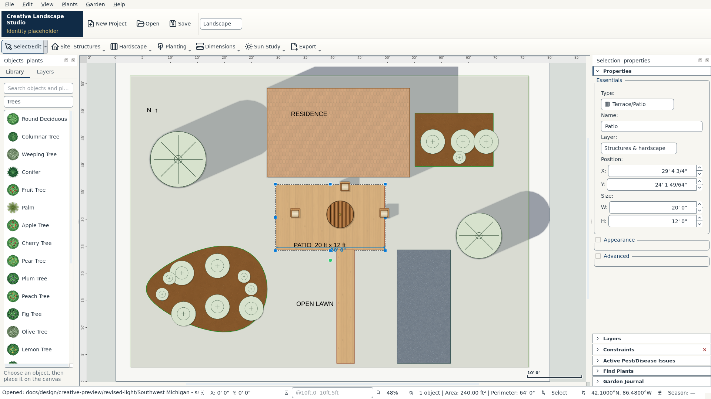
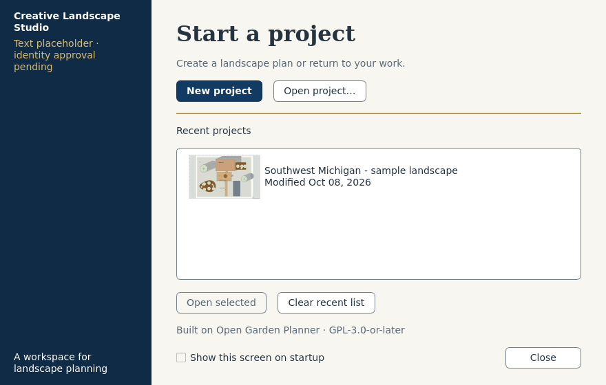

# Revised Creative desktop design

The owner approved the navy/ivory/gold direction and revised layout. A matching Windows test installer is undergoing native validation. The normal desktop entry point opens the real Creative workspace over Open Garden Planner's editor. The internal subclass name remains CreativePreviewWindow to avoid an unnecessary package rename.

These are genuine captures of running Qt widgets and an editable synthetic `.ogp` project. The labeled identity text remains a placeholder; there is no approved company logo. No client data, company photographs or fake templates were added.

[Before editor](previews/before/editor.png) · [Before welcome](previews/before/welcome.png) · [Sun workspace](creative-preview/revised-light/sun-study.png) · [Imperial properties](creative-preview/revised-light/imperial.png) · [Dark](creative-preview/revised-dark/editor.png) · [960 × 720](creative-preview/revised-small/editor.png)

The before captures record the prior source interface and its old synthetic 24 × 18 m sample. The revised sample is 80 × 60 ft with a 20 × 12 ft patio, curved polygon bed, house, walk, plants and a live dimension; it remains editable. These are source captures, not Windows installer screenshots.

See [validation and unit coverage](CONTINUATION_VALIDATION.md), [original interface audit](UI_AUDIT.md), [design system](../../BRAND_DESIGN_SYSTEM.md) and [asset inventory](../../assets/creative/README.md).

## Trying the source

A developer with the prepared environment can run `.venv/bin/python -m open_garden_planner` (Windows: `.venv\Scripts\python.exe -m open_garden_planner`). `--classic` retains the inherited shell. To open the synthetic review plan in an isolated account, run `.venv/bin/python scripts/creative_design_preview.py`; it preserves subsequently saved sample edits. No new dependency is needed.

Visual approval is complete. A new Windows test installer follows successful native validation; the older foundation download does not contain this interface. See [download instructions](../WINDOWS_DOWNLOAD.md).

## Source review checklist

- Dimensions → Project units selects feet/inches, decimal feet or metric. Bare imperial numbers mean feet; `10' 6 1/2"`, `10.5 ft`, `3/8 in`, and explicit cm/m are accepted. Use commas between typed coordinates.
- Select a patio, edit its width, then Ctrl+Z / Ctrl+Y. Save As and reopen the `.ogp` project.
- Use the workspace selector for Landscape, Sun Study or Gardening. Sun controls use the computer's time zone; location is saved, simulation time is runtime-only.
- View → Focus canvas / Reset workspace, or dock close buttons, changes the drawing area; resizing/closing docks persists.
- View → Drawing presentation switches existing detailed symbols and original architectural linework; texture strength is independent.
- Ctrl+F retains Find & Replace; View → Search object library uses Ctrl+Shift+F. On narrow windows, optional location/season status segments collapse to keep measurements readable.
- Existing File → Export and advanced tools remain available. Scientific gardening units and API/provider data remain canonical; see coverage limits.

No merge or production release is authorized.
