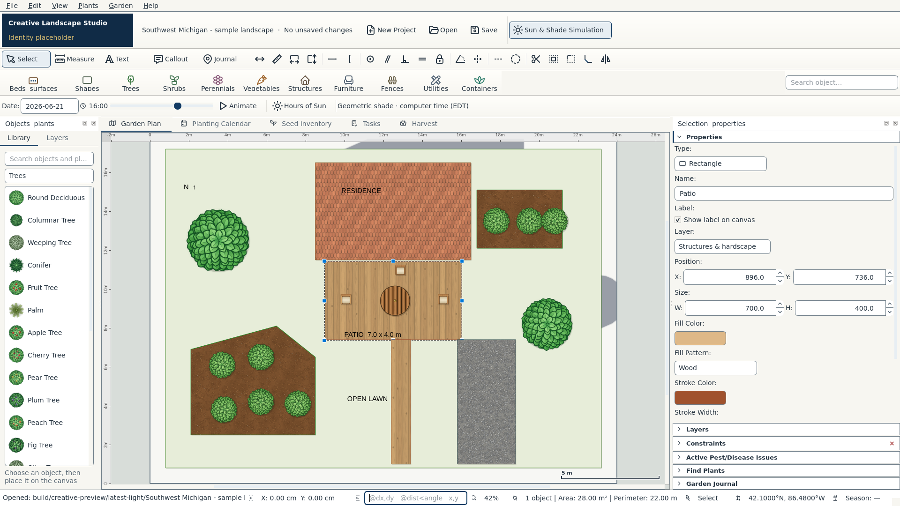
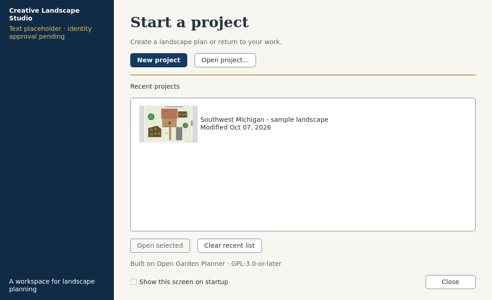

# Review the Creative desktop direction

**Awaiting visual approval. No new installer is published for this experiment.**

The two primary previews are captures of running Qt desktop windows:

1. [Proposed main editor](previews/light/editor.png): actual populated landscape,
   working tools, library/layers, original property editor and sun simulation.
2. [Proposed welcome](previews/light/welcome.png): working New/Open/recents, actual
   file-modification date and a canvas thumbnail injected by the capture runner.





[Before editor](previews/before/editor.png) · [Before welcome](previews/before/welcome.png) ·
[Dark editor](previews/dark/editor.png) · [Dark welcome](previews/dark/welcome.png) ·
[Narrow editor](previews/narrow/editor.png) · [150%](previews/scale150/editor.png) ·
[200%](previews/scale200/editor.png)

Everything pictured is actual Qt UI or existing rendered plan geometry. The
identity block is a **labeled text placeholder**; it is not an official logo.
There are no website mockups, company photos, invented templates or fake controls.
This is an opt-in design experiment, not the finished production redesign.

For a nonprogrammer, **review the two images above first**. Approval can be a
simple “Approve this direction” or a description of the visual changes wanted.
The brief's execution step 4 requires this approval before broad application
redesign. A new Windows download follows that stage and its checks; the earlier
[Windows desktop-foundation download](../WINDOWS_DOWNLOAD.md) still contains the
existing upstream interface.

## Developer source preview

From this feature branch, use the already prepared cloud `.venv`, or follow the
existing Python 3.12 dependency setup with `installer/constraints-desktop.txt`.
No new dependencies are required. Run from the repository root:

```bash
.venv/bin/python scripts/creative_design_preview.py
```

On an already prepared Windows source checkout:

```powershell
.venv\Scripts\python.exe scripts\creative_design_preview.py
```

The runner initially opens a synthetic landscape and the real welcome proposal.
Close the welcome to edit. Later launches preserve edits saved to this sample and
respect the welcome checkbox, saved theme and workspace. It isolates preferences,
recents and recovery from the normal application and disables its optional agent
server. Other projects open only when selected through the normal Open controls.
`--dark` selects dark mode; `--original` opens the unchanged reference interface
in another isolated account. Normal `python -m open_garden_planner` is unchanged.

Source-review steps verified through Qt interactions/tests:

- Library → search “Round Deciduous” → choose row → click center and rim on the
  canvas: a real tree appears. Ctrl+Z removes it; Ctrl+Y restores it.
- Layers tab → rename a layer: both views reflect it, and undo restores its name.
- Ctrl+Shift+S (Save As) → choose your own file, then Ctrl+O → reopen: the plan
  remains editable. Ctrl+S updates the current file.
- View → Focus canvas hides both docks; Reset workspace restores them.
- F11 → added chrome hides; Escape restores the previous workspace.
- View → Theme → Dark changes the proposed chrome and keeps the canvas light.
- Sun row → adjust time/date: the inherited controller changes geometric shade.

Cloud automation does not prove native mouse feel, screen-reader behavior, font
rendering or packaged GPU use. See [validation](VALIDATION.md),
[audit](UI_AUDIT.md), [design system](../../BRAND_DESIGN_SYSTEM.md) and
[asset inventory](../../assets/creative/README.md).
