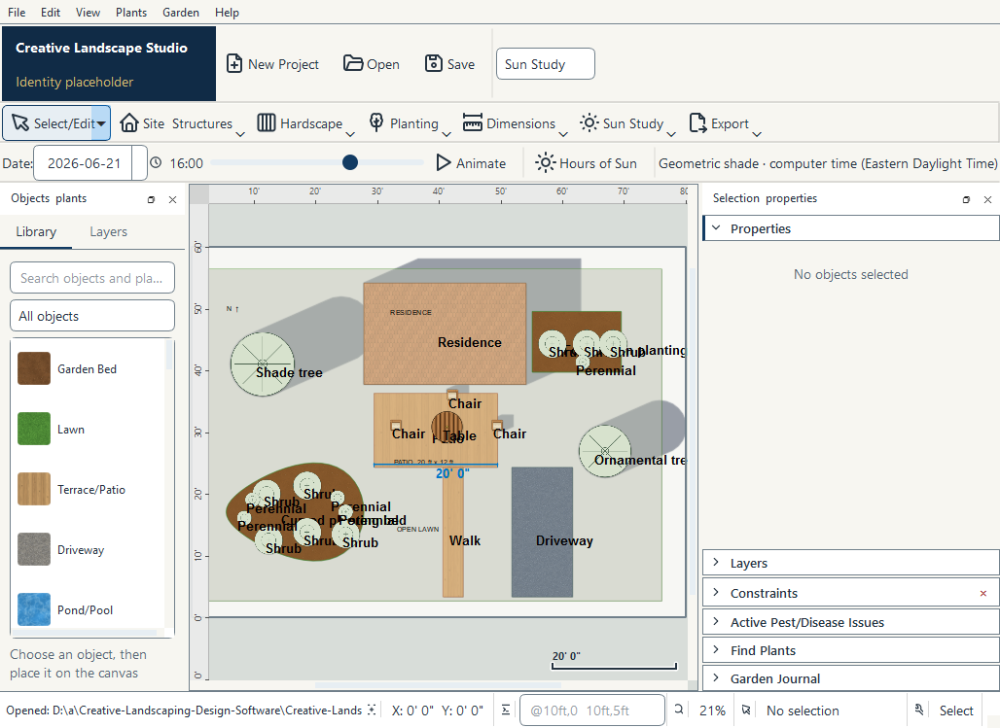

# Actual installed Windows captures

These are unmodified captures of the actual installed Creative Landscape Studio
executable, taken during successful native [Windows run 37773267264](https://github.com/jaceaddison2016-dot/Creative-Landscaping-Design-Software/actions/runs/37773267264)
on 2026-10-08. The matching [test download](https://github.com/jaceaddison2016-dot/Creative-Landscaping-Design-Software/actions/runs/37773267264/artifacts/11549062663)
was built from **`7c07a3220f0178f28ab7cf1b38a356cc6ff2aff1`**.
Later documentation/evidence commits do not change that application source.

| Capture | What it shows |
| --- | --- |
| [Editor](editor.png) | Editable 80 × 60 ft sample, compact tool groups, architectural plant symbols, imperial ruler/dimension and live shade. |
| [Welcome](welcome.png) | Real New/Open actions, synthetic recent projects and company-identity placeholder. |
| [Imperial properties](imperial-properties.png) | Selected rectangle, imperial position fields and area/perimeter in the status bar. The size fields are below the visible dock viewport. |
| [Sun Study](sun-study.png) | Real date/time controls and nonempty geometric shadow paths. |

## Provenance and verification

[BUILD-INFO.json](BUILD-INFO.json) records source/build identity;
[result.json](result.json) records the installed check's PASS, frozen executable,
native Windows plugin, Qt 6.11.0, Segoe UI control font, no inherited standard
handles, bundled icons and all eight workflows. Fractional input produced a
321.31 cm width (10 ft 6½ in); exported DXF width was 10.541666666666668 ft.
Times use the runner's Eastern Daylight Time computer zone.

The Linux task could access GitHub logs but could not retrieve the whole binary
artifact because the artifact-storage host was outside its current network
allowlist. The Windows runner checked the archives and exercised both app copies.
`scripts/record_creative_evidence.py` also recorded these four synthetic PNGs and
JSON results in GitHub logs. They were reconstructed from complete numbered
base64 chunks, checked against the recorder's SHA-256 values in
[capture-digests.json](capture-digests.json), and verified as complete PNGs with
Pillow. These are the original installed-app image bytes in the download, not
images recreated from the Linux source.

## Capture and usability limits

The runner limited editor/Sun/properties captures to **1028 × 749** pixels;
welcome is **880 × 560**. Both editor docks are open, so this native capture
does not establish a dominant canvas at that width. Several sample labels overlap
or clip at fit-to-plan overview. Users can close/resize docks, use **View → Focus
canvas**, and zoom; automatic label collision avoidance remains future work.
The earlier [source captures](../README.md#source-layout-comparisons) separately
show light/dark 1920 × 1080 and a 960 × 720 layout with its library collapsed.

The Properties screenshot does not show the edited width field; the real-key
workflow and `result.json` verify it independently. Shadow paths are visibly
present, but automation asserts controller state rather than pixel accuracy.
Opaque materials can cover the inherited shadow overlay. Logo/identity text is
still a placeholder; visual layout approval does not supply an official logo.

This is native automated Qt interaction, not a human usability test. Real display
scaling, native dialogs, accessibility, printing, GPU 3D, upgrades/uninstall and
security-software acceptance remain manual checks. The installer is unsigned.
No working Mac installer is established. See [installation instructions](../../WINDOWS_DOWNLOAD.md)
and [complete validation](../CONTINUATION_VALIDATION.md).
